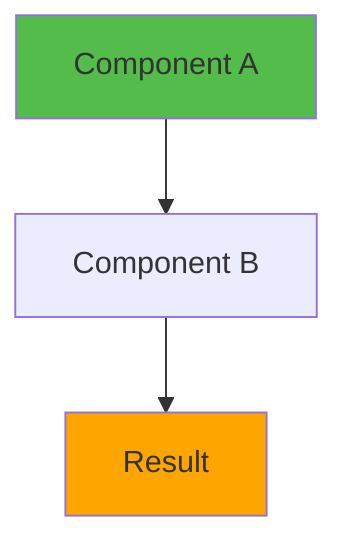
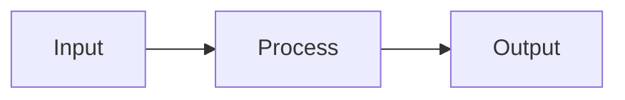

# Slide Template: [Topic Name]

---

## 🎯 What is [Topic]?

Brief 2-3 sentence explanation of what this slide covers.

Key points (3-5 bullet points):
- ⚡ **Point 1** - Brief description
- 🎨 **Point 2** - Brief description
- 📦 **Point 3** - Brief description

---

## 📂 Files to Explore

<details>
<summary><b>New/Modified Files</b></summary>

- 📄 [file1.ts](../textarea-fullscreen-react/path/to/file1.ts)
- 📄 [file2.tsx](../textarea-fullscreen-react/path/to/file2.tsx)
- 📁 [folder/file3.tsx](../textarea-fullscreen-react/folder/file3.tsx)

</details>

<details>
<summary><b>Configuration/Supporting Files</b></summary>

- 📄 [config.ts](../textarea-fullscreen-react/config.ts)
- 📄 [package.json](../textarea-fullscreen-react/package.json)

</details>

---

## ✅ What's New in This Slide

- ✅ Feature/change 1
- ✅ Feature/change 2
- ✅ Feature/change 3
- ✅ Feature/change 4

---

**Next:** [Slide X+1: Next Topic](./0X-next-topic.md) 
**Branch:** `react/X-branch-name`

---

## 📑 Deep Dive

- [How It Works](#how-it-works)
- [Implementation Steps](#implementation-steps)
- [Key Concepts](#key-concepts)
- [Code Examples](#code-examples)
- [Common Patterns](#common-patterns)
- [Documentation](#documentation)
- [Challenge](#challenge)

---

## How It Works



Brief explanation of the diagram and process.

---

## Implementation Steps

### 1. Step Title
```bash
# Command if applicable
npm install something
```

**What happens:**
- Action 1
- Action 2
- Action 3

### 2. Next Step
```typescript
// Code example
export default function example() {
  return <div>Example</div>;
}
```

**Explanation:**
- Point about the code
- Another important detail

### 3. Final Step

**Instructions:**
1. Do this
2. Then this
3. Finally this

---

## Key Concepts

### Concept 1: [Name]



**Explanation:**
- Point 1
- Point 2
- Point 3

### Concept 2: [Name]

**Key points:**
- Detail 1
- Detail 2
- Detail 3

---

## Code Examples

### Example 1: [Description]

```typescript
// Code example with comments
export default function Component() {
  const [state, setState] = useState(false);
  
  return <div>Example</div>;
}
```

**What this does:**
- Explanation point 1
- Explanation point 2

### Example 2: [Description]

```typescript
// Another example
const result = doSomething();
```

---

## Common Patterns

<details>
<summary><b>Pattern 1: [Name]</b></summary>

```typescript
// Pattern code
export const pattern = () => {
  // implementation
};
```

**When to use:**
- Use case 1
- Use case 2

</details>

<details>
<summary><b>Pattern 2: [Name]</b></summary>

```typescript
// Another pattern
```

**When to use:**
- Use case 1
- Use case 2

</details>

---

## Documentation

<details>
<summary><b>Related Resources</b></summary>

- 📚 [Documentation Link](https://example.com)
- 📚 [API Reference](https://example.com/api)
- 🎓 [Tutorial](https://example.com/tutorial)
- 💡 [Best Practices](https://example.com/best-practices)

</details>

---

## Challenge

**Try this yourself:**

1. Task 1 description
2. Task 2 description
3. Task 3 description

**Expected result:**
- What should happen
- What you should see

**Bonus:**
- Extra challenge if time permits

---

**Next:** [Slide X+1: Next Topic](./0X-next-topic.md)  
**Branch:** `git checkout react/X+1-next-branch`