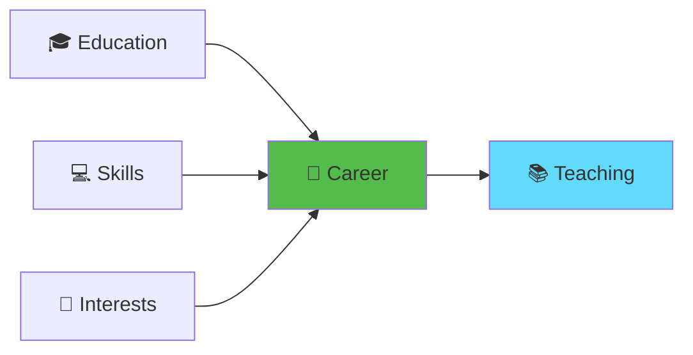
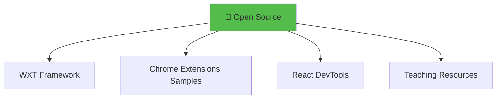
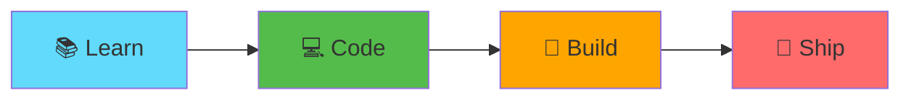

# About me

---

## 👋 Hi, I'm Alex Chen

**Senior Frontend Developer & Extension Enthusiast**



---

## 🚀 Background

### Professional Experience

**Current:** Senior Frontend Developer @ TechFlow Inc.  
**Focus:** Browser extensions, React applications, Developer tools

**Previous Roles:**
- 🏢 **WebTools Corp** - Full-stack Developer (3 years)
- 🎨 **DesignLab** - Frontend Engineer (2 years)
- 💡 **Startup Studios** - Freelance Developer (1 year)

---

### Technical Expertise

```typescript
const skills = {
  languages: ['TypeScript', 'JavaScript', 'Python', 'Go'],
  frameworks: ['React', 'Vue', 'Next.js', 'Node.js'],
  extensions: ['WXT', 'Plasmo', 'Chrome APIs', 'WebExtensions'],
  tools: ['Vite', 'Webpack', 'Git', 'Docker'],
  interests: ['DX', 'Performance', 'Open Source']
};
```

---

## 🎯 Why Chrome Extensions?

<details>
<summary><b>My Extension Journey</b></summary>

**2018** - Built my first extension (a simple tab manager)  
**2020** - Published 3 extensions with 50K+ users  
**2022** - Started contributing to WXT framework  
**2024** - Teaching extension development workshops

**Published Extensions:**
- 📝 **QuickNotes** - 25K users, 4.5⭐ rating
- 🎨 **ColorPicker Pro** - 15K users, 4.7⭐ rating  
- ⌨️ **DevTools Shortcuts** - 10K users, 4.6⭐ rating

</details>

---

## 💡 Philosophy

> "Great browser extensions are invisible until you need them, then they're indispensable."

**My Development Principles:**

1. 🎯 **User-First Design** - Solve real problems elegantly
2. ⚡ **Performance Matters** - Extensions should be fast and lightweight
3. 🔐 **Privacy by Default** - Request only necessary permissions
4. 📚 **Open Source** - Share knowledge and code with the community
5. 🧪 **Test Everything** - Reliable extensions = happy users

---

## 🌟 Open Source Contributions



**GitHub Stats:**
- ⭐ 2.5K+ stars across repositories
- 🔀 150+ pull requests merged
- 📦 12 published packages
- 🤝 Active in extension dev community

---

## 📫 Connect With Me

<details>
<summary><b>Contact Information</b></summary>

- 🌐 **Website:** [alexchen.dev](https://alexchen.dev)
- 💼 **LinkedIn:** [linkedin.com/in/alexchen](https://linkedin.com/in/alexchen)
- 🐦 **Twitter:** [@alexchen_dev](https://twitter.com/alexchen_dev)
- 💻 **GitHub:** [github.com/alexchen](https://github.com/alexchen)
- 📧 **Email:** alex.chen@example.com
- 💬 **Discord:** alexchen#1234

</details>

---

## 🎓 What to Expect Today

**Workshop Structure:**



**We'll cover:**
- ✅ Modern extension development with WXT
- ✅ React integration and best practices
- ✅ Real-world project: Textarea Fullscreen
- ✅ Publishing to Chrome Web Store
- ✅ Q&A and hands-on challenges

**Let's build something awesome together! 🚀**

---

**Next:** [Slide 1: Init WXT React Starter](./0a-intro-chrome-extensions.md)