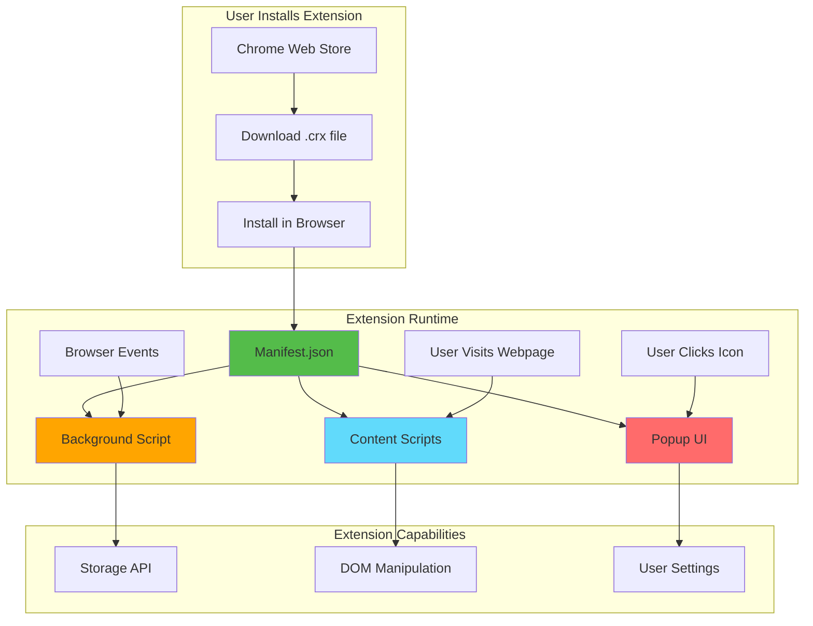
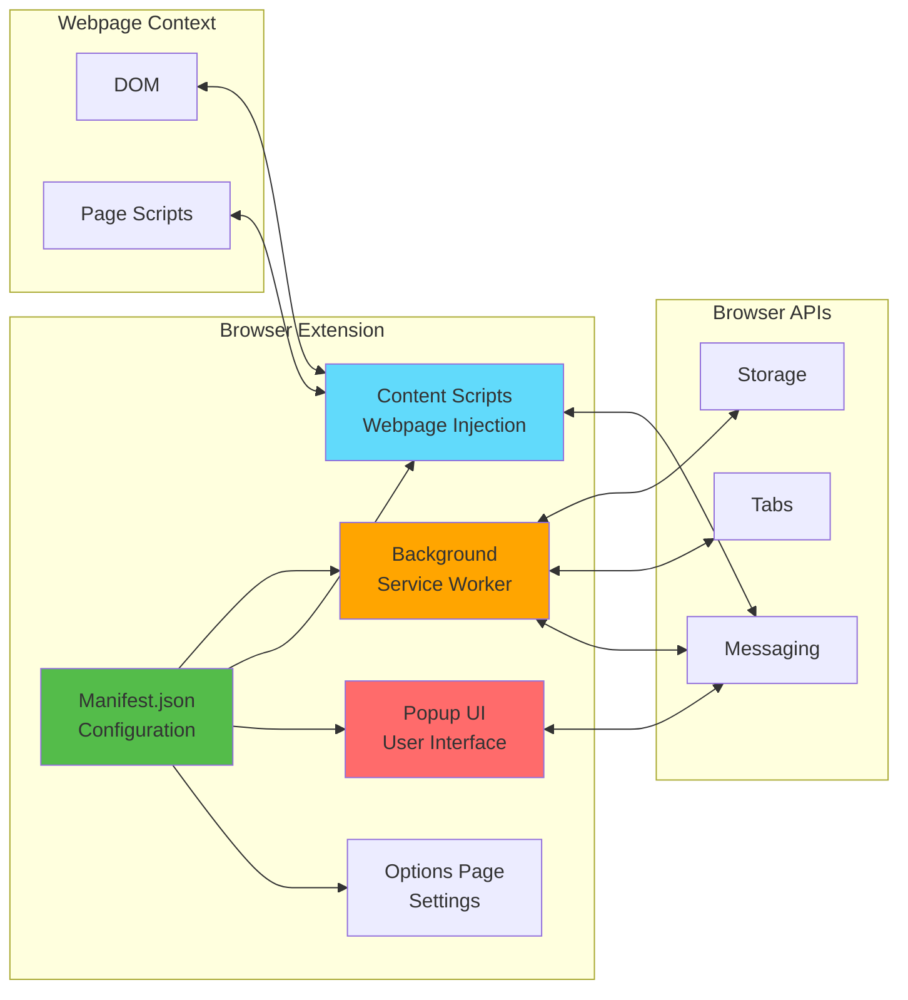
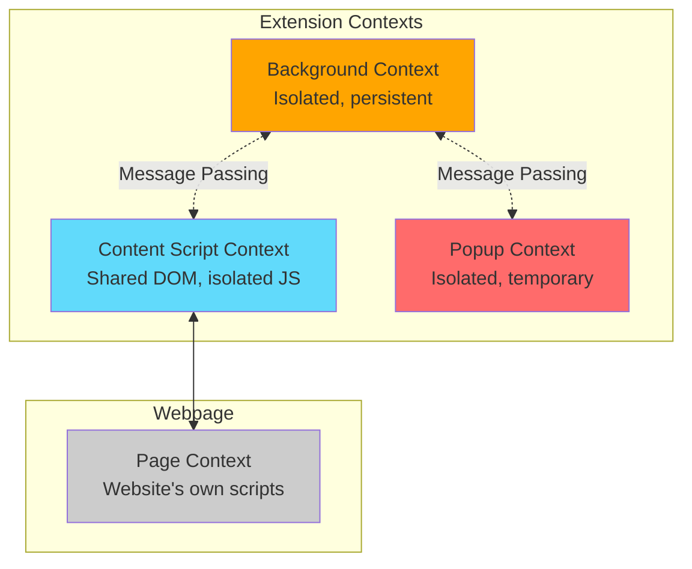

# Slide 0a: What are Chrome Extensions?

---

## 🎯 What is a Chrome Extension?

A Chrome extension is a small software program that customizes and enhances your browsing experience. Built with web technologies (HTML, CSS, JavaScript), extensions add new features to your browser or modify existing webpage behavior.

Key points:
- 🌐 **Web Technologies** - Built with HTML, CSS, JavaScript/TypeScript
- 🔧 **Browser Enhancement** - Add features or modify webpage behavior
- 📦 **Packaged App** - Distributed through Chrome Web Store
- 🔐 **Sandboxed & Secure** - Run in isolated environments with permissions
- 🎨 **Highly Customizable** - From simple tools to complex applications

---

## 📂 Extension Components

<details>
<summary><b>Core Components</b></summary>

- 📄 **Manifest.json** - Configuration and metadata
- 📄 **Background Scripts** - Run in background, handle events
- 📄 **Content Scripts** - Inject into webpages, modify DOM
- 📄 **Popup UI** - Small window when clicking extension icon
- 📄 **Options Page** - Settings and configuration page

</details>

---

## ✅ What You'll Learn Today

- ✅ Modern Chrome extension development with WXT framework
- ✅ Building UI with React and TypeScript
- ✅ Injecting React components into webpages
- ✅ Managing state and storage
- ✅ Building and packaging for distribution
- ✅ Real-world example: Textarea Fullscreen extension

---

**Next:** [Slide 1: Init WXT React Starter](./01-init-wxt-react-starter.md)

---

## 📑 Deep Dive

- [How It Works](#how-it-works)
- [Architecture Overview](#architecture-overview)
- [Key Concepts](#key-concepts)
- [Extension Types](#extension-types)
- [Use Cases](#use-cases)
- [Documentation](#documentation)

---

## How It Works



**Flow Explanation:**
1. User installs extension from Chrome Web Store
2. Browser loads manifest.json to understand extension structure
3. Background script runs persistently (or as service worker in MV3)
4. Content scripts inject into matching webpages
5. Popup opens when user clicks extension icon
6. All components communicate via Chrome APIs

---

## Architecture Overview

### Extension Manifest (manifest.json)

```json
{
  "manifest_version": 3,
  "name": "My Extension",
  "version": "1.0.0",
  "description": "Does something cool",
  
  "permissions": ["storage", "tabs"],
  
  "background": {
    "service_worker": "background.js"
  },
  
  "content_scripts": [{
    "matches": ["<all_urls>"],
    "js": ["content.js"]
  }],
  
  "action": {
    "default_popup": "popup.html",
    "default_icon": "icon.png"
  }
}
```

**Key Fields:**
- `manifest_version` - MV2 (deprecated) or MV3 (current)
- `permissions` - What browser APIs extension can use
- `background` - Background script configuration
- `content_scripts` - Scripts injected into webpages
- `action` - Popup and icon configuration

---

### Component Breakdown



---

## Key Concepts

### Concept 1: Execution Contexts

Chrome extensions run in **three separate contexts**:



**Important:**
- **Background** - No DOM access, full Chrome API access
- **Content Script** - DOM access, limited Chrome API access
- **Popup** - Own HTML page, full Chrome API access
- **Page Context** - Website's code, no Chrome API access

---

### Concept 2: Permissions System

Extensions must declare permissions in manifest:

```json
{
  "permissions": [
    "storage",        // chrome.storage API
    "tabs",          // chrome.tabs API
    "activeTab"      // Access current tab when user clicks
  ],
  
  "host_permissions": [
    "https://*.example.com/*"  // Access to specific domains
  ]
}
```

**Permission Types:**
- **API Permissions** - Access to Chrome APIs
- **Host Permissions** - Access to webpage content
- **Optional Permissions** - Request at runtime when needed

**User sees permissions during installation!**

---

### Concept 3: Manifest V2 vs V3

| Feature | Manifest V2 (Old) | Manifest V3 (Current) |
|---------|------------------|---------------------|
| **Background** | Persistent page | Service worker |
| **Status** | Deprecated 2024 | Required for new extensions |
| **Host Permissions** | `permissions` array | `host_permissions` array |
| **Remote Code** | Allowed | Blocked (security) |
| **webRequest** | Blocking allowed | Declarative only |

**WXT handles both!** We'll use MV3 in this presentation.

---

## Extension Types

### Type 1: Page Modifiers
**Modify existing webpages**

```
Examples:
- Ad blockers (uBlock Origin)
- Dark mode (Dark Reader)
- Grammar checkers (Grammarly)
- Our project: Textarea Fullscreen
```

**Key Features:**
- Content scripts
- DOM manipulation
- CSS injection

---

### Type 2: Browser Tools
**Add new browser functionality**

```
Examples:
- Password managers (1Password)
- Screenshot tools (Awesome Screenshot)
- Tab managers (OneTab)
- Bookmark organizers
```

**Key Features:**
- Background scripts
- Browser API usage
- Popup interfaces

---

### Type 3: Dev Tools
**Enhance developer experience**

```
Examples:
- React DevTools
- Vue DevTools
- JSON formatters
- API testers
```

**Key Features:**
- DevTools pages
- Network inspection
- Code analysis

---

### Type 4: Productivity Tools
**Improve workflow**

```
Examples:
- Note takers (Notion Web Clipper)
- Time trackers (Toggl)
- Task managers (Todoist)
- Email helpers
```

**Key Features:**
- Storage APIs
- Cloud sync
- Rich UI

---

## Use Cases

<details>
<summary><b>Use Case 1: Content Enhancement</b></summary>

**Problem:** Want to add features to existing websites without browser extension.

**Solution:** Content script that injects UI components.

**Example:**
```javascript
// Content script adds a "Save to Reading List" button to articles
const button = document.createElement('button');
button.textContent = 'Save for Later';
button.onclick = () => chrome.storage.local.set({ article: document.body.innerText });
document.querySelector('article').prepend(button);
```

**Our Project:** Adding fullscreen button to textareas!

</details>

<details>
<summary><b>Use Case 2: Cross-Site Features</b></summary>

**Problem:** Need functionality that works across multiple websites.

**Solution:** Extension with background script + content scripts.

**Example:**
```javascript
// Background script tracks time spent on websites
chrome.tabs.onActivated.addListener(({ tabId }) => {
  chrome.tabs.get(tabId, (tab) => {
    logTimeSpent(tab.url);
  });
});
```

**Real Extensions:** RescueTime, WakaTime

</details>

<details>
<summary><b>Use Case 3: Browser Automation</b></summary>

**Problem:** Repetitive browser tasks.

**Solution:** Extension that automates actions.

**Example:**
```javascript
// Auto-fill forms with saved data
chrome.runtime.onMessage.addListener((request, sender, sendResponse) => {
  if (request.action === 'autofill') {
    document.querySelector('#name').value = request.data.name;
    document.querySelector('#email').value = request.data.email;
  }
});
```

**Real Extensions:** Form fillers, Auto-refresh tools

</details>

---

## Documentation

<details>
<summary><b>Official Resources</b></summary>

- 📚 [Chrome Extension Documentation](https://developer.chrome.com/docs/extensions/)
- 📚 [Chrome Extensions Samples](https://github.com/GoogleChrome/chrome-extensions-samples)
- 📚 [Extension API Reference](https://developer.chrome.com/docs/extensions/reference/)
- 🎓 [Getting Started Tutorial](https://developer.chrome.com/docs/extensions/mv3/getstarted/)
- 💡 [Chrome Web Store](https://chrome.google.com/webstore/category/extensions)

</details>

<details>
<summary><b>Development Tools</b></summary>

- 🔧 [WXT Framework](https://wxt.dev) - What we'll use today!
- 🔧 [Plasmo](https://www.plasmo.com/) - Alternative framework
- 🔧 [Extension CLI](https://github.com/chibat/chrome-extension-cli)
- 🔧 [WebExtension Polyfill](https://github.com/mozilla/webextension-polyfill)

</details>