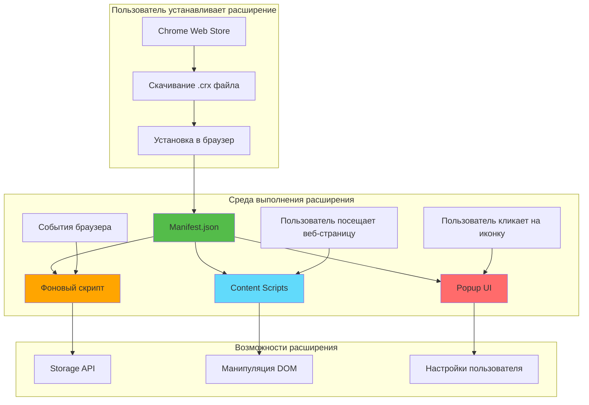
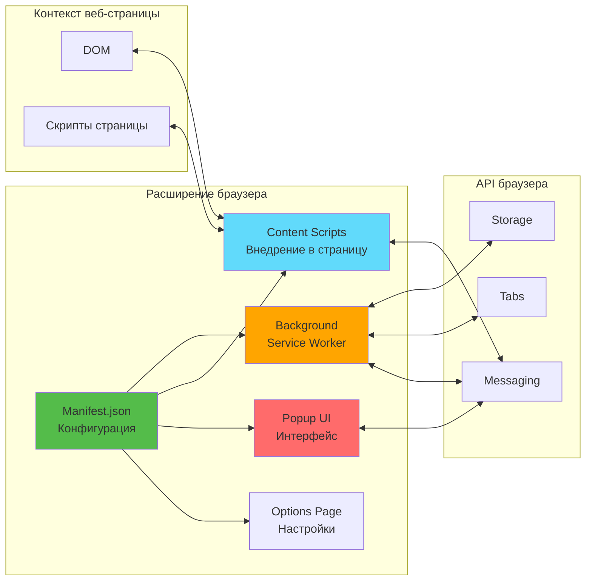
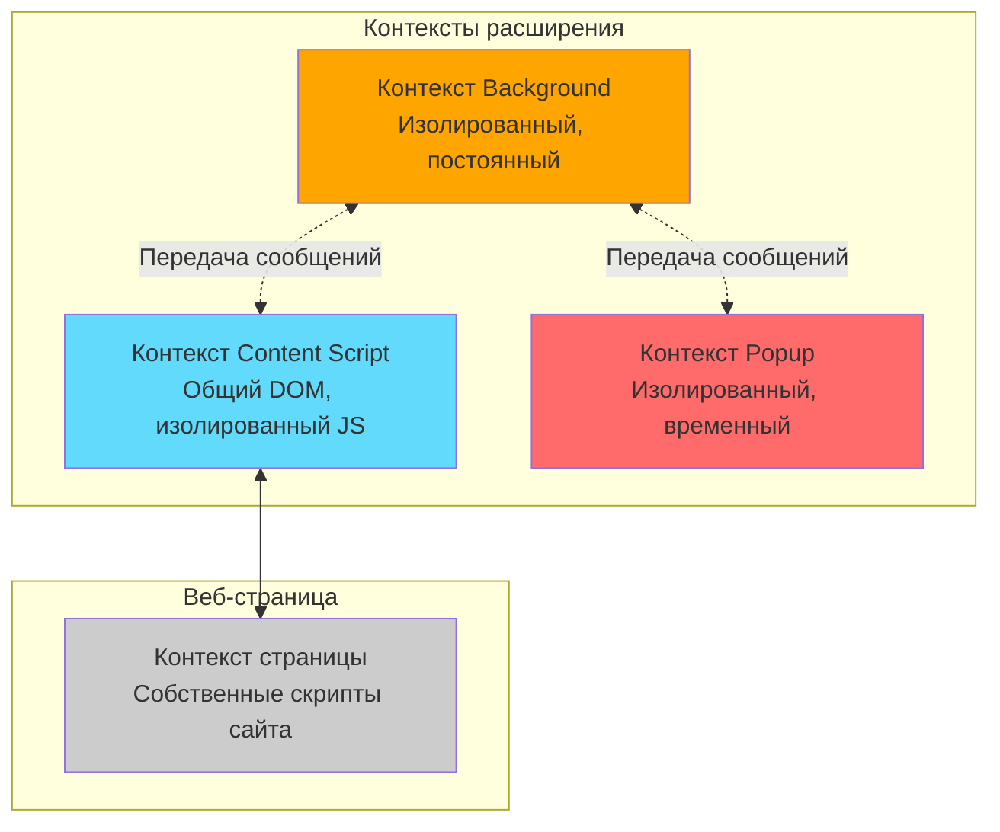

# Слайд 00: Что такое расширения Chrome?

---

## 🎯 Что такое расширение Chrome?

Расширение Chrome — это небольшая программа, которая настраивает и улучшает ваш опыт просмотра веб-страниц. Созданные с использованием веб-технологий (HTML, CSS, JavaScript), расширения добавляют новые функции в ваш браузер или изменяют существующее поведение веб-страниц.

Ключевые моменты:
- 🌐 **Веб-технологии** - Созданы с помощью HTML, CSS, JavaScript/TypeScript
- 🔧 **Улучшение браузера** - Добавляют функции или изменяют поведение веб-страниц
- 📦 **Упакованное приложение** - Распространяется через Chrome Web Store
- 🔐 **Изолированы и безопасны** - Работают в изолированных средах с разрешениями
- 🎨 **Высоко настраиваемы** - От простых инструментов до сложных приложений

---

## 📂 Компоненты расширения

<details>
<summary><b>Основные компоненты</b></summary>

- 📄 **Manifest.json** - Конфигурация и метаданные
- 📄 **Фоновые скрипты** - Работают в фоне, обрабатывают события
- 📄 **Content Scripts** - Внедряются в веб-страницы, изменяют DOM
- 📄 **Popup UI** - Небольшое окно при клике на иконку расширения
- 📄 **Страница настроек** - Страница настроек и конфигурации

</details>

---

## ✅ Что вы сегодня изучите

- ✅ Современная разработка расширений Chrome с фреймворком WXT
- ✅ Создание UI с React и TypeScript
- ✅ Внедрение React компонентов в веб-страницы
- ✅ Управление состоянием и хранилищем
- ✅ Сборка и упаковка для распространения
- ✅ Реальный пример: расширение Textarea Fullscreen

---

**Далее:** [Слайд 1: Инициализация WXT React Starter](./01-init-wxt-react-starter.md)

---

## 📑 Подробное изучение

- [Как это работает](#как-это-работает)
- [Обзор архитектуры](#обзор-архитектуры)
- [Ключевые концепции](#ключевые-концепции)
- [Типы расширений](#типы-расширений)
- [Примеры использования](#примеры-использования)
- [Документация](#документация)

---

## Как это работает



**Объяснение потока:**
1. Пользователь устанавливает расширение из Chrome Web Store
2. Браузер загружает manifest.json для понимания структуры расширения
3. Фоновый скрипт работает постоянно (или как service worker в MV3)
4. Content scripts внедряются в соответствующие веб-страницы
5. Popup открывается, когда пользователь кликает на иконку расширения
6. Все компоненты взаимодействуют через Chrome API

---

## Обзор архитектуры

### Манифест расширения (manifest.json)

```json
{
  "manifest_version": 3,
  "name": "Мое расширение",
  "version": "1.0.0",
  "description": "Делает что-то крутое",
  
  "permissions": ["storage", "tabs"],
  
  "background": {
    "service_worker": "background.js"
  },
  
  "content_scripts": [{
    "matches": ["<all_urls>"],
    "js": ["content.js"]
  }],
  
  "action": {
    "default_popup": "popup.html",
    "default_icon": "icon.png"
  }
}
```

**Ключевые поля:**
- `manifest_version` - MV2 (устарел) или MV3 (текущий)
- `permissions` - Какие API браузера может использовать расширение
- `background` - Конфигурация фонового скрипта
- `content_scripts` - Скрипты, внедряемые в веб-страницы
- `action` - Конфигурация popup и иконки

---

### Разбор компонентов



---

## Ключевые концепции

### Концепция 1: Контексты выполнения

Расширения Chrome работают в **трех отдельных контекстах**:



**Важно:**
- **Background** - Нет доступа к DOM, полный доступ к Chrome API
- **Content Script** - Доступ к DOM, ограниченный доступ к Chrome API
- **Popup** - Собственная HTML страница, полный доступ к Chrome API
- **Контекст страницы** - Код веб-сайта, нет доступа к Chrome API

---

### Концепция 2: Система разрешений

Расширения должны объявлять разрешения в манифесте:

```json
{
  "permissions": [
    "storage",        // chrome.storage API
    "tabs",          // chrome.tabs API
    "activeTab"      // Доступ к текущей вкладке при клике пользователя
  ],
  
  "host_permissions": [
    "https://*.example.com/*"  // Доступ к определенным доменам
  ]
}
```

**Типы разрешений:**
- **Разрешения API** - Доступ к Chrome API
- **Разрешения хостов** - Доступ к содержимому веб-страницы
- **Опциональные разрешения** - Запрос во время выполнения при необходимости

**Пользователь видит разрешения во время установки!**

---

### Концепция 3: Manifest V2 vs V3

| Функция | Manifest V2 (Старый) | Manifest V3 (Текущий) |
|---------|------------------|---------------------|
| **Background** | Постоянная страница | Service worker |
| **Статус** | Устарел в 2024 | Требуется для новых расширений |
| **Разрешения хостов** | Массив `permissions` | Массив `host_permissions` |
| **Удаленный код** | Разрешен | Заблокирован (безопасность) |
| **webRequest** | Разрешена блокировка | Только декларативный |

**WXT обрабатывает оба!** В этой презентации мы будем использовать MV3.

---

## Типы расширений

### Тип 1: Модификаторы страниц
**Изменяют существующие веб-страницы**

```
Примеры:
- Блокировщики рекламы (uBlock Origin)
- Темный режим (Dark Reader)
- Проверка грамматики (Grammarly)
- Наш проект: Textarea Fullscreen
```

**Ключевые функции:**
- Content scripts
- Манипуляция DOM
- Внедрение CSS

---

### Тип 2: Инструменты браузера
**Добавляют новую функциональность браузера**

```
Примеры:
- Менеджеры паролей (1Password)
- Инструменты для скриншотов (Awesome Screenshot)
- Менеджеры вкладок (OneTab)
- Организаторы закладок
```

**Ключевые функции:**
- Фоновые скрипты
- Использование Browser API
- Интерфейсы popup

---

### Тип 3: Dev Tools
**Улучшают опыт разработчика**

```
Примеры:
- React DevTools
- Vue DevTools
- JSON форматеры
- API тестеры
```

**Ключевые функции:**
- Страницы DevTools
- Инспекция сети
- Анализ кода

---

### Тип 4: Инструменты продуктивности
**Улучшают рабочий процесс**

```
Примеры:
- Блокноты (Notion Web Clipper)
- Трекеры времени (Toggl)
- Менеджеры задач (Todoist)
- Помощники для email
```

**Ключевые функции:**
- Storage API
- Облачная синхронизация
- Богатый UI

---

## Примеры использования

<details>
<summary><b>Пример использования 1: Улучшение контента</b></summary>

**Проблема:** Хотите добавить функции на существующие веб-сайты без расширения браузера.

**Решение:** Content script, который внедряет UI компоненты.

**Пример:**
```javascript
// Content script добавляет кнопку "Сохранить в список чтения" к статьям
const button = document.createElement('button');
button.textContent = 'Сохранить на потом';
button.onclick = () => chrome.storage.local.set({ article: document.body.innerText });
document.querySelector('article').prepend(button);
```

**Наш проект:** Добавление кнопки полноэкранного режима к textarea!

</details>

<details>
<summary><b>Пример использования 2: Межсайтовые функции</b></summary>

**Проблема:** Нужна функциональность, которая работает на нескольких веб-сайтах.

**Решение:** Расширение с фоновым скриптом + content scripts.

**Пример:**
```javascript
// Фоновый скрипт отслеживает время, проведенное на веб-сайтах
chrome.tabs.onActivated.addListener(({ tabId }) => {
  chrome.tabs.get(tabId, (tab) => {
    logTimeSpent(tab.url);
  });
});
```

**Реальные расширения:** RescueTime, WakaTime

</details>

<details>
<summary><b>Пример использования 3: Автоматизация браузера</b></summary>

**Проблема:** Повторяющиеся задачи в браузере.

**Решение:** Расширение, которое автоматизирует действия.

**Пример:**
```javascript
// Автозаполнение форм сохраненными данными
chrome.runtime.onMessage.addListener((request, sender, sendResponse) => {
  if (request.action === 'autofill') {
    document.querySelector('#name').value = request.data.name;
    document.querySelector('#email').value = request.data.email;
  }
});
```

**Реальные расширения:** Заполнители форм, Инструменты автообновления

</details>

---

## Документация

<details>
<summary><b>Официальные ресурсы</b></summary>

- 📚 [Документация расширений Chrome](https://developer.chrome.com/docs/extensions/)
- 📚 [Примеры расширений Chrome](https://github.com/GoogleChrome/chrome-extensions-samples)
- 📚 [Справочник API расширений](https://developer.chrome.com/docs/extensions/reference/)
- 🎓 [Учебник для начинающих](https://developer.chrome.com/docs/extensions/mv3/getstarted/)
- 💡 [Chrome Web Store](https://chrome.google.com/webstore/category/extensions)

</details>

<details>
<summary><b>Инструменты разработки</b></summary>

- 🔧 [Фреймворк WXT](https://wxt.dev) - Что мы будем использовать сегодня!
- 🔧 [Plasmo](https://www.plasmo.com/) - Альтернативный фреймворк
- 🔧 [Extension CLI](https://github.com/chibat/chrome-extension-cli)
- 🔧 [WebExtension Polyfill](https://github.com/mozilla/webextension-polyfill)

</details>