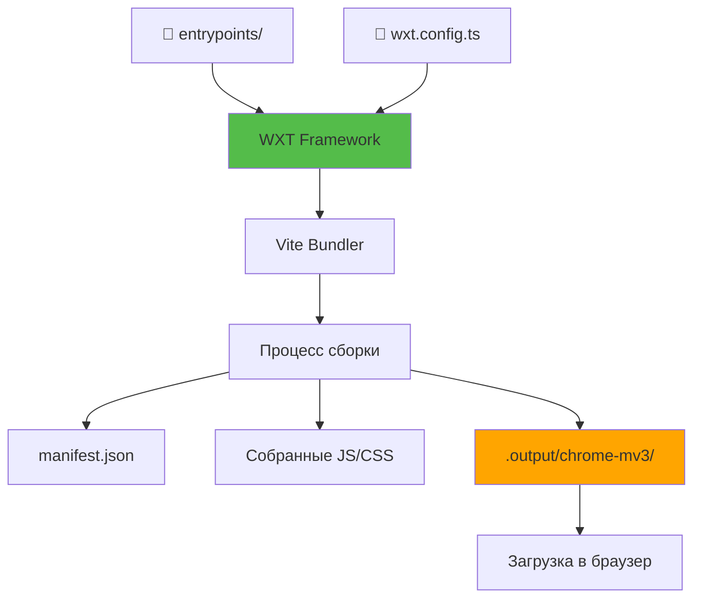
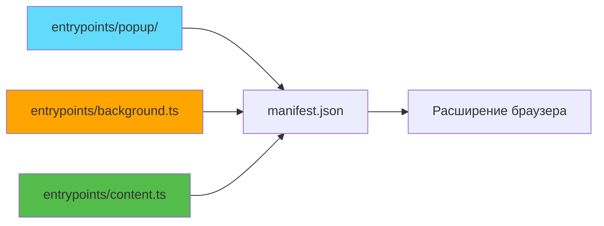

# Слайд 1: Инициализация WXT React Starter

**Ветка:** `react/01-init-wxt-react-starter`

---

## 🎯 Что такое WXT?

WXT (Web Extension Tools) — это фреймворк нового поколения для создания кроссбраузерных расширений с современными инструментами. Он предоставляет настройку без конфигурации, автоматическую генерацию манифеста и молниеносную горячую перезагрузку модулей на базе Vite.

Ключевые моменты:
- ⚡ **Разработка на Vite** - Мгновенная HMR и сборка за доли секунды
- 🎨 **React + TypeScript** - Современная разработка с полной типобезопасностью
- 📦 **Авто-генерация манифеста** - Не нужно вручную редактировать manifest.json
- 🔄 **Поддержка мульти-браузеров** - Единая кодовая база для Chrome, Firefox, Safari
- 🛠️ **Конвенция точек входа** - Файловая маршрутизация для страниц расширения

---

## 📂 Файлы для изучения

<details>
<summary><b>Новые/Измененные файлы</b></summary>

- 📄 [entrypoints/popup/App.tsx](../textarea-fullscreen-react/entrypoints/popup/App.tsx)
- 📄 [entrypoints/popup/main.tsx](../textarea-fullscreen-react/entrypoints/popup/main.tsx)
- 📄 [entrypoints/popup/index.html](../textarea-fullscreen-react/entrypoints/popup/index.html)
- 📄 [entrypoints/background.ts](../textarea-fullscreen-react/entrypoints/background.ts)
- 📄 [entrypoints/content.ts](../textarea-fullscreen-react/entrypoints/content.ts)

</details>

<details>
<summary><b>Файлы конфигурации/поддержки</b></summary>

- 📄 [wxt.config.ts](../textarea-fullscreen-react/wxt.config.ts)
- 📄 [package.json](../textarea-fullscreen-react/package.json)
- 📄 [tsconfig.json](../textarea-fullscreen-react/tsconfig.json)
- 📄 [.gitignore](../textarea-fullscreen-react/.gitignore)

</details>

---

## ✅ Что нового в этом слайде

- ✅ Инициализирован проект WXT с шаблоном React
- ✅ Настроен TypeScript со строгим режимом
- ✅ Создана точка входа popup с демо счетчиком на React
- ✅ Создан фоновый сервис-воркер
- ✅ Добавлен пример content script
- ✅ Включена горячая перезагрузка модулей (HMR) для мгновенной разработки

---

**Далее:** [Слайд 2: Монтирование React в Content Script](./02-react-content-script.md)

---

## 📑 Подробное изучение

- [Как это работает](#как-это-работает)
- [Шаги реализации](#шаги-реализации)
- [Ключевые концепции](#ключевые-концепции)
- [Примеры кода](#примеры-кода)
- [Распространенные паттерны](#распространенные-паттерны)
- [Документация](#документация)
- [Задание](#задание)

---

## Как это работает



**Как WXT преобразует ваш код:**

1. **Сканирует entrypoints/** - Обнаруживает popup, background, content scripts
2. **Собирает с Vite** - Молниеносная сборка с HMR
3. **Генерирует manifest.json** - Автоматически из точек входа
4. **Выводит сборку** - Готовое для браузера расширение в `.output/`
5. **Отслеживает изменения** - Автоматическая пересборка при сохранении файлов

---

## Шаги реализации

### 1. Создание нового проекта WXT
```bash
# Используя npm
npm create wxt@latest

# Следуйте подсказкам:
# ✔ Название проекта: textarea-fullscreen
# ✔ Выберите шаблон: react
# ✔ Менеджер пакетов: npm
```

**Что происходит:**
- Создается структура проекта с точками входа
- Устанавливаются зависимости (React, WXT, TypeScript)
- Генерируются начальные файлы конфигурации
- Настраивается Git репозиторий

---

### 2. Изучение структуры проекта
```bash
cd textarea-fullscreen
tree -L 2
```

**Сгенерированная структура:**
```
textarea-fullscreen/
├── entrypoints/           # Точки входа расширения
│   ├── popup/            # UI Popup (React)
│   ├── background.ts     # Фоновый сервис-воркер
│   └── content.ts        # Content script
├── public/               # Статические ресурсы
├── .output/              # Результат сборки (генерируется)
├── wxt.config.ts         # Конфигурация WXT
├── package.json          # Зависимости
└── tsconfig.json         # Конфигурация TypeScript
```

**Объяснение:**
- `entrypoints/` - Маршрутизация на основе конвенций для страниц расширения
- `.output/` - Артефакты сборки (игнорируются git)
- `wxt.config.ts` - Основная конфигурация (аналогично vite.config)

---

### 3. Установка зависимостей
```bash
npm install
```

**Что устанавливается:**
```json
{
  "dependencies": {
    "react": "^19.1.1",
    "react-dom": "^19.1.1"
  },
  "devDependencies": {
    "wxt": "^0.19.0",
    "@wxt-dev/module-react": "^1.1.0",
    "typescript": "^5.7.3",
    "@types/react": "^19.1.16"
  }
}
```

---

### 4. Запуск сервера разработки
```bash
npm run dev
```

**Вывод в терминале:**
```
🌐 WXT 0.19.0
🔨 Building chrome-mv3 for development...

entrypoints/popup/main.tsx      1.2 kB
entrypoints/background.ts       0.5 kB
entrypoints/content.ts          0.3 kB

✓ Built in 847ms
📦 .output/chrome-mv3/

👀 Watching for changes...
```

**Что происходит:**
- Vite запускает сервер разработки
- Собирает все точки входа
- Генерирует manifest.json
- Отслеживает изменения файлов
- Включает горячую перезагрузку модулей

---

### 5. Загрузка расширения в браузер

**Chrome/Edge:**
1. Откройте `chrome://extensions/`
2. Включите "Режим разработчика" (переключатель справа вверху)
3. Нажмите "Загрузить распакованное расширение"
4. Выберите директорию `.output/chrome-mv3`
5. Расширение появляется на панели инструментов ✅

**Firefox:**
```bash
npm run dev:firefox
```
Firefox откроется автоматически с загруженным расширением!

---

### 6. Тестирование расширения

**Инструкции:**
1. Нажмите на иконку расширения на панели инструментов
2. Откроется popup с приложением-счетчиком на React
3. Нажмите кнопку "count is 0" → увеличится до 1
4. Откройте DevTools (F12) → Увидите лог фонового скрипта
5. Посетите Google.com → Запустится content script

---

## Ключевые концепции

### Концепция 1: Конвенция точек входа



**Объяснение:**
- **Файловая маршрутизация** - Каждый файл/папка в `entrypoints/` становится частью вашего расширения
- **Авто-обнаружение** - WXT сканирует директорию и генерирует манифест автоматически
- **Без ручной настройки** - Не редактируйте manifest.json напрямую, WXT генерирует его

**Соответствие:**
| Точка входа | Становится | Назначение |
|------------|---------|---------|
| `popup/` | Popup браузерного действия | UI при клике на иконку |
| `background.ts` | Сервис-воркер | Фоновая обработка |
| `content.ts` | Content script | Запускается на веб-страницах |

---

### Концепция 2: Горячая перезагрузка модулей (HMR)

**Традиционная разработка расширений:**
```
Редактирование кода → Перезагрузка расширения → Закрытие popup → Открытие popup → Тестирование
(5 шагов, ~10 секунд)
```

**С WXT + HMR:**
```
Редактирование кода → Мгновенное отображение изменений
(1 шаг, ~100мс)
```

**Как это работает:**
1. Vite обнаруживает изменение файла
2. Пересобирает только измененный модуль (быстро!)
3. Отправляет обновление в браузер
4. React Fast Refresh обновляет UI
5. Состояние сохраняется (счетчик не сбрасывается!)

---

### Концепция 3: TypeScript в первую очередь

**Ключевые моменты:**
- Полная типобезопасность из коробки
- IntelliSense для API браузера
- Отлов ошибок до выполнения
- Лучший опыт разработчика

**Пример:**
```typescript
// TypeScript знает, что такое browser.tabs!
browser.tabs.query({ active: true })
//      ^? browser.tabs: Tabs
```

---

## Примеры кода

### Пример 1: Компонент Popup (React)

```typescript
// entrypoints/popup/App.tsx
import { useState } from 'react';
import reactLogo from '@/assets/react.svg';
import wxtLogo from '/wxt.svg';
import './App.css';

function App() {
  const [count, setCount] = useState(0);

  return (
    <>
      <div>
        <a href="https://wxt.dev" target="_blank">
          
        </a>
        <a href="https://react.dev" target="_blank">
          
        </a>
      </div>
      <h1>WXT + React</h1>
      <div className="card">
        <button onClick={() => setCount((count) => count + 1)}>
          счетчик {count}
        </button>
      </div>
    </>
  );
}

export default App;
```

**Что это делает:**
- Стандартный React компонент с хуками
- Использует импорт ресурсов Vite (`@/assets/`, `/public`)
- Поддержка CSS модулей
- Горячая перезагрузка работает из коробки

---

### Пример 2: Фоновый скрипт

```typescript
// entrypoints/background.ts
export default defineBackground(() => {
  console.log('Привет, фоновый скрипт!', { id: browser.runtime.id });
});
```

**Что это делает:**
- `defineBackground()` - Хелпер WXT для фоновых скриптов
- Запускается при загрузке расширения
- Доступ ко всем API браузера
- Логирует ID расширения в консоль

---

### Пример 3: Content Script

```typescript
// entrypoints/content.ts
export default defineContentScript({
  matches: ['*://*.google.com/*'],
  main() {
    console.log('Привет, content script!', { id: browser.runtime.id });
  },
});
```

**Что это делает:**
- `defineContentScript()` - Хелпер WXT с конфигурацией
- `matches` - Запуск только на Google.com
- `main()` - Функция точки входа
- Внедряется на соответствующие страницы

---

### Пример 4: Конфигурация WXT

```typescript
// wxt.config.ts
import { defineConfig } from 'wxt';

export default defineConfig({
  modules: ['@wxt-dev/module-react'],
  manifest: {
    name: 'Textarea Fullscreen',
    description: 'Сделать любое textarea полноэкранным',
    permissions: ['storage'],
  }
});
```

**Что это делает:**
- Включает модуль React (JSX трансформация, Fast Refresh)
- Настраивает метаданные манифеста
- Устанавливает разрешения
- WXT объединяет с авто-сгенерированным манифестом

---

## Распространенные паттерны

<details>
<summary><b>Паттерн 1: Множественные точки входа</b></summary>

```
entrypoints/
├── popup/          # Основной popup
├── options/        # Страница настроек
├── background.ts   # Сервис-воркер
├── content.ts      # Content script
└── content.css     # Стили content script
```

**Когда использовать:**
- Страница настроек для сложных настроек
- Несколько content scripts для разных сайтов
- Отдельный CSS для content scripts

</details>

<details>
<summary><b>Паттерн 2: Общие компоненты</b></summary>

```typescript
// components/Button.tsx
export function Button({ children, onClick }) {
  return <button onClick={onClick}>{children}</button>;
}

// entrypoints/popup/App.tsx
import { Button } from '@/components/Button';

function App() {
  return <Button onClick={() => alert('Привет!')}>Нажми меня</Button>;
}
```

**Когда использовать:**
- Переиспользуемые UI компоненты
- Общие утилиты
- Общие хуки

</details>

<details>
<summary><b>Паттерн 3: Импорт ресурсов</b></summary>

```typescript
// Импорт из папки public/
import logo from '/logo.png';

// Импорт из src/assets/
import icon from '@/assets/icon.svg';

// Использование в JSX

```

**Когда использовать:**
- Изображения, шрифты, SVG
- Статические ресурсы
- Иконки

</details>

---

## Документация

<details>
<summary><b>Связанные ресурсы</b></summary>

- 📚 [Документация WXT](https://wxt.dev)
- 📚 [Начало работы с WXT](https://wxt.dev/guide/)
- 🎓 [Руководство по расширениям Chrome](https://developer.chrome.com/docs/extensions)
- 💡 [Документация React](https://react.dev)
- 🔧 [Документация Vite](https://vitejs.dev)

</details>

---

## Задание

**Попробуйте сами:**

1. **Настройте popup:**
   - Измените текст кнопки на "🚀 Кликов: {count}"
   - Добавьте кнопку сброса
   - Увидите мгновенное обновление через HMR

2. **Добавьте новую точку входа:**
   - Создайте `entrypoints/options/index.html`
   - Создайте `entrypoints/options/App.tsx`
   - Соберите и откройте страницу настроек

3. **Измените content script:**
   - Измените matches на `['<all_urls>']`
   - Логируйте URL текущей страницы
   - Протестируйте на разных веб-сайтах

**Ожидаемый результат:**
- Popup обновляется без перезагрузки
- Новая страница настроек появляется в расширениях
- Content script запускается на всех сайтах

**Бонус:**
- Добавьте CSS стилизацию в popup
- Создайте общий компонент
- Используйте browser.storage API для сохранения счетчика

---

**Далее:** [Слайд 2: Монтирование React в Content Script](./02-react-content-script.md)