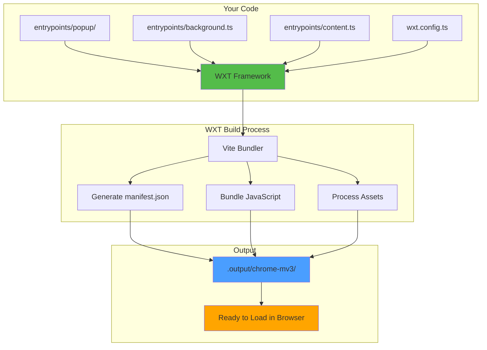
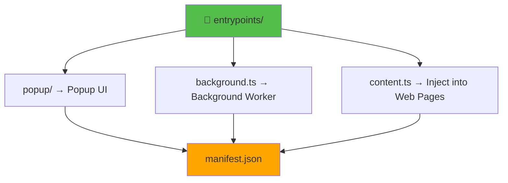
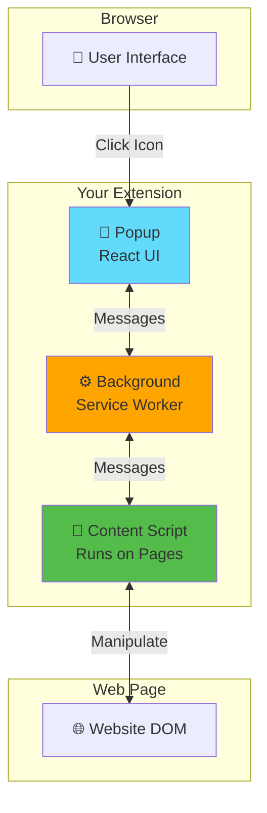

# Slide 1: Init WXT React Starter

**Branch:** `react/1-init-wxt-react-starter`

---

## <details><summary>🎯 What is WXT?</summary>

**WXT** (Web Extension Tools) is a next-generation framework for building browser extensions with:
- ⚡ **Vite-powered** - Lightning fast HMR
- 🎨 **Framework agnostic** - React, Vue, Svelte, Vanilla JS
- 📦 **Auto-bundling** - Generates manifest.json automatically
- 🔄 **Cross-browser** - Chrome, Firefox, Safari
- 🛠️ **TypeScript first** - Full type safety

</details>

---

## 📂 Files to Explore

### Configuration
- 📄 [wxt.config.ts](./wxt.config.ts)
- 📄 [package.json](command:vscode.open?%5B%22package.json%22%5D)
- 📄 [tsconfig.json](command:vscode.open?%5B%22tsconfig.json%22%5D)

### Entrypoints
- 📁 [entrypoints/popup/App.tsx](command:vscode.open?%5B%22entrypoints%2Fpopup%2FApp.tsx%22%5D)
- 📁 [entrypoints/popup/index.html](command:vscode.open?%5B%22entrypoints%2Fpopup%2Findex.html%22%5D)
- 📁 [entrypoints/popup/main.tsx](command:vscode.open?%5B%22entrypoints%2Fpopup%2Fmain.tsx%22%5D)
- 📄 [entrypoints/background.ts](command:vscode.open?%5B%22entrypoints%2Fbackground.ts%22%5D)
- 📄 [entrypoints/content.ts](command:vscode.open?%5B%22entrypoints%2Fcontent.ts%22%5D)

---

## 📊 How WXT Works

<details>
<summary>View Architecture Diagram</summary>



</details>

<details>
<summary>View Project Structure</summary>

```
📂 textarea-fullscreen-react/
├── 📁 entrypoints/       ← Your extension code
│   ├── 📁 popup/         ← Popup UI (React)
│   ├── 📄 background.ts  ← Background worker
│   └── 📄 content.ts     ← Runs on web pages
├── 📁 .output/           ← Build output
├── 📁 .wxt/              ← Generated config
└── 📄 wxt.config.ts      ← Main configuration
```

</details>

---

## 🚀 Demo Steps

### 1. Install Dependencies
```bash
npm install
```

<details>
<summary>What happens?</summary>

- Installs WXT framework
- Installs React 19 + React DOM
- Installs TypeScript and type definitions
- Sets up development tools

</details>

### 2. Start Development Server
```bash
npm run dev
```

<details>
<summary>What happens?</summary>

```
➜ wxt dev

🌐 WXT 0.20.6
🔨 Building chrome-mv3 for development...
✓ Built in 1.2s
📦 Output: .output/chrome-mv3
👀 Watching for changes...
```

**Build Process:**
1. Scans `entrypoints/` directory
2. Bundles each entrypoint
3. Generates `manifest.json`
4. Watches for file changes
5. Enables Hot Module Reload (HMR)

</details>

### 3. Load Extension in Browser

<details>
<summary>Chrome/Edge Instructions</summary>

1. Open `chrome://extensions/`
2. Enable "Developer mode" (top right)
3. Click "Load unpacked"
4. Select `.output/chrome-mv3` folder
5. Extension loaded! 🎉

</details>

<details>
<summary>Firefox Instructions</summary>

```bash
npm run dev:firefox
```
Firefox opens automatically with extension loaded!

</details>

### 4. Test the Popup
1. Click extension icon in toolbar
2. See the counter demo
3. Click "count is 0" button
4. Watch it increment!

### 5. Test Hot Module Reload (HMR)

<details>
<summary>Try this</summary>

1. Keep popup open
2. Edit `entrypoints/popup/App.tsx`
3. Add this line:
   ```tsx
   <h2>✨ WXT is Amazing!</h2>
   ```
4. **Save file**
5. Watch popup update **instantly** without reload! ⚡

</details>

---

## 🧠 Key Learning Points

### What is WXT?

<details>
<summary>Expand</summary>

- Modern framework for web extensions
- Built on Vite (fast, modern bundler)
- Handles manifest.json generation
- One codebase → Multiple browsers

</details>

### Entrypoints Concept

<details>
<summary>Expand</summary>



**Key Points:**
- Each file/folder in `entrypoints/` becomes part of your extension
- WXT automatically adds them to `manifest.json`
- No manual manifest editing needed!

</details>

### Auto-Reload in Development

<details>
<summary>Expand</summary>

**Traditional Extensions:**
Edit → Reload extension → Reopen popup → Test 😫

**With WXT:**
Edit → See changes instantly! ⚡

**How it works:**
1. Vite detects file change
2. Rebuilds only changed module
3. Hot Module Reload updates browser
4. UI updates without losing state

</details>

---

## 📝 Quick Reference

<details>
<summary>Commands</summary>

```bash
# Development
npm run dev              # Chrome (Manifest V3)
npm run dev:firefox      # Firefox (Manifest V2)

# Production
npm run build            # Build for Chrome
npm run build:firefox    # Build for Firefox

# Distribution
npm run zip              # Create chrome-mv3.zip
npm run zip:firefox      # Create firefox-mv2.zip
```

</details>

<details>
<summary>Extension Architecture</summary>



</details>

---

## ✅ What We Have Now

- ✅ Working popup with React counter
- ✅ Background script that logs on startup
- ✅ Content script (runs on Google.com only)
- ✅ Hot Module Reload for instant development
- ✅ TypeScript configured
- ✅ Auto-generated manifest.json

---

## 💡 Challenge

<details>
<summary>Try This Now!</summary>

**Customize the popup:**

1. Open `entrypoints/popup/App.tsx`
2. Change the button text:
   ```tsx
   <button onClick={() => setCount((count) => count + 1)}>
     🚀 Clicks: {count}
   </button>
   ```
3. Save and watch it update live!

</details>

---

## 🔗 Resources

<details>
<summary>Documentation Links</summary>

- 📚 [WXT Documentation](https://wxt.dev)
- 📚 [WXT GitHub](https://github.com/wxt-dev/wxt)
- 🎓 [Chrome Extension Docs](https://developer.chrome.com/docs/extensions)
- 🎓 [Firefox Extension Docs](https://developer.mozilla.org/en-US/docs/Mozilla/Add-ons/WebExtensions)

</details>

---

**Next:** [Slide 2: Understanding Entrypoints](./02-entrypoints.md)  
**Branch:** `git checkout react/2-understand-entrypoints`