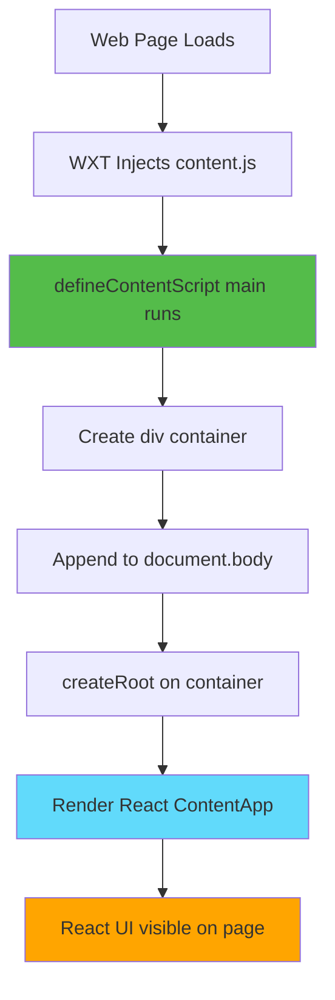
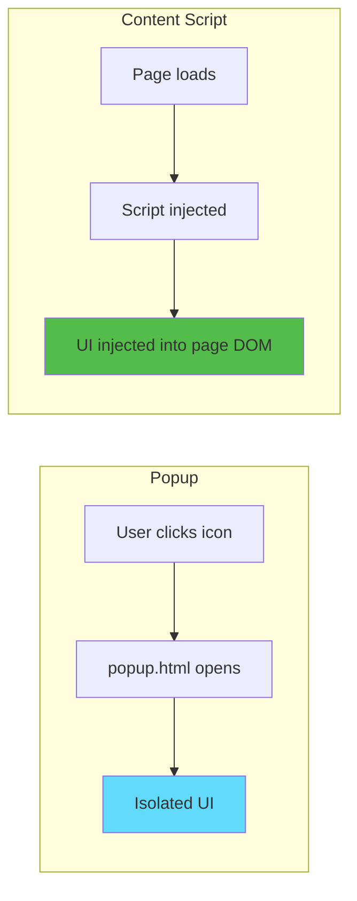
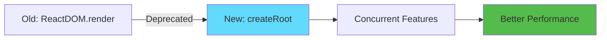

# Slide 2: Mounting React in Content Script

**Branch:** `react/02-react-content-script`

---

## 🎯 What is a React Content Script?

A content script that uses React to inject UI components directly into web pages. Instead of vanilla JavaScript DOM manipulation, we leverage React's component model for better organization and state management.

Key points:
- ⚡ **React in Content Scripts** - Use React components on any webpage
- 🎨 **Component-Based** - Organize UI as reusable components  
- 📦 **createRoot API** - Modern React 18+ mounting method
- 🔄 **TSX Support** - Full TypeScript + JSX support in WXT

---

## 📂 Files to Explore

<details>
<summary><b>New/Modified Files</b></summary>

- 📁 [entrypoints/content/index.tsx](../textarea-fullscreen-react/entrypoints/content/index.tsx)
- 📁 [entrypoints/content/ContentApp.tsx](../textarea-fullscreen-react/entrypoints/content/ContentApp.tsx)

</details>

<details>
<summary><b>Configuration Files</b></summary>

- 📄 [wxt.config.ts](../textarea-fullscreen-react/wxt.config.ts)
- 📄 [package.json](../textarea-fullscreen-react/package.json)

</details>

---

## ✅ What's New in This Slide

- ✅ Converted `content.ts` from single file to directory structure
- ✅ Created React entrypoint with `createRoot`
- ✅ Added `ContentApp.tsx` component
- ✅ Injected React UI into every webpage
- ✅ Used high z-index for visibility above page content

---

**Next:** [Slide 3: Auto-Imports and Hooks](./03-auto-imports-and-hooks.md)  

---

## 📑 Deep Dive

- [How It Works](#how-it-works)
- [Implementation Steps](#implementation-steps)
- [Key Concepts](#key-concepts)
- [Code Examples](#code-examples)
- [Common Patterns](#common-patterns)
- [Documentation](#documentation)
- [Challenge](#challenge)

---

## How It Works



**Flow Explanation:**
1. User visits any webpage
2. Browser injects your content script
3. Script creates a container div
4. React mounts into that container
5. Your React components render on the page

---

## Implementation Steps

### 1. Convert to Directory Structure

**Old structure:**
```
📂 entrypoints/
   📄 content.ts
```

**New structure:**
```
📂 entrypoints/
   📂 content/
      📄 index.tsx       # Entrypoint (must be named index)
      📄 ContentApp.tsx  # React component
```

**Why?**
- Keeps related files together
- Allows adding more components/styles later
- WXT looks for `index.tsx` as the entrypoint

---

### 2. Create Content Script Entrypoint

```typescript
// entrypoints/content/index.tsx
import { createRoot } from 'react-dom/client';
import ContentApp from './ContentApp';

export default defineContentScript({
  matches: ['<all_urls>'],
  
  main() {
    // Create container for React app
    const container = document.createElement('div');
    container.id = 'textarea-fullscreen-root';
    document.body.appendChild(container);
    
    // Mount React
    const root = createRoot(container);
    root.render(<ContentApp />);
  },
});
```

**What happens:**
- `matches: ['<all_urls>']` - Run on every webpage
- `main()` - Runs when script loads
- Creates a div and appends to page
- Mounts React app into that div

---

### 3. Create React Component

```tsx
// entrypoints/content/ContentApp.tsx
export default function ContentApp() {
  return (
    <div style={{ 
      position: 'fixed', 
      top: 10, 
      right: 10, 
      background: 'white',
      padding: '10px',
      border: '2px solid #54bc4a',
      borderRadius: '4px',
      zIndex: 999999,
      fontFamily: 'sans-serif',
      fontSize: '14px',
      boxShadow: '0 2px 8px rgba(0,0,0,0.15)'
    }}>
      ✅ Extension Active
    </div>
  );
}
```

**Styling notes:**
- `position: fixed` - Stays visible when scrolling
- `zIndex: 999999` - Appears above most page content
- `top/right: 10` - Positioned in top-right corner

---

### 4. Test on Any Website

**Steps:**
1. Run `npm run dev`
2. Load extension in browser
3. Visit **any website** (e.g., google.com, github.com)
4. See "✅ Extension Active" badge in top-right corner

---

## Key Concepts

### Concept 1: Content Script vs Popup



**Key Differences:**
- **Popup:** Opens when user clicks extension icon, separate window
- **Content Script:** Runs automatically on web pages, shares DOM with page
- **Use Case:** Content scripts modify/enhance existing pages

---

### Concept 2: Why `main()` Function?

**❌ WRONG - Code runs during build:**
```typescript
const container = document.createElement('div'); // Error! No 'document' during build

export default defineContentScript({
  matches: ['<all_urls>'],
  main() {
    document.body.appendChild(container);
  }
});
```

**✅ CORRECT - Code runs in browser:**
```typescript
export default defineContentScript({
  matches: ['<all_urls>'],
  main() {
    const container = document.createElement('div'); // ✓ Runs in browser
    document.body.appendChild(container);
  }
});
```

**Explanation:**
- WXT imports content scripts during **build time** (Node.js environment)
- `document`, `window` don't exist in Node.js
- `main()` function runs in **browser** where DOM exists

---

### Concept 3: React createRoot (React 18+)



**Old way (React 17):**
```typescript
import ReactDOM from 'react-dom';
ReactDOM.render(<App />, container);
```

**New way (React 18+):**
```typescript
import { createRoot } from 'react-dom/client';
const root = createRoot(container);
root.render(<App />);
```

---

## Code Examples

### Example 1: Simple Badge Component

```tsx
// entrypoints/content/ContentApp.tsx
export default function ContentApp() {
  return (
    <div style={{ 
      position: 'fixed', 
      top: 10, 
      right: 10, 
      background: 'white',
      padding: '10px',
      zIndex: 999999 
    }}>
      Extension Active ✓
    </div>
  );
}
```

**What this does:**
- Creates a fixed position badge
- Shows "Extension Active ✓" message
- Appears on every webpage matching pattern

---

### Example 2: With State

```tsx
// entrypoints/content/ContentApp.tsx
import { useState } from 'react';

export default function ContentApp() {
  const [count, setCount] = useState(0);

  return (
    <div style={{ 
      position: 'fixed', 
      top: 10, 
      right: 10, 
      background: 'white',
      padding: '10px',
      zIndex: 999999 
    }}>
      <p>Page visits: {count}</p>
      <button onClick={() => setCount(c => c + 1)}>
        Increment
      </button>
    </div>
  );
}
```

**What this does:**
- Adds React state with `useState`
- Button increments counter
- Demonstrates React hooks work in content scripts

---

### Example 3: Multiple Components

```tsx
// entrypoints/content/ContentApp.tsx
function Badge({ children }) {
  return (
    <div style={{
      background: '#54bc4a',
      color: 'white',
      padding: '5px 10px',
      borderRadius: '4px',
      fontSize: '12px'
    }}>
      {children}
    </div>
  );
}

export default function ContentApp() {
  return (
    <div style={{ 
      position: 'fixed', 
      top: 10, 
      right: 10, 
      zIndex: 999999 
    }}>
      <Badge>✅ Extension Active</Badge>
    </div>
  );
}
```

---

## Common Patterns

<details>
<summary><b>Pattern 1: Conditional Rendering</b></summary>

```tsx
export default function ContentApp() {
  const [visible, setVisible] = useState(true);

  if (!visible) return null;

  return (
    <div style={{ position: 'fixed', top: 10, right: 10, zIndex: 999999 }}>
      Extension Active
      <button onClick={() => setVisible(false)}>Hide</button>
    </div>
  );
}
```

**When to use:**
- Show/hide UI based on conditions
- Toggle visibility
- Conditional features

</details>

<details>
<summary><b>Pattern 2: Cleanup on Unmount</b></summary>

```tsx
export default function ContentApp() {
  useEffect(() => {
    console.log('Component mounted');
    
    return () => {
      console.log('Component unmounted');
      // Cleanup code here
    };
  }, []);

  return <div>Content</div>;
}
```

**When to use:**
- Remove event listeners
- Clear intervals/timeouts
- Clean up resources

</details>

<details>
<summary><b>Pattern 3: High z-index Styling</b></summary>

```tsx
const OVERLAY_STYLES = {
  position: 'fixed',
  zIndex: 2147483647, // Maximum z-index value
  top: 0,
  right: 0,
  // ... other styles
};

export default function ContentApp() {
  return <div style={OVERLAY_STYLES}>Always on top</div>;
}
```

**When to use:**
- Ensure visibility above all page content
- Modal overlays
- Fixed position UI

</details>

---

## Documentation

<details>
<summary><b>Related Resources</b></summary>

- 📚 [WXT Content Scripts](https://wxt.dev/guide/essentials/content-scripts.html)
- 📚 [React createRoot API](https://react.dev/reference/react-dom/client/createRoot)
- 🎓 [Chrome Content Scripts](https://developer.chrome.com/docs/extensions/mv3/content_scripts/)
- 💡 [React in Extensions Best Practices](https://wxt.dev/guide/frameworks/react.html)

</details>

---

## Challenge

**Try this yourself:**

1. Add a counter that tracks how many textareas are on the page
2. Display the count in your badge component
3. Update the count when new textareas are added dynamically

**Expected result:**
- Badge shows: "Textareas found: 3"
- Count updates automatically

**Bonus:**
- Add a button to highlight all textareas on the page
- Use different colors for different textarea states

**Hint:**
```tsx
const textareas = document.querySelectorAll('textarea');
console.log('Found:', textareas.length);
```

---

**Next:** [Slide 3: Auto-Imports and Hooks](./03-auto-imports-and-hooks.md)