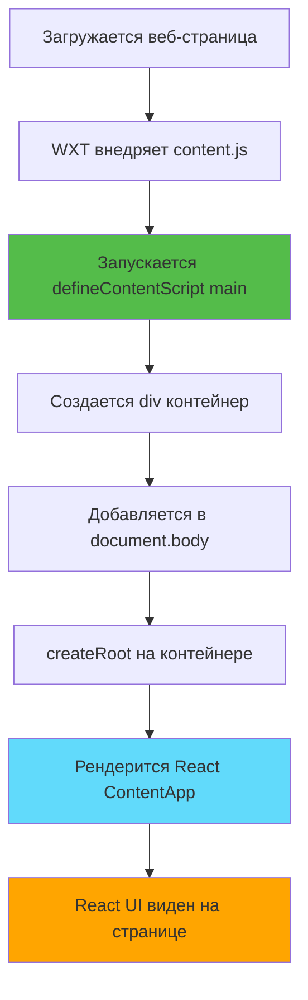
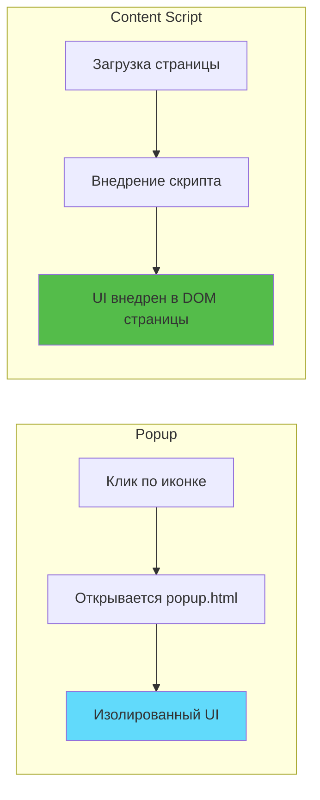
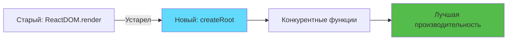

# Слайд 2: Монтирование React в Content Script

**Ветка:** `react/02-react-content-script`

---

## 🎯 Что такое React Content Script?

Content script, который использует React для внедрения UI компонентов непосредственно в веб-страницы. Вместо манипуляции DOM на чистом JavaScript, мы используем компонентную модель React для лучшей организации и управления состоянием.

Ключевые моменты:
- ⚡ **React в Content Scripts** - Используйте React компоненты на любой веб-странице
- 🎨 **Компонентный подход** - Организуйте UI как переиспользуемые компоненты  
- 📦 **API createRoot** - Современный метод монтирования React 18+
- 🔄 **Поддержка TSX** - Полная поддержка TypeScript + JSX в WXT

---

## 📂 Файлы для изучения

<details>
<summary><b>Новые/Измененные файлы</b></summary>

- 📁 [entrypoints/content/index.tsx](../textarea-fullscreen-react/entrypoints/content/index.tsx)
- 📁 [entrypoints/content/ContentApp.tsx](../textarea-fullscreen-react/entrypoints/content/ContentApp.tsx)

</details>

<details>
<summary><b>Файлы конфигурации</b></summary>

- 📄 [wxt.config.ts](../textarea-fullscreen-react/wxt.config.ts)
- 📄 [package.json](../textarea-fullscreen-react/package.json)

</details>

---

## ✅ Что нового в этом слайде

- ✅ Преобразован `content.ts` из одного файла в структуру каталогов
- ✅ Создана точка входа React с `createRoot`
- ✅ Добавлен компонент `ContentApp.tsx`
- ✅ React UI внедрен на каждую веб-страницу
- ✅ Использован высокий z-index для видимости поверх содержимого страницы

---

**Далее:** [Слайд 3: Авто-импорты и хуки](./03-auto-imports-and-hooks.md)  

---

## 📑 Подробное изучение

- [Как это работает](#как-это-работает)
- [Шаги реализации](#шаги-реализации)
- [Ключевые концепции](#ключевые-концепции)
- [Примеры кода](#примеры-кода)
- [Распространенные паттерны](#распространенные-паттерны)
- [Документация](#документация)
- [Задание](#задание)

---

## Как это работает



**Объяснение потока:**
1. Пользователь посещает любую веб-страницу
2. Браузер внедряет ваш content script
3. Скрипт создает контейнер div
4. React монтируется в этот контейнер
5. Ваши React компоненты рендерятся на странице

---

## Шаги реализации

### 1. Преобразование в структуру каталогов

**Старая структура:**
```
📂 entrypoints/
   📄 content.ts
```

**Новая структура:**
```
📂 entrypoints/
   📂 content/
      📄 index.tsx       # Точка входа (должна называться index)
      📄 ContentApp.tsx  # React компонент
```

**Почему?**
- Держит связанные файлы вместе
- Позволяет добавлять больше компонентов/стилей позже
- WXT ищет `index.tsx` как точку входа

---

### 2. Создание точки входа Content Script

```typescript
// entrypoints/content/index.tsx
import { createRoot } from 'react-dom/client';
import ContentApp from './ContentApp';

export default defineContentScript({
  matches: ['<all_urls>'],
  
  main() {
    // Создаем контейнер для React приложения
    const container = document.createElement('div');
    container.id = 'textarea-fullscreen-root';
    document.body.appendChild(container);
    
    // Монтируем React
    const root = createRoot(container);
    root.render(<ContentApp />);
  },
});
```

**Что происходит:**
- `matches: ['<all_urls>']` - Запуск на каждой веб-странице
- `main()` - Выполняется при загрузке скрипта
- Создает div и добавляет на страницу
- Монтирует React приложение в этот div

---

### 3. Создание React компонента

```tsx
// entrypoints/content/ContentApp.tsx
export default function ContentApp() {
  return (
    <div style={{ 
      position: 'fixed', 
      top: 10, 
      right: 10, 
      background: 'white',
      padding: '10px',
      border: '2px solid #54bc4a',
      borderRadius: '4px',
      zIndex: 999999,
      fontFamily: 'sans-serif',
      fontSize: '14px',
      boxShadow: '0 2px 8px rgba(0,0,0,0.15)'
    }}>
      ✅ Расширение активно
    </div>
  );
}
```

**Примечания по стилям:**
- `position: fixed` - Остается видимым при прокрутке
- `zIndex: 999999` - Отображается поверх большинства содержимого страницы
- `top/right: 10` - Позиционирован в правом верхнем углу

---

### 4. Тестирование на любом веб-сайте

**Шаги:**
1. Запустите `npm run dev`
2. Загрузите расширение в браузер
3. Посетите **любой веб-сайт** (например, google.com, github.com)
4. Увидите бейдж "✅ Расширение активно" в правом верхнем углу

---

## Ключевые концепции

### Концепция 1: Content Script vs Popup



**Ключевые различия:**
- **Popup:** Открывается при клике на иконку расширения, отдельное окно
- **Content Script:** Запускается автоматически на веб-страницах, разделяет DOM со страницей
- **Случай использования:** Content scripts модифицируют/улучшают существующие страницы

---

### Концепция 2: Зачем функция `main()`?

**❌ НЕПРАВИЛЬНО - Код выполняется во время сборки:**
```typescript
const container = document.createElement('div'); // Ошибка! Нет 'document' во время сборки

export default defineContentScript({
  matches: ['<all_urls>'],
  main() {
    document.body.appendChild(container);
  }
});
```

**✅ ПРАВИЛЬНО - Код выполняется в браузере:**
```typescript
export default defineContentScript({
  matches: ['<all_urls>'],
  main() {
    const container = document.createElement('div'); // ✓ Выполняется в браузере
    document.body.appendChild(container);
  }
});
```

**Объяснение:**
- WXT импортирует content scripts во время **сборки** (среда Node.js)
- `document`, `window` не существуют в Node.js
- Функция `main()` выполняется в **браузере**, где существует DOM

---

### Концепция 3: React createRoot (React 18+)



**Старый способ (React 17):**
```typescript
import ReactDOM from 'react-dom';
ReactDOM.render(<App />, container);
```

**Новый способ (React 18+):**
```typescript
import { createRoot } from 'react-dom/client';
const root = createRoot(container);
root.render(<App />);
```

---

## Примеры кода

### Пример 1: Простой компонент бейджа

```tsx
// entrypoints/content/ContentApp.tsx
export default function ContentApp() {
  return (
    <div style={{ 
      position: 'fixed', 
      top: 10, 
      right: 10, 
      background: 'white',
      padding: '10px',
      zIndex: 999999 
    }}>
      Расширение активно ✓
    </div>
  );
}
```

**Что это делает:**
- Создает бейдж с фиксированной позицией
- Показывает сообщение "Расширение активно ✓"
- Появляется на каждой веб-странице, соответствующей паттерну

---

### Пример 2: С состоянием

```tsx
// entrypoints/content/ContentApp.tsx
import { useState } from 'react';

export default function ContentApp() {
  const [count, setCount] = useState(0);

  return (
    <div style={{ 
      position: 'fixed', 
      top: 10, 
      right: 10, 
      background: 'white',
      padding: '10px',
      zIndex: 999999 
    }}>
      <p>Посещений страницы: {count}</p>
      <button onClick={() => setCount(c => c + 1)}>
        Увеличить
      </button>
    </div>
  );
}
```

**Что это делает:**
- Добавляет состояние React с `useState`
- Кнопка увеличивает счетчик
- Демонстрирует, что React хуки работают в content scripts

---

### Пример 3: Несколько компонентов

```tsx
// entrypoints/content/ContentApp.tsx
function Badge({ children }) {
  return (
    <div style={{
      background: '#54bc4a',
      color: 'white',
      padding: '5px 10px',
      borderRadius: '4px',
      fontSize: '12px'
    }}>
      {children}
    </div>
  );
}

export default function ContentApp() {
  return (
    <div style={{ 
      position: 'fixed', 
      top: 10, 
      right: 10, 
      zIndex: 999999 
    }}>
      <Badge>✅ Расширение активно</Badge>
    </div>
  );
}
```

---

## Распространенные паттерны

<details>
<summary><b>Паттерн 1: Условный рендеринг</b></summary>

```tsx
export default function ContentApp() {
  const [visible, setVisible] = useState(true);

  if (!visible) return null;

  return (
    <div style={{ position: 'fixed', top: 10, right: 10, zIndex: 999999 }}>
      Расширение активно
      <button onClick={() => setVisible(false)}>Скрыть</button>
    </div>
  );
}
```

**Когда использовать:**
- Показ/скрытие UI на основе условий
- Переключение видимости
- Условные функции

</details>

<details>
<summary><b>Паттерн 2: Очистка при размонтировании</b></summary>

```tsx
export default function ContentApp() {
  useEffect(() => {
    console.log('Компонент смонтирован');
    
    return () => {
      console.log('Компонент размонтирован');
      // Код очистки здесь
    };
  }, []);

  return <div>Содержимое</div>;
}
```

**Когда использовать:**
- Удаление обработчиков событий
- Очистка интервалов/таймаутов
- Очистка ресурсов

</details>

<details>
<summary><b>Паттерн 3: Стилизация с высоким z-index</b></summary>

```tsx
const OVERLAY_STYLES = {
  position: 'fixed',
  zIndex: 2147483647, // Максимальное значение z-index
  top: 0,
  right: 0,
  // ... другие стили
};

export default function ContentApp() {
  return <div style={OVERLAY_STYLES}>Всегда сверху</div>;
}
```

**Когда использовать:**
- Обеспечение видимости поверх всего содержимого страницы
- Модальные оверлеи
- UI с фиксированной позицией

</details>

---

## Документация

<details>
<summary><b>Связанные ресурсы</b></summary>

- 📚 [WXT Content Scripts](https://wxt.dev/guide/essentials/content-scripts.html)
- 📚 [React createRoot API](https://react.dev/reference/react-dom/client/createRoot)
- 🎓 [Chrome Content Scripts](https://developer.chrome.com/docs/extensions/mv3/content_scripts/)
- 💡 [Лучшие практики React в расширениях](https://wxt.dev/guide/frameworks/react.html)

</details>

---

## Задание

**Попробуйте сами:**

1. Добавьте счетчик, который отслеживает, сколько textarea на странице
2. Отобразите количество в вашем компоненте бейджа
3. Обновляйте счетчик при динамическом добавлении новых textarea

**Ожидаемый результат:**
- Бейдж показывает: "Найдено textarea: 3"
- Счетчик обновляется автоматически

**Бонус:**
- Добавьте кнопку для подсветки всех textarea на странице
- Используйте разные цвета для разных состояний textarea

**Подсказка:**
```tsx
const textareas = document.querySelectorAll('textarea');
console.log('Найдено:', textareas.length);
```

---

**Далее:** [Слайд 3: Авто-импорты и хуки](./03-auto-imports-and-hooks.md)