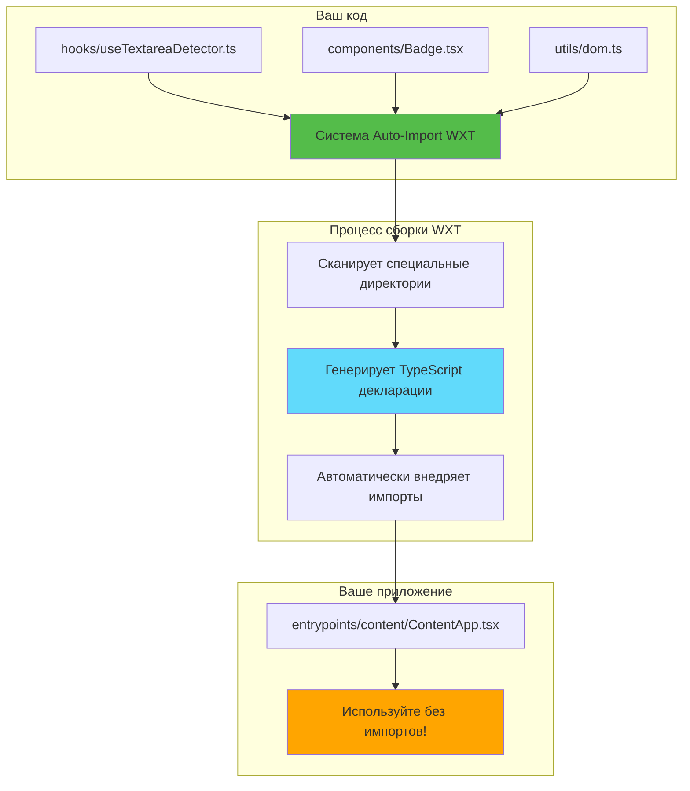
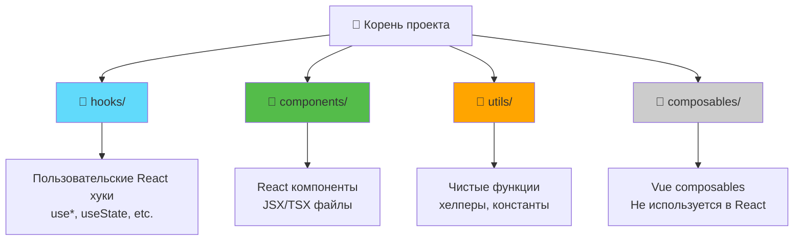

# Слайд 3: Система Auto-Import в WXT

**Ветка:** `react/03-auto-imports-and-hooks`

---

## 🎯 Что такое WXT Auto-Import?

WXT автоматически импортирует файлы из специальных директорий (`hooks/`, `components/`, `utils/`), поэтому вам не нужны ручные импорты. Подобно auto-imports в Nuxt.js, это делает ваш код чище и уменьшает шаблонный код.

Ключевые моменты:
- ⚡ **Никаких импортов** - Файлы автоматически импортируются из специальных директорий
- 🎨 **Конвенции вместо конфигурации** - Положите файлы в правильную папку, и они просто работают
- 📦 **Типобезопасность** - Полная поддержка TypeScript с автодополнением
- 🔄 **Знает о фреймворках** - `hooks/` для React, `composables/` для Vue
- 🛠️ **Лучший DX** - Меньше шаблонного кода, чище код

---

## 📂 Файлы для изучения

<details>
<summary><b>Новые директории и файлы</b></summary>

- 📁 [hooks/useTextareaDetector.ts](../textarea-fullscreen-react/hooks/useTextareaDetector.ts)
- 📁 [components/Badge.tsx](../textarea-fullscreen-react/components/Badge.tsx)
- 📁 [utils/dom.ts](../textarea-fullscreen-react/utils/dom.ts)
- 📁 [entrypoints/content/ContentApp.tsx](../textarea-fullscreen-react/entrypoints/content/ContentApp.tsx)

</details>

<details>
<summary><b>Изменённые файлы</b></summary>

- 📄 [entrypoints/content/index.ts](../textarea-fullscreen-react/entrypoints/content/index.ts)
- 📄 [wxt.config.ts](../textarea-fullscreen-react/wxt.config.ts)

</details>

---

## ✅ Что нового в этом слайде

- ✅ Создана директория `hooks/` для пользовательских React хуков
- ✅ Создана директория `components/` для переиспользуемых компонентов
- ✅ Создана директория `utils/` для вспомогательных функций
- ✅ Реализован хук `useTextareaDetector`
- ✅ Использован auto-imported код без ручных импортов

---

**Далее:** [Слайд 4: Обнаружение и валидация Textarea](./04-detect-and-validate-textareas.md)  

---

## 📑 Подробное погружение

- [Как это работает](#как-это-работает)
- [Шаги реализации](#шаги-реализации)
- [Ключевые концепции](#ключевые-концепции)
- [Примеры кода](#примеры-кода)
- [Частые паттерны](#частые-паттерны)
- [Документация](#документация)
- [Задание](#задание)

---

## Как это работает



**Объяснение потока:**
1. Вы создаёте файлы в `hooks/`, `components/` или `utils/`
2. WXT сканирует эти директории во время сборки
3. Генерирует определения типов в папке `.wxt/`
4. Ваш код может использовать их без импортов
5. TypeScript всё ещё имеет полную типобезопасность и автодополнение

---

## Шаги реализации

### 1. Создание структуры проекта

```bash
# Создайте директории
mkdir hooks
mkdir components
mkdir utils
```

**Финальная структура:**
```
📂 textarea-fullscreen-react/
   📁 .wxt/                    # Генерируется WXT (игнорируется git)
      📄 types.d.ts            # Автоматически сгенерированные определения типов
   📁 hooks/                   # Ваши пользовательские хуки
      📄 useTextareaDetector.ts
   📁 components/              # Ваши компоненты
      📄 Badge.tsx
   📁 utils/                   # Ваши утилиты
      📄 dom.ts
   📁 entrypoints/
      📂 content/
         📄 ContentApp.tsx     # Использует auto-imported код
         📄 index.html
         📄 main.tsx
      📄 content.ts
```

---

### 2. Создание пользовательского хука

```typescript
// hooks/useTextareaDetector.ts
import { useState, useEffect } from 'react';

export function useTextareaDetector() {
  const [textareas, setTextareas] = useState<HTMLTextAreaElement[]>([]);

  useEffect(() => {
    // Ищем все textarea элементы на странице
    const elements = document.querySelectorAll('textarea');
    setTextareas(Array.from(elements));
    
    console.log(`[useTextareaDetector] Найдено ${elements.length} textareas`);
  }, []); // Пустой массив = выполняется один раз при монтировании

  return { 
    textareas,              // Массив найденных textarea
    count: textareas.length // Количество для удобства
  };
}
```

**Что это делает:**
- Находит все элементы `<textarea>` на странице
- Возвращает их как массив
- Обновляется при монтировании компонента
- Добавляет счётчик для удобства

---

### 3. Создание переиспользуемого компонента

```tsx
// components/Badge.tsx
interface BadgeProps {
  children: React.ReactNode;
  color?: string;
}

export function Badge({ children, color = '#54bc4a' }: BadgeProps) {
  return (
    <div
      style={{
        background: color,
        color: 'white',
        padding: '8px 12px',
        borderRadius: '6px',
        fontSize: '14px',
        fontWeight: 'bold',
        display: 'inline-block',
        boxShadow: '0 2px 8px rgba(0,0,0,0.15)',
      }}
    >
      {children}
    </div>
  );
}
```

**Что это делает:**
- Создаёт стилизованный значок (badge)
- Принимает пользовательский цвет (по умолчанию зелёный WXT)
- Отображает переданные дочерние элементы
- Имеет тень для визуальной глубины

---

### 4. Создание утилитарных функций

```typescript
// utils/dom.ts

/**
 * Получить количество textarea на странице
 */
export function getTextareaCount(): number {
  return document.querySelectorAll('textarea').length;
}

/**
 * Подсветить элемент цветной обводкой
 */
export function highlightElement(element: HTMLElement, color: string = 'yellow') {
  element.style.outline = `3px solid ${color}`;
}

/**
 * Убрать подсветку с элемента
 */
export function removeHighlight(element: HTMLElement) {
  element.style.outline = '';
}
```

**Что это делает:**
- `getTextareaCount()` - подсчитывает textarea на странице
- `highlightElement()` - добавляет цветную обводку
- `removeHighlight()` - убирает обводку

---

### 5. Использование auto-imported кода

```tsx
// entrypoints/content/ContentApp.tsx

// ═══════════════════════════════════════════════════════════
// ❌ СТАРЫЙ СПОСОБ - Ручные импорты
// import { useTextareaDetector } from '../../hooks/useTextareaDetector';
// import { Badge } from '../../components/Badge';
// import { getTextareaCount } from '../../utils/dom';
// ═══════════════════════════════════════════════════════════

// ✅ НОВЫЙ СПОСОБ - Импорты не нужны!
export default function ContentApp() {
  // Auto-imported хук! 🎉
  const { textareas, count } = useTextareaDetector();
  
  console.log('[ContentApp] Рендеринг с', count, 'textarea элементами');

  return (
    <div
      style={{
        position: 'fixed', // Фиксированная позиция
        top: 10,           // 10px от верха
        right: 10,         // 10px справа
        zIndex: 999999,    // Поверх всех элементов
      }}
    >
      {/* Auto-imported компонент! 🎉 */}
      <Badge color="#0066cc">
        Найдено {count} textarea{count !== 1 ? '' : ''}
      </Badge>
    </div>
  );
}
```

---

### 6. Настройка Content Script

```typescript
// entrypoints/content/index.ts
import React from 'react';
import ReactDOM from 'react-dom/client';
import ContentApp from './content/ContentApp';

export default defineContentScript({
  matches: ['<all_urls>'], // Запускается на всех сайтах
  
  main(ctx) {
    console.log('Content script загружен!');
    
    // Создаём UI интеграцию с WXT
    const ui = createIntegratedUI(ctx, {
      position: 'inline',
      onMount: (container) => {
        const root = ReactDOM.createRoot(container);
        root.render(
          <React.StrictMode>
            <ContentApp />
          </React.StrictMode>
        );
        return root;
      },
      onRemove: (root) => {
        root?.unmount();
      },
    });
    
    ui.mount();
  },
});
```

---

### 7. Проверка работы Auto-Imports

**Шаги:**
1. Запустите `npm run dev`
2. Проверьте файл `.wxt/types.d.ts` (автоматически сгенерирован)
3. Начните печатать в ContentApp.tsx
4. Увидите автодополнение для ваших hooks/components/utils
5. Нет красных подчёркиваний = работает! ✅

**Проверьте `.wxt/types.d.ts`:**
```typescript
// Этот файл автоматически генерируется WXT
declare module '#imports' {
  export const useTextareaDetector: typeof import('../hooks/useTextareaDetector').useTextareaDetector;
  export const Badge: typeof import('../components/Badge').Badge;
  export const getTextareaCount: typeof import('../utils/dom').getTextareaCount;
  export const highlightElement: typeof import('../utils/dom').highlightElement;
  export const removeHighlight: typeof import('../utils/dom').removeHighlight;
}
```

---

## Ключевые концепции

### Концепция 1: Специальные директории



**Назначение директорий:**
- **`hooks/`** - React хуки (должны начинаться с `use`)
- **`components/`** - React компоненты (имена с заглавной буквы)
- **`utils/`** - Чистые утилитарные функции
- **`composables/`** - Vue composables (игнорируется для React проектов)

---

### Концепция 2: Как WXT генерирует типы

**Процесс сборки:**
```
1. WXT сканирует hooks/, components/, utils/
2. Извлекает экспортируемые функции/компоненты
3. Генерирует TypeScript декларации
4. Сохраняет в .wxt/types.d.ts
5. TypeScript читает эти типы
6. Вы получаете автодополнение!
```

**Пошаговый процесс:**

```
┌─────────────────────────────────────┐
│ npm run dev                         │
└──────────┬──────────────────────────┘
           │
           ▼
┌─────────────────────────────────────┐
│ WXT сканирует:                      │
│  hooks/useTextareaDetector.ts       │
│  components/Badge/index.tsx         │
│  utils/dom.ts                       │
└──────────┬──────────────────────────┘
           │
           ▼
┌─────────────────────────────────────┐
│ WXT находит экспорты:               │
│  - useTextareaDetector (function)   │
│  - Badge (component)                │
│  - getTextareaCount (function)      │
│  - highlightElement (function)      │
│  - removeHighlight (function)       │
└──────────┬──────────────────────────┘
           │
           ▼
┌─────────────────────────────────────┐
│ Генерирует .wxt/types.d.ts          │
│ с TypeScript декларациями           │
└──────────┬──────────────────────────┘
           │
           ▼
┌─────────────────────────────────────┐
│ TypeScript получает автодополнение  │
│ Vite плагин внедряет импорты        │
└─────────────────────────────────────┘
```

**Вы никогда не редактируете `.wxt/types.d.ts`!** WXT регенерирует его автоматически.

---

### Концепция 3: Соглашения об именовании

**Хуки (должны начинаться с `use`):**
```typescript
✅ useTextareaDetector
✅ useFullscreen
✅ useSettings
❌ textareaDetector (отсутствует префикс 'use')
❌ getTextareas (это не хук)
```

**Компоненты (PascalCase):**
```tsx
✅ Badge
✅ FullscreenButton
✅ TextareaWrapper
❌ badge (строчные буквы)
❌ fullscreen-button (kebab-case)
```

**Утилиты (любое валидное имя функции):**
```typescript
✅ getTextareaCount
✅ highlightElement
✅ debounce
✅ CONSTANTS (заглавные для констант)
```

---

## Примеры кода

### Пример 1: Простой хук

```typescript
// hooks/useCounter.ts
import { useState } from 'react';

export function useCounter(initialValue: number = 0) {
  const [count, setCount] = useState(initialValue);

  const increment = () => setCount(c => c + 1);
  const decrement = () => setCount(c => c - 1);
  const reset = () => setCount(initialValue);

  return { count, increment, decrement, reset };
}
```

**Использование (auto-imported):**
```tsx
// entrypoints/content/ContentApp.tsx
export default function ContentApp() {
  const { count, increment } = useCounter(0);
  
  return <button onClick={increment}>Счёт: {count}</button>;
}
```

---

### Пример 2: Компонент с пропсами

```tsx
// components/StatusBadge/index.tsx
interface StatusBadgeProps {
  status: 'active' | 'inactive' | 'error';
  message: string;
}

export function StatusBadge({ status, message }: StatusBadgeProps) {
  const colors = {
    active: '#4caf50',
    inactive: '#9e9e9e',
    error: '#f44336'
  };

  return (
    <div
      style={{
        background: colors[status],
        color: 'white',
        padding: '8px 12px',
        borderRadius: '4px'
      }}
    >
      {message}
    </div>
  );
}
```

**Использование (auto-imported):**
```tsx
export default function ContentApp() {
  return <StatusBadge status="active" message="Расширение работает" />;
}
```

---

### Пример 3: Утилитарные функции

```typescript
// utils/validators.ts

/**
 * Проверить, является ли элемент валидным textarea
 */
export function isValidTextarea(element: HTMLElement): boolean {
  return element.tagName === 'TEXTAREA' && !element.hasAttribute('disabled');
}

/**
 * Получить информацию о textarea
 */
export function getTextareaInfo(textarea: HTMLTextAreaElement) {
  return {
    id: textarea.id,
    name: textarea.name,
    rows: textarea.rows,
    value: textarea.value,
    length: textarea.value.length
  };
}
```

**Использование (auto-imported):**
```tsx
export default function ContentApp() {
  const { textareas } = useTextareaDetector();
  
  const validTextareas = textareas.filter(isValidTextarea);
  
  return <div>Валидных: {validTextareas.length}</div>;
}
```

---

### Пример 4: Полный пример

```tsx
// entrypoints/content/ContentApp.tsx
export default function ContentApp() {
  // Всё auto-imported! Импорты не нужны
  const { textareas } = useTextareaDetector();
  const { count, increment } = useCounter(0);
  const validCount = textareas.filter(isValidTextarea).length;

  return (
    <div style={{ position: 'fixed', top: 10, right: 10, zIndex: 999999 }}>
      <StatusBadge 
        status={validCount > 0 ? 'active' : 'inactive'}
        message={`${validCount} textarea найдено`}
      />
      
      <Badge color="#0066cc">
        Кликов: {count}
      </Badge>
      
      <button onClick={increment}>Увеличить</button>
    </div>
  );
}
```

---

## Частые паттерны

<details>
<summary><b>Паттерн 1: Хук с зависимостями</b></summary>

```typescript
// hooks/useDebounce.ts
import { useState, useEffect } from 'react';

export function useDebounce<T>(value: T, delay: number): T {
  const [debouncedValue, setDebouncedValue] = useState(value);

  useEffect(() => {
    const handler = setTimeout(() => {
      setDebouncedValue(value);
    }, delay);

    return () => clearTimeout(handler);
  }, [value, delay]);

  return debouncedValue;
}
```

**Когда использовать:**
- Отложенное обновление состояния
- Поля поиска
- API вызовы
- Оптимизация производительности

</details>

<details>
<summary><b>Паттерн 2: Составной компонент</b></summary>

```tsx
// components/Card/index.tsx
export function Card({ children }: { children: React.ReactNode }) {
  return (
    <div
      style={{
        background: 'white',
        borderRadius: '8px',
        padding: '16px',
        boxShadow: '0 2px 8px rgba(0,0,0,0.1)'
      }}
    >
      {children}
    </div>
  );
}

export function CardHeader({ children }: { children: React.ReactNode }) {
  return <h3 style={{ margin: '0 0 12px 0' }}>{children}</h3>;
}

export function CardBody({ children }: { children: React.ReactNode }) {
  return <div>{children}</div>;
}
```

**Использование:**
```tsx
<Card>
  <CardHeader>Заголовок</CardHeader>
  <CardBody>Содержимое</CardBody>
</Card>
```

</details>

<details>
<summary><b>Паттерн 3: Константы и конфигурация</b></summary>

```typescript
// utils/constants.ts
export const COLORS = {
  primary: '#0066cc',
  success: '#4caf50',
  error: '#f44336',
  warning: '#ff9800'
} as const;

export const Z_INDEX = {
  badge: 999999,
  modal: 1000000,
  overlay: 999998
} as const;

export const TEXTAREA_MIN_SIZE = {
  width: 50,
  height: 15
} as const;
```

**Использование:**
```tsx
<div
  style={{ 
    zIndex: Z_INDEX.badge, 
    background: COLORS.primary 
  }}
>
  Значок
</div>
```

</details>

<details>
<summary><b>Паттерн 4: Типобезопасные утилиты</b></summary>

```typescript
// utils/array.ts

/** Получить уникальные элементы массива */
export function unique<T>(array: T[]): T[] {
  return Array.from(new Set(array));
}

/** Разбить массив на куски заданного размера */
export function chunk<T>(array: T[], size: number): T[][] {
  const chunks: T[][] = [];
  for (let i = 0; i < array.length; i += size) {
    chunks.push(array.slice(i, i + size));
  }
  return chunks;
}

/** Сгруппировать массив по ключу */
export function groupBy<T>(array: T[], key: keyof T): Record<string, T[]> {
  return array.reduce((result, item) => {
    const groupKey = String(item[key]);
    if (!result[groupKey]) result[groupKey] = [];
    result[groupKey].push(item);
    return result;
  }, {} as Record<string, T[]>);
}
```

</details>

---

## Документация

<details>
<summary><b>Полезные ресурсы</b></summary>

- 📚 [WXT Auto-Imports Guide](https://wxt.dev/guide/essentials/auto-imports.html)
- 📚 [TypeScript Declaration Files](https://www.typescriptlang.org/docs/handbook/declaration-files/introduction.html)
- 🎓 [React Custom Hooks](https://react.dev/learn/reusing-logic-with-custom-hooks)
- 💡 [Component Composition Patterns](https://react.dev/learn/passing-props-to-a-component)

</details>

---

## Задание

**Попробуйте сами:**

1. **Создайте `hooks/useLocalStorage.ts` хук:**
   ```typescript
   // Должен:
   // - Сохранять/загружать данные из localStorage
   // - Возвращать текущее значение и функцию установки
   // - Синхронизироваться между вкладками браузера
   ```

2. **Создайте `components/Toggle/index.tsx` компонент:**
   ```tsx
   // Должен иметь:
   // - UI переключателя On/Off
   // - Принимать пропсы value и onChange
   // - Красивые стили
   ```

3. **Используйте оба в ContentApp без импортов:**
   ```tsx
   const [enabled, setEnabled] = useLocalStorage('extension-enabled', true);
   return <Toggle value={enabled} onChange={setEnabled} />;
   ```

**Ожидаемый результат:**
- Переключатель показывает текущее состояние
- Клик по переключателю сохраняет в localStorage
- Состояние сохраняется при перезагрузке страницы

**Бонус:**
- Добавьте TypeScript типы для лучшего автодополнения
- Добавьте анимацию к переключателю
- Синхронизируйте состояние между несколькими вкладками

---

## 🎯 Магия auto-imports в сравнении

| Без WXT | С WXT |
|---------|-------|
| `import { useTextareaDetector } from '../../hooks/useTextareaDetector';` | *(ничего)* |
| `import { Badge } from '../../components/Badge';` | *(ничего)* |
| `import { getTextareaCount } from '../../utils/dom';` | *(ничего)* |
| **3 строки импортов** | **0 строк** ✨ |

---

## 📊 Итоговая схема работы

```
┌─────────────────────────────────────────────┐
│ 1. Вы создаёте файлы                        │
│    hooks/useTextareaDetector.ts             │
│    components/Badge/index.tsx               │
│    utils/dom.ts                             │
└──────────────┬──────────────────────────────┘
               │
               ▼
┌─────────────────────────────────────────────┐
│ 2. Запускаете npm run dev                   │
└──────────────┬──────────────────────────────┘
               │
               ▼
┌─────────────────────────────────────────────┐
│ 3. WXT сканирует специальные директории     │
│    Находит все экспорты                     │
└──────────────┬──────────────────────────────┘
               │
               ▼
┌─────────────────────────────────────────────┐
│ 4. WXT генерирует .wxt/types.d.ts           │
│    TypeScript знает о ваших функциях        │
└──────────────┬──────────────────────────────┘
               │
               ▼
┌─────────────────────────────────────────────┐
│ 5. Вы пишете ContentApp.tsx БЕЗ импортов    │
│    useTextareaDetector()                    │
│    <Badge>                                  │
└──────────────┬──────────────────────────────┘
               │
               ▼
┌─────────────────────────────────────────────┐
│ 6. При компиляции Vite добавляет импорты    │
│    Автоматически!                           │
└──────────────┬──────────────────────────────┘
               │
               ▼
┌─────────────────────────────────────────────┐
│ 7. Код работает в браузере                  │
│    Badge появляется на странице             │
└─────────────────────────────────────────────┘
```

---

**Далее:** [Слайд 4: Обнаружение и валидация Textarea](./04-detect-and-validate-textareas.md)