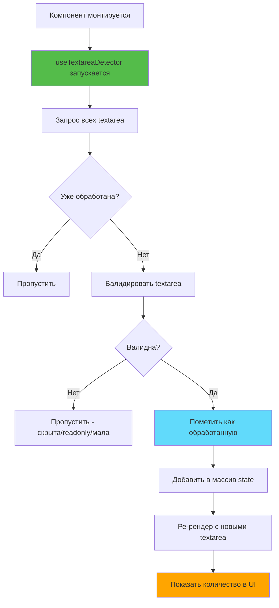
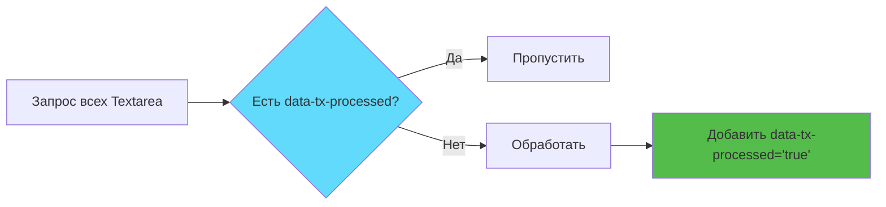
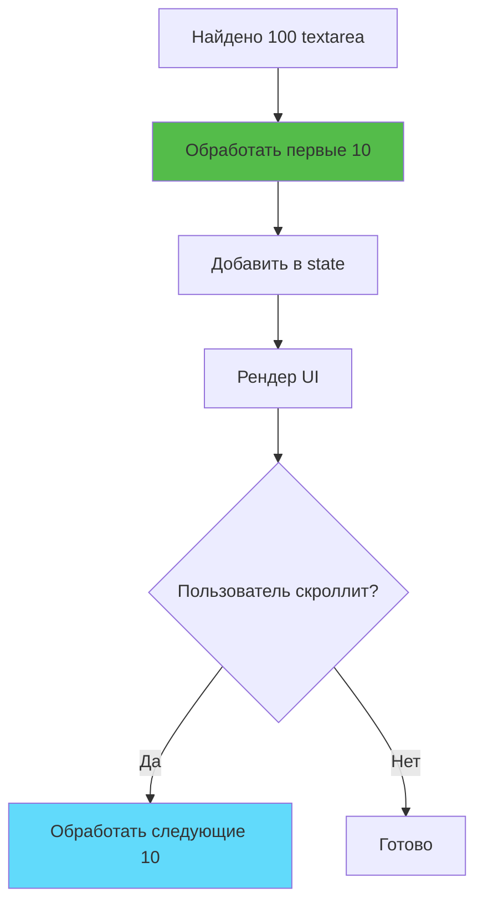

# Слайд 4: Обнаружение и валидация Textarea

**Ветка:** `react/04-detect-and-validate-textareas`

---

## 🎯 Что такое обнаружение Textarea?

Поиск всех textarea на веб-странице и их фильтрация на основе правил валидации (видимость, размер, атрибуты). Это гарантирует, что мы добавляем кнопку полноэкранного режима только к тем textarea, с которыми пользователь действительно может взаимодействовать.

Ключевые моменты:
- ⚡ **Умное обнаружение** - Поиск textarea с помощью DOM-запросов
- 🎨 **Правила валидации** - Проверка видимости, размера и атрибутов
- 📦 **Data-атрибуты** - Отслеживание уже обработанных textarea
- 🔄 **Пакетная обработка** - Обработка максимум 10 textarea за раз для производительности
- 🛠️ **useCallback** - Предотвращение ненужных ре-рендеров

---

## 📂 Файлы для изучения

<details>
<summary><b>Новые/изменённые файлы</b></summary>

- 📄 [hooks/useTextareaDetector.ts](../textarea-fullscreen-react/hooks/useTextareaDetector.ts)
- 📄 [entrypoints/content/ContentApp.tsx](../textarea-fullscreen-react/entrypoints/content/ContentApp.tsx)
- 📄 [entrypoints/content/index.tsx](../textarea-fullscreen-react/entrypoints/content/index.tsx)

</details>

<details>
<summary><b>Вспомогательные файлы</b></summary>

- 📄 [utils/constants.ts](../textarea-fullscreen-react/utils/constants.ts)
- 📄 [components/Badge/index.tsx](../textarea-fullscreen-react/components/Badge/index.tsx)

</details>

---

## ✅ Что нового в этом слайде

- ✅ Реализован хук `useTextareaDetector` с валидацией
- ✅ Добавлены проверки видимости (display, visibility, opacity)
- ✅ Добавлена валидация размера (минимальная ширина/высота)
- ✅ Добавлены проверки атрибутов (readonly, disabled)
- ✅ Использованы data-атрибуты для предотвращения дублирования обработки
- ✅ Пакетная обработка (максимум 10 textarea за раз)
- ✅ Отображение количества валидных textarea в UI
- ✅ Shadow DOM для изоляции стилей
- ✅ TypeScript для типобезопасности

---

**Далее:** [Слайд 5: Компонент кнопки полноэкранного режима](./05-fullscreen-button-component.md)  

---

## 📑 Глубокое погружение

- [Как это работает](#как-это-работает)
- [Шаги реализации](#шаги-реализации)
- [Ключевые концепции](#ключевые-концепции)
- [Примеры кода](#примеры-кода)
- [Распространённые паттерны](#распространённые-паттерны)
- [Документация](#документация)
- [Задание](#задание)

---

## Как это работает



**Поток валидации:**
1. Найти все элементы `<textarea>`
2. Отфильтровать уже обработанные
3. Проверить каждую textarea:
   - ✅ Видима на экране
   - ✅ Минимальный размер (50×15px)
   - ✅ Не readonly/disabled
   - ✅ Родители видимы
4. Пометить валидные атрибутом `data-tx-processed="true"`
5. Добавить в state для рендеринга

---

## Шаги реализации

### 1. Создание констант

```typescript
// utils/constants.ts

// Минимальные размеры для валидных textarea
export const TEXTAREA_MIN_SIZE = {
  width: 50,   // минимальная ширина в пикселях
  height: 15   // минимальная высота в пикселях
} as const;

// Максимальное количество для обработки за раз
export const MAX_BATCH_SIZE = 10;

// Имена data-атрибутов
export const DATA_ATTRIBUTES = {
  processed: 'data-tx-processed',  // маркировка обработанных
  wrapper: 'data-tx-wrapper'       // маркировка обёртки
} as const;

// Z-index для слоёв UI
export const Z_INDEX = {
  BUTTON: 999999,        // кнопка
  OVERLAY: 2147483646,   // оверлей
  EDITOR: 2147483647     // редактор (максимум)
} as const;
```

**Зачем константы?**
- ✅ Легко изменять значения
- ✅ Переиспользование в разных файлах
- ✅ Самодокументируемый код
- ✅ TypeScript-безопасность с `as const`

---

### 2. Создание функции валидации

```typescript
// hooks/useTextareaDetector.ts

// Проверка валидности textarea
const isTextareaValid = useCallback((textarea: HTMLTextAreaElement): boolean => {
  // === ПРОВЕРКА 1: Видимость элемента ===
  const style = window.getComputedStyle(textarea);
  
  // Скрытые элементы
  if (style.display === 'none' || style.visibility === 'hidden') {
    return false;
  }
  
  // Прозрачные элементы
  if (parseFloat(style.opacity) === 0) {
    return false;
  }

  // === ПРОВЕРКА 2: Минимальный размер ===
  const rect = textarea.getBoundingClientRect();
  if (rect.width < TEXTAREA_MIN_SIZE.width || 
      rect.height < TEXTAREA_MIN_SIZE.height) {
    return false;
  }

  // === ПРОВЕРКА 3: Атрибуты ===
  if (textarea.hasAttribute('readonly') || 
      textarea.hasAttribute('disabled')) {
    return false;
  }

  // === ПРОВЕРКА 4: Видимость родителей ===
  let parent = textarea.parentElement;
  while (parent && parent !== document.body) {
    const parentStyle = window.getComputedStyle(parent);
    if (parentStyle.display === 'none' || 
        parentStyle.visibility === 'hidden') {
      return false;
    }
    parent = parent.parentElement;
  }

  return true;
}, []);
```

**Что проверяется:**
- ✅ CSS display/visibility элемента
- ✅ Прозрачность (opacity)
- ✅ Минимальные размеры
- ✅ Атрибуты readonly/disabled
- ✅ Видимость родительских элементов

---

### 3. Создание функции обработки

```typescript
// hooks/useTextareaDetector.ts

const processTextareas = useCallback(() => {
  // Поиск необработанных textarea
  const unprocessed = document.querySelectorAll<HTMLTextAreaElement>(
    `textarea:not([${DATA_ATTRIBUTES.processed}])`
  );
  
  const validTextareas: HTMLTextAreaElement[] = [];

  // Валидация каждой textarea
  for (const textarea of unprocessed) {
    // Сразу помечаем как обработанную
    textarea.setAttribute(DATA_ATTRIBUTES.processed, 'true');
    
    // Проверяем валидность
    if (isTextareaValid(textarea)) {
      validTextareas.push(textarea);
    }
    
    // Лимит пакета: максимум 10 за раз
    if (validTextareas.length >= MAX_BATCH_SIZE) {
      break;
    }
  }

  // Добавляем в state если нашли новые
  if (validTextareas.length > 0) {
    setTextareas(prev => {
      const existing = new Set(prev);
      const combined = [...prev];
      
      // Добавляем только новые (без дубликатов)
      for (const ta of validTextareas) {
        if (!existing.has(ta)) {
          combined.push(ta);
        }
      }
      
      return combined;
    });
  }
}, [isTextareaValid]);
```

**Зачем useCallback?**
- ✅ Предотвращает пересоздание функции при каждом рендере
- ✅ Стабильная ссылка для зависимостей useEffect
- ✅ Лучшая производительность
- ✅ Избегает бесконечных циклов

---

### 4. Полная реализация хука

```typescript
// hooks/useTextareaDetector.ts
import { useState, useEffect, useCallback } from 'react';
import { TEXTAREA_MIN_SIZE, MAX_BATCH_SIZE, DATA_ATTRIBUTES } from '../utils/constants';

export function useTextareaDetector() {
  // State для хранения найденных textarea
  const [textareas, setTextareas] = useState<HTMLTextAreaElement[]>([]);

  // Функция валидации (мемоизированная)
  const isTextareaValid = useCallback((textarea: HTMLTextAreaElement): boolean => {
    // Видимость
    const style = window.getComputedStyle(textarea);
    if (style.display === 'none' || 
        style.visibility === 'hidden' || 
        parseFloat(style.opacity) === 0) {
      return false;
    }

    // Размер
    const rect = textarea.getBoundingClientRect();
    if (rect.width < TEXTAREA_MIN_SIZE.width || 
        rect.height < TEXTAREA_MIN_SIZE.height) {
      return false;
    }

    // Атрибуты
    if (textarea.hasAttribute('readonly') || 
        textarea.hasAttribute('disabled')) {
      return false;
    }

    // Видимость родителей
    let parent = textarea.parentElement;
    while (parent && parent !== document.body) {
      const parentStyle = window.getComputedStyle(parent);
      if (parentStyle.display === 'none' || 
          parentStyle.visibility === 'hidden') {
        return false;
      }
      parent = parent.parentElement;
    }

    return true;
  }, []);

  // Функция обработки (мемоизированная)
  const processTextareas = useCallback(() => {
    const unprocessed = document.querySelectorAll<HTMLTextAreaElement>(
      `textarea:not([${DATA_ATTRIBUTES.processed}])`
    );
    
    const validTextareas: HTMLTextAreaElement[] = [];

    for (const textarea of unprocessed) {
      textarea.setAttribute(DATA_ATTRIBUTES.processed, 'true');
      
      if (isTextareaValid(textarea)) {
        validTextareas.push(textarea);
      }
      
      if (validTextareas.length >= MAX_BATCH_SIZE) {
        break;
      }
    }

    if (validTextareas.length > 0) {
      setTextareas(prev => {
        const existing = new Set(prev);
        const combined = [...prev];
        
        for (const ta of validTextareas) {
          if (!existing.has(ta)) {
            combined.push(ta);
          }
        }
        
        return combined;
      });
    }
  }, [isTextareaValid]);

  // Запуск при монтировании
  useEffect(() => {
    processTextareas();
  }, [processTextareas]);

  // Возвращаем данные и функции
  return { textareas, processTextareas };
}
```

---

### 5. Использование в ContentApp

```tsx
// entrypoints/content/ContentApp.tsx
import { useTextareaDetector } from '../../hooks/useTextareaDetector';
import { Badge } from '../../components/Badge';

export default function ContentApp() {
  // Используем хук для обнаружения
  const { textareas } = useTextareaDetector();

  return (
    <div
      style={{
        position: 'fixed',
        top: '10px',
        right: '10px',
        zIndex: 999999,
        background: 'white',
        padding: '10px',
        borderRadius: '4px',
        boxShadow: '0 2px 8px rgba(0,0,0,0.15)',
        fontFamily: 'system-ui, -apple-system, sans-serif'
      }}
    >
      {/* Бейдж с динамическим цветом */}
      <Badge color={textareas.length > 0 ? '#4caf50' : '#9e9e9e'}>
        ✅ {textareas.length} валидных textarea
        {textareas.length !== 1 ? 's' : ''}
      </Badge>
    </div>
  );
}
```

---

### 6. Создание точки входа с Shadow DOM

```typescript
// entrypoints/content/index.tsx
import React from 'react';
import ReactDOM from 'react-dom/client';
import ContentApp from './ContentApp';

export default defineContentScript({
  matches: ['<all_urls>'],      // Работает на всех сайтах
  cssInjectionMode: 'ui',        // Изоляция стилей
  
  async main(ctx) {
    // Создаём Shadow DOM UI
    const ui = await createShadowRootUi(ctx, {
      name: 'textarea-fullscreen-ui',
      position: 'inline',
      append: 'last',
      
      onMount: (container) => {
        const app = document.createElement('div');
        container.append(app);
        
        const root = ReactDOM.createRoot(app);
        root.render(
          <React.StrictMode>
            <ContentApp />
          </React.StrictMode>
        );
        return root;
      },
      
      onRemove: (root) => {
        root?.unmount();
      },
    });
    
    ui.mount();
  },
});
```

---

### 7. Тестирование на разных сайтах

**Тестовые страницы:**
1. **GitHub** - Поля комментариев к Issue/PR
2. **Gmail** - Создание письма
3. **CodePen** - Редакторы кода
4. **Stack Overflow** - Формы вопросов/ответов
5. **Reddit** - Создание постов/комментариев

**Ожидаемые результаты:**
- Скрытые textarea: НЕ учитываются ✅
- Отключённые textarea: НЕ учитываются ✅
- Крошечные textarea: НЕ учитываются ✅
- Обычные textarea: Учитываются ✅
- Бейдж показывает правильное количество ✅

**Пример на GitHub:**
```
Страница Issue с 1 textarea для комментария:
┌─────────────────────┐
│ ✅ 1 valid textarea │  ← Зелёный бейдж
└─────────────────────┘

Пустая страница без textarea:
┌──────────────────────┐
│ ✅ 0 valid textareas │  ← Серый бейдж
└──────────────────────┘
```

---

## Ключевые концепции

### Концепция 1: CSS-селекторы атрибутов



**CSS-селектор:**
```css
textarea:not([data-tx-processed])
```

**Что делает:**
- Находит все элементы `<textarea>`
- Исключает те, у которых есть атрибут `data-tx-processed`
- Очень производительный (нативный браузерный запрос)

**До обработки:**
```html
<textarea>Контент</textarea>
```

**После обработки:**
```html
<textarea data-tx-processed="true">Контент</textarea>
```

**Преимущества:**
- 🚀 Быстрый поиск необработанных элементов
- 🔒 Предотвращение дублирования обработки
- 🎯 Точная фильтрация через CSS

---

### Концепция 2: getComputedStyle

**Что это?**
Возвращает **реальные** отрендеренные CSS-значения, а не только inline-стили.

```typescript
const style = window.getComputedStyle(element);
console.log(style.display);    // 'none', 'block', 'flex', и т.д.
console.log(style.visibility); // 'visible' или 'hidden'
console.log(style.opacity);    // '0' до '1'
```

**Почему не `element.style`?**
```html
<textarea style="color: red">Текст</textarea>
<style>
  textarea { display: none; } /* Не показывается в element.style */
</style>
```

```typescript
// ❌ Не работает правильно:
element.style.display;              // '' (пустая строка)

// ✅ Работает правильно:
getComputedStyle(element).display;  // 'none'
```

**Разница:**
| Метод | Возвращает | Использование |
|-------|-----------|---------------|
| `element.style` | Только inline-стили | Установка стилей |
| `getComputedStyle()` | Все применённые стили | Чтение стилей |

---

### Концепция 3: getBoundingClientRect

**Что это?**
Возвращает размеры и позицию элемента относительно viewport.

```typescript
const rect = element.getBoundingClientRect();

console.log(rect.width);   // 300 - ширина
console.log(rect.height);  // 150 - высота
console.log(rect.top);     // Расстояние от верха viewport
console.log(rect.left);    // Расстояние от левого края viewport
console.log(rect.x);       // Координата X
console.log(rect.y);       // Координата Y
```

**Использование:**
```typescript
// Проверка на слишком маленький размер
const rect = textarea.getBoundingClientRect();

if (rect.width < 50 || rect.height < 15) {
  return false; // Пропустить крошечные textarea
}
```

**Примеры реальных значений:**

```html
<!-- ✅ Нормальная textarea -->
<textarea style="width: 400px; height: 200px;"></textarea>
<!-- rect.width = 400, rect.height = 200 → ВАЛИДНА -->

<!-- ❌ Скрытое поле -->
<textarea style="width: 1px; height: 1px;"></textarea>
<!-- rect.width = 1, rect.height = 1 → НЕВАЛИДНА -->
```

---

### Концепция 4: Пакетная обработка

**Зачем пакеты?**
- 🚀 **Производительность**: Не обрабатывать 1000+ textarea за раз
- 👤 **UX**: У пользователей редко бывает 10+ textarea на странице
- 🛡️ **Безопасность**: Предотвращение зависания браузера



**Реализация:**
```typescript
// Ограничение на 10 элементов
if (validTextareas.length >= MAX_BATCH_SIZE) {
  break; // Выход из цикла
}
```

**Пример работы:**
```
Страница с 25 textarea:

Цикл 1-10:   ✅ Обработаны → validTextareas = 10 → BREAK
Цикл 11-25:  ⏸️ Пропущены (но помечены data-tx-processed)

Следующий запуск processTextareas():
Цикл 11-20:  ✅ Обработаны → validTextareas = 10 → BREAK
Цикл 21-25:  ⏸️ Пропущены
```

---

## Примеры кода

### Пример 1: Базовое обнаружение

```typescript
// hooks/useTextareaDetector.ts (упрощённая версия)
export function useTextareaDetector() {
  const [textareas, setTextareas] = useState<HTMLTextAreaElement[]>([]);

  useEffect(() => {
    // Находим все textarea
    const elements = document.querySelectorAll('textarea');
    setTextareas(Array.from(elements));
  }, []);

  return { textareas };
}
```

**Что делает:**
- ✅ Находит все textarea при монтировании
- ❌ Нет валидации
- ❌ Нет защиты от дубликатов
- ⚠️ Простой, но не готов для продакшена

---

### Пример 2: С проверкой видимости

```typescript
export function useTextareaDetector() {
  const [textareas, setTextareas] = useState<HTMLTextAreaElement[]>([]);

  // Проверка видимости
  const isVisible = (textarea: HTMLTextAreaElement): boolean => {
    const style = window.getComputedStyle(textarea);
    return style.display !== 'none' && 
           style.visibility !== 'hidden' &&
           parseFloat(style.opacity) > 0;
  };

  useEffect(() => {
    const all = document.querySelectorAll<HTMLTextAreaElement>('textarea');
    const visible = Array.from(all).filter(isVisible);
    setTextareas(visible);
  }, []);

  return { textareas };
}
```

**Улучшения:**
- ✅ Фильтрует скрытые элементы
- ✅ Проверяет opacity
- ❌ Всё ещё нет проверки размера
- ❌ Нет пакетной обработки

---

### Пример 3: С проверкой размера

```typescript
export function useTextareaDetector() {
  const [textareas, setTextareas] = useState<HTMLTextAreaElement[]>([]);

  // Проверка размера
  const isValidSize = (textarea: HTMLTextAreaElement): boolean => {
    const rect = textarea.getBoundingClientRect();
    return rect.width >= 50 && rect.height >= 15;
  };

  useEffect(() => {
    const all = document.querySelectorAll<HTMLTextAreaElement>('textarea');
    const valid = Array.from(all).filter(ta => {
      const style = window.getComputedStyle(ta);
      const isVisible = style.display !== 'none';
      return isVisible && isValidSize(ta);
    });
    setTextareas(valid);
  }, []);

  return { textareas };
}
```

**Улучшения:**
- ✅ Проверка видимости
- ✅ Проверка минимального размера
- ❌ Нет проверки атрибутов
- ❌ Нет защиты от повторной обработки

---

### Пример 4: Продакшен-версия (полная)

```typescript
// hooks/useTextareaDetector.ts
import { useState, useEffect, useCallback } from 'react';
import { TEXTAREA_MIN_SIZE, MAX_BATCH_SIZE, DATA_ATTRIBUTES } from '../utils/constants';

export function useTextareaDetector() {
  const [textareas, setTextareas] = useState<HTMLTextAreaElement[]>([]);

  // Полная валидация
  const isTextareaValid = useCallback((textarea: HTMLTextAreaElement): boolean => {
    // 1. Видимость
    const style = window.getComputedStyle(textarea);
    if (style.display === 'none' || 
        style.visibility === 'hidden' || 
        parseFloat(style.opacity) === 0) {
      return false;
    }

    // 2. Размер
    const rect = textarea.getBoundingClientRect();
    if (rect.width < TEXTAREA_MIN_SIZE.width || 
        rect.height < TEXTAREA_MIN_SIZE.height) {
      return false;
    }

    // 3. Атрибуты
    if (textarea.hasAttribute('readonly') || 
        textarea.hasAttribute('disabled')) {
      return false;
    }

    // 4. Видимость родителей
    let parent = textarea.parentElement;
    while (parent && parent !== document.body) {
      const parentStyle = window.getComputedStyle(parent);
      if (parentStyle.display === 'none' || 
          parentStyle.visibility === 'hidden') {
        return false;
      }
      parent = parent.parentElement;
    }

    return true;
  }, []);

  // Пакетная обработка
  const processTextareas = useCallback(() => {
    const unprocessed = document.querySelectorAll<HTMLTextAreaElement>(
      `textarea:not([${DATA_ATTRIBUTES.processed}])`
    );
    
    const valid: HTMLTextAreaElement[] = [];

    for (const textarea of unprocessed) {
      textarea.setAttribute(DATA_ATTRIBUTES.processed, 'true');
      
      if (isTextareaValid(textarea)) {
        valid.push(textarea);
      }
      
      if (valid.length >= MAX_BATCH_SIZE) break;
    }

    if (valid.length > 0) {
      setTextareas(prev => {
        const existing = new Set(prev);
        const combined = [...prev];
        
        for (const ta of valid) {
          if (!existing.has(ta)) {
            combined.push(ta);
          }
        }
        
        return combined;
      });
    }
  }, [isTextareaValid]);

  useEffect(() => {
    processTextareas();
  }, [processTextareas]);

  return { textareas, processTextareas };
}
```

**Все функции:**
- ✅ Полная валидация (видимость, размер, атрибуты, родители)
- ✅ Data-атрибуты для отслеживания
- ✅ Пакетная обработка (макс 10)
- ✅ Защита от дубликатов
- ✅ useCallback для производительности
- ✅ TypeScript типы
- ✅ Готово для продакшена

---

## Распространённые паттерны

<details>
<summary><b>Паттерн 1: Защитные проверки</b></summary>

```typescript
function isTextareaValid(textarea: HTMLTextAreaElement | null): boolean {
  // Проверка на null
  if (!textarea) {
    console.warn('[Detector] Textarea is null');
    return false;
  }
  
  // Проверка типа
  if (textarea.tagName !== 'TEXTAREA') {
    console.warn('[Detector] Element is not a textarea:', textarea.tagName);
    return false;
  }
  
  // Проверка наличия в DOM
  if (!document.body.contains(textarea)) {
    console.warn('[Detector] Textarea not in document');
    return false;
  }
  
  // Ваша логика валидации...
  return true;
}
```

**Когда использовать:**
- 🔧 Работа с динамическим DOM
- ⚠️ Сторонние скрипты могут удалять элементы
- 🛡️ Предотвращение runtime-ошибок
- 📊 Отладка проблем

</details>

<details>
<summary><b>Паттерн 2: Debounced обнаружение</b></summary>

```typescript
export function useTextareaDetector() {
  const [textareas, setTextareas] = useState<HTMLTextAreaElement[]>([]);

  const processTextareas = useCallback(() => {
    // логика обнаружения...
  }, []);

  useEffect(() => {
    // Начальное обнаружение
    processTextareas();

    // Debounced повторное обнаружение при скролле
    let timeout: number;
    const handleScroll = () => {
      clearTimeout(timeout);
      timeout = setTimeout(processTextareas, 300);
    };

    window.addEventListener('scroll', handleScroll, { passive: true });
    
    return () => {
      clearTimeout(timeout);
      window.removeEventListener('scroll', handleScroll);
    };
  }, [processTextareas]);

  return { textareas };
}
```

**Когда использовать:**
- 📜 Lazy-loaded контент
- ♾️ Infinite scroll страницы
- 🔄 SPA с изменением роутов
- 🎯 Динамические формы

</details>

<details>
<summary><b>Паттерн 3: Логирование и отладка</b></summary>

```typescript
// Утилита для получения информации о textarea
const getTextareaInfo = (textarea: HTMLTextAreaElement) => {
  return {
    id: textarea.id || 'no-id',
    name: textarea.name || 'no-name',
    class: textarea.className || 'no-class',
    placeholder: textarea.placeholder || 'no-placeholder',
    visible: window.getComputedStyle(textarea).display !== 'none',
    size: {
      width: textarea.getBoundingClientRect().width,
      height: textarea.getBoundingClientRect().height
    },
    attributes: {
      readonly: textarea.hasAttribute('readonly'),
      disabled: textarea.hasAttribute('disabled'),
      required: textarea.hasAttribute('required')
    },
    position: textarea.getBoundingClientRect()
  };
};

const processTextareas = useCallback(() => {
  const all = document.querySelectorAll<HTMLTextAreaElement>('textarea');
  
  console.group(`[Detector] Найдено ${all.length} textareas`);
  
  all.forEach((ta, i) => {
    const info = getTextareaInfo(ta);
    const valid = isTextareaValid(ta);
    
    console.log(
      `[${i}] ${valid ? '✅' : '❌'}`,
      info
    );
  });
  
  console.groupEnd();
  
  // логика валидации...
}, []);
```

**Когда использовать:**
- 🐛 Разработка/отладка
- 🔍 Понимание почему textarea отфильтрованы
- 🌐 Troubleshooting на конкретных сайтах
- 📊 Анализ производительности

**Пример вывода в консоль:**
```
[Detector] Найдено 5 textareas
  [0] ✅ { id: 'comment', size: { width: 600, height: 200 }, ... }
  [1] ❌ { id: 'hidden', size: { width: 1, height: 1 }, ... }
  [2] ✅ { name: 'message', size: { width: 400, height: 150 }, ... }
  [3] ❌ { class: 'readonly', attributes: { readonly: true }, ... }
  [4] ✅ { id: 'reply', size: { width: 500, height: 100 }, ... }
```

</details>

---

## Документация

<details>
<summary><b>Связанные ресурсы</b></summary>

**MDN Web Docs:**
- 📚 [getComputedStyle](https://developer.mozilla.org/ru/docs/Web/API/Window/getComputedStyle) - Получение вычисленных стилей
- 📚 [getBoundingClientRect](https://developer.mozilla.org/ru/docs/Web/API/Element/getBoundingClientRect) - Получение размеров и позиции
- 🎓 [CSS Selectors](https://developer.mozilla.org/ru/docs/Web/CSS/CSS_Selectors) - CSS селекторы
- 💡 [Data Attributes](https://developer.mozilla.org/ru/docs/Learn/HTML/Howto/Use_data_attributes) - Data-атрибуты
- 🎓 [querySelectorAll](https://developer.mozilla.org/ru/docs/Web/API/Document/querySelectorAll) - Поиск элементов

**React Docs:**
- 🎓 [useCallback](https://react.dev/reference/react/useCallback) - Мемоизация функций
- 🎓 [useState](https://react.dev/reference/react/useState) - State хук
- 🎓 [useEffect](https://react.dev/reference/react/useEffect) - Эффекты

**TypeScript:**
- 📘 [TypeScript Handbook](https://www.typescriptlang.org/docs/handbook/intro.html) - Основы TypeScript
- 📘 [DOM Types](https://github.com/microsoft/TypeScript/blob/main/lib/lib.dom.d.ts) - Типы DOM

</details>

---

## Задание

**Попробуйте сами:**

### 1. **Добавьте фильтрацию по размеру:**
   - Пропускайте textarea меньше 100×50px
   - Логируйте какие textarea пропущены и почему
   
   ```typescript
   const CUSTOM_MIN_SIZE = { width: 100, height: 50 };
   
   // В консоли:
   // ❌ Textarea #hidden: размер 1×1px < 100×50px
   // ✅ Textarea #comment: размер 600×200px >= 100×50px
   ```

### 2. **Реализуйте режим отладки "Show All":**
   - Добавьте кнопку переключения валидации on/off
   - При off показывайте ВСЕ textarea (даже скрытые)
   - Отображайте: "5 видимых / 12 всего"
   
   ```tsx
   const [debugMode, setDebugMode] = useState(false);
   
   <Badge>
     {debugMode 
       ? `${visibleCount} видимых / ${totalCount} всего`
       : `${validCount} валидных`
     }
   </Badge>
   ```

### 3. **Добавьте визуальную отладку:**
   - Подсветите валидные textarea зелёной рамкой
   - Подсветите невалидные textarea красной рамкой
   - Покажите причину невалидности (tooltip)
   
   ```typescript
   // Причины невалидности
   type InvalidReason = 
     | 'hidden'       // display: none
     | 'too-small'    // < 50×15px
     | 'disabled'     // disabled атрибут
     | 'readonly'     // readonly атрибут
     | 'transparent'  // opacity: 0
     | 'parent-hidden'; // родитель скрыт
   ```

**Ожидаемый результат:**
```
┌─────────────────────────────────┐
│ Режим отладки: ВКЛ              │
│                                 │
│ Валидных: 3 textarea            │
│ Невалидных: 2                   │
│   • 1 скрыта (display: none)    │
│   • 1 слишком мала (1×1px)      │
│ Всего: 5 textarea               │
│                                 │
│ [Выключить отладку]             │
└─────────────────────────────────┘
```

### 4. **Бонус:**
   - ⏱️ Добавьте метрики производительности (время обнаружения)
   - 📊 Группируйте textarea по статусу валидации
   - 💾 Экспортируйте отчёт в консоль
   
   ```typescript
   const report = {
     totalTime: '45ms',
     found: 12,
     valid: 5,
     invalid: 7,
     reasons: {
       hidden: 3,
       tooSmall: 2,
       disabled: 1,
       readonly: 1
     }
   };
   ```

**Подсказка:**
```typescript
const getInvalidReason = (textarea: HTMLTextAreaElement): InvalidReason | null => {
  const style = window.getComputedStyle(textarea);
  
  if (style.display === 'none') return 'hidden';
  if (parseFloat(style.opacity) === 0) return 'transparent';
  
  const rect = textarea.getBoundingClientRect();
  if (rect.width < 50 || rect.height < 15) return 'too-small';
  
  if (textarea.hasAttribute('disabled')) return 'disabled';
  if (textarea.hasAttribute('readonly')) return 'readonly';
  
  // Проверка родителей...
  
  return null; // Валидна
};
```

---

**Далее:** [Слайд 5: Компонент кнопки полноэкранного режима](./05-fullscreen-button-component.md)