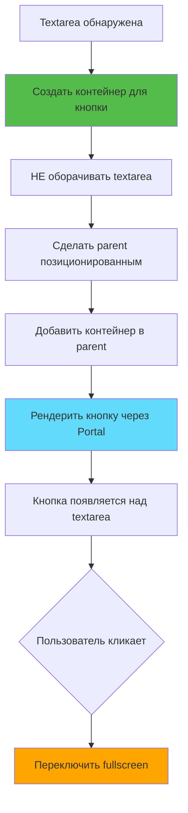
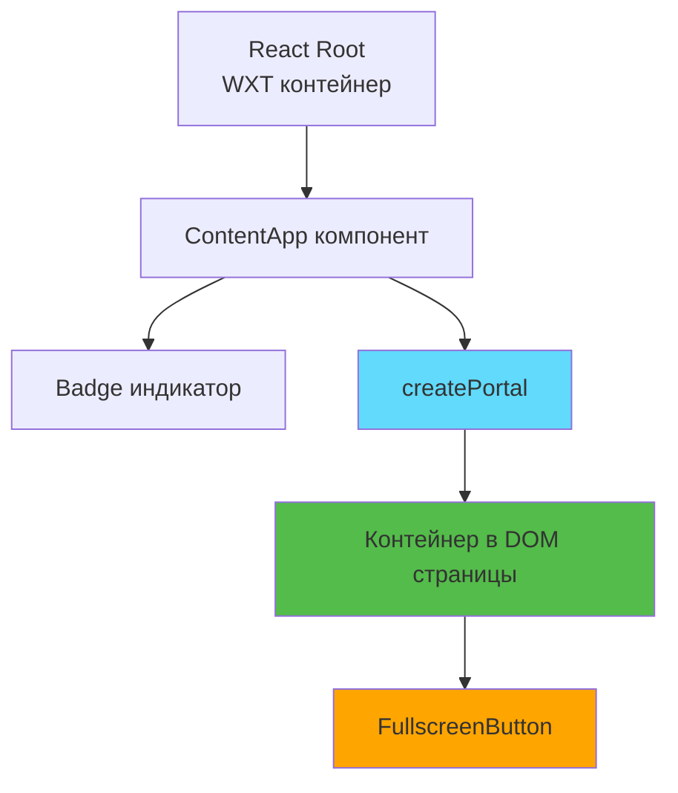

# Слайд 5: Компонент кнопки полноэкранного режима

**Ветка:** `react/05-fullscreen-button-component`

---

## 🎯 Что такое кнопка полноэкранного режима?

Маленькая интерактивная кнопка, позиционированная в правом верхнем углу каждой textarea, которая переключает полноэкранный режим. Она должна переопределять стили сайта и всегда оставаться видимой поверх всего контента страницы.

Ключевые особенности:
- ⚡ **Абсолютное позиционирование** - Правый верхний угол каждой textarea
- 🎨 **Переопределение стилей** - Использует `!important` для обхода CSS сайта
- 📦 **Высокий Z-Index** - Отображается поверх всего контента страницы
- 🔄 **Визуальная обратная связь** - Эффекты при наведении и плавные переходы
- 🛠️ **Доступность** - Правильные aria-labels и подсказки
- 🚪 **React Portal** - Рендеринг в DOM страницы без нарушения layout

---

## 📂 Файлы для изучения

<details>
<summary><b>Новые файлы компонентов</b></summary>

- 📁 [components/FullscreenButton/index.tsx](../textarea-fullscreen-react/components/FullscreenButton/index.tsx)
- 📁 [components/FullscreenButton/style.css](../textarea-fullscreen-react/components/FullscreenButton/style.css)
- 📁 [utils/logger.ts](../textarea-fullscreen-react/utils/logger.ts) - Система логирования

</details>

<details>
<summary><b>Изменённые файлы</b></summary>

- 📄 [entrypoints/content/ContentApp.tsx](../textarea-fullscreen-react/entrypoints/content/ContentApp.tsx)
- 📄 [utils/constants.ts](../textarea-fullscreen-react/utils/constants.ts)
- 📄 [hooks/useTextareaDetector.ts](../textarea-fullscreen-react/hooks/useTextareaDetector.ts)

</details>

---

## ✅ Что нового в этом слайде

- ✅ Создан компонент `FullscreenButton`
- ✅ Реализован CSS с переопределениями через `!important`
- ✅ Добавлены анимации при наведении и переходы
- ✅ Кнопка позиционирована абсолютно над textarea
- ✅ Установлен высокий z-index для видимости (9999999)
- ✅ Добавлены атрибуты доступности (aria-label, title)
- ✅ Реагирует на состояние `isExpanded`
- ✅ **НОВОЕ:** Использует React Portal для рендеринга
- ✅ **НОВОЕ:** Контейнер БЕЗ обёртывания textarea (не ломает layout)
- ✅ **НОВОЕ:** Система логирования с отключением в production
- ✅ **НОВОЕ:** Динамическое управление z-index при фокусе
- ✅ **НОВОЕ:** `pointer-events: none` на контейнере, `auto` на кнопке

---

**Далее:** [Слайд 6: Компонент обёртки Textarea](./06-textarea-wrapper-component.md)  

---

## 📑 Подробный разбор

- [Как это работает](#как-это-работает)
- [Шаги реализации](#шаги-реализации)
- [Ключевые концепции](#ключевые-концепции)
- [Примеры кода](#примеры-кода)
- [Распространённые паттерны](#распространённые-паттерны)
- [Документация](#документация)
- [Задание](#задание)

---

## Как это работает



**Визуальная схема (НОВЫЙ ПОДХОД):**
```
┌─────────────────────────────────────────┐
│ Parent (position: relative)             │
│  ┌──────────────────────────┐           │
│  │ Textarea (не обёрнута!)  │           │
│  │                          │           │
│  └──────────────────────────┘           │
│  ┌──────────────────────────┐           │
│  │ Контейнер кнопки         │  [⛶] ← Кнопка (absolute)
│  │ (position: absolute)     │           │
│  │ (pointer-events: none)   │           │
│  └──────────────────────────┘           │
└─────────────────────────────────────────┘
```

**Преимущества:**
- ✅ Textarea остаётся на месте
- ✅ Размеры parent не меняются
- ✅ Layout сайта не нарушается
- ✅ Кнопка всегда видна сверху

---

## Шаги реализации

### 1. Создание структуры компонента

```bash
mkdir -p components/FullscreenButton
touch components/FullscreenButton/index.tsx
touch components/FullscreenButton/style.css

mkdir -p utils
touch utils/logger.ts
```

---

### 2. Определение TypeScript интерфейса

```tsx
// components/FullscreenButton/index.tsx
import './style.css';

interface FullscreenButtonProps {
  onClick: () => void;
  isExpanded: boolean;
}
```

**Объяснение props:**
- `onClick` - Функция, вызываемая при клике на кнопку
- `isExpanded` - Текущее состояние (обычный или полноэкранный режим)

---

### 3. Создание компонента кнопки

```tsx
// components/FullscreenButton/index.tsx
import './style.css';
import { logger } from '../../utils/logger';

interface FullscreenButtonProps {
  onClick: () => void;
  isExpanded: boolean;
}

export function FullscreenButton({ onClick, isExpanded }: FullscreenButtonProps) {
  const handleClick = () => {
    logger.debug('FullscreenButton clicked', { isExpanded });
    onClick();
  };

  return (
    <button
      className="tx-fullscreen-btn"
      onClick={handleClick}
      aria-label="Toggle Fullscreen"
      title="Toggle Fullscreen (Ctrl+F)"
      type="button"
    >
      {isExpanded ? '⊗' : '⛶'}
    </button>
  );
}
```

**Разбор элементов:**
- `className` - CSS класс для стилизации
- `onClick` - Обработчик клика от родителя
- `aria-label` - Доступность для скринридеров
- `title` - Подсказка при наведении
- `type="button"` - Предотвращает отправку формы
- Иконка меняется в зависимости от состояния `isExpanded`
- **НОВОЕ:** Логирование клика через систему logger

---

### 4. Стилизация CSS

```css
/* components/FullscreenButton/style.css */
.tx-fullscreen-btn {
  /* Позиционирование */
  position: absolute !important;
  top: 5px !important;
  right: 5px !important;
  
  /* Размеры */
  width: 30px !important;
  height: 30px !important;
  min-width: 30px !important;
  min-height: 30px !important;
  
  /* Оформление */
  background: rgba(255, 255, 255, 0.95) !important;
  border: 1px solid rgba(204, 204, 204, 0.8) !important;
  border-radius: 4px !important;
  
  /* Текст */
  font-size: 16px !important;
  line-height: 1 !important;
  color: #333 !important;
  
  /* Layout */
  padding: 0 !important;
  margin: 0 !important;
  display: flex !important;
  align-items: center !important;
  justify-content: center !important;
  
  /* Взаимодействие */
  cursor: pointer !important;
  user-select: none !important;
  
  /* ===== КРИТИЧНО: pointer-events и z-index ===== */
  pointer-events: auto !important;
  z-index: 9999999 !important;
  
  /* Видимость */
  opacity: 0.85 !important;
  
  /* Анимация */
  transition: all 0.2s ease !important;
  
  /* Эффекты */
  box-shadow: 0 2px 8px rgba(0, 0, 0, 0.15) !important;
  outline: none !important;
  
  /* Изоляция стекинг-контекста */
  isolation: isolate !important;
}

.tx-fullscreen-btn:hover {
  opacity: 1 !important;
  transform: scale(1.05) !important;
  box-shadow: 0 3px 12px rgba(0, 0, 0, 0.25) !important;
}

.tx-fullscreen-btn:active {
  transform: scale(0.95) !important;
}

.tx-fullscreen-btn:focus-visible {
  outline: 2px solid #0066cc !important;
  outline-offset: 2px !important;
}
```

**Почему везде `!important`?**
- Сайты имеют свои CSS, которые могут конфликтовать
- Кнопка должна выглядеть одинаково на всех сайтах
- Гарантирует, что наши стили всегда побеждают

**НОВОЕ - `pointer-events: auto`:**
- Контейнер имеет `pointer-events: none`
- Кнопка переопределяет на `auto` для кликабельности
- Клики по textarea проходят сквозь контейнер

---

### 5. Добавление констант

```typescript
// utils/constants.ts
export const Z_INDEX = {
  button: 9999999,        // Очень высокий для кнопки
  overlay: 2147483646,    // Затемнённый фон
  editor: 2147483647      // Полноэкранный редактор (максимум)
} as const;

export const BUTTON_SIZE = {
  normal: 30,
  expanded: 32
} as const;
```

**НОВОЕ - Увеличенный z-index:**
- Было: `999999`
- Стало: `9999999` (на порядок больше)
- Причина: Яндекс и другие сайты используют высокие z-index для автодополнения

---

### 6. Использование в ContentApp (НОВЫЙ ПОДХОД)

```tsx
// entrypoints/content/ContentApp.tsx
import { createPortal } from 'react-dom';

export default function ContentApp() {
  const { textareas } = useTextareaDetector();
  const [expandedIndex, setExpandedIndex] = useState<number | null>(null);
  
  // Ref для хранения контейнеров кнопок
  const containersRef = useRef<Map<HTMLTextAreaElement, HTMLDivElement>>(new Map());

  useEffect(() => {
    textareas.forEach((textarea, index) => {
      const parent = textarea.parentElement;
      if (!parent) return;

      // ===== НОВОЕ: Создаём контейнер БЕЗ обёртывания textarea =====
      const container = document.createElement('div');
      container.setAttribute(DATA_ATTRIBUTES.wrapper, 'true');
      
      // ===== Контейнер не влияет на layout =====
      container.style.cssText = `
        position: absolute !important;
        top: 0 !important;
        left: 0 !important;
        width: 100% !important;
        height: 100% !important;
        pointer-events: none !important;
        z-index: ${Z_INDEX.button} !important;
      `;

      // Делаем parent позиционированным
      if (window.getComputedStyle(parent).position === 'static') {
        parent.style.position = 'relative';
      }

      // Добавляем контейнер В parent (не оборачиваем textarea!)
      parent.appendChild(container);
      
      containersRef.current.set(textarea, container);
    });
  }, [textareas]);

  return (
    <>
      {textareas.map((textarea, index) => {
        const container = containersRef.current.get(textarea);
        if (!container) return null;

        // ===== НОВОЕ: Используем React Portal =====
        return createPortal(
          <FullscreenButton
            onClick={() => setExpandedIndex(index === expandedIndex ? null : index)}
            isExpanded={index === expandedIndex}
          />,
          container, // Рендерим в контейнер в DOM страницы
          `button-${index}` // Уникальный ключ
        );
      })}
    </>
  );
}
```

**Ключевые отличия от старого подхода:**
1. ❌ **Не оборачиваем** textarea
2. ✅ **Создаём отдельный** контейнер
3. ✅ **Используем** `createPortal`
4. ✅ **Сохраняем** исходный layout

---

## Ключевые концепции

### Концепция 1: React Portal



**Что такое Portal:**
```tsx
// Обычный рендеринг (в WXT контейнер)
return <FullscreenButton />

// Portal (рендеринг в другое место DOM)
return createPortal(
  <FullscreenButton />,
  document.getElementById('some-element'), // Куда рендерить
  'unique-key' // Ключ для React
)
```

**Преимущества Portal:**
- ✅ React-компонент, но рендерится в нужном месте DOM
- ✅ События всплывают по React-дереву (не по DOM)
- ✅ Полный доступ к props и state родителя
- ✅ Cleanup автоматический при размонтировании

---

### Концепция 2: pointer-events

```css
/* Контейнер - пропускает клики */
.container {
  pointer-events: none !important;
}

/* Кнопка - принимает клики */
.button {
  pointer-events: auto !important;
}
```

**Как это работает:**
```
Клик по textarea → проходит сквозь контейнер → попадает в textarea ✅
Клик по кнопке → принимается кнопкой → обрабатывается ✅
```

**Визуализация:**
```
┌──────────────────────────┐
│ Контейнер (ghost-слой)   │ ← pointer-events: none
│  ┌───────┐               │
│  │Кнопка │               │ ← pointer-events: auto
│  └───────┘               │
└──────────────────────────┘
   ↓ Клики проходят ↓
┌──────────────────────────┐
│ Textarea                 │ ← Получает клики!
└──────────────────────────┘
```

---

### Концепция 3: Динамический Z-Index

```tsx
// Отслеживаем фокус textarea
useEffect(() => {
  const handleFocus = (textarea: HTMLTextAreaElement) => {
    const container = containersRef.current.get(textarea);
    const button = container?.querySelector('.tx-fullscreen-btn');
    
    // Проверяем, что под кнопкой
    const elementUnder = document.elementFromPoint(
      buttonRect.x + buttonRect.width / 2,
      buttonRect.y + buttonRect.height / 2
    );
    
    // Если под кнопкой НЕ кнопка - что-то перекрывает!
    if (elementUnder !== button) {
      const coveringZIndex = parseInt(
        window.getComputedStyle(elementUnder).zIndex
      );
      
      // Поднимаем z-index выше
      container.style.zIndex = String(coveringZIndex + 1);
    }
  };
  
  textareas.forEach(ta => ta.addEventListener('focus', handleFocus));
}, [textareas]);
```

**Почему это нужно:**
- Яндекс добавляет автодополнение с z-index: 1000000
- При фокусе появляются подсказки с высоким z-index
- Наша кнопка должна автоматически подниматься выше

---

### Концепция 4: Система логирования

```typescript
// utils/logger.ts
const IS_DEV = import.meta.env.MODE === 'development';

class Logger {
  private enabled: boolean = IS_DEV;
  
  log(...args: any[]) {
    if (!this.enabled) return;
    console.log(...args);
  }
  
  // В production - тишина!
  // В development - полные логи
}

export const logger = new Logger();
```

**Использование:**
```tsx
// Логи только в dev режиме
logger.info('Button clicked');
logger.debug('State:', { expanded: true });
logger.error('Critical error'); // Всегда показывается!

// В production - пустые вызовы (оптимизируются)
```

**Преимущества:**
- ✅ Нет засорения консоли в production
- ✅ Подробные логи в development
- ✅ Цветные и структурированные сообщения
- ✅ Ошибки логируются всегда

---

### Концепция 5: Layout Preservation (Сохранение вёрстки)

**Проблема (старый подход):**
```html
<!-- ДО: Parent высота 50px -->
<div class="parent">
  <textarea></textarea>
</div>

<!-- ПОСЛЕ: Parent высота 100px (сломалось!) -->
<div class="parent">
  <div class="wrapper" style="display: block">
    <textarea></textarea>
    <button></button>
  </div>
</div>
```

**Решение (новый подход):**
```html
<!-- Parent остаётся 50px -->
<div class="parent" style="position: relative">
  <textarea></textarea> <!-- НЕ обёрнута! -->
  
  <!-- Контейнер поверх, не влияет на размеры -->
  <div class="container" style="position: absolute; pointer-events: none">
    <button style="pointer-events: auto"></button>
  </div>
</div>
```

---

## Примеры кода

### Пример 1: Базовая кнопка с порталом

```tsx
// components/FullscreenButton/index.tsx
import './style.css';
import { logger } from '../../utils/logger';

interface Props {
  onClick: () => void;
  isExpanded: boolean;
}

export function FullscreenButton({ onClick, isExpanded }: Props) {
  const handleClick = () => {
    logger.debug('Button clicked', { isExpanded });
    onClick();
  };

  return (
    <button
      className="tx-fullscreen-btn"
      onClick={handleClick}
      title="Toggle Fullscreen (Ctrl+F)"
    >
      {isExpanded ? '⊗' : '⛶'}
    </button>
  );
}
```

---

### Пример 2: Создание контейнера без обёртывания

```tsx
// В ContentApp.tsx
useEffect(() => {
  textareas.forEach((textarea, index) => {
    const parent = textarea.parentElement;
    if (!parent) return;

    // Создаём контейнер
    const container = document.createElement('div');
    container.setAttribute(DATA_ATTRIBUTES.wrapper, 'true');
    
    // Стили контейнера (не влияют на layout)
    container.style.cssText = `
      position: absolute !important;
      inset: 0 !important;
      pointer-events: none !important;
      z-index: ${Z_INDEX.button} !important;
    `;

    // Делаем parent позиционированным
    if (window.getComputedStyle(parent).position === 'static') {
      parent.style.position = 'relative';
    }

    // Добавляем контейнер (НЕ оборачиваем textarea!)
    parent.appendChild(container);
    
    containersRef.current.set(textarea, container);
  });
}, [textareas]);
```

---

### Пример 3: Рендеринг через Portal

```tsx
// В ContentApp.tsx
import { createPortal } from 'react-dom';

return (
  <>
    {textareas.map((textarea, index) => {
      const container = containersRef.current.get(textarea);
      if (!container) return null;

      // Используем Portal для рендеринга в контейнер
      return createPortal(
        <FullscreenButton
          onClick={() => handleClick(index)}
          isExpanded={index === expandedIndex}
        />,
        container,      // DOM элемент на странице
        `button-${index}` // Уникальный ключ
      );
    })}
  </>
);
```

---

### Пример 4: Динамическое управление z-index

```tsx
// Отслеживание фокуса
useEffect(() => {
  const handleFocus = (textarea: HTMLTextAreaElement) => {
    const container = containersRef.current.get(textarea);
    if (!container) return;

    const button = container.querySelector('.tx-fullscreen-btn');
    if (!button) return;

    // Проверяем элемент под кнопкой
    const rect = button.getBoundingClientRect();
    const elementUnder = document.elementFromPoint(
      rect.left + rect.width / 2,
      rect.top + rect.height / 2
    );

    // Если кнопка перекрыта
    if (elementUnder && elementUnder !== button) {
      const coveringZIndex = parseInt(
        window.getComputedStyle(elementUnder).zIndex
      ) || 0;

      if (coveringZIndex >= Z_INDEX.button) {
        const newZIndex = coveringZIndex + 1;
        container.style.zIndex = String(newZIndex);
        logger.info(`Z-index adjusted to ${newZIndex}`);
      }
    }
  };

  textareas.forEach(ta => {
    ta.addEventListener('focus', handleFocus);
  });

  return () => {
    textareas.forEach(ta => {
      ta.removeEventListener('focus', handleFocus);
    });
  };
}, [textareas]);
```

---

## Распространённые паттерны

<details>
<summary><b>Паттерн 1: Безопасное создание контейнера</b></summary>

```tsx
const createButtonContainer = (textarea: HTMLTextAreaElement): HTMLDivElement | null => {
  const parent = textarea.parentElement;
  if (!parent) {
    logger.error('No parent for textarea', textarea);
    return null;
  }

  // Проверяем существующий контейнер
  const existing = parent.querySelector(`[${DATA_ATTRIBUTES.wrapper}]`);
  if (existing) {
    logger.debug('Container already exists');
    return existing as HTMLDivElement;
  }

  // Создаём новый
  const container = document.createElement('div');
  container.setAttribute(DATA_ATTRIBUTES.wrapper, 'true');
  container.style.cssText = `
    position: absolute !important;
    inset: 0 !important;
    pointer-events: none !important;
    z-index: ${Z_INDEX.button} !important;
  `;

  // Делаем parent позиционированным
  const parentPos = window.getComputedStyle(parent).position;
  if (parentPos === 'static') {
    parent.style.position = 'relative';
    logger.debug('Made parent relative');
  }

  parent.appendChild(container);
  logger.success('Container created');
  
  return container;
};
```

**Когда использовать:**
- Переиспользование логики создания контейнера
- Проверка существования перед созданием
- Централизованное логирование

</details>

<details>
<summary><b>Паттерн 2: Cleanup контейнеров</b></summary>

```tsx
useEffect(() => {
  // Создание контейнеров...
  
  return () => {
    logger.debug('Cleanup: removing containers');
    
    containersRef.current.forEach((container, textarea) => {
      // Проверяем, что textarea всё ещё в DOM
      if (!document.body.contains(textarea)) {
        logger.debug('Removing container for deleted textarea');
        container.remove();
        containersRef.current.delete(textarea);
      }
    });
  };
}, [textareas]);
```

**Когда использовать:**
- При размонтировании компонента
- При удалении textarea из DOM
- Предотвращение утечек памяти

</details>

<details>
<summary><b>Паттерн 3: Условный рендеринг через Portal</b></summary>

```tsx
{textareas.map((textarea, index) => {
  const container = containersRef.current.get(textarea);
  
  // Ранний выход если контейнер не готов
  if (!container) {
    logger.debug(`Skipping textarea #${index} - no container yet`);
    return null;
  }

  // Проверяем, что контейнер в DOM
  if (!document.body.contains(container)) {
    logger.warn(`Container for textarea #${index} not in DOM`);
    return null;
  }

  logger.debug(`Rendering button #${index} via portal`);

  return createPortal(
    <FullscreenButton
      onClick={() => handleClick(index)}
      isExpanded={index === expandedIndex}
    />,
    container,
    `button-${index}`
  );
})}
```

**Когда использовать:**
- Асинхронное создание контейнеров
- Проверка валидности DOM
- Отладка проблем с рендерингом

</details>

---

## Документация

<details>
<summary><b>Связанные ресурсы</b></summary>

**React:**
- 📚 [React Portal - React Docs](https://react.dev/reference/react-dom/createPortal)
- 🎓 [Portals - React Legacy Docs](https://legacy.reactjs.org/docs/portals.html)

**CSS:**
- 📚 [CSS Position - MDN](https://developer.mozilla.org/ru/docs/Web/CSS/position)
- 📚 [CSS !important - MDN](https://developer.mozilla.org/ru/docs/Web/CSS/Specificity#исключение_!important)
- 🎓 [Z-Index - MDN](https://developer.mozilla.org/ru/docs/Web/CSS/z-index)
- 💡 [pointer-events - MDN](https://developer.mozilla.org/ru/docs/Web/CSS/pointer-events)
- 🎓 [CSS Transitions - MDN](https://developer.mozilla.org/ru/docs/Web/CSS/CSS_transitions)

**Accessibility:**
- 🎓 [ARIA Button Role - MDN](https://developer.mozilla.org/en-US/docs/Web/Accessibility/ARIA/Roles/button_role)
- 📚 [WCAG Guidelines](https://www.w3.org/WAI/WCAG21/quickref/)

**Browser APIs:**
- 📚 [document.elementFromPoint - MDN](https://developer.mozilla.org/ru/docs/Web/API/Document/elementFromPoint)
- 📚 [getBoundingClientRect - MDN](https://developer.mozilla.org/ru/docs/Web/API/Element/getBoundingClientRect)

</details>

---

## Задание

**Попробуйте сами:**

1. **Добавить анимацию смены иконки:**
   - Поворот иконки на 180° при переключении
   - Анимация масштаба при клике
   - Плавная функция easing

2. **Реализовать состояние загрузки:**
   - Показать спиннер при обработке
   - Отключить кнопку во время загрузки
   - Изменить курсор на `wait`

3. **Добавить индикатор горячей клавиши:**
   - Показать "Ctrl+F" при наведении
   - Tooltip с анимацией
   - Позиционировать под кнопкой

4. **НОВОЕ: Добавить визуальную обратную связь:**
   - Ripple эффект при клике
   - Пульсация при первом появлении
   - Hint для новых пользователей

**Ожидаемый результат:**
```tsx
<button className="tx-fullscreen-btn">
  <AnimatedIcon isExpanded={isExpanded} />
  {isLoading && <Spinner />}
  {isHovered && <Tooltip>Ctrl+F</Tooltip>}
  {isFirstTime && <Hint>Кликни меня!</Hint>}
</button>
```

**Бонус:**
- Ripple эффект при клике (Material Design)
- Поддержка тем (светлая/тёмная)
- Кастомные библиотеки иконок
- Адаптация под мобильные устройства
- A/B тестирование разных иконок

---

## 🎓 Итоги слайда

Вы изучили:
- ✅ Как использовать React Portal для рендеринга вне React-дерева
- ✅ Как создавать контейнеры без нарушения layout страницы
- ✅ Как работает `pointer-events` для пропуска кликов
- ✅ Как динамически управлять z-index при изменениях DOM
- ✅ Как создать систему логирования с отключением в production
- ✅ Как переопределять стили сайтов через `!important`
- ✅ Как делать компоненты доступными (accessibility)

**Далее:** [Слайд 6: Компонент обёртки Textarea](./06-textarea-wrapper-component.md)