# Slide 5: Fullscreen Button Component

**Branch:** `react/05-fullscreen-button-component`

---

## 🎯 What is the Fullscreen Button?

A small, clickable button positioned in the top-right corner of each textarea that toggles fullscreen mode. It must override website styles and remain visible above all page content.

Key points:
- ⚡ **Positioned Absolutely** - Top-right corner of each textarea
- 🎨 **Style Override** - Uses `!important` to bypass site CSS
- 📦 **High Z-Index** - Appears above all page content
- 🔄 **Visual Feedback** - Hover effects and smooth transitions
- 🛠️ **Accessible** - Proper aria-labels and tooltips

---

## 📂 Files to Explore

<details>
<summary><b>New Component Files</b></summary>

- 📁 [components/FullscreenButton/index.tsx](../textarea-fullscreen-react/components/FullscreenButton/index.tsx)
- 📁 [components/FullscreenButton/style.css](../textarea-fullscreen-react/components/FullscreenButton/style.css)

</details>

<details>
<summary><b>Modified Files</b></summary>

- 📄 [entrypoints/content/ContentApp.tsx](../textarea-fullscreen-react/entrypoints/content/ContentApp.tsx)
- 📄 [utils/constants.ts](../textarea-fullscreen-react/utils/constants.ts)

</details>

---

## ✅ What's New in This Slide

- ✅ Created `FullscreenButton` component
- ✅ Implemented CSS with `!important` overrides
- ✅ Added hover animations and transitions
- ✅ Positioned button absolutely over textareas
- ✅ Set high z-index for visibility (999999)
- ✅ Added accessibility attributes (aria-label, title)
- ✅ Responsive to `isExpanded` state

---

**Next:** [Slide 6: Textarea Wrapper Component](./06-textarea-wrapper-component.md)  

---

## 📑 Deep Dive

- [How It Works](#how-it-works)
- [Implementation Steps](#implementation-steps)
- [Key Concepts](#key-concepts)
- [Code Examples](#code-examples)
- [Common Patterns](#common-patterns)
- [Documentation](#documentation)
- [Challenge](#challenge)

---

## How It Works


**Visual Layout:**
```
┌─────────────────────────────────┐
│ Wrapper (position: relative)    │
│  ┌──────────────────────────┐   │
│  │ Textarea                 │ [⛶] ← Button (absolute)
│  │                          │   │
│  │                          │   │
│  └──────────────────────────┘   │
└─────────────────────────────────┘
```

---

## Implementation Steps

### 1. Create Component Structure

```bash
mkdir -p components/FullscreenButton
touch components/FullscreenButton/index.tsx
touch components/FullscreenButton/style.css
```

---

### 2. Define TypeScript Interface

```tsx
// components/FullscreenButton/index.tsx
import './style.css';

interface FullscreenButtonProps {
  onClick: () => void;
  isExpanded: boolean;
}
```

**Props explanation:**
- `onClick` - Function to call when button is clicked
- `isExpanded` - Current state (normal or fullscreen)

---

### 3. Create Button Component

```tsx
// components/FullscreenButton/index.tsx
import './style.css';

interface FullscreenButtonProps {
  onClick: () => void;
  isExpanded: boolean;
}

export function FullscreenButton({ onClick, isExpanded }: FullscreenButtonProps) {
  return (
    <button
      className="tx-fullscreen-btn"
      onClick={onClick}
      aria-label="Toggle Fullscreen"
      title="Toggle Fullscreen (Ctrl+F)"
      type="button"
    >
      {isExpanded ? '⊗' : '⛶'}
    </button>
  );
}
```

**Element breakdown:**
- `className` - CSS class for styling
- `onClick` - Click handler from parent
- `aria-label` - Screen reader accessibility
- `title` - Tooltip on hover
- `type="button"` - Prevent form submission
- Icon changes based on `isExpanded` state

---

### 4. Add CSS Styling

```css
/* components/FullscreenButton/style.css */
.tx-fullscreen-btn {
  /* Positioning */
  position: absolute !important;
  top: 5px !important;
  right: 5px !important;
  
  /* Size */
  width: 30px !important;
  height: 30px !important;
  min-width: 30px !important;
  min-height: 30px !important;
  
  /* Appearance */
  background: rgba(255, 255, 255, 0.95) !important;
  border: 1px solid rgba(204, 204, 204, 0.8) !important;
  border-radius: 4px !important;
  
  /* Text */
  font-size: 16px !important;
  line-height: 1 !important;
  color: #333 !important;
  
  /* Layout */
  padding: 0 !important;
  margin: 0 !important;
  display: flex !important;
  align-items: center !important;
  justify-content: center !important;
  
  /* Interaction */
  cursor: pointer !important;
  user-select: none !important;
  
  /* Visibility */
  z-index: 999999 !important;
  opacity: 0.85 !important;
  
  /* Animation */
  transition: all 0.2s ease !important;
  
  /* Reset */
  box-shadow: 0 2px 8px rgba(0, 0, 0, 0.15) !important;
  outline: none !important;
}

.tx-fullscreen-btn:hover {
  opacity: 1 !important;
  transform: scale(1.05) !important;
  box-shadow: 0 3px 12px rgba(0, 0, 0, 0.25) !important;
}

.tx-fullscreen-btn:active {
  transform: scale(0.95) !important;
}

.tx-fullscreen-btn:focus-visible {
  outline: 2px solid #0066cc !important;
  outline-offset: 2px !important;
}
```

**Why all the `!important`?**
- Websites have their own CSS that might conflict
- Button must look consistent across all sites
- Ensures our styles always win

---

### 5. Add Constants

```typescript
// utils/constants.ts
export const Z_INDEX = {
  button: 999999,
  overlay: 2147483646,
  editor: 2147483647
} as const;

export const BUTTON_SIZE = {
  normal: 30,
  expanded: 32
} as const;
```

---

### 6. Use in ContentApp

```tsx
// entrypoints/content/ContentApp.tsx
export default function ContentApp() {
  const { textareas } = useTextareaDetector();
  const [expanded, setExpanded] = useState(false);

  return (
    <>
      {textareas.map((textarea, index) => (
        <div 
          key={index}
          style={{ position: 'relative', display: 'inline-block' }}
        >
          <FullscreenButton
            onClick={() => setExpanded(!expanded)}
            isExpanded={expanded}
          />
        </div>
      ))}
    </>
  );
}
```

---

## Key Concepts

### Concept 1: CSS !important

```mermaid
graph LR
    A[Website CSS] --> B{Specificity War}
    C[Extension CSS] --> B
    B --> D[Winner?]
    D -->|Without !important| E[Website wins ❌]
    D -->|With !important| F[Extension wins ✅]
    
    style F fill:#54bc4a
    style E fill:#f44336
```



**Example scenario:**
```css
/* Website's CSS */
button {
  width: 100px !important;
  background: red !important;
}

/* Your CSS WITHOUT !important */
.tx-fullscreen-btn {
  width: 30px;        /* ❌ Loses - becomes 100px */
  background: white;  /* ❌ Loses - becomes red */
}

/* Your CSS WITH !important */
.tx-fullscreen-btn {
  width: 30px !important;      /* ✅ Wins - stays 30px */
  background: white !important; /* ✅ Wins - stays white */
}
```

---

### Concept 2: Absolute Positioning

**Parent (Wrapper):**
```css
.wrapper {
  position: relative; /* Creates positioning context */
}
```

**Child (Button):**
```css
.button {
  position: absolute; /* Positioned relative to wrapper */
  top: 5px;          /* 5px from wrapper's top */
  right: 5px;        /* 5px from wrapper's right */
}
```

**Visual:**
```
┌────────────────────────────┐ ← Wrapper (relative)
│ (0, 0)                     │
│                            │
│                      [Btn] │ ← Button at (right: 5px, top: 5px)
│                            │
└────────────────────────────┘
```

---

### Concept 3: Z-Index Stacking


**Why such high values?**
- Most websites use z-index: 1-1000
- Extension must appear above everything
- Maximum safe integer: 2147483647

---

### Concept 4: Transitions

```css
.tx-fullscreen-btn {
  transition: all 0.2s ease;
  /*          ↑   ↑    ↑
              │   │    └── Easing function
              │   └─────── Duration
              └─────────── Properties */
}
```

**What animates:**
- `opacity: 0.85` → `opacity: 1`
- `transform: scale(1)` → `transform: scale(1.05)`
- `box-shadow: small` → `box-shadow: large`

**Result:** Smooth hover effect instead of instant change

---

## Code Examples

### Example 1: Basic Button

```tsx
// components/FullscreenButton/index.tsx
import './style.css';

interface Props {
  onClick: () => void;
  isExpanded: boolean;
}

export function FullscreenButton({ onClick, isExpanded }: Props) {
  return (
    <button
      className="tx-fullscreen-btn"
      onClick={onClick}
      title="Toggle Fullscreen (Ctrl+F)"
    >
      {isExpanded ? '⊗' : '⛶'}
    </button>
  );
}
```

---

### Example 2: With SVG Icons

```tsx
// components/FullscreenButton/index.tsx
import './style.css';

interface Props {
  onClick: () => void;
  isExpanded: boolean;
}

export function FullscreenButton({ onClick, isExpanded }: Props) {
  const ExpandIcon = () => (
    <svg width="16" height="16" viewBox="0 0 16 16" fill="currentColor">
      <path d="M1.5 1a.5.5 0 0 0-.5.5v4a.5.5 0 0 1-1 0v-4A1.5 1.5 0 0 1 1.5 0h4a.5.5 0 0 1 0 1h-4zM10 .5a.5.5 0 0 1 .5-.5h4A1.5 1.5 0 0 1 16 1.5v4a.5.5 0 0 1-1 0v-4a.5.5 0 0 0-.5-.5h-4a.5.5 0 0 1-.5-.5zM.5 10a.5.5 0 0 1 .5.5v4a.5.5 0 0 0 .5.5h4a.5.5 0 0 1 0 1h-4A1.5 1.5 0 0 1 0 14.5v-4a.5.5 0 0 1 .5-.5zm15 0a.5.5 0 0 1 .5.5v4a1.5 1.5 0 0 1-1.5 1.5h-4a.5.5 0 0 1 0-1h4a.5.5 0 0 0 .5-.5v-4a.5.5 0 0 1 .5-.5z"/>
    </svg>
  );

  const CollapseIcon = () => (
    <svg width="16" height="16" viewBox="0 0 16 16" fill="currentColor">
      <path d="M5.5 0a.5.5 0 0 1 .5.5v4A1.5 1.5 0 0 1 4.5 6h-4a.5.5 0 0 1 0-1h4a.5.5 0 0 0 .5-.5v-4a.5.5 0 0 1 .5-.5zm5 0a.5.5 0 0 1 .5.5v4a.5.5 0 0 0 .5.5h4a.5.5 0 0 1 0 1h-4A1.5 1.5 0 0 1 10 4.5v-4a.5.5 0 0 1 .5-.5zM0 10.5a.5.5 0 0 1 .5-.5h4A1.5 1.5 0 0 1 6 11.5v4a.5.5 0 0 1-1 0v-4a.5.5 0 0 0-.5-.5h-4a.5.5 0 0 1-.5-.5zm10 1a1.5 1.5 0 0 1 1.5-1.5h4a.5.5 0 0 1 0 1h-4a.5.5 0 0 0-.5.5v4a.5.5 0 0 1-1 0v-4z"/>
    </svg>
  );

  return (
    <button
      className="tx-fullscreen-btn"
      onClick={onClick}
      title="Toggle Fullscreen"
    >
      {isExpanded ? <CollapseIcon /> : <ExpandIcon />}
    </button>
  );
}
```

---

### Example 3: With Hover State

```tsx
// components/FullscreenButton/index.tsx
import { useState } from 'react';
import './style.css';

interface Props {
  onClick: () => void;
  isExpanded: boolean;
}

export function FullscreenButton({ onClick, isExpanded }: Props) {
  const [isHovered, setIsHovered] = useState(false);

  return (
    <button
      className="tx-fullscreen-btn"
      onClick={onClick}
      onMouseEnter={() => setIsHovered(true)}
      onMouseLeave={() => setIsHovered(false)}
      title="Toggle Fullscreen (Ctrl+F)"
      style={{
        opacity: isHovered ? 1 : 0.85,
        transform: isHovered ? 'scale(1.05)' : 'scale(1)'
      }}
    >
      {isExpanded ? '⊗' : '⛶'}
    </button>
  );
}
```

---

### Example 4: With Animation

```tsx
// components/FullscreenButton/index.tsx
import './style.css';

interface Props {
  onClick: () => void;
  isExpanded: boolean;
}

export function FullscreenButton({ onClick, isExpanded }: Props) {
  return (
    <button
      className={`tx-fullscreen-btn ${isExpanded ? 'expanded' : ''}`}
      onClick={onClick}
      title="Toggle Fullscreen (Ctrl+F)"
    >
      <span className="icon-wrapper">
        {isExpanded ? '⊗' : '⛶'}
      </span>
    </button>
  );
}
```

```css
/* components/FullscreenButton/style.css */
.tx-fullscreen-btn .icon-wrapper {
  display: inline-block;
  transition: transform 0.3s ease;
}

.tx-fullscreen-btn:hover .icon-wrapper {
  transform: rotate(90deg);
}

.tx-fullscreen-btn.expanded .icon-wrapper {
  transform: rotate(180deg);
}
```

---

## Common Patterns

<details>
<summary><b>Pattern 1: Conditional Styling</b></summary>

```tsx
export function FullscreenButton({ onClick, isExpanded }: Props) {
  const buttonStyle = {
    width: isExpanded ? '32px' : '30px',
    height: isExpanded ? '32px' : '30px',
    background: isExpanded ? 'rgba(255, 255, 255, 0.9)' : 'rgba(255, 255, 255, 0.95)',
  };

  return (
    <button
      className="tx-fullscreen-btn"
      onClick={onClick}
      style={buttonStyle}
    >
      {isExpanded ? '⊗' : '⛶'}
    </button>
  );
}
```

**When to use:**
- Different styles for different states
- Dynamic sizing
- Theme variations

</details>

<details>
<summary><b>Pattern 2: CSS Classes for States</b></summary>

```tsx
export function FullscreenButton({ onClick, isExpanded }: Props) {
  const className = [
    'tx-fullscreen-btn',
    isExpanded && 'tx-fullscreen-btn--expanded',
    // Add more state classes as needed
  ].filter(Boolean).join(' ');

  return (
    <button className={className} onClick={onClick}>
      {isExpanded ? '⊗' : '⛶'}
    </button>
  );
}
```

```css
.tx-fullscreen-btn { /* base styles */ }
.tx-fullscreen-btn--expanded { /* expanded state styles */ }
```

**When to use:**
- Complex state management
- Multiple variants
- BEM methodology

</details>

<details>
<summary><b>Pattern 3: Accessibility Focus</b></summary>

```tsx
export function FullscreenButton({ onClick, isExpanded }: Props) {
  return (
    <button
      className="tx-fullscreen-btn"
      onClick={onClick}
      aria-label={isExpanded ? 'Exit fullscreen' : 'Enter fullscreen'}
      aria-pressed={isExpanded}
      title={`Toggle Fullscreen (Ctrl+F) - Currently ${isExpanded ? 'fullscreen' : 'normal'}`}
    >
      {isExpanded ? '⊗' : '⛶'}
    </button>
  );
}
```

```css
.tx-fullscreen-btn:focus-visible {
  outline: 2px solid #0066cc !important;
  outline-offset: 2px !important;
}

.tx-fullscreen-btn:focus:not(:focus-visible) {
  outline: none !important;
}
```

**When to use:**
- Keyboard navigation support
- Screen reader compatibility
- WCAG compliance

</details>

---

## Documentation

<details>
<summary><b>Related Resources</b></summary>

- 📚 [CSS Position - MDN](https://developer.mozilla.org/en-US/docs/Web/CSS/position)
- 📚 [CSS !important - MDN](https://developer.mozilla.org/en-US/docs/Web/CSS/Specificity#the_!important_exception)
- 🎓 [Z-Index and Stacking Contexts - MDN](https://developer.mozilla.org/en-US/docs/Web/CSS/CSS_positioned_layout/Understanding_z-index/Stacking_context)
- 💡 [CSS Transitions - MDN](https://developer.mozilla.org/en-US/docs/Web/CSS/CSS_transitions)
- 🎓 [ARIA Button Role - MDN](https://developer.mozilla.org/en-US/docs/Web/Accessibility/ARIA/Roles/button_role)

</details>

---

## Challenge

**Try this yourself:**

1. **Add animated icon transition:**
   - Rotate icon 180° when toggling
   - Add scale animation on click
   - Smooth easing function

2. **Implement loading state:**
   - Show spinner when processing
   - Disable button during loading
   - Change cursor to `wait`

3. **Add keyboard shortcut indicator:**
   - Show "Ctrl+F" on hover
   - Tooltip with animation
   - Position below button

**Expected result:**
```tsx
<button>
  <AnimatedIcon />
  {isLoading && <Spinner />}
  {isHovered && <Tooltip>Ctrl+F</Tooltip>}
</button>
```

**Bonus:**
- Add ripple effect on click
- Theme support (light/dark)
- Custom icon library support

---

**Next:** [Slide 6: Textarea Wrapper Component](./06-textarea-wrapper-component.md)