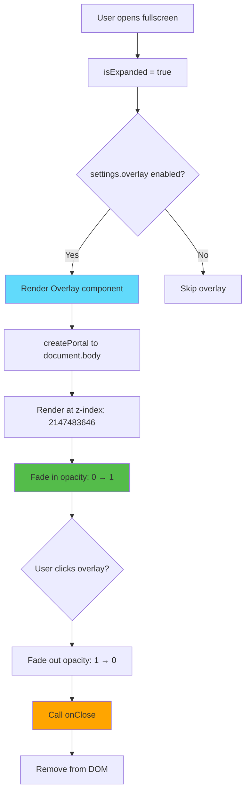
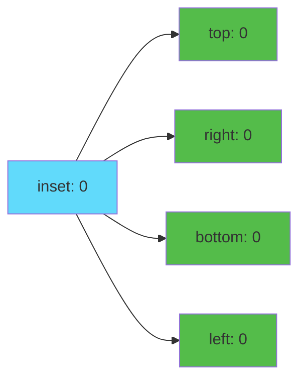
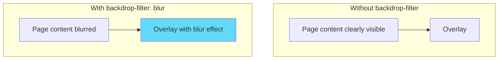
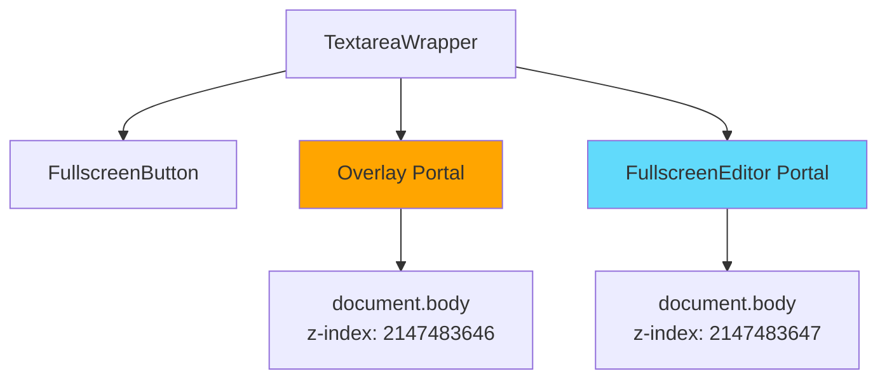

# Slide 8: Background Overlay Component

**Branch:** `react/08-overlay-component`

---

## 🎯 What is Background Overlay?

A semi-transparent dark backdrop rendered behind the fullscreen editor using React Portal. It provides visual focus by dimming the page content and allows users to close the editor by clicking outside.

Key points:
- ⚡ **React Portal** - Renders between page and editor
- 🎨 **Backdrop Blur** - CSS blur effect for visual depth
- 📦 **Click to Close** - Intuitive dismissal interaction
- 🔄 **Smooth Animations** - Fade in/out transitions
- 🛠️ **Z-Index Layering** - Sits below editor, above page

---

## 📂 Files to Explore

<details>
<summary><b>New/Modified Files</b></summary>

- 📁 [components/Overlay/index.tsx](../textarea-fullscreen-react/components/Overlay/index.tsx)
- 📁 [components/Overlay/style.css](../textarea-fullscreen-react/components/Overlay/style.css)

</details>

<details>
<summary><b>Supporting Files</b></summary>

- 📄 [components/TextareaWrapper/index.tsx](../textarea-fullscreen-react/components/TextareaWrapper/index.tsx)
- 📄 [components/FullscreenEditor/index.tsx](../textarea-fullscreen-react/components/FullscreenEditor/index.tsx)
- 📄 [utils/constants.ts](../textarea-fullscreen-react/utils/constants.ts)

</details>

---

## ✅ What's New in This Slide

- ✅ Created `Overlay` component with React Portal
- ✅ Implemented backdrop-filter blur effect
- ✅ Added click-to-close functionality
- ✅ Created smooth fade-in/out animations
- ✅ Positioned with z-index: 2147483646 (below editor)
- ✅ Integrated with TextareaWrapper
- ✅ Made conditional based on settings

---

**Next:** [Slide 9: Keyboard Shortcuts](./09-keyboard-shortcuts.md)  

---

## 📑 Deep Dive

- [How It Works](#how-it-works)
- [Implementation Steps](#implementation-steps)
- [Key Concepts](#key-concepts)
- [Code Examples](#code-examples)
- [Common Patterns](#common-patterns)
- [Documentation](#documentation)
- [Challenge](#challenge)

---

## How It Works



**Z-Index stacking:**
```
Page content:      z-index: 1-1000
Button:            z-index: 999999
Overlay:           z-index: 2147483646  ← This component
Fullscreen Editor: z-index: 2147483647
```

---

## Implementation Steps

### 1. Create Component Structure

```bash
mkdir -p components/Overlay
touch components/Overlay/index.tsx
touch components/Overlay/style.css
```

---

### 2. Define Component Interface

```tsx
// components/Overlay/index.tsx
import { createPortal } from 'react-dom';
import { useEffect, useState } from 'react';
import './style.css';

interface OverlayProps {
  onClose: () => void;
  visible: boolean;
}
```

**Props:**
- `onClose` - Callback when overlay is clicked
- `visible` - Controls visibility state

---

### 3. Create Basic Overlay with Portal

```tsx
// components/Overlay/index.tsx
export function Overlay({ onClose, visible }: OverlayProps) {
  if (!visible) return null;

  return createPortal(
    <div 
      className="tx-overlay"
      onClick={onClose}
    />,
    document.body
  );
}
```

---

### 4. Add Fade-In Animation

```tsx
// components/Overlay/index.tsx
export function Overlay({ onClose, visible }: OverlayProps) {
  const [opacity, setOpacity] = useState(0);

  useEffect(() => {
    if (visible) {
      // Use requestAnimationFrame for smooth animation
      requestAnimationFrame(() => {
        setOpacity(1);
      });
    }
  }, [visible]);

  return createPortal(
    <div 
      className="tx-overlay"
      onClick={onClose}
      style={{ opacity }}
    />,
    document.body
  );
}
```

**Why requestAnimationFrame?**
- Ensures CSS transition is triggered
- Browser paints initial state (opacity: 0) first
- Then applies transition to final state (opacity: 1)

---

### 5. Add Fade-Out Animation

```tsx
// components/Overlay/index.tsx (complete)
export function Overlay({ onClose, visible }: OverlayProps) {
  const [opacity, setOpacity] = useState(0);

  useEffect(() => {
    if (visible) {
      requestAnimationFrame(() => {
        setOpacity(1);
      });
    }
  }, [visible]);

  const handleClose = () => {
    // Fade out first
    setOpacity(0);
    
    // Then call onClose after animation
    setTimeout(onClose, 300); // Match CSS transition duration
  };

  return createPortal(
    <div 
      className="tx-overlay"
      onClick={handleClose}
      style={{ opacity }}
    />,
    document.body
  );
}
```

**Animation sequence:**
1. User clicks overlay
2. Opacity changes: 1 → 0 (300ms transition)
3. After 300ms, `onClose` is called
4. Component unmounts

---

### 6. Add CSS Styling

```css
/* components/Overlay/style.css */
.tx-overlay {
  /* Positioning - full viewport */
  position: fixed !important;
  inset: 0 !important; /* Shorthand for top, right, bottom, left */
  
  /* Size - explicit for older browsers */
  width: 100vw !important;
  height: 100vh !important;
  
  /* Appearance - semi-transparent dark */
  background: rgba(0, 0, 0, 0.7) !important;
  
  /* Blur effect */
  backdrop-filter: blur(3px) !important;
  -webkit-backdrop-filter: blur(3px) !important; /* Safari */
  
  /* Z-index - below editor, above everything else */
  z-index: 2147483646 !important;
  
  /* Animation */
  opacity: 0 !important;
  transition: opacity 0.3s ease !important;
  
  /* Interaction */
  cursor: pointer !important;
}
```

**CSS Breakdown:**
- `inset: 0` = `top: 0; right: 0; bottom: 0; left: 0;`
- `backdrop-filter: blur(3px)` - Blurs content behind overlay
- `z-index: 2147483646` - One below maximum (editor uses 2147483647)
- `transition: opacity 0.3s` - Smooth fade effect

---

### 7. Integrate with TextareaWrapper

```tsx
// components/TextareaWrapper/index.tsx (updated)
export function TextareaWrapper({ textarea }: Props) {
  const { settings } = useSettings();
  const { isExpanded, toggle } = useFullscreen(textarea);
  const wrapperRef = useRef<HTMLDivElement>(null);

  // ... existing code ...

  return (
    <div ref={wrapperRef} className="tx-editor-wrapper" data-tx-wrapper>
      <FullscreenButton onClick={toggle} isExpanded={isExpanded} />
      
      {/* Conditional overlay rendering */}
      {isExpanded && settings.overlay && (
        <Overlay onClose={toggle} visible={isExpanded} />
      )}
      
      <FullscreenEditor
        textarea={textarea}
        isExpanded={isExpanded}
        onToggle={toggle}
      />
    </div>
  );
}
```

**Render conditions:**
- `isExpanded` - Editor must be open
- `settings.overlay` - User must have overlay enabled in settings
- Both must be true to render overlay

---

## Key Concepts

### Concept 1: CSS `inset` Property



**Shorthand syntax:**
```css
/* These are equivalent */
.overlay-v1 {
  top: 0;
  right: 0;
  bottom: 0;
  left: 0;
}

.overlay-v2 {
  inset: 0; /* Shorthand! */
}
```

**Other inset examples:**
```css
inset: 10px;              /* All sides: 10px */
inset: 10px 20px;         /* Vertical: 10px, Horizontal: 20px */
inset: 10px 20px 30px;    /* Top: 10px, Horizontal: 20px, Bottom: 30px */
inset: 10px 20px 30px 40px; /* Top, Right, Bottom, Left */
```

---

### Concept 2: backdrop-filter

**What it does:**
Applies graphical effects (blur, grayscale, etc.) to the area BEHIND the element.



**Examples:**
```css
/* Blur effect */
backdrop-filter: blur(5px);

/* Grayscale effect */
backdrop-filter: grayscale(80%);

/* Brightness effect */
backdrop-filter: brightness(0.5);

/* Combined effects */
backdrop-filter: blur(3px) brightness(0.8);
```

**Browser support:**
```css
/* Modern browsers */
backdrop-filter: blur(3px);

/* Safari (needs prefix) */
-webkit-backdrop-filter: blur(3px);
```

---

### Concept 3: requestAnimationFrame

**Why use it?**
Forces browser to paint initial state before applying transition.

**Without requestAnimationFrame:**
```tsx
// ❌ Animation might not work
const [opacity, setOpacity] = useState(0);

useEffect(() => {
  if (visible) {
    setOpacity(1); // Might jump directly to 1
  }
}, [visible]);
```

**With requestAnimationFrame:**
```tsx
// ✅ Smooth animation
const [opacity, setOpacity] = useState(0);

useEffect(() => {
  if (visible) {
    requestAnimationFrame(() => {
      setOpacity(1); // Smooth transition 0 → 1
    });
  }
}, [visible]);
```

**How it works:**
```
1. Component mounts with opacity: 0
2. Browser paints element (visible but transparent)
3. requestAnimationFrame waits for next frame
4. setOpacity(1) triggers
5. CSS transition animates opacity: 0 → 1 over 300ms
```

---

### Concept 4: Multiple Portals



**Render order:**
```html
<body>
  <!-- Page content -->
  <div class="page">...</div>
  
  <!-- Portal 1: Overlay (rendered first, lower z-index) -->
  <div class="tx-overlay" style="z-index: 2147483646"></div>
  
  <!-- Portal 2: Editor (rendered second, higher z-index) -->
  <div class="tx-fullscreen-editor" style="z-index: 2147483647"></div>
</body>
```

**Visual stacking:**
```
┌─────────────────────────────────┐
│ Editor (z: 2147483647)          │ ← On top
│  ┌──────────────────────────┐   │
│  │ Textarea                 │   │
│  └──────────────────────────┘   │
└─────────────────────────────────┘
┌─────────────────────────────────┐
│ Overlay (z: 2147483646)         │ ← Middle
│ [Dark semi-transparent]         │
└─────────────────────────────────┘
┌─────────────────────────────────┐
│ Page content (z: 1-1000)        │ ← Bottom
└─────────────────────────────────┘
```

---

## Code Examples

### Example 1: Basic Overlay

```tsx
// components/Overlay/index.tsx (minimal)
import { createPortal } from 'react-dom';

interface Props {
  onClose: () => void;
  visible: boolean;
}

export function Overlay({ onClose, visible }: Props) {
  if (!visible) return null;

  return createPortal(
    <div 
      style={{
        position: 'fixed',
        inset: 0,
        background: 'rgba(0, 0, 0, 0.7)',
        zIndex: 2147483646,
        cursor: 'pointer'
      }}
      onClick={onClose}
    />,
    document.body
  );
}
```

---

### Example 2: With Fade Animation

```tsx
// components/Overlay/index.tsx (with animation)
import { createPortal } from 'react-dom';
import { useEffect, useState } from 'react';

export function Overlay({ onClose, visible }: Props) {
  const [opacity, setOpacity] = useState(0);

  useEffect(() => {
    if (visible) {
      requestAnimationFrame(() => setOpacity(1));
    }
  }, [visible]);

  const handleClose = () => {
    setOpacity(0);
    setTimeout(onClose, 300);
  };

  return createPortal(
    <div 
      style={{
        position: 'fixed',
        inset: 0,
        background: 'rgba(0, 0, 0, 0.7)',
        zIndex: 2147483646,
        opacity,
        transition: 'opacity 0.3s ease',
        cursor: 'pointer'
      }}
      onClick={handleClose}
    />,
    document.body
  );
}
```

---

### Example 3: With Backdrop Blur

```tsx
// components/Overlay/index.tsx (with blur)
export function Overlay({ onClose, visible }: Props) {
  const [opacity, setOpacity] = useState(0);

  useEffect(() => {
    if (visible) {
      requestAnimationFrame(() => setOpacity(1));
    }
  }, [visible]);

  return createPortal(
    <div 
      style={{
        position: 'fixed',
        inset: 0,
        background: 'rgba(0, 0, 0, 0.7)',
        backdropFilter: 'blur(3px)',
        WebkitBackdropFilter: 'blur(3px)', // Safari
        zIndex: 2147483646,
        opacity,
        transition: 'opacity 0.3s ease',
        cursor: 'pointer'
      }}
      onClick={onClose}
    />,
    document.body
  );
}
```

---

### Example 4: Production Version

```tsx
// components/Overlay/index.tsx (complete)
import { createPortal } from 'react-dom';
import { useEffect, useState } from 'react';
import './style.css';

interface OverlayProps {
  onClose: () => void;
  visible: boolean;
}

export function Overlay({ onClose, visible }: OverlayProps) {
  const [opacity, setOpacity] = useState(0);

  useEffect(() => {
    if (visible) {
      requestAnimationFrame(() => {
        setOpacity(1);
      });
    }
  }, [visible]);

  const handleClose = () => {
    setOpacity(0);
    setTimeout(onClose, 300);
  };

  return createPortal(
    <div
      className="tx-overlay"
      onClick={handleClose}
      style={{ opacity }}
    />,
    document.body
  );
}
```

```css
/* components/Overlay/style.css */
.tx-overlay {
  position: fixed !important;
  inset: 0 !important;
  width: 100vw !important;
  height: 100vh !important;
  background: rgba(0, 0, 0, 0.7) !important;
  backdrop-filter: blur(3px) !important;
  -webkit-backdrop-filter: blur(3px) !important;
  z-index: 2147483646 !important;
  opacity: 0 !important;
  transition: opacity 0.3s ease !important;
  cursor: pointer !important;
}
```

---

## Common Patterns

<details>
<summary><b>Pattern 1: Prevent Body Scroll</b></summary>

```tsx
export function Overlay({ onClose, visible }: Props) {
  const [opacity, setOpacity] = useState(0);

  useEffect(() => {
    if (visible) {
      // Prevent background scroll
      document.body.style.overflow = 'hidden';
      requestAnimationFrame(() => setOpacity(1));
      
      return () => {
        // Restore scroll
        document.body.style.overflow = '';
      };
    }
  }, [visible]);

  return createPortal(
    <div className="tx-overlay" onClick={onClose} style={{ opacity }} />,
    document.body
  );
}
```

**When to use:**
- Lock user interaction to modal
- Prevent accidental scrolling
- Full-screen immersive experiences

</details>

<details>
<summary><b>Pattern 2: Prevent Click Propagation</b></summary>

```tsx
export function Overlay({ onClose, visible }: Props) {
  const handleOverlayClick = (e: React.MouseEvent) => {
    // Only close if clicking the overlay itself, not children
    if (e.target === e.currentTarget) {
      onClose();
    }
  };

  return createPortal(
    <div className="tx-overlay" onClick={handleOverlayClick}>
      {/* Child elements won't trigger close */}
    </div>,
    document.body
  );
}
```

**When to use:**
- Overlay contains interactive elements
- Click should only close on background
- More precise control needed

</details>

<details>
<summary><b>Pattern 3: Customizable Opacity</b></summary>

```tsx
interface OverlayProps {
  onClose: () => void;
  visible: boolean;
  opacity?: number; // Custom opacity
  blur?: number;    // Custom blur amount
}

export function Overlay({ 
  onClose, 
  visible, 
  opacity: maxOpacity = 0.7,
  blur = 3
}: OverlayProps) {
  const [opacity, setOpacity] = useState(0);

  useEffect(() => {
    if (visible) {
      requestAnimationFrame(() => setOpacity(maxOpacity));
    }
  }, [visible, maxOpacity]);

  return createPortal(
    <div
      className="tx-overlay"
      onClick={onClose}
      style={{
        opacity,
        backdropFilter: `blur(${blur}px)`
      }}
    />,
    document.body
  );
}
```

**When to use:**
- Theme customization
- Different overlay intensities
- User preferences

</details>

---

## Documentation

<details>
<summary><b>Related Resources</b></summary>

- 📚 [backdrop-filter - MDN](https://developer.mozilla.org/en-US/docs/Web/CSS/backdrop-filter)
- 📚 [CSS inset - MDN](https://developer.mozilla.org/en-US/docs/Web/CSS/inset)
- 🎓 [requestAnimationFrame - MDN](https://developer.mozilla.org/en-US/docs/Web/API/window/requestAnimationFrame)
- 💡 [CSS Transitions - MDN](https://developer.mozilla.org/en-US/docs/Web/CSS/CSS_transitions)
- 🎓 [React Portals - React Docs](https://react.dev/reference/react-dom/createPortal)

</details>

---

## Challenge

**Try this yourself:**

1. **Add color customization:**
   - Allow overlay color from settings
   - Support RGB, hex, or named colors
   - Default to semi-transparent black

2. **Implement blur intensity control:**
   - Slider in settings: 0-10px blur
   - Real-time preview
   - Save preference to storage

3. **Add animation variants:**
   - Fade (current)
   - Scale from center
   - Slide from top
   - User selectable in settings

**Expected result:**
```tsx
<Overlay 
  onClose={toggle}
  visible={isExpanded}
  color="rgba(0, 0, 0, 0.8)"
  blur={5}
  animation="fade"
/>
```

**Bonus:**
- Add "click outside to close" toggle in settings
- Implement Escape key to close
- Add overlay pattern (dots, lines, gradient)

---

**Next:** [Slide 9: Keyboard Shortcuts](./09-keyboard-shortcuts.md)