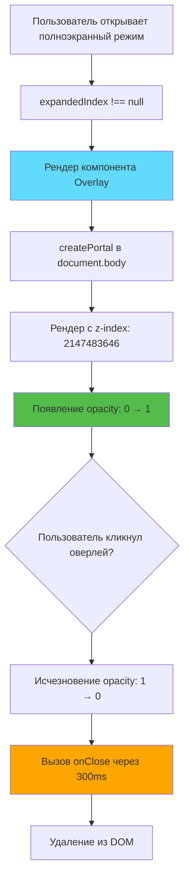
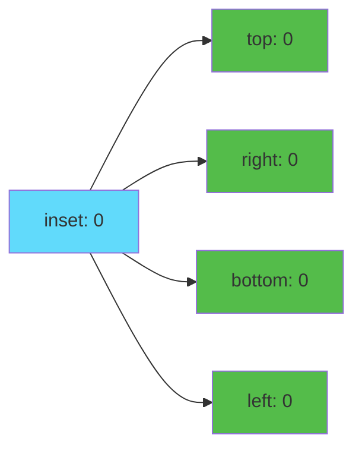
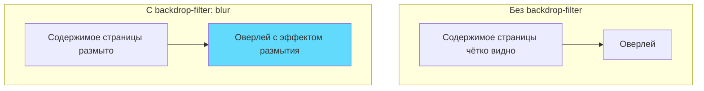
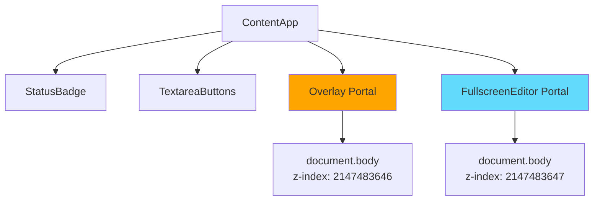

# Слайд 8: Компонент фонового оверлея

**Ветка:** `react/08-overlay-component`

---

## 🎯 Что такое фоновый оверлей?

Полупрозрачный тёмный фон, отрисованный за полноэкранным редактором с помощью React Portal. Обеспечивает визуальный фокус, затемняя содержимое страницы, и позволяет пользователям закрыть редактор кликом снаружи.

Ключевые моменты:
- ⚡ **React Portal** - Рендерится между страницей и редактором
- 🎨 **Размытие фона** - CSS эффект blur для визуальной глубины
- 📦 **Клик для закрытия** - Интуитивное взаимодействие
- 🔄 **Плавные анимации** - Переходы появления/исчезновения
- 🛠️ **Слоистость Z-Index** - Располагается ниже редактора, выше страницы

---

## 📂 Файлы для изучения

<details>
<summary><b>Новые/Изменённые файлы</b></summary>

- 📁 [components/Overlay/index.tsx](../textarea-fullscreen-react/components/Overlay/index.tsx) ✨ **НОВЫЙ**
- 📁 [components/Overlay/style.css](../textarea-fullscreen-react/components/Overlay/style.css) ✨ **НОВЫЙ**
- 📄 [entrypoints/content/ContentApp.tsx](../textarea-fullscreen-react/entrypoints/content/ContentApp.tsx) 📝 **ИЗМЕНЁН**

</details>

<details>
<summary><b>Вспомогательные файлы</b></summary>

- 📄 [components/FullscreenEditor/index.tsx](../textarea-fullscreen-react/components/FullscreenEditor/index.tsx)
- 📄 [components/StatusBadge/index.tsx](../textarea-fullscreen-react/components/StatusBadge/index.tsx)
- 📄 [utils/constants.ts](../textarea-fullscreen-react/utils/constants.ts)

</details>

---

## ✅ Что нового в этом слайде

- ✅ Создан компонент `Overlay` с React Portal
- ✅ Реализован эффект размытия backdrop-filter
- ✅ Добавлена функция закрытия по клику
- ✅ Созданы плавные анимации появления/исчезновения
- ✅ Позиционирование с z-index: 2147483646 (ниже редактора)
- ✅ Интеграция с ContentApp
- ✅ Условный рендеринг при открытии редактора

---

**Далее:** [Слайд 9: Клавиатурные сокращения](./09-keyboard-shortcuts.md)  

---

## 📑 Подробное изучение

- [Как это работает](#как-это-работает)
- [Шаги реализации](#шаги-реализации)
- [Ключевые концепции](#ключевые-концепции)
- [Примеры кода](#примеры-кода)
- [Распространённые паттерны](#распространённые-паттерны)
- [Документация](#документация)
- [Задание](#задание)

---

## Как это работает



**Стек Z-Index:**
```
Содержимое страницы: z-index: 1-1000
Кнопка:              z-index: 99999999
Оверлей:             z-index: 2147483646  ← Этот компонент
Полноэкранный редактор: z-index: 2147483647
```

---

## Шаги реализации

### 1. Создание структуры компонента

```bash
mkdir -p components/Overlay
touch components/Overlay/index.tsx
touch components/Overlay/style.css
```

---

### 2. Определение интерфейса компонента

```tsx
// components/Overlay/index.tsx
import { createPortal } from 'react-dom';
import { useEffect, useState } from 'react';
import './style.css';

interface OverlayProps {
  onClose: () => void;
  visible: boolean;
}
```

**Пропсы:**
- `onClose` - Коллбэк при клике на оверлей
- `visible` - Управляет состоянием видимости

---

### 3. Создание базового оверлея с порталом

```tsx
// components/Overlay/index.tsx
export function Overlay({ onClose, visible }: OverlayProps) {
  if (!visible) return null;

  return createPortal(
    <div 
      className="tx-overlay"
      onClick={onClose}
    />,
    document.body
  );
}
```

---

### 4. Добавление анимации появления

```tsx
// components/Overlay/index.tsx
export function Overlay({ onClose, visible }: OverlayProps) {
  const [opacity, setOpacity] = useState(0);

  useEffect(() => {
    if (visible) {
      // Используем requestAnimationFrame для плавной анимации
      requestAnimationFrame(() => {
        setOpacity(1);
      });
    }
  }, [visible]);

  return createPortal(
    <div 
      className="tx-overlay"
      onClick={onClose}
      style={{ opacity }}
    />,
    document.body
  );
}
```

**Зачем requestAnimationFrame?**
- Гарантирует, что CSS переход будет запущен
- Браузер сначала отрисовывает начальное состояние (opacity: 0)
- Затем применяет переход к финальному состоянию (opacity: 1)

---

### 5. Добавление анимации исчезновения

```tsx
// components/Overlay/index.tsx (полная версия)
export function Overlay({ onClose, visible }: OverlayProps) {
  const [opacity, setOpacity] = useState(0);

  useEffect(() => {
    if (visible) {
      requestAnimationFrame(() => {
        setOpacity(1);
      });
    }
  }, [visible]);

  const handleClose = () => {
    // Сначала исчезновение
    setOpacity(0);
    
    // Затем вызов onClose после анимации
    setTimeout(onClose, 300); // Соответствует длительности CSS transition
  };

  if (!visible) return null;

  return createPortal(
    <div 
      className="tx-overlay"
      onClick={handleClose}
      style={{ opacity }}
    />,
    document.body
  );
}
```

**Последовательность анимации:**
1. Пользователь кликает на оверлей
2. Прозрачность меняется: 1 → 0 (переход 300ms)
3. Через 300ms вызывается `onClose`
4. Компонент размонтируется

---

### 6. Добавление CSS стилей

```css
/* components/Overlay/style.css */
.tx-overlay {
  /* Позиционирование - на весь viewport */
  position: fixed;
  inset: 0; /* Сокращение для top, right, bottom, left */
  
  /* Размер - явное указание для старых браузеров */
  width: 100vw;
  height: 100vh;
  
  /* Внешний вид - полупрозрачный тёмный фон */
  background: rgba(0, 0, 0, 0.5);
  
  /* Эффект размытия */
  backdrop-filter: blur(5px);
  -webkit-backdrop-filter: blur(5px); /* Safari */
  
  /* Z-index - ниже редактора, выше всего остального */
  z-index: 2147483646;
  
  /* Анимация */
  opacity: 0;
  transition: opacity 0.3s ease;
  
  /* Взаимодействие */
  cursor: pointer;
  
  /* Сброс возможных конфликтов */
  margin: 0;
  padding: 0;
  border: none;
  box-sizing: border-box;
}
```

**Разбор CSS:**
- `inset: 0` = `top: 0; right: 0; bottom: 0; left: 0;`
- `backdrop-filter: blur(5px)` - Размывает содержимое за оверлеем
- `z-index: 2147483646` - На единицу ниже максимума (редактор использует 2147483647)
- `transition: opacity 0.3s` - Плавный эффект исчезновения
- **Без `!important`** - Чище и легче переопределить при необходимости

---

### 7. Интеграция с ContentApp

```tsx
// entrypoints/content/ContentApp.tsx (обновлённый)
import { Overlay } from '../../components/Overlay';

export default function ContentApp() {
  // ... существующий код ...

  const [expandedIndex, setExpandedIndex] = useState<number | null>(null);

  const handleEditorClose = useCallback(() => {
    logger.info('[ContentApp] Closing fullscreen editor');
    setExpandedIndex(null);
  }, []);

  return (
    <>
      {/* Значок статуса */}
      <StatusBadge textareaCount={textareas.length} />

      {/* Кнопки полноэкранного режима */}
      <TextareaButtons
        textareas={textareas}
        containersRef={containersRef}
        expandedIndex={expandedIndex}
        onButtonClick={handleButtonClick}
      />

      {/* Фоновый оверлей - НОВОЕ! */}
      {expandedIndex !== null && (
        <Overlay onClose={handleEditorClose} visible={true} />
      )}

      {/* Полноэкранный редактор */}
      {expandedIndex !== null && textareas[expandedIndex] && (
        <FullscreenEditor
          textarea={textareas[expandedIndex]}
          isExpanded={true}
          onClose={handleEditorClose}
        />
      )}
    </>
  );
}
```

**Условия рендера:**
- `expandedIndex !== null` - Редактор должен быть открыт
- `visible={true}` - Оверлей всегда виден при рендере
- Оба компонента (Overlay и Editor) рендерятся одновременно

---

## Ключевые концепции

### Концепция 1: CSS свойство `inset`



**Сокращённый синтаксис:**
```css
/* Эквивалентные записи */
.overlay-v1 {
  top: 0;
  right: 0;
  bottom: 0;
  left: 0;
}

.overlay-v2 {
  inset: 0; /* Сокращённая запись! */
}
```

**Другие примеры inset:**
```css
inset: 10px;              /* Все стороны: 10px */
inset: 10px 20px;         /* Вертикаль: 10px, Горизонталь: 20px */
inset: 10px 20px 30px;    /* Верх: 10px, Горизонталь: 20px, Низ: 30px */
inset: 10px 20px 30px 40px; /* Верх, Право, Низ, Лево */
```

---

### Концепция 2: backdrop-filter

**Что это делает:**
Применяет графические эффекты (размытие, оттенки серого и т.д.) к области ЗА элементом.



**Примеры:**
```css
/* Эффект размытия */
backdrop-filter: blur(5px);

/* Эффект оттенков серого */
backdrop-filter: grayscale(80%);

/* Эффект яркости */
backdrop-filter: brightness(0.5);

/* Комбинированные эффекты */
backdrop-filter: blur(3px) brightness(0.8);
```

**Поддержка браузерами:**
```css
/* Современные браузеры */
backdrop-filter: blur(5px);

/* Safari (требуется префикс) */
-webkit-backdrop-filter: blur(5px);
```

---

### Концепция 3: requestAnimationFrame

**Зачем это нужно?**
Заставляет браузер отрисовать начальное состояние перед применением перехода.

**Без requestAnimationFrame:**
```tsx
// ❌ Анимация может не работать
const [opacity, setOpacity] = useState(0);

useEffect(() => {
  if (visible) {
    setOpacity(1); // Может сразу перепрыгнуть к 1
  }
}, [visible]);
```

**С requestAnimationFrame:**
```tsx
// ✅ Плавная анимация
const [opacity, setOpacity] = useState(0);

useEffect(() => {
  if (visible) {
    requestAnimationFrame(() => {
      setOpacity(1); // Плавный переход 0 → 1
    });
  }
}, [visible]);
```

**Как это работает:**
```
1. Компонент монтируется с opacity: 0
2. Браузер отрисовывает элемент (видимый, но прозрачный)
3. requestAnimationFrame ждёт следующего кадра
4. Срабатывает setOpacity(1)
5. CSS переход анимирует opacity: 0 → 1 за 300ms
```

---

### Концепция 4: Множественные порталы



**Порядок рендера:**
```html
<body>
  <!-- Содержимое страницы -->
  <div class="page">...</div>
  
  <!-- Портал 1: Оверлей (рендерится первым, меньший z-index) -->
  <div class="tx-overlay" style="z-index: 2147483646"></div>
  
  <!-- Портал 2: Редактор (рендерится вторым, больший z-index) -->
  <div class="tx-fullscreen-editor" style="z-index: 2147483647"></div>
</body>
```

**Визуальное наложение:**
```
┌─────────────────────────────────┐
│ Редактор (z: 2147483647)        │ ← Сверху
│  ┌──────────────────────────┐   │
│  │ Textarea                 │   │
│  └──────────────────────────┘   │
└─────────────────────────────────┘
┌─────────────────────────────────┐
│ Оверлей (z: 2147483646)         │ ← Посередине
│ [Тёмный полупрозрачный + blur]  │
└─────────────────────────────────┘
┌─────────────────────────────────┐
│ Содержимое страницы (z: 1-1000) │ ← Снизу
└─────────────────────────────────┘
```

---

## Примеры кода

### Пример 1: Базовый оверлей

```tsx
// components/Overlay/index.tsx (минимальный)
import { createPortal } from 'react-dom';

interface Props {
  onClose: () => void;
  visible: boolean;
}

export function Overlay({ onClose, visible }: Props) {
  if (!visible) return null;

  return createPortal(
    <div 
      style={{
        position: 'fixed',
        inset: 0,
        background: 'rgba(0, 0, 0, 0.5)',
        zIndex: 2147483646,
        cursor: 'pointer'
      }}
      onClick={onClose}
    />,
    document.body
  );
}
```

---

### Пример 2: С анимацией исчезновения

```tsx
// components/Overlay/index.tsx (с анимацией)
import { createPortal } from 'react-dom';
import { useEffect, useState } from 'react';

export function Overlay({ onClose, visible }: Props) {
  const [opacity, setOpacity] = useState(0);

  useEffect(() => {
    if (visible) {
      requestAnimationFrame(() => setOpacity(1));
    }
  }, [visible]);

  const handleClose = () => {
    setOpacity(0);
    setTimeout(onClose, 300);
  };

  if (!visible) return null;

  return createPortal(
    <div 
      style={{
        position: 'fixed',
        inset: 0,
        background: 'rgba(0, 0, 0, 0.5)',
        zIndex: 2147483646,
        opacity,
        transition: 'opacity 0.3s ease',
        cursor: 'pointer'
      }}
      onClick={handleClose}
    />,
    document.body
  );
}
```

---

### Пример 3: С размытием фона

```tsx
// components/Overlay/index.tsx (с размытием)
export function Overlay({ onClose, visible }: Props) {
  const [opacity, setOpacity] = useState(0);

  useEffect(() => {
    if (visible) {
      requestAnimationFrame(() => setOpacity(1));
    }
  }, [visible]);

  const handleClose = () => {
    setOpacity(0);
    setTimeout(onClose, 300);
  };

  if (!visible) return null;

  return createPortal(
    <div 
      style={{
        position: 'fixed',
        inset: 0,
        background: 'rgba(0, 0, 0, 0.5)',
        backdropFilter: 'blur(5px)',
        WebkitBackdropFilter: 'blur(5px)', // Safari
        zIndex: 2147483646,
        opacity,
        transition: 'opacity 0.3s ease',
        cursor: 'pointer'
      }}
      onClick={handleClose}
    />,
    document.body
  );
}
```

---

### Пример 4: Продакшн версия

```tsx
// components/Overlay/index.tsx (полная версия)
import { createPortal } from 'react-dom';
import { useEffect, useState } from 'react';
import './style.css';

interface OverlayProps {
  onClose: () => void;
  visible: boolean;
}

/**
 * Компонент фонового оверлея с эффектом размытия
 * Рендерится ниже полноэкранного редактора через React Portal
 */
export function Overlay({ onClose, visible }: OverlayProps) {
  const [opacity, setOpacity] = useState(0);

  // Анимация появления при монтировании
  useEffect(() => {
    if (visible) {
      // Используем requestAnimationFrame для гарантии запуска CSS перехода
      requestAnimationFrame(() => {
        setOpacity(1);
      });
    }
  }, [visible]);

  // Обработка закрытия с анимацией исчезновения
  const handleClose = () => {
    // Сначала исчезновение
    setOpacity(0);
    
    // Затем вызов onClose после завершения анимации
    setTimeout(onClose, 300); // Соответствует длительности CSS transition
  };

  if (!visible) return null;

  return createPortal(
    <div
      className="tx-overlay"
      onClick={handleClose}
      style={{ opacity }}
    />,
    document.body
  );
}
```

```css
/* components/Overlay/style.css */
.tx-overlay {
  /* Позиционирование - на весь viewport */
  position: fixed;
  inset: 0;
  
  /* Размер - явное указание для старых браузеров */
  width: 100vw;
  height: 100vh;
  
  /* Внешний вид - полупрозрачный тёмный фон */
  background: rgba(0, 0, 0, 0.5);
  
  /* Эффект размытия - современные браузеры */
  backdrop-filter: blur(5px);
  -webkit-backdrop-filter: blur(5px); /* Safari */
  
  /* Z-index - ниже редактора (2147483647), выше всего остального */
  z-index: 2147483646;
  
  /* Анимация - плавный эффект исчезновения */
  opacity: 0;
  transition: opacity 0.3s ease;
  
  /* Взаимодействие */
  cursor: pointer;
  
  /* Сброс возможных конфликтов */
  margin: 0;
  padding: 0;
  border: none;
  box-sizing: border-box;
}
```

---

## Распространённые паттерны

<details>
<summary><b>Паттерн 1: Предотвращение прокрутки body</b></summary>

```tsx
export function Overlay({ onClose, visible }: Props) {
  const [opacity, setOpacity] = useState(0);

  useEffect(() => {
    if (visible) {
      // Предотвращаем прокрутку фона
      document.body.style.overflow = 'hidden';
      requestAnimationFrame(() => setOpacity(1));
      
      return () => {
        // Восстанавливаем прокрутку
        document.body.style.overflow = '';
      };
    }
  }, [visible]);

  if (!visible) return null;

  return createPortal(
    <div className="tx-overlay" onClick={onClose} style={{ opacity }} />,
    document.body
  );
}
```

**Когда использовать:**
- Блокировка взаимодействия с фоном
- Предотвращение случайной прокрутки
- Полноэкранные погружающие интерфейсы

</details>

<details>
<summary><b>Паттерн 2: Предотвращение всплытия кликов</b></summary>

```tsx
export function Overlay({ onClose, visible }: Props) {
  const handleOverlayClick = (e: React.MouseEvent) => {
    // Закрываем только при клике на сам оверлей, не на дочерние элементы
    if (e.target === e.currentTarget) {
      onClose();
    }
  };

  if (!visible) return null;

  return createPortal(
    <div className="tx-overlay" onClick={handleOverlayClick}>
      {/* Дочерние элементы не вызовут закрытие */}
    </div>,
    document.body
  );
}
```

**Когда использовать:**
- Оверлей содержит интерактивные элементы
- Клик должен закрывать только при клике на фон
- Требуется более точный контроль

</details>

<details>
<summary><b>Паттерн 3: Настраиваемая прозрачность</b></summary>

```tsx
interface OverlayProps {
  onClose: () => void;
  visible: boolean;
  opacity?: number; // Пользовательская прозрачность
  blur?: number;    // Пользовательская величина размытия
}

export function Overlay({ 
  onClose, 
  visible, 
  opacity: maxOpacity = 0.5,
  blur = 5
}: OverlayProps) {
  const [opacity, setOpacity] = useState(0);

  useEffect(() => {
    if (visible) {
      requestAnimationFrame(() => setOpacity(maxOpacity));
    }
  }, [visible, maxOpacity]);

  if (!visible) return null;

  return createPortal(
    <div
      className="tx-overlay"
      onClick={onClose}
      style={{
        opacity,
        backdropFilter: `blur(${blur}px)`,
        WebkitBackdropFilter: `blur(${blur}px)`
      }}
    />,
    document.body
  );
}
```

**Когда использовать:**
- Настройка темы
- Разные уровни интенсивности оверлея
- Пользовательские предпочтения

</details>

---

## Документация

<details>
<summary><b>Связанные ресурсы</b></summary>

- 📚 [backdrop-filter - MDN](https://developer.mozilla.org/ru/docs/Web/CSS/backdrop-filter)
- 📚 [CSS inset - MDN](https://developer.mozilla.org/en-US/docs/Web/CSS/inset)
- 🎓 [requestAnimationFrame - MDN](https://developer.mozilla.org/ru/docs/Web/API/window/requestAnimationFrame)
- 💡 [CSS Transitions - MDN](https://developer.mozilla.org/ru/docs/Web/CSS/CSS_Transitions)
- 🎓 [React Portals - React Docs](https://react.dev/reference/react-dom/createPortal)

</details>

---

## Задание

**Попробуйте самостоятельно:**

1. **Добавьте настройку цвета:**
   - Разрешите изменять цвет оверлея из настроек
   - Поддержка RGB, hex или именованных цветов
   - По умолчанию полупрозрачный чёрный

2. **Реализуйте контроль интенсивности размытия:**
   - Слайдер в настройках: 0-10px размытия
   - Предпросмотр в реальном времени
   - Сохранение предпочтений в storage

3. **Добавьте варианты анимации:**
   - Fade (текущий)
   - Scale от центра
   - Slide сверху
   - Выбор пользователем в настройках

**Ожидаемый результат:**
```tsx
<Overlay 
  onClose={toggle}
  visible={isExpanded}
  color="rgba(0, 0, 0, 0.8)"
  blur={5}
  animation="fade"
/>
```

**Бонус:**
- Добавить переключатель "клик снаружи для закрытия" в настройках
- Реализовать закрытие по клавише Escape
- Добавить паттерн оверлея (точки, линии, градиент)

---

## 🎯 Итоги слайда

### Что мы изучили:

✅ **React Portal** - Рендеринг компонента вне иерархии DOM  
✅ **backdrop-filter** - Современный CSS эффект размытия  
✅ **requestAnimationFrame** - Синхронизация с браузерным рендерингом  
✅ **Z-index layering** - Управление слоями в стеке отображения  
✅ **Анимации появления/исчезновения** - UX с плавными переходами  

### Реальный код в вашем проекте:

```tsx
// ✅ Компонент Overlay создан
// ✅ Интегрирован в ContentApp
// ✅ Работает размытие backdrop-filter: blur(5px)
// ✅ Плавная анимация opacity через requestAnimationFrame
// ✅ Закрытие по клику с задержкой 300ms
```

---

**Далее:** [Слайд 9: Клавиатурные сокращения](./09-keyboard-shortcuts.md)