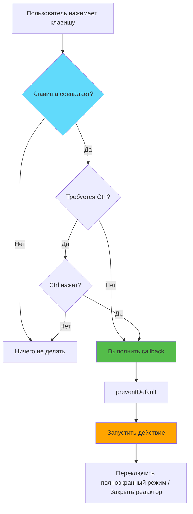
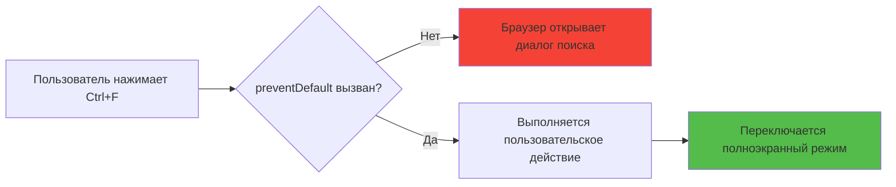
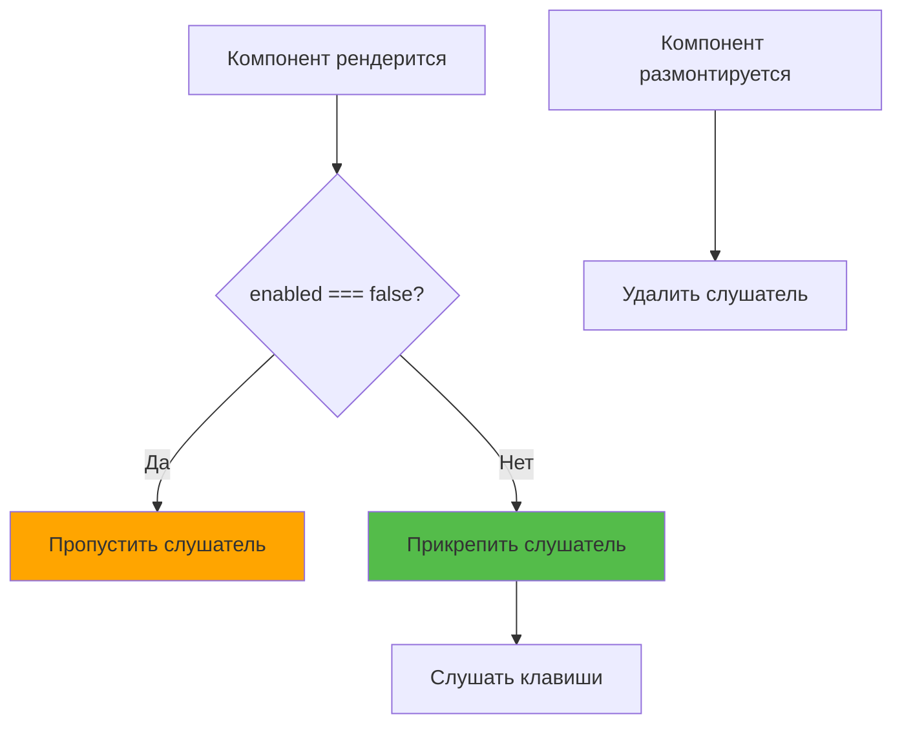

# Слайд 9: Клавиатурные Сокращения

**Ветка:** `react/09-keyboard-shortcuts`

---

## 🎯 Что такое Клавиатурные Сокращения?

Переиспользуемые кастомные хуки, которые обеспечивают клавиатурное взаимодействие для переключения полноэкранного режима. Пользователи могут нажать Ctrl+8 для развёртывания любого textarea и Escape для закрытия полноэкранного редактора, обеспечивая бесшовный рабочий процесс на клавиатуре.

Ключевые моменты:
- ⚡ **Паттерн Кастомных Хуков** - Переиспользуемый `useKeyboardShortcut` для любой комбинации клавиш
- 🎨 **Предотвращение Стандартного Поведения** - Переопределение встроенных горячих клавиш браузера
- 📦 **Условные Слушатели** - Включение/выключение на основе состояния компонента
- 🔄 **Предотвращение Утечек Памяти** - Правильная очистка при размонтировании с useRef
- 🛠️ **Настраиваемые Модификаторы** - Поддержка комбинаций Ctrl, Alt, Shift
- 🖥️ **Кросс-Платформенность** - Работает на Mac (Cmd) и Windows/Linux (Ctrl)

---

## 📂 Файлы для Изучения

<details>
<summary><b>Новые Файлы</b></summary>

- 📄 **[hooks/useKeyboardShortcut.ts](../textarea-fullscreen-react/hooks/useKeyboardShortcut.ts)** - Кастомный хук для клавиатурных сокращений

</details>

<details>
<summary><b>Изменённые Файлы</b></summary>

- 📄 [entrypoints/content/ContentApp.tsx](../textarea-fullscreen-react/entrypoints/content/ContentApp.tsx) - Добавлен Ctrl+F для переключения полноэкранного режима
- 📄 [components/FullscreenEditor/index.tsx](../textarea-fullscreen-react/components/FullscreenEditor/index.tsx) - Рефакторинг для использования хука useKeyboardShortcut
- 📄 [utils/constants.ts](../textarea-fullscreen-react/utils/constants.ts) - Добавлена конфигурация KEYBOARD_SHORTCUTS

</details>

---

## ✅ Что Нового в Этом Слайде

- ✅ Создан переиспользуемый хук `useKeyboardShortcut` с useRef для стабильных коллбэков
- ✅ Реализован **Ctrl+F** для переключения полноэкранного режима для сфокусированного textarea
- ✅ Добавлена клавиша **Escape** для закрытия редактора (условно - только когда развёрнут)
- ✅ Предотвращены стандартные действия браузера (например, Ctrl+F больше не открывает поиск)
- ✅ Добавлено определение фокуса - сокращение влияет только на сфокусированный textarea
- ✅ Реализована условная активация слушателя через флаг `enabled`
- ✅ Добавлена правильная очистка для предотвращения утечек памяти
- ✅ Кросс-платформенная поддержка (Cmd на Mac, Ctrl на Windows/Linux через `metaKey`)

---

**Следующий:** [Слайд 10: Настройки и Сохранение](./10-settings-popup.md)  

---

## 📑 Детальный Обзор

- [Как Это Работает](#как-это-работает)
- [Шаги Реализации](#шаги-реализации)
- [Ключевые Концепции](#ключевые-концепции)
- [Примеры Кода](#примеры-кода)
- [Общие Паттерны](#общие-паттерны)
- [Тестирование](#тестирование)
- [Документация](#документация-ru)
- [Задание](#задание)

---

## Как Это Работает



**Поток событий клавиатуры:**
```
1. Пользователь нажимает комбинацию клавиш (например, Ctrl+F)
2. Браузер перехватывает событие keydown
3. Хук useKeyboardShortcut получает событие
4. Проверяет совпадение клавиши (без учёта регистра)
5. Проверяет совпадение модификаторов (Ctrl, Alt, Shift)
6. Вызывает e.preventDefault() для блокировки действия браузера
7. Выполняет функцию callback из callbackRef
8. ContentApp переключает полноэкранный режим ИЛИ FullscreenEditor закрывается
```

---

## Шаги Реализации

### 1. Создать Файл Кастомного Хука

```bash
touch hooks/useKeyboardShortcut.ts
```

---

### 2. Определить Интерфейс Хука

```typescript
// hooks/useKeyboardShortcut.ts
import { useEffect, useRef } from 'react';

interface KeyboardShortcutOptions {
  ctrl?: boolean;
  alt?: boolean;
  shift?: boolean;
  enabled?: boolean;
  preventDefault?: boolean;
}

export function useKeyboardShortcut(
  key: string,
  callback: () => void,
  options: KeyboardShortcutOptions = {}
) {
  // Реализация
}
```

**Параметры:**
- `key` - Клавиша для прослушивания ('f', 'Escape', 'Enter' и т.д.)
- `callback` - Функция для выполнения при нажатии клавиши
- `options` - Объект конфигурации для модификаторов и включения/выключения

---

### 3. Реализовать с useRef для Предотвращения Устаревших Замыканий

```typescript
// hooks/useKeyboardShortcut.ts
export function useKeyboardShortcut(
  key: string,
  callback: () => void,
  options: KeyboardShortcutOptions = {}
) {
  // Используем ref чтобы избежать пересоздания слушателя при изменении callback
  const callbackRef = useRef(callback);

  // Держим ref callback обновлённым
  useEffect(() => {
    callbackRef.current = callback;
  }, [callback]);

  useEffect(() => {
    // Не прикреплять слушатель если отключен
    if (options.enabled === false) {
      logger.debug('[useKeyboardShortcut] Отключен, пропускаем слушатель');
      return;
    }

    const handleKeyDown = (e: KeyboardEvent) => {
      // Проверяем совпадение клавиши (без учёта регистра)
      const keyMatch = e.key.toLowerCase() === key.toLowerCase();
      
      if (keyMatch) {
        // Выполнить callback из ref (всегда свежий)
        callbackRef.current();
      }
    };

    document.addEventListener('keydown', handleKeyDown);
    
    // Очистка
    return () => document.removeEventListener('keydown', handleKeyDown);
  }, [key, options.enabled]);
}
```

**Зачем `useRef`?**
- Избегает устаревших замыканий в слушателях событий
- Предотвращает повторное прикрепление слушателя при изменении callback
- Лучшая производительность

---

### 4. Добавить Поддержку Клавиш-Модификаторов со Строгим Сопоставлением

```typescript
// hooks/useKeyboardShortcut.ts
export function useKeyboardShortcut(
  key: string,
  callback: () => void,
  options: KeyboardShortcutOptions = {}
) {
  const callbackRef = useRef(callback);

  useEffect(() => {
    callbackRef.current = callback;
  }, [callback]);

  useEffect(() => {
    if (options.enabled === false) return;

    const handleKeyDown = (e: KeyboardEvent) => {
      // Проверяем клавиши-модификаторы со СТРОГИМ сопоставлением
      const ctrlMatch = options.ctrl 
        ? (e.ctrlKey || e.metaKey)  // Ctrl требуется
        : !e.ctrlKey && !e.metaKey; // Ctrl НЕ разрешён
      
      const altMatch = options.alt 
        ? e.altKey 
        : !e.altKey;
      
      const shiftMatch = options.shift 
        ? e.shiftKey 
        : !e.shiftKey;
      
      // Проверяем совпадение клавиши
      const keyMatch = e.key.toLowerCase() === key.toLowerCase();
      
      // Все условия должны быть истинными
      if (keyMatch && ctrlMatch && altMatch && shiftMatch) {
        callbackRef.current();
      }
    };

    document.addEventListener('keydown', handleKeyDown);
    return () => document.removeEventListener('keydown', handleKeyDown);
  }, [key, options.ctrl, options.alt, options.shift, options.enabled]);
}
```

**Зачем строгое сопоставление?**
- `Ctrl+F` не срабатывает на просто `F`
- `Escape` не срабатывает на `Ctrl+Escape`
- Предотвращает непреднамеренные активации

---

### 5. Добавить preventDefault и Логирование (Полная Версия)

```typescript
// hooks/useKeyboardShortcut.ts (АКТУАЛЬНАЯ РЕАЛИЗАЦИЯ)
import { useEffect, useRef } from 'react';
import { logger } from '../utils/logger';

interface KeyboardShortcutOptions {
  ctrl?: boolean;
  alt?: boolean;
  shift?: boolean;
  enabled?: boolean;
  preventDefault?: boolean;
}

export function useKeyboardShortcut(
  key: string,
  callback: () => void,
  options: KeyboardShortcutOptions = {}
) {
  const callbackRef = useRef(callback);

  // Держим callback ref обновлённым
  useEffect(() => {
    callbackRef.current = callback;
  }, [callback]);

  useEffect(() => {
    // Пропустить если отключено
    if (options.enabled === false) {
      logger.debug('[useKeyboardShortcut] Отключено, пропускаем слушатель');
      return;
    }

    const handleKeyDown = (e: KeyboardEvent) => {
      // Проверяем клавиши-модификаторы
      const ctrlMatch = options.ctrl 
        ? (e.ctrlKey || e.metaKey) 
        : !e.ctrlKey && !e.metaKey;
      
      const altMatch = options.alt 
        ? e.altKey 
        : !e.altKey;
      
      const shiftMatch = options.shift 
        ? e.shiftKey 
        : !e.shiftKey;

      // Проверяем совпадение клавиши (без учёта регистра)
      const keyMatch = e.key.toLowerCase() === key.toLowerCase();

      if (keyMatch && ctrlMatch && altMatch && shiftMatch) {
        logger.info(`[useKeyboardShortcut] Сработало: ${key}`, { 
          ctrl: e.ctrlKey, 
          alt: e.altKey, 
          shift: e.shiftKey 
        });
        
        // Предотвратить стандартное действие браузера (по умолчанию: true)
        if (options.preventDefault !== false) {
          e.preventDefault();
        }

        // Выполнить callback
        callbackRef.current();
      }
    };

    logger.debug('[useKeyboardShortcut] Прикрепление слушателя', { key, options });
    document.addEventListener('keydown', handleKeyDown);

    return () => {
      logger.debug('[useKeyboardShortcut] Удаление слушателя', { key });
      document.removeEventListener('keydown', handleKeyDown);
    };
  }, [key, options.ctrl, options.alt, options.shift, options.enabled, options.preventDefault]);
}
```

---

### 6. Добавить Константы KEYBOARD_SHORTCUTS

```typescript
// utils/constants.ts (ДОБАВИТЬ ЭТО)
export const KEYBOARD_SHORTCUTS = {
  toggleFullscreen: 'f',     // Ctrl+F для переключения полноэкранного режима
  closeEditor: 'Escape',     // Escape для закрытия редактора
  save: 's',                 // Ctrl+S для сохранения (в будущем)
  help: '?',                 // Показать помощь по сокращениям (в будущем)
} as const;
```

---

### 7. Использовать в ContentApp для Ctrl+F

```tsx
// entrypoints/content/ContentApp.tsx (АКТУАЛЬНАЯ РЕАЛИЗАЦИЯ)
import { useKeyboardShortcut } from '../../hooks/useKeyboardShortcut';
import { KEYBOARD_SHORTCUTS } from '../../utils/constants';

export default function ContentApp() {
  const { textareas } = useTextareaDetector();
  const [expandedIndex, setExpandedIndex] = useState<number | null>(null);

  // ===== Клавиатурное Сокращение: Ctrl+F для переключения полноэкранного режима =====
  useKeyboardShortcut(
    KEYBOARD_SHORTCUTS.toggleFullscreen,
    () => {
      logger.group('⌨️ [ContentApp] Нажат Ctrl+F');
      
      // Найти текущий сфокусированный textarea
      const activeElement = document.activeElement;
      
      if (activeElement instanceof HTMLTextAreaElement) {
        // Найти индекс сфокусированного textarea
        const index = textareas.indexOf(activeElement);
        
        if (index !== -1) {
          logger.info('Переключение полноэкранного режима для сфокусированного textarea', { index });
          
          // Переключение: закрыть если уже развёрнут, открыть если нет
          setExpandedIndex(expandedIndex === index ? null : index);
        } else {
          logger.warn('Сфокусированный textarea не в нашем списке');
        }
      } else {
        logger.debug('Нет сфокусированного textarea, игнорируем сокращение');
        
        // Опционально: развернуть первый textarea если ничего не сфокусировано
        if (textareas.length > 0 && expandedIndex === null) {
          logger.info('Развёртывание первого textarea');
          setExpandedIndex(0);
        }
      }
      
      logger.groupEnd();
    },
    { ctrl: true }
  );

  // ... остальная часть компонента
}
```

---

### 8. Использовать в FullscreenEditor для Escape

```tsx
// components/FullscreenEditor/index.tsx (АКТУАЛЬНАЯ РЕАЛИЗАЦИЯ)
import { useKeyboardShortcut } from '../../hooks/useKeyboardShortcut';
import { KEYBOARD_SHORTCUTS } from '../../utils/constants';

export function FullscreenEditor({ textarea, isExpanded, onClose }: Props) {
  const cloneRef = useRef<HTMLTextAreaElement>(null);

  // ===== Клавиатурные Сокращения =====
  // Escape для закрытия редактора (только когда развёрнут)
  useKeyboardShortcut(
    KEYBOARD_SHORTCUTS.closeEditor, 
    onClose, 
    { enabled: isExpanded }
  );

  // ===== Синхронизация Контента =====
  useEffect(() => {
    if (isExpanded && textarea && cloneRef.current) {
      const clone = cloneRef.current;
      clone.value = textarea.value;
      clone.focus();

      const syncContent = (e: Event) => {
        textarea.value = (e.target as HTMLTextAreaElement).value;
      };

      clone.addEventListener('input', syncContent);
      return () => clone.removeEventListener('input', syncContent);
    }
  }, [isExpanded, textarea]);

  if (!isExpanded) return null;

  return createPortal(
    <div className="tx-fullscreen-editor">
      <textarea ref={cloneRef} className="tx-fullscreen-textarea" />
      <FullscreenButton onClick={onClose} isExpanded={true} />
    </div>,
    document.body
  );
}
```

---

## Ключевые Концепции

### Концепция 1: Event.preventDefault()



**Без preventDefault:**
```typescript
// ❌ Стандартное действие браузера выполняется
const handleKeyDown = (e: KeyboardEvent) => {
  if (e.ctrlKey && e.key === 'f') {
    toggle(); // Ваше действие
    // Браузер ТАКЖЕ открывает диалог поиска ← ПЛОХО!
  }
};
```

**С preventDefault:**
```typescript
// ✅ Выполняется только ваше действие
const handleKeyDown = (e: KeyboardEvent) => {
  if (e.ctrlKey && e.key === 'f') {
    e.preventDefault(); // Блокирует действие браузера
    toggle(); // Выполняется только ваше действие ← ХОРОШО!
  }
};
```

---

### Концепция 2: Клавиши-Модификаторы и Кросс-Платформенная Поддержка

**Свойства события клавиатуры:**
```typescript
interface KeyboardEvent {
  key: string;       // 'f', 'Escape', 'Enter' и т.д.
  ctrlKey: boolean;  // Ctrl нажат?
  metaKey: boolean;  // Cmd (Mac) или Win нажат?
  altKey: boolean;   // Alt/Option нажат?
  shiftKey: boolean; // Shift нажат?
}
```

**Кросс-платформенная обработка Ctrl:**
```typescript
// ✅ Работает на Mac (Cmd) и Windows/Linux (Ctrl)
const ctrlMatch = e.ctrlKey || e.metaKey;

// Mac: Cmd+F → metaKey=true, ctrlKey=false
// Windows/Linux: Ctrl+F → ctrlKey=true, metaKey=false
```

**Общие комбинации:**
```typescript
// Ctrl+F (или Cmd+F на Mac)
if ((e.ctrlKey || e.metaKey) && e.key === 'f') { }

// Alt+S
if (e.altKey && e.key === 's') { }

// Shift+Enter
if (e.shiftKey && e.key === 'Enter') { }

// Ctrl+Shift+K
if ((e.ctrlKey || e.metaKey) && e.shiftKey && e.key === 'k') { }
```

---

### Концепция 3: Условные Слушатели Событий



**Зачем условные?**
```typescript
// ✅ Слушать только когда редактор открыт
useKeyboardShortcut('Escape', onClose, {
  enabled: isExpanded  // ← Активен только когда true
});

// ✅ Слушать всегда
useKeyboardShortcut('f', toggle, {
  ctrl: true
  // enabled не установлен = всегда активен
});
```

**Преимущества:**
- ✅ Экономит ресурсы когда не нужно
- ✅ Предотвращает непреднамеренные срабатывания
- ✅ Лучшая производительность
- ✅ Чище код (нет ручных проверок if)

---

### Концепция 4: Предотвращение Утечек Памяти с useRef

**Проблема 1: Утечка памяти - слушатель никогда не удаляется**
```typescript
// ❌ Утечка памяти
useEffect(() => {
  document.addEventListener('keydown', handleKeyDown);
  // Отсутствует очистка!
}, []);
```

**Проблема 2: Пересоздание слушателя при каждом рендере**
```typescript
// ❌ Проблема производительности - callback в зависимостях
useEffect(() => {
  const handleKeyDown = (e: KeyboardEvent) => {
    if (e.key === 'Escape') {
      onClose(); // ← Это меняется каждый рендер!
    }
  };

  document.addEventListener('keydown', handleKeyDown);
  return () => document.removeEventListener('keydown', handleKeyDown);
}, [onClose]); // ← Перезапускается каждый раз когда onClose меняется
```

**Решение: useRef + правильная очистка**
```typescript
// ✅ Стабильный слушатель + правильная очистка
const callbackRef = useRef(callback);

useEffect(() => {
  callbackRef.current = callback; // Всегда свежий callback
}, [callback]);

useEffect(() => {
  const handleKeyDown = (e: KeyboardEvent) => {
    if (e.key === 'Escape') {
      callbackRef.current(); // ← Всегда вызывает последний callback
    }
  };

  document.addEventListener('keydown', handleKeyDown);
  
  return () => {
    document.removeEventListener('keydown', handleKeyDown); // ← Очистка!
  };
}, []); // ← Нет callback в зависимостях!
```

**Что происходит:**
1. Компонент монтируется → Слушатель прикрепляется
2. Callback меняется → Обновляется только ref (нет повторного прикрепления)
3. Компонент размонтируется → Слушатель удаляется
4. Нет утечек памяти! ✅
5. Лучшая производительность! ✅

---

### Концепция 5: Определение Фокуса

**Как это работает:**
```typescript
// Получить текущий сфокусированный элемент
const activeElement = document.activeElement;

// Проверить является ли он textarea
if (activeElement instanceof HTMLTextAreaElement) {
  // Найти его в нашем списке
  const index = textareas.indexOf(activeElement);
  
  if (index !== -1) {
    // Переключить полноэкранный режим для ЭТОГО textarea
    setExpandedIndex(index);
  }
}
```

**Зачем определение фокуса?**
- ✅ Влияет только на textarea в котором пользователь печатает
- ✅ Работает с несколькими textarea на одной странице
- ✅ Интуитивный UX (клавиатура следует за фокусом)
- ✅ Предотвращает случайные развёртывания

---

## Примеры Кода

### Пример 1: Базовое Использование (Закрытие Модального Окна)

```tsx
// Простой обработчик клавиши Escape
function Modal({ onClose }) {
  useKeyboardShortcut('Escape', onClose);
  
  return <div className="modal">Содержимое модального окна</div>;
}
```

---

### Пример 2: С Модификатором Ctrl (Сохранение)

```tsx
// Ctrl+S для сохранения
function Editor({ onSave }) {
  useKeyboardShortcut('s', onSave, { ctrl: true });
  
  return <textarea />;
}
```

---

### Пример 3: Условная Активация

```tsx
// Активен только когда модальное окно открыто
function App() {
  const [isOpen, setIsOpen] = useState(false);
  
  useKeyboardShortcut('Escape', () => setIsOpen(false), {
    enabled: isOpen  // ← Слушать только когда модальное окно открыто
  });
  
  return (
    <>
      <button onClick={() => setIsOpen(true)}>Открыть</button>
      {isOpen && <Modal />}
    </>
  );
}
```

---

### Пример 4: Несколько Сокращений в Одном Компоненте

```tsx
// Несколько клавиатурных сокращений
function TextEditor() {
  const [content, setContent] = useState('');
  const [isBold, setIsBold] = useState(false);
  
  // Ctrl+B для жирного текста
  useKeyboardShortcut('b', () => setIsBold(!isBold), { 
    ctrl: true 
  });
  
  // Ctrl+S для сохранения
  useKeyboardShortcut('s', () => save(content), { 
    ctrl: true 
  });
  
  // Ctrl+Z для отмены
  useKeyboardShortcut('z', () => undo(), { 
    ctrl: true 
  });
  
  return (
    <textarea 
      value={content} 
      onChange={e => setContent(e.target.value)} 
      style={{ fontWeight: isBold ? 'bold' : 'normal' }}
    />
  );
}
```

---

## Общие Паттерны

<details>
<summary><b>Паттерн 1: Сокращения-Переключатели</b></summary>

```tsx
function Component() {
  const [isActive, setIsActive] = useState(false);
  
  // Переключение одной клавишей
  useKeyboardShortcut('t', () => setIsActive(prev => !prev), {
    ctrl: true
  });
  
  return <div>{isActive ? 'Активно' : 'Неактивно'}</div>;
}
```

**Когда использовать:**
- Переключаемые состояния (вкл/выкл, открыть/закрыть)
- Одна клавиша для обоих действий
- Простые изменения состояния

</details>

<details>
<summary><b>Паттерн 2: Контекстно-Зависимые Сокращения</b></summary>

```tsx
function Editor() {
  const [mode, setMode] = useState<'edit' | 'preview'>('edit');
  
  // Разное действие в зависимости от режима
  useKeyboardShortcut('Enter', () => {
    if (mode === 'edit') {
      save();
    } else {
      setMode('edit');
    }
  }, { ctrl: true });
  
  return <div>Режим: {mode}</div>;
}
```

**Когда использовать:**
- Одно сокращение, разные контексты
- Действия зависящие от состояния
- Модальные диалоги

</details>

<details>
<summary><b>Паттерн 3: Цепочки Сокращений (В Стиле VS Code)</b></summary>

```tsx
function App() {
  const [commandMode, setCommandMode] = useState(false);
  
  // Ctrl+K входит в командный режим
  useKeyboardShortcut('k', () => setCommandMode(true), {
    ctrl: true
  });
  
  // Затем 'S' для сохранения (только в командном режиме)
  useKeyboardShortcut('s', () => {
    save();
    setCommandMode(false);
  }, {
    enabled: commandMode
  });
  
  // Затем 'Q' для выхода (только в командном режиме)
  useKeyboardShortcut('q', () => {
    quit();
    setCommandMode(false);
  }, {
    enabled: commandMode
  });
  
  return <div>{commandMode && '⌨️ Командный режим активен'}</div>;
}
```

**Когда использовать:**
- Сокращения в стиле VS Code (Ctrl+K, затем S)
- Командные режимы в стиле Vim
- Многошаговые действия

</details>

<details>
<summary><b>Паттерн 4: Локальные Сокращения</b></summary>

```tsx
function Component() {
  const elementRef = useRef<HTMLDivElement>(null);
  
  useEffect(() => {
    const element = elementRef.current;
    if (!element) return;
    
    const handleKeyDown = (e: KeyboardEvent) => {
      if (e.key === 'Enter') {
        console.log('Enter нажат внутри этого элемента');
      }
    };
    
    // Слушать только на этом элементе (не глобально)
    element.addEventListener('keydown', handleKeyDown);
    return () => element.removeEventListener('keydown', handleKeyDown);
  }, []);
  
  return <div ref={elementRef} tabIndex={0}>Сфокусированный элемент</div>;
}
```

**Когда использовать:**
- Сокращения только в определённых областях
- Несколько редакторов на одной странице
- Предотвращение глобальных конфликтов

</details>

---

## Тестирование

### 🧪 Чек-Лист Ручного Тестирования

**Базовая Функциональность:**
- [ ] **Ctrl+F** на сфокусированном textarea → Открывает полноэкранный режим
- [ ] **Ctrl+F** снова → Закрывает полноэкранный режим
- [ ] **Escape** в полноэкранном режиме → Закрывает редактор
- [ ] **Ctrl+F** без сфокусированного textarea → Открывает первый textarea (запасной вариант)

**Граничные Случаи:**
- [ ] Диалог поиска браузера не появляется (preventDefault работает)
- [ ] Несколько textarea → Ctrl+F влияет только на сфокусированный
- [ ] Переключение фокуса между textarea → Сокращение следует за фокусом
- [ ] Закрытие редактора → Сокращения всё ещё работают при следующем открытии
- [ ] Нажатие `F` без Ctrl → Ничего не происходит (строгое сопоставление)

**Кросс-Платформенность:**
- [ ] **Mac**: Cmd+F работает (metaKey)
- [ ] **Windows/Linux**: Ctrl+F работает (ctrlKey)

**Производительность:**
- [ ] Нет утечек памяти (проверить в DevTools Memory)
- [ ] Слушатели событий правильно очищаются
- [ ] Нет дублирующихся слушателей при повторном рендере

---

### 🔍 Отладочные Команды

Откройте консоль браузера и попробуйте:

```javascript
// 1. Проверить прикреплены ли слушатели событий
getEventListeners(document).keydown

// 2. Симулировать Ctrl+F
document.dispatchEvent(new KeyboardEvent('keydown', {
  key: 'f',
  ctrlKey: true,
  bubbles: true
}))

// 3. Симулировать Escape
document.dispatchEvent(new KeyboardEvent('keydown', {
  key: 'Escape',
  bubbles: true
}))

// 4. Проверить сфокусированный элемент
console.log(document.activeElement)

// 5. Проверить является ли он textarea
console.log(document.activeElement instanceof HTMLTextAreaElement)
```

---

## Документация (RU)

<details>
<summary><b>Связанные Ресурсы</b></summary>

- 📚 [KeyboardEvent - MDN (RU)](https://developer.mozilla.org/ru/docs/Web/API/KeyboardEvent)
- 📚 [Event.preventDefault() - MDN (RU)](https://developer.mozilla.org/ru/docs/Web/API/Event/preventDefault)
- 🎓 [Клавиатурные События - JavaScript.info (RU)](https://learn.javascript.ru/keyboard-events)
- 💡 [React useEffect - React Docs](https://react.dev/reference/react/useEffect)
- 💡 [React useRef - React Docs](https://react.dev/reference/react/useRef)
- 🎓 [Клавиатурные Сокращения Web-Расширений](https://developer.mozilla.org/ru/docs/Mozilla/Add-ons/WebExtensions/manifest.json/commands)

</details>

---

## Задание

**Попробуйте сами:**

### Задание 1: Поддержка Нескольких Сокращений
```tsx
// Разрешить массив клавиш: ['f', 'F']
useKeyboardShortcut(['f', 'F'], toggle, { ctrl: true })
```
- Сопоставить любую клавишу в массиве
- Полезно для вариаций регистра

### Задание 2: Компонент Записи Сокращений
```tsx
<ShortcutRecorder
  value={settings.shortcut}
  onChange={setShortcut}
  conflicts={['Ctrl+F', 'Ctrl+S']}
/>
```
- Поле ввода которое перехватывает нажатие клавиш
- Отображение: "Ctrl+Shift+K"
- Сохранение в настройках
- Пользователи настраивают свои сокращения

### Задание 3: Определение Конфликтов
- Предупреждать если сокращение уже используется
- Показывать список активных сокращений
- Предлагать альтернативы

**Бонус:**
- Добавить глобальные сокращения (работают везде)
- Реализовать последовательности сокращений (Ctrl+K, затем S)
- Добавить визуальную шпаргалку по сокращениям (нажать `?`)

---

**Следующий:** [Слайд 10: Настройки и Сохранение](./10-settings-popup.md)