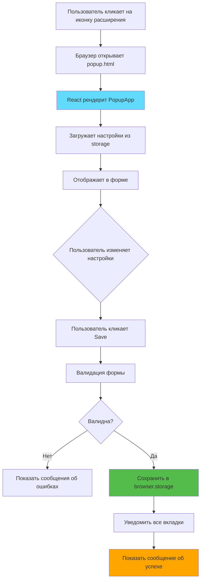
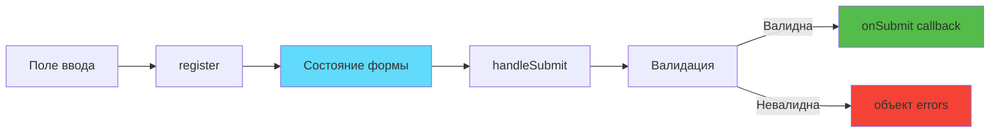
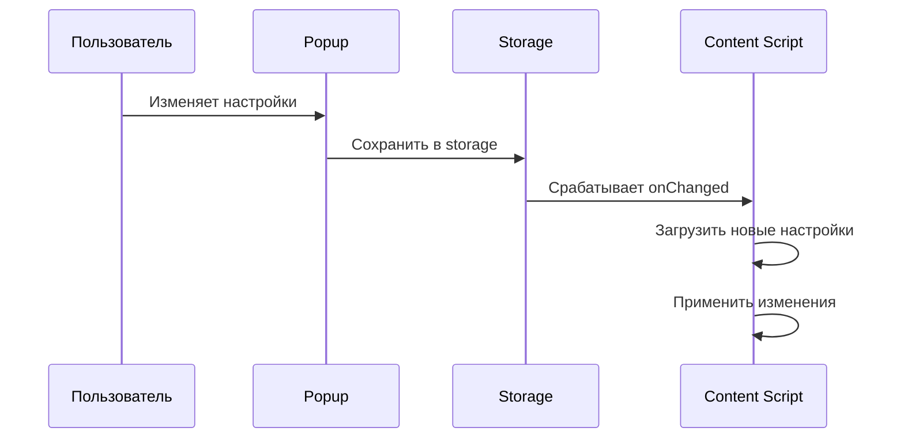

# Слайд 10: Всплывающее окно настроек (Settings Popup UI)

**Ветка:** `react/10-settings-popup`

---

## 🎯 Что такое всплывающее окно настроек?

Интерфейс настроек, который появляется при клике на иконку расширения в панели браузера. Построен с использованием React и react-hook-form, предоставляет удобный способ настройки поведения расширения, горячих клавиш и исключённых доменов.

Ключевые моменты:
- ⚡ **Popup Entrypoint** - Отдельная HTML-страница для UI настроек
- 🎨 **React Hook Form** - Эффективное управление формами с валидацией
- 📦 **Browser Storage** - Сохранение/загрузка настроек через browser.storage API
- 🔄 **Обновления в реальном времени** - Настройки применяются на всех вкладках
- 🛠️ **Валидация форм** - Клиентская валидация с сообщениями об ошибках

---

## 📂 Файлы для изучения

<details>
<summary><b>Новые/Изменённые файлы</b></summary>

- 📄 [entrypoints/popup/App.tsx](../textarea-fullscreen-react/entrypoints/popup/App.tsx)
- 📄 [entrypoints/popup/App.css](../textarea-fullscreen-react/entrypoints/popup/App.css)
- 📄 [entrypoints/popup/index.html](../textarea-fullscreen-react/entrypoints/popup/index.html)
- 📄 [entrypoints/popup/main.tsx](../textarea-fullscreen-react/entrypoints/popup/main.tsx)
- 📄 [entrypoints/popup/style.css](../textarea-fullscreen-react/entrypoints/popup/style.css)
- 📄 [components/SettingsForm/index.tsx](../textarea-fullscreen-react/components/SettingsForm/index.tsx)
- 📄 [components/SettingsForm/style.css](../textarea-fullscreen-react/components/SettingsForm/style.css)

</details>

<details>
<summary><b>Вспомогательные файлы</b></summary>

- 📄 [types/settings.ts](../textarea-fullscreen-react/types/settings.ts) - **НОВЫЙ**
- 📄 [hooks/useSettings.ts](../textarea-fullscreen-react/hooks/useSettings.ts) - **НОВЫЙ**
- 📄 [utils/constants.ts](../textarea-fullscreen-react/utils/constants.ts)
- 📄 [wxt.config.ts](../textarea-fullscreen-react/wxt.config.ts)
- 📄 [package.json](../textarea-fullscreen-react/package.json)

</details>

---

## ✅ Что нового в этом слайде

- ✅ Создан popup entrypoint с HTML-страницей
- ✅ Построена форма настроек с react-hook-form
- ✅ Добавлена валидация форм (обязательные поля, максимальная длина)
- ✅ Интегрирован browser.storage для сохранения данных
- ✅ Создан компонент SettingsForm
- ✅ Добавлены сообщения об успехе/ошибке
- ✅ Реализована синхронизация настроек в реальном времени
- ✅ **Исправлены критические импорты** (useSettings, browser API)
- ✅ **Добавлены разрешения в manifest** (storage, tabs)

---

## 🐛 Важные исправления

<details>
<summary><b>⚠️ Распространённые проблемы и решения</b></summary>

### Проблема 1: Popup не открывается (бесконечная загрузка)

**Симптомы:**
- При клике на иконку расширения popup показывает "Loading..." вечно
- В консоли ошибка: `browser is not defined`

**Решение:**
Добавить импорт в `hooks/useSettings.ts`:

```typescript
import browser from 'webextension-polyfill';
```

---

### Проблема 2: Ошибки импорта в ContentApp

**Симптомы:**
- `useTextareaDetector is not defined`
- `useButtonContainers is not defined`

**Решение:**
Добавить импорты в `entrypoints/content/ContentApp.tsx`:

```typescript
import { useTextareaDetector } from '../../hooks/useTextareaDetector';
import { useButtonContainers } from '../../hooks/useButtonContainers';
```

---

### Проблема 3: Logger не определён

**Симптомы:**
- `logger is not defined` в content script

**Решение:**
Добавить импорт в `entrypoints/content/index.tsx`:

```typescript
import { logger } from '../../utils/logger';
```

---

### Проблема 4: Storage permissions

**Симптомы:**
- `storage.sync is undefined`
- Настройки не сохраняются

**Решение:**
Обновить `wxt.config.ts`:

```typescript
export default defineConfig({
  modules: ['@wxt-dev/module-react'],
  manifest: {
    permissions: ['storage', 'tabs']
  }
});
```

</details>

---

**Следующий:** [Слайд 11: Интеграция хранилища](./11-storage-api.md)

---

## 📑 Подробное изучение

- [Как это работает](#как-это-работает)
- [Шаги реализации](#шаги-реализации)
- [Ключевые концепции](#ключевые-концепции)
- [Примеры кода](#примеры-кода)
- [Распространённые паттерны](#распространённые-паттерны)
- [Документация](#документация)
- [Задание](#задание)

---

## Как это работает



**Объяснение потока:**
1. Пользователь кликает на иконку расширения → Браузер открывает popup
2. Popup загружает текущие настройки из хранилища
3. Форма отображается с текущими значениями
4. Пользователь вносит изменения
5. При отправке форма валидирует данные
6. Валидные данные сохраняются в browser.storage
7. Все content scripts получают уведомление об обновлении
8. Отображается сообщение об успехе

---

## Шаги реализации

### 1. Обновить Manifest для Popup

```typescript
// wxt.config.ts
import { defineConfig } from 'wxt';

export default defineConfig({
  modules: ['@wxt-dev/module-react'],
  manifest: {
    name: 'Textarea Fullscreen',
    description: 'Fullscreen editor for any textarea',
    version: '1.0.0',
    permissions: ['storage', 'tabs'],
    action: {
      default_popup: 'popup.html',
      default_title: 'Textarea Fullscreen Settings'
    }
  }
});
```

**Что это делает:**
- `action.default_popup` - Открывает popup.html при клике на иконку
- `permissions: ["storage", "tabs"]` - Разрешает использование browser.storage и tabs API

---

### 2. Создать HTML entrypoint для Popup

```html
<!-- entrypoints/popup/index.html -->
<!DOCTYPE html>
<html lang="en">
  <head>
    <meta charset="UTF-8" />
    <meta name="viewport" content="width=device-width, initial-scale=1.0" />
    <title>Textarea Fullscreen - Settings</title>
    <meta name="manifest.type" content="browser_action" />
  </head>
  <body>
    <div id="root"></div>
    <script type="module" src="./main.tsx"></script>
  </body>
</html>
```

**Структура:**
- Минимальный HTML-скелет
- Root div для React
- Module script загружает React-приложение

---

### 3. Создать React точку входа

```tsx
// entrypoints/popup/main.tsx
import React from 'react';
import ReactDOM from 'react-dom/client';
import App from './App.tsx';
import './style.css';

ReactDOM.createRoot(document.getElementById('root')!).render(
  <React.StrictMode>
    <App />
  </React.StrictMode>,
);
```

---

### 4. Установить зависимости

```bash
npm install react-hook-form webextension-polyfill
npm install -D @types/webextension-polyfill
```

**Зачем react-hook-form?**
- Минимальные ре-рендеры (лучшая производительность)
- Встроенная валидация
- Простое управление состоянием формы
- Малый размер бандла

**Зачем webextension-polyfill?**
- Кроссбраузерная совместимость (Chrome/Firefox)
- Promise-based API (вместо callbacks)
- TypeScript типы из коробки

---

### 5. Создать интерфейс настроек

```typescript
// types/settings.ts
export interface Settings {
  enabled: boolean;
  overlay: boolean;
  shortcutKey: string;
  excludedDomains: string;
}

export const DEFAULT_SETTINGS: Settings = {
  enabled: true,
  overlay: true,
  shortcutKey: 'f',
  excludedDomains: ''
};
```

---

### 6. Создать хук для управления настройками

```typescript
// hooks/useSettings.ts
import { useState, useEffect, useCallback } from 'react';
import browser from 'webextension-polyfill'; // ⚠️ КРИТИЧЕСКИЙ ИМПОРТ
import { DEFAULT_SETTINGS, type Settings } from '../types/settings';
import { logger } from '../utils/logger';

export function useSettings() {
  const [settings, setSettings] = useState<Settings>(DEFAULT_SETTINGS);
  const [loading, setLoading] = useState(true);
  const [error, setError] = useState<string | null>(null);

  // Загрузка настроек при монтировании
  useEffect(() => {
    logger.info('[useSettings] Loading settings from storage...');
    
    browser.storage.sync
      .get(DEFAULT_SETTINGS)
      .then((data) => {
        const loadedSettings = data as Settings;
        logger.success('[useSettings] Settings loaded', loadedSettings);
        setSettings(loadedSettings);
        setLoading(false);
      })
      .catch((err) => {
        logger.error('[useSettings] Failed to load settings', err);
        setError('Failed to load settings');
        setLoading(false);
      });
  }, []);

  // Слушать изменения в storage
  useEffect(() => {
    const handleStorageChange = (
      changes: Record<string, browser.Storage.StorageChange>,
      areaName: string
    ) => {
      if (areaName !== 'sync') return;

      logger.info('[useSettings] Storage changed', changes);

      setSettings((prev) => {
        const updated = { ...prev };
        let hasChanges = false;

        for (const key in changes) {
          if (key in DEFAULT_SETTINGS) {
            updated[key as keyof Settings] = changes[key].newValue;
            hasChanges = true;
          }
        }

        return hasChanges ? updated : prev;
      });
    };

    browser.storage.onChanged.addListener(handleStorageChange);

    return () => {
      browser.storage.onChanged.removeListener(handleStorageChange);
    };
  }, []);

  // Сохранить настройки
  const saveSettings = useCallback(async (newSettings: Settings) => {
    logger.info('[useSettings] Saving settings...', newSettings);

    try {
      await browser.storage.sync.set(newSettings);
      setSettings(newSettings);
      logger.success('[useSettings] Settings saved successfully');

      // Уведомить все вкладки
      const tabs = await browser.tabs.query({});
      const message = { type: 'SETTINGS_UPDATED', settings: newSettings };

      tabs.forEach((tab) => {
        if (tab.id) {
          browser.tabs
            .sendMessage(tab.id, message)
            .catch(() => {}); // Игнорируем ошибки
        }
      });
    } catch (err) {
      logger.error('[useSettings] Failed to save settings', err);
      throw new Error('Failed to save settings');
    }
  }, []);

  return {
    settings,
    loading,
    error,
    saveSettings
  };
}
```

**⚠️ Критически важно:**
- Импорт `browser from 'webextension-polyfill'` - БЕЗ НЕГО POPUP НЕ РАБОТАЕТ
- Использование `browser.storage.sync` для синхронизации между устройствами
- Обработка ошибок при загрузке/сохранении

---

### 7. Создать компонент формы настроек

```tsx
// components/SettingsForm/index.tsx
import { useForm } from 'react-hook-form';
import type { Settings } from '../../types/settings';
import './style.css';

interface SettingsFormProps {
  settings: Settings;
  onSave: (data: Settings) => void;
}

export function SettingsForm({ settings, onSave }: SettingsFormProps) {
  const { 
    register, 
    handleSubmit, 
    formState: { errors, isSubmitting } 
  } = useForm<Settings>({
    defaultValues: settings
  });

  return (
    <form onSubmit={handleSubmit(onSave)} className="settings-form">
      {/* Включить расширение */}
      <div className="form-group">
        <label className="checkbox-label">
          <input type="checkbox" {...register('enabled')} />
          <span>Включить расширение</span>
        </label>
        <small className="form-hint">
          Включить/выключить всё расширение
        </small>
      </div>

      {/* Показывать overlay */}
      <div className="form-group">
        <label className="checkbox-label">
          <input type="checkbox" {...register('overlay')} />
          <span>Показывать затемнённый фон</span>
        </label>
        <small className="form-hint">
          Затемнять страницу при открытии полноэкранного редактора
        </small>
      </div>

      {/* Горячая клавиша */}
      <div className="form-group">
        <label htmlFor="shortcutKey" className="form-label">
          Горячая клавиша
        </label>
        <input
          id="shortcutKey"
          type="text"
          maxLength={1}
          placeholder="f"
          className="form-input"
          {...register('shortcutKey', { 
            required: 'Горячая клавиша обязательна',
            maxLength: {
              value: 1,
              message: 'Разрешён только один символ'
            },
            pattern: {
              value: /^[a-z0-9]$/i,
              message: 'Должна быть буква или цифра'
            }
          })}
        />
        <small className="form-hint">
          Нажмите Ctrl+[Клавиша] для переключения полноэкранного режима
        </small>
        {errors.shortcutKey && (
          <span className="error-message">{errors.shortcutKey.message}</span>
        )}
      </div>

      {/* Исключённые домены */}
      <div className="form-group">
        <label htmlFor="excludedDomains" className="form-label">
          Исключённые домены
        </label>
        <textarea
          id="excludedDomains"
          rows={4}
          placeholder="mail.google.com&#10;docs.google.com&#10;github.com"
          className="form-textarea"
          {...register('excludedDomains')}
        />
        <small className="form-hint">
          Расширение не будет работать на этих доменах (один на строку)
        </small>
      </div>

      {/* Кнопка отправки */}
      <button type="submit" className="submit-button" disabled={isSubmitting}>
        {isSubmitting ? 'Сохранение...' : 'Сохранить настройки'}
      </button>
    </form>
  );
}
```

**Ключевые части:**
- `register()` - Связывает inputs с состоянием формы
- `handleSubmit()` - Обрабатывает отправку с валидацией
- `errors` - Содержит ошибки валидации
- Правила валидации встроены в register

---

### 8. Создать главное приложение Popup

```tsx
// entrypoints/popup/App.tsx
import { useState } from 'react';
import { SettingsForm } from '../../components/SettingsForm';
import { useSettings } from '../../hooks/useSettings';
import type { Settings } from '../../types/settings';
import './App.css';

export default function App() {
  const { settings, loading, saveSettings } = useSettings();
  const [statusMessage, setStatusMessage] = useState('');
  const [statusType, setStatusType] = useState<'success' | 'error'>('success');

  const handleSave = async (newSettings: Settings) => {
    try {
      await saveSettings(newSettings);
      setStatusType('success');
      setStatusMessage('✓ Настройки успешно сохранены!');
      
      // Очистить сообщение через 2 секунды
      setTimeout(() => setStatusMessage(''), 2000);
    } catch (error) {
      setStatusType('error');
      setStatusMessage('✗ Не удалось сохранить настройки');
      
      setTimeout(() => setStatusMessage(''), 3000);
    }
  };

  if (loading) {
    return (
      <div className="popup-container">
        <div className="loading">
          <div className="spinner"></div>
          <p>Загрузка настроек...</p>
        </div>
      </div>
    );
  }

  return (
    <div className="popup-container">
      {/* Заголовок */}
      <div className="popup-header">
        <h3 className="popup-title">
          <span className="popup-icon">⛶</span>
          Textarea Fullscreen
        </h3>
        <p className="popup-subtitle">Настройте полноэкранный режим</p>
      </div>

      {/* Статусное сообщение */}
      {statusMessage && (
        <div className={`status-message status-${statusType}`}>
          {statusMessage}
        </div>
      )}

      {/* Форма настроек */}
      <SettingsForm settings={settings} onSave={handleSave} />

      {/* Информационный блок */}
      <div className="info-box">
        <strong>💡 Подсказка:</strong>
        <p>
          Нажмите <kbd>Ctrl</kbd>+<kbd>{settings.shortcutKey.toUpperCase()}</kbd> на
          любом textarea для переключения полноэкранного режима.
        </p>
      </div>

      {/* Футер */}
      <div className="popup-footer">
        <small>Версия 1.0.0 • Сделано с ❤️</small>
      </div>
    </div>
  );
}
```

---

### 9. Добавить стили

```css
/* entrypoints/popup/style.css */
* {
  margin: 0;
  padding: 0;
  box-sizing: border-box;
}

body {
  margin: 0;
  min-width: 380px;
  overflow-x: hidden;
}
```

```css
/* entrypoints/popup/App.css */
.popup-container {
  width: 380px;
  min-height: 400px;
  padding: 0;
  font-family: -apple-system, BlinkMacSystemFont, 'Segoe UI', Roboto, sans-serif;
  background: #f9fafb;
  color: #111827;
}

/* Заголовок */
.popup-header {
  background: linear-gradient(135deg, #3b82f6 0%, #2563eb 100%);
  color: white;
  padding: 20px;
  text-align: center;
}

.popup-title {
  margin: 0;
  font-size: 20px;
  font-weight: 700;
  display: flex;
  align-items: center;
  justify-content: center;
  gap: 8px;
}

.popup-icon {
  font-size: 24px;
}

.popup-subtitle {
  margin: 8px 0 0 0;
  font-size: 13px;
  opacity: 0.9;
  font-weight: 400;
}

/* Статусное сообщение */
.status-message {
  margin: 16px 16px 0;
  padding: 12px 16px;
  border-radius: 6px;
  font-size: 14px;
  font-weight: 500;
  text-align: center;
  animation: slideDown 0.3s ease;
}

@keyframes slideDown {
  from {
    opacity: 0;
    transform: translateY(-10px);
  }
  to {
    opacity: 1;
    transform: translateY(0);
  }
}

.status-success {
  background: #ecfdf5;
  color: #065f46;
  border: 1px solid #10b981;
}

.status-error {
  background: #fef2f2;
  color: #991b1b;
  border: 1px solid #ef4444;
}

/* Контейнер формы */
.popup-container .settings-form {
  padding: 20px;
  background: white;
  margin: 16px;
  border-radius: 8px;
  box-shadow: 0 1px 3px rgba(0, 0, 0, 0.1);
}

/* Информационный блок */
.info-box {
  margin: 0 16px 16px;
  padding: 12px;
  background: #fffbeb;
  border: 1px solid #fbbf24;
  border-left: 4px solid #f59e0b;
  border-radius: 6px;
  font-size: 13px;
  color: #92400e;
}

.info-box strong {
  display: block;
  margin-bottom: 4px;
  color: #78350f;
}

.info-box p {
  margin: 4px 0 0;
  line-height: 1.5;
}

.info-box kbd {
  display: inline-block;
  padding: 2px 6px;
  background: white;
  border: 1px solid #d97706;
  border-radius: 3px;
  font-family: 'Courier New', monospace;
  font-size: 12px;
  font-weight: 600;
  color: #92400e;
}

/* Футер */
.popup-footer {
  padding: 12px 20px;
  text-align: center;
  border-top: 1px solid #e5e7eb;
  background: white;
}

.popup-footer small {
  color: #6b7280;
  font-size: 12px;
}

/* Состояние загрузки */
.loading {
  display: flex;
  flex-direction: column;
  align-items: center;
  justify-content: center;
  padding: 60px 20px;
  gap: 16px;
}

.spinner {
  width: 40px;
  height: 40px;
  border: 4px solid #e5e7eb;
  border-top-color: #3b82f6;
  border-radius: 50%;
  animation: spin 0.8s linear infinite;
}

@keyframes spin {
  to {
    transform: rotate(360deg);
  }
}

.loading p {
  margin: 0;
  color: #6b7280;
  font-size: 14px;
}
```

```css
/* components/SettingsForm/style.css */
.settings-form {
  display: flex;
  flex-direction: column;
  gap: 20px;
}

/* Группы формы */
.form-group {
  display: flex;
  flex-direction: column;
  gap: 6px;
}

/* Метки */
.form-label {
  font-size: 14px;
  font-weight: 600;
  color: #1f2937;
}

.checkbox-label {
  display: flex;
  align-items: center;
  gap: 8px;
  font-size: 14px;
  font-weight: 500;
  color: #374151;
  cursor: pointer;
  user-select: none;
}

.checkbox-label input[type='checkbox'] {
  width: 16px;
  height: 16px;
  cursor: pointer;
}

.checkbox-label span {
  flex: 1;
}

/* Поля ввода */
.form-input,
.form-textarea {
  padding: 10px 12px;
  border: 1px solid #d1d5db;
  border-radius: 6px;
  font-size: 14px;
  font-family: -apple-system, BlinkMacSystemFont, 'Segoe UI', sans-serif;
  transition: all 0.2s;
}

.form-input:focus,
.form-textarea:focus {
  outline: none;
  border-color: #3b82f6;
  box-shadow: 0 0 0 3px rgba(59, 130, 246, 0.1);
}

.form-input::placeholder,
.form-textarea::placeholder {
  color: #9ca3af;
}

.form-textarea {
  resize: vertical;
  min-height: 80px;
}

/* Подсказки */
.form-hint {
  font-size: 12px;
  color: #6b7280;
  margin-top: -2px;
}

/* Сообщения об ошибках */
.error-message {
  color: #ef4444;
  font-size: 12px;
  font-weight: 500;
  display: flex;
  align-items: center;
  gap: 4px;
}

.error-message::before {
  content: '⚠️';
}

/* Кнопка отправки */
.submit-button {
  padding: 12px 16px;
  background: #3b82f6;
  color: white;
  border: none;
  border-radius: 6px;
  font-size: 14px;
  font-weight: 600;
  cursor: pointer;
  transition: all 0.2s;
  box-shadow: 0 1px 3px rgba(0, 0, 0, 0.1);
}

.submit-button:hover {
  background: #2563eb;
  box-shadow: 0 4px 6px rgba(0, 0, 0, 0.1);
}

.submit-button:active {
  transform: translateY(1px);
}

.submit-button:disabled {
  background: #9ca3af;
  cursor: not-allowed;
  box-shadow: none;
}
```

---

## Ключевые концепции

### Концепция 1: react-hook-form



**Основные функции:**

| Функция | Назначение |
|---------|-----------|
| `register()` | Связать поле с состоянием формы |
| `handleSubmit()` | Обработать отправку с валидацией |
| `formState.errors` | Доступ к ошибкам валидации |
| `watch()` | Отслеживать значения полей |
| `reset()` | Сбросить форму к значениям по умолчанию |

**Пример:**
```tsx
const { register, handleSubmit, formState: { errors } } = useForm({
  defaultValues: { name: 'Иван' }
});

// Зарегистрировать поле
<input {...register('name', { required: true, maxLength: 20 })} />

// Показать ошибки
{errors.name && <span>Это поле обязательно</span>}

// Обработать отправку
<form onSubmit={handleSubmit(data => console.log(data))}>
```

---

### Концепция 2: Browser Storage API

**Типы хранилищ:**

| Тип | Область | Синхр. | Лимит размера |
|-----|---------|--------|---------------|
| `storage.local` | На устройстве | ❌ Нет | ~5MB |
| `storage.sync` | Между устройствами | ✅ Да | ~100KB |
| `storage.session` | На сессию | ❌ Нет | ~1MB |

**Использование:**
```typescript
import browser from 'webextension-polyfill';

// Сохранить
await browser.storage.sync.set({ key: 'value' });

// Загрузить
const data = await browser.storage.sync.get('key');
console.log(data.key); // 'value'

// Слушать изменения
browser.storage.onChanged.addListener((changes, area) => {
  if (area === 'sync' && changes.key) {
    console.log('Старое:', changes.key.oldValue);
    console.log('Новое:', changes.key.newValue);
  }
});
```

---

### Концепция 3: Валидация форм

**Правила валидации:**
```tsx
<input 
  {...register('email', {
    required: 'Email обязателен',
    pattern: {
      value: /^[A-Z0-9._%+-]+@[A-Z0-9.-]+\.[A-Z]{2,}$/i,
      message: 'Неверный email адрес'
    }
  })}
/>

<input
  {...register('age', {
    min: { value: 18, message: 'Должно быть 18+' },
    max: { value: 120, message: 'Неверный возраст' },
    valueAsNumber: true
  })}
/>

<input
  {...register('username', {
    required: true,
    minLength: { value: 3, message: 'Слишком короткое' },
    maxLength: { value: 20, message: 'Слишком длинное' },
    validate: {
      noSpaces: v => !/\s/.test(v) || 'Пробелы запрещены',
      notTaken: async v => {
        const taken = await checkUsername(v);
        return !taken || 'Имя занято';
      }
    }
  })}
/>
```

---

### Концепция 4: Связь Popup и Content Script



**Как они общаются:**

1. **Через Storage (Рекомендуется):**
   ```typescript
   // Popup сохраняет
   await browser.storage.sync.set({ enabled: false });
   
   // Content script слушает
   browser.storage.onChanged.addListener((changes) => {
     if (changes.enabled) {
       applyNewSettings(changes.enabled.newValue);
     }
   });
   ```

2. **Через сообщения:**
   ```typescript
   // Popup отправляет сообщение
   browser.tabs.sendMessage(tabId, { type: 'UPDATE_SETTINGS', data });
   
   // Content script получает
   browser.runtime.onMessage.addListener((message) => {
     if (message.type === 'UPDATE_SETTINGS') {
       applySettings(message.data);
     }
   });
   ```

---

## Примеры кода

### Пример 1: Простая форма

```tsx
import { useForm } from 'react-hook-form';

export function SimpleSettings() {
  const { register, handleSubmit } = useForm({
    defaultValues: {
      enabled: true,
      theme: 'dark'
    }
  });

  const onSubmit = (data) => {
    console.log('Сохраняю:', data);
  };

  return (
    <form onSubmit={handleSubmit(onSubmit)}>
      <label>
        <input type="checkbox" {...register('enabled')} />
        Включить
      </label>
      
      <select {...register('theme')}>
        <option value="light">Светлая</option>
        <option value="dark">Тёмная</option>
      </select>
      
      <button type="submit">Сохранить</button>
    </form>
  );
}
```

---

### Пример 2: С валидацией

```tsx
export function ValidatedForm() {
  const { register, handleSubmit, formState: { errors } } = useForm();

  return (
    <form onSubmit={handleSubmit(data => console.log(data))}>
      <input
        {...register('name', {
          required: 'Имя обязательно',
          minLength: { value: 3, message: 'Слишком короткое' }
        })}
      />
      {errors.name && <span>{errors.name.message}</span>}
      
      <input
        type="number"
        {...register('age', {
          required: true,
          min: { value: 1, message: 'Должно быть положительным' },
          max: { value: 120, message: 'Неверно' }
        })}
      />
      {errors.age && <span>{errors.age.message}</span>}
      
      <button>Отправить</button>
    </form>
  );
}
```

---

### Пример 3: С интеграцией Storage

```tsx
import { useForm } from 'react-hook-form';
import browser from 'webextension-polyfill';

export function StorageForm() {
  const [settings, setSettings] = useState(null);
  const { register, handleSubmit, reset } = useForm();

  // Загрузить при монтировании
  useEffect(() => {
    browser.storage.sync.get('settings').then(data => {
      setSettings(data.settings || {});
      reset(data.settings);
    });
  }, [reset]);

  const onSubmit = async (data) => {
    await browser.storage.sync.set({ settings: data });
    alert('Сохранено!');
  };

  if (!settings) return <div>Загрузка...</div>;

  return (
    <form onSubmit={handleSubmit(onSubmit)}>
      <input {...register('name')} />
      <button>Сохранить</button>
    </form>
  );
}
```

---

## Распространённые паттерны

<details>
<summary><b>Паттерн 1: Сброс формы</b></summary>

```tsx
const { register, handleSubmit, reset } = useForm();

// Сброс к значениям по умолчанию
const handleReset = () => {
  reset({
    enabled: true,
    theme: 'light'
  });
};

// Сброс к загруженным данным
useEffect(() => {
  loadSettings().then(data => {
    reset(data); // Заполнить форму загруженными данными
  });
}, [reset]);
```

**Когда использовать:**
- Перезагрузить форму свежими данными
- Сбросить к значениям по умолчанию
- Отменить изменения

</details>

<details>
<summary><b>Паттерн 2: Отслеживание значений полей</b></summary>

```tsx
const { register, watch } = useForm();

// Отслеживать одно поле
const enabled = watch('enabled');

// Отслеживать несколько полей
const [enabled, theme] = watch(['enabled', 'theme']);

// Отслеживать все поля
const formData = watch();

return (
  <div>
    <input type="checkbox" {...register('enabled')} />
    {enabled && <p>Расширение включено!</p>}
  </div>
);
```

**Когда использовать:**
- Показывать/скрывать поля на основе других полей
- Валидация в реальном времени
- Предпросмотр изменений

</details>

<details>
<summary><b>Паттерн 3: Асинхронная валидация</b></summary>

```tsx
<input
  {...register('username', {
    validate: {
      checkAvailable: async (value) => {
        const response = await fetch(`/api/check/${value}`);
        const available = await response.json();
        return available || 'Имя занято';
      }
    }
  })}
/>
```

**Когда использовать:**
- Проверка доступности имени/email
- Проверка API ключей
- Валидация доменов

</details>

---

## Документация

<details>
<summary><b>Связанные ресурсы</b></summary>

- 📚 [react-hook-form Документация](https://react-hook-form.com/)
- 📚 [Browser Storage API](https://developer.mozilla.org/en-US/docs/Mozilla/Add-ons/WebExtensions/API/storage)
- 🎓 [Chrome Extension Popup](https://developer.chrome.com/docs/extensions/mv3/user_interface/#popup)
- 💡 [Паттерны валидации форм](https://react-hook-form.com/advanced-usage#FormProviderPerformance)
- 🎓 [webextension-polyfill](https://github.com/mozilla/webextension-polyfill)

</details>

---

## Задание

**Попробуйте сами:**

1. **Добавьте секцию продвинутых настроек:**
   - Сворачиваемая секция "Продвинутые"
   - Слайдер размера шрифта (12-24px)
   - Выбор цвета для фона редактора
   - Экспорт/импорт настроек в JSON

2. **Реализуйте валидацию формы:**
   - Горячая клавиша не должна быть зарезервированной
   - Исключённые домены должны быть валидными хостами
   - Показывайте валидацию в реальном времени (не только при отправке)

3. **Добавьте пресеты настроек:**
   - "Минимальный", "По умолчанию", "Продвинутый" пресеты
   - Применение пресета одним кликом
   - Сохранение пользовательского пресета

**Ожидаемый результат:**
```tsx
<select onChange={applyPreset}>
  <option>По умолчанию</option>
  <option>Минимальный</option>
  <option>Продвинутый</option>
</select>

<div className="advanced">
  <input type="range" min="12" max="24" {...register('fontSize')} />
  <input type="color" {...register('bgColor')} />
</div>

<button onClick={exportSettings}>Экспорт</button>
<input type="file" onChange={importSettings} />
```

**Бонус:**
- Добавить навигацию с клавиатуры в popup (Tab, Enter)
- Реализовать тёмную тему для popup
- Добавить подсказки с объяснением каждой настройки

---

**Следующий:** [Слайд 11: Интеграция хранилища](./11-storage-api.md)