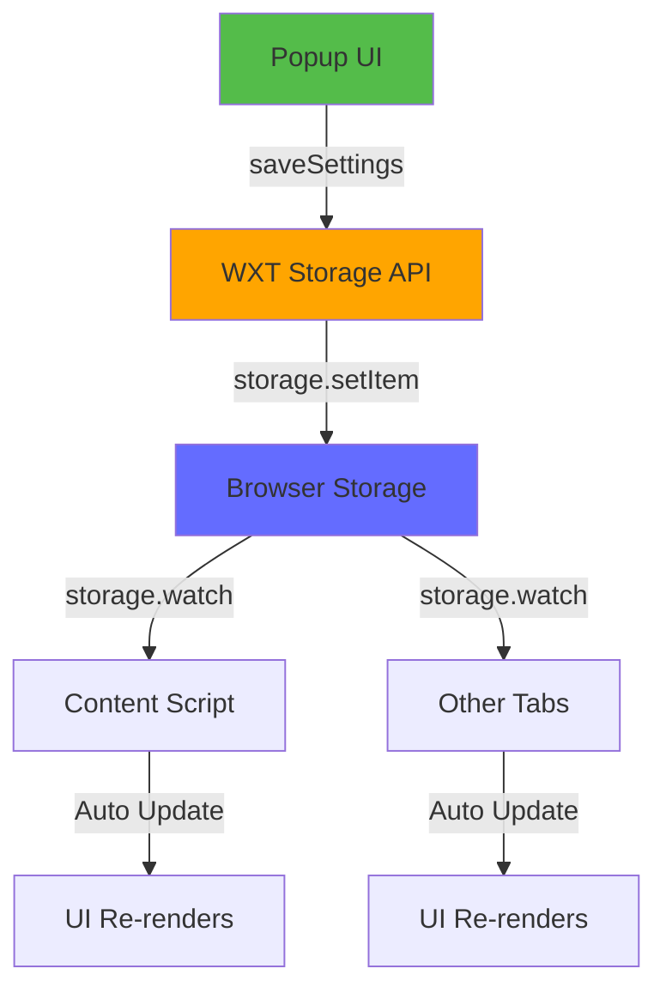
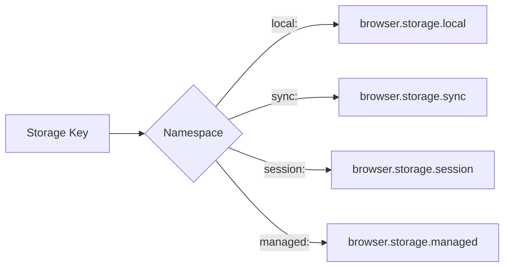

# Slide 11: Persisting Settings with Storage API

**Branch:** `react/11-storage-api`

---

## 🎯 What is WXT Storage API?

WXT provides a powerful, type-safe wrapper around browser storage APIs that simplifies data persistence and real-time synchronization across your extension.

Key points:
- 🗄️ **Storage API** - Type-safe wrapper around `browser.storage` with auto-completion
- 🔄 **Real-time Sync** - `storage.watch()` automatically syncs changes across tabs
- 🎨 **Storage Namespaces** - `local:`, `sync:`, `session:`, `managed:` prefixes
- 📦 **Auto-serialization** - Handles complex objects, arrays, and primitives automatically
- ⚡ **Better DX** - No manual parsing, stronger TypeScript support

---

## 📂 Files to Explore

<details>
<summary><b>New/Modified Files</b></summary>

- 📄 [utils/storage.ts](../textarea-fullscreen-react/src/utils/storage.ts) ⭐ **NEW**
- 📄 [popup/hooks/useSettings.ts](../textarea-fullscreen-react/src/popup/hooks/useSettings.ts)
- 📄 [content/hooks/useSettings.ts](../textarea-fullscreen-react/src/content/hooks/useSettings.ts)
- 📄 [popup/App.tsx](../textarea-fullscreen-react/src/entrypoints/popup/App.tsx)

</details>

<details>
<summary><b>Removed Files</b></summary>

- ❌ [shared/utils/storage.js](../textarea-fullscreen-react/src/shared/utils/storage.js) - Replaced by WXT storage
- ❌ [shared/constants/defaults.js](../textarea-fullscreen-react/src/shared/constants/defaults.js) - Merged into storage.ts

</details>

<details>
<summary><b>Configuration/Supporting Files</b></summary>

- 📄 [package.json](../textarea-fullscreen-react/package.json) - Remove `webextension-polyfill` dependency

</details>

---

## ✅ What's New in This Slide

- ✅ Created centralized `utils/storage.ts` with typed interfaces
- ✅ Replaced manual `browser.storage` calls with WXT's `storage` API
- ✅ Implemented `storage.watch()` for real-time settings synchronization
- ✅ Added default settings with fallback logic
- ✅ Removed `webextension-polyfill` dependency for storage
- ✅ Type-safe storage operations with full TypeScript support

---

**Next:** [Slide 12: Content Script Integration](./12-mutation-observer.md)  

---

## 📑 Deep Dive

- [How It Works](#how-it-works)
- [Implementation Steps](#implementation-steps)
- [Key Concepts](#key-concepts)
- [Code Examples](#code-examples)
- [Common Patterns](#common-patterns)
- [Documentation](#documentation)
- [Challenge](#challenge)

---

## How It Works



**Flow:**
1. User saves settings in popup
2. WXT storage API writes to browser storage
3. `storage.watch()` listeners detect changes
4. All tabs/contexts automatically receive updates
5. Components re-render with new settings

---

## Implementation Steps

### 1. Install WXT Storage (Already included)
```bash
# WXT storage is built-in, no installation needed!
# Just import from 'wxt/storage'
```

**What happens:**
- WXT provides `storage` module out of the box
- No need for `webextension-polyfill` for storage operations
- Full TypeScript support with generics

---

### 2. Create Storage Utility

Create `src/utils/storage.ts`:

```typescript
import { storage } from 'wxt/storage';

export interface Settings {
  enabled: boolean;
  overlay: boolean;
  maxWidth: string;
  maxHeight: string;
  shortcutKey: string;
  excludedDomains: string[];
}

export const DEFAULT_SETTINGS: Settings = {
  enabled: true,
  overlay: true,
  maxWidth: '90vw',
  maxHeight: '90vh',
  shortcutKey: 'f',
  excludedDomains: ['mail.google.com', 'docs.google.com', 'sheets.google.com']
};

// Get settings with fallback to defaults
export async function getSettings(): Promise<Settings> {
  const stored = await storage.getItem<Settings>('local:settings');
  return stored ?? DEFAULT_SETTINGS;
}

// Save settings
export async function saveSettings(settings: Settings): Promise<void> {
  await storage.setItem('local:settings', settings);
}

// Watch for settings changes (real-time sync)
export function watchSettings(callback: (settings: Settings | null) => void) {
  return storage.watch<Settings>('local:settings', callback);
}
```

**Explanation:**
- `local:` prefix = stores in `browser.storage.local`
- Type-safe with `Settings` interface
- Auto-serialization of complex objects
- `watch()` returns cleanup function

---

### 3. Update Popup Hook

Update `src/popup/hooks/useSettings.ts`:

```typescript
import { useEffect, useState } from 'react';
import { getSettings, saveSettings, watchSettings, Settings, DEFAULT_SETTINGS } from '@/utils/storage';

export const useSettings = () => {
  const [settings, setSettings] = useState<Settings>(DEFAULT_SETTINGS);
  const [loading, setLoading] = useState(true);

  useEffect(() => {
    // Load initial settings
    getSettings().then(stored => {
      setSettings(stored);
      setLoading(false);
    });

    // Watch for changes (from other tabs/contexts)
    const unwatch = watchSettings((newSettings) => {
      if (newSettings) {
        setSettings(newSettings);
      }
    });

    return unwatch; // Cleanup
  }, []);

  const save = async (newSettings: Settings) => {
    await saveSettings(newSettings);
    setSettings(newSettings);
  };

  return { settings, loading, saveSettings: save };
};
```

**What changed:**
- Uses WXT's `storage` instead of `browser.storage`
- `watchSettings()` for real-time updates
- Cleaner async/await patterns
- TypeScript-first approach

---

### 4. Update Popup Component

Update `src/entrypoints/popup/App.tsx`:

```tsx
import { useEffect, useState } from 'react';
import { useForm } from 'react-hook-form';
import { useSettings } from './hooks/useSettings';
import type { Settings } from '@/utils/storage';

export default function App() {
  const { settings, loading, saveSettings } = useSettings();
  const { register, handleSubmit, reset, formState: { errors } } = useForm<Settings>();
  const [statusMessage, setStatusMessage] = useState('');

  // Reset form when settings load
  useEffect(() => {
    reset(settings);
  }, [settings, reset]);

  const onSave = async (data: Settings) => {
    await saveSettings(data);
    setStatusMessage('Settings saved!');
    setTimeout(() => setStatusMessage(''), 2000);
  };

  if (loading) {
    return <div className="loading">Loading settings...</div>;
  }

  return (
    <div className="popup-app">
      <h3>⛶ Textarea Fullscreen</h3>
      
      {statusMessage && (
        <div className="status-message">{statusMessage}</div>
      )}

      <form onSubmit={handleSubmit(onSave)} className="settings-form">
        <div className="form-group">
          <label>
            <input type="checkbox" {...register('enabled')} />
            Enable extension
          </label>
        </div>

        <div className="form-group">
          <label>
            <input type="checkbox" {...register('overlay')} />
            Show overlay
          </label>
        </div>

        <div className="form-group">
          <label htmlFor="shortcutKey">Shortcut Key</label>
          <input 
            id="shortcutKey" 
            {...register('shortcutKey', { 
              required: true, 
              maxLength: 1 
            })} 
          />
          {errors.shortcutKey && (
            <span className="error">Single character required</span>
          )}
        </div>

        <button type="submit">Save Settings</button>
      </form>
    </div>
  );
}
```

---

## Key Concepts

### Concept 1: Storage Namespaces



**Available Namespaces:**

| Namespace | Use Case | Sync Across Devices |
|-----------|----------|---------------------|
| `local:` | Large data, per-device | ❌ No |
| `sync:` | User preferences | ✅ Yes (if logged in) |
| `session:` | Temporary data | ❌ No (cleared on restart) |
| `managed:` | Admin policies | ❌ Read-only |

**Example:**
```typescript
// Local storage (not synced)
await storage.setItem('local:cache', largeData);

// Sync storage (syncs across devices)
await storage.setItem('sync:theme', 'dark');

// Session storage (temporary)
await storage.setItem('session:token', tempToken);
```

---

### Concept 2: Storage Watchers

**Real-time synchronization across contexts:**

```typescript
// In any context (popup, content script, background)
const unwatch = storage.watch<Settings>('local:settings', (newValue, oldValue) => {
  console.log('Settings changed!', { newValue, oldValue });
});

// Don't forget to cleanup!
useEffect(() => {
  return unwatch;
}, []);
```

**How it works:**
1. Any script calls `storage.setItem()`
2. Browser fires `storage.onChanged` event
3. All active watchers receive callback
4. Components re-render with new data

---

### Concept 3: Type Safety

```typescript
// Define your schema
interface UserProfile {
  name: string;
  age: number;
  premium: boolean;
}

// Type-safe operations
const profile = await storage.getItem<UserProfile>('local:profile');
//    ^? UserProfile | null

if (profile) {
  console.log(profile.name); // ✅ TypeScript knows the shape
  console.log(profile.email); // ❌ Error: Property doesn't exist
}
```

---

## Code Examples

### Example 1: Simple Get/Set

```typescript
import { storage } from 'wxt/storage';

// Save data
await storage.setItem('local:counter', 42);
await storage.setItem('sync:username', 'john');

// Get data
const counter = await storage.getItem<number>('local:counter');
console.log(counter); // 42

// Remove data
await storage.removeItem('local:counter');
```

---

### Example 2: Complex Objects

```typescript
interface TodoList {
  id: string;
  items: Array<{ text: string; done: boolean }>;
  createdAt: Date;
}

// WXT handles serialization automatically!
await storage.setItem('local:todos', {
  id: '123',
  items: [
    { text: 'Learn WXT', done: true },
    { text: 'Build extension', done: false }
  ],
  createdAt: new Date()
});

const todos = await storage.getItem<TodoList>('local:todos');
```

---

### Example 3: Watch Multiple Keys

```typescript
import { storage } from 'wxt/storage';

export function useMultipleSettings() {
  const [theme, setTheme] = useState('light');
  const [lang, setLang] = useState('en');

  useEffect(() => {
    // Load initial values
    Promise.all([
      storage.getItem('sync:theme'),
      storage.getItem('sync:language')
    ]).then(([t, l]) => {
      setTheme(t ?? 'light');
      setLang(l ?? 'en');
    });

    // Watch both keys
    const unwatchTheme = storage.watch('sync:theme', setTheme);
    const unwatchLang = storage.watch('sync:language', setLang);

    return () => {
      unwatchTheme();
      unwatchLang();
    };
  }, []);

  return { theme, lang };
}
```

---

### Example 4: Default Values Pattern

```typescript
import { storage } from 'wxt/storage';

const DEFAULTS = {
  volume: 50,
  muted: false,
  quality: 'auto'
} as const;

async function getAudioSettings() {
  const stored = await storage.getItem('local:audio');
  return { ...DEFAULTS, ...stored }; // Merge with defaults
}

// Usage
const settings = await getAudioSettings();
console.log(settings.volume); // Always has a value
```

---

## Common Patterns

<details>
<summary><b>Pattern 1: Settings Hook with Persistence</b></summary>

```typescript
import { useState, useEffect } from 'react';
import { storage } from 'wxt/storage';

export function usePersistedState<T>(
  key: string,
  defaultValue: T
): [T, (value: T) => void] {
  const [value, setValue] = useState<T>(defaultValue);
  const [loaded, setLoaded] = useState(false);

  useEffect(() => {
    // Load from storage
    storage.getItem<T>(key).then(stored => {
      if (stored !== null) setValue(stored);
      setLoaded(true);
    });

    // Watch for changes
    const unwatch = storage.watch<T>(key, (newValue) => {
      if (newValue !== null) setValue(newValue);
    });

    return unwatch;
  }, [key]);

  const updateValue = (newValue: T) => {
    setValue(newValue);
    storage.setItem(key, newValue);
  };

  return [value, updateValue];
}

// Usage
function MyComponent() {
  const [darkMode, setDarkMode] = usePersistedState('local:darkMode', false);
  
  return (
    <button onClick={() => setDarkMode(!darkMode)}>
      Toggle: {darkMode ? 'Dark' : 'Light'}
    </button>
  );
}
```

**When to use:**
- Auto-persist component state
- Sync state across tabs
- Simple settings storage

</details>

<details>
<summary><b>Pattern 2: Migration Helper</b></summary>

```typescript
import { storage } from 'wxt/storage';

async function migrateSettings() {
  const version = await storage.getItem<number>('local:version');
  
  if (!version || version < 2) {
    // Migrate from v1 to v2
    const oldSettings = await storage.getItem('local:settings');
    if (oldSettings) {
      const newSettings = {
        ...oldSettings,
        newField: 'defaultValue' // Add new field
      };
      await storage.setItem('local:settings', newSettings);
    }
    await storage.setItem('local:version', 2);
  }
}

// Run on extension startup
migrateSettings();
```

**When to use:**
- Version upgrades
- Schema changes
- Data transformation

</details>

<details>
<summary><b>Pattern 3: Batch Operations</b></summary>

```typescript
import { storage } from 'wxt/storage';

async function saveMultiple(data: Record<string, any>) {
  await Promise.all(
    Object.entries(data).map(([key, value]) => 
      storage.setItem(key, value)
    )
  );
}

async function getMultiple<T>(keys: string[]): Promise<Record<string, T>> {
  const values = await Promise.all(
    keys.map(key => storage.getItem<T>(key))
  );
  
  return keys.reduce((acc, key, i) => {
    acc[key] = values[i];
    return acc;
  }, {} as Record<string, T>);
}

// Usage
await saveMultiple({
  'local:name': 'John',
  'local:age': 30,
  'local:city': 'NYC'
});

const data = await getMultiple(['local:name', 'local:age']);
```

</details>

---

## Documentation

<details>
<summary><b>Related Resources</b></summary>

- 📚 [WXT Storage API Docs](https://wxt.dev/guide/storage.html)
- 📚 [Browser Storage API](https://developer.mozilla.org/en-US/docs/Mozilla/Add-ons/WebExtensions/API/storage)
- 🎓 [Storage Best Practices](https://wxt.dev/guide/storage.html#best-practices)
- 💡 [Type-safe Storage Patterns](https://wxt.dev/guide/typescript.html)
- 🔧 [Storage Debugging](https://wxt.dev/guide/debugging.html#storage)

</details>

<details>
<summary><b>Key API Methods</b></summary>

| Method | Description |
|--------|-------------|
| `storage.getItem(key)` | Get value from storage |
| `storage.setItem(key, value)` | Save value to storage |
| `storage.removeItem(key)` | Delete value from storage |
| `storage.watch(key, callback)` | Watch for changes |
| `storage.snapshot(key)` | Get current value synchronously |

</details>

---

## Challenge

**Try this yourself:**

1. **Add a new setting:**
   - Add `fontSize: number` to `Settings` interface
   - Update `DEFAULT_SETTINGS` with default value
   - Add input field in popup form
   - Apply font size in fullscreen editor

2. **Implement storage migration:**
   - Add version field to settings
   - Write migration function for v1 → v2
   - Test with old stored data

3. **Create a debug panel:**
   - Show current storage contents
   - Add "Clear All" button
   - Display last updated timestamp

**Expected result:**
- New settings persist across sessions
- Changes sync between popup and content script
- Migration runs automatically on upgrade

**Bonus:**
- Add export/import settings as JSON
- Implement storage quota warning
- Create storage usage statistics

---

**Next:** [Slide 12: Content Script Integration](./12-mutation-observer.md)