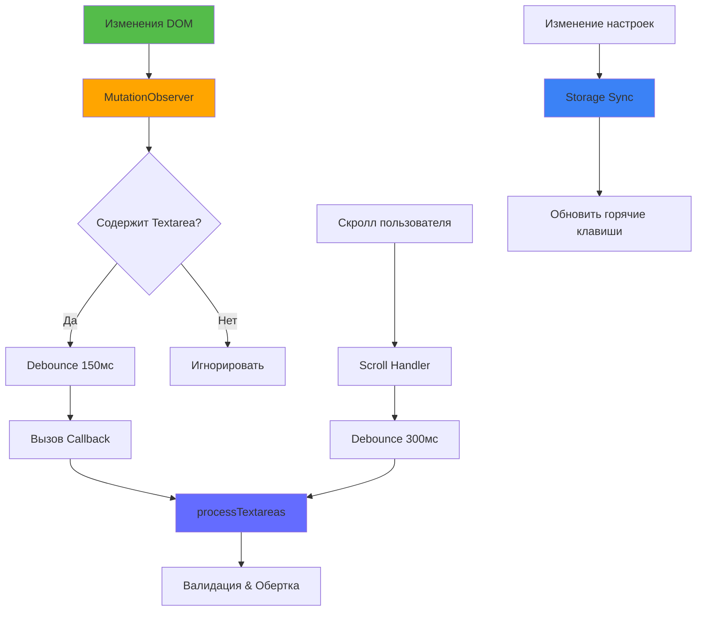
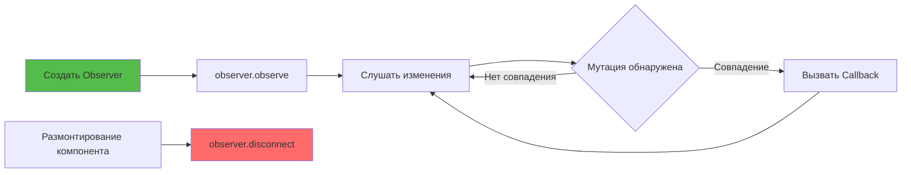
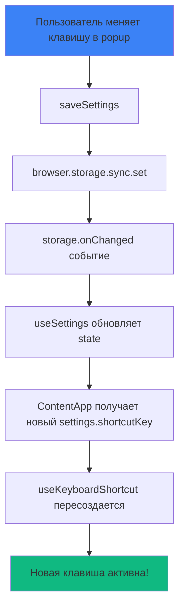

# Слайд 12: Обнаружение Динамических Textarea

**Ветка:** `react/12-mutation-observer`

---

## 🎯 Что такое MutationObserver?

MutationObserver — это браузерный API, который отслеживает изменения в дереве DOM. Это критически важно для обнаружения динамически добавляемых textarea в современных Single Page Applications (SPA) таких как React, Vue или Angular.

Ключевые моменты:
- 👁️ **Отслеживание DOM в реальном времени** - Обнаруживает добавление новых элементов на страницу
- ⚡ **Оптимизация производительности** - Debouncing и throttling предотвращают избыточные вызовы
- 🔄 **Поддержка SPA** - Отлавливает textarea, загруженные через AJAX, lazy loading или изменение роутов
- 🎯 **Выборочная фильтрация** - Срабатывает только при обнаружении элементов `<textarea>`
- 🧹 **Безопасность памяти** - Правильная очистка предотвращает утечки памяти

---

## 📂 Файлы для изучения

<details>
<summary><b>Новые/Измененные файлы</b></summary>

- 📄 [hooks/useMutationObserver.ts](../textarea-fullscreen-react/hooks/useMutationObserver.ts) ⭐ **НОВЫЙ**
- 📄 [hooks/useScrollDetection.ts](../textarea-fullscreen-react/hooks/useScrollDetection.ts) ⭐ **НОВЫЙ**
- 📄 [hooks/useTextareaDetector.ts](../textarea-fullscreen-react/hooks/useTextareaDetector.ts) - Обновлён
- 📄 [hooks/useKeyboardShortcut.ts](../textarea-fullscreen-react/hooks/useKeyboardShortcut.ts) - Обновлён
- 📄 [hooks/useSettings.ts](../textarea-fullscreen-react/hooks/useSettings.ts) - Обновлён
- 📄 [ContentApp.tsx](../textarea-fullscreen-react/entrypoints/content/ContentApp.tsx) - Обновлён
- 📄 [FullscreenEditor/index.tsx](../textarea-fullscreen-react/components/FullscreenEditor/index.tsx) - Обновлён
- 📄 [content/index.tsx](../textarea-fullscreen-react/entrypoints/content/index.tsx) - Обновлён

</details>

<details>
<summary><b>Удаленные файлы</b></summary>

- ❌ Нет удаленных файлов в этом слайде

</details>

<details>
<summary><b>Конфигурационные файлы</b></summary>

- 📄 [utils/constants.ts](../textarea-fullscreen-react/utils/constants.ts) - Обновлён
- 📄 [types/settings.ts](../textarea-fullscreen-react/types/settings.ts)
- 📄 [tsconfig.json](../textarea-fullscreen-react/tsconfig.json)

</details>

---

## ✅ Что нового в этом слайде

- ✅ Создан переиспользуемый хук `useMutationObserver` с TypeScript
- ✅ Реализован debouncing для предотвращения проблем с производительностью
- ✅ Добавлена умная фильтрация для обработки только textarea-мутаций
- ✅ Разделение ответственности: generic observer vs textarea-специфичная логика
- ✅ Улучшена совместимость с SPA (React, Vue, Angular приложения)
- ✅ Добавлена корректная очистка для предотвращения утечек памяти
- ✅ Обнаружение при скролле для lazy-loaded контента
- ✅ **Динамические горячие клавиши** - используются настройки из storage
- ✅ **Исправлена типизация** - TypeScript проверки для всех хуков
- ✅ **Синхронизация настроек** - изменения применяются мгновенно

---

**Следующий:** [Слайд 13: Мониторинг производительности](./13-performance-safeguards.md)  

---

## 📑 Подробное изучение

- [Как это работает](#как-это-работает)
- [Шаги реализации](#шаги-реализации)
- [Ключевые концепции](#ключевые-концепции)
- [Примеры кода](#примеры-кода)
- [Распространенные паттерны](#распространенные-паттерны)
- [Документация](#документация)
- [Задание](#задание)

---

## Как это работает



**Поток выполнения:**
1. Страница загружается, MutationObserver начинает наблюдать за `document.body`
2. Обнаружено изменение DOM (добавлен новый элемент)
3. Проверка: это `<textarea>` или содержит textarea?
4. Если да → debounce → вызов callback
5. Callback запускает `processTextareas()` для валидации и обертки
6. События скролла также запускают обнаружение для lazy-loaded контента
7. Изменения в настройках мгновенно обновляют горячие клавиши

---

## Шаги реализации

### 1. Создание Generic MutationObserver Hook

Создайте `hooks/useMutationObserver.ts`:

```typescript
/**
 * Универсальный хук MutationObserver с debouncing и фильтрацией
 * Отслеживает изменения DOM и вызывает callback
 */

import { useEffect, useRef } from 'react';
import { logger } from '../utils/logger';

interface UseMutationObserverOptions {
  /** Задержка debounce в миллисекундах */
  debounce?: number;
  /** Конфигурация MutationObserver */
  config?: MutationObserverInit;
  /** Функция фильтрации для уменьшения ненужных вызовов */
  filter?: (mutations: MutationRecord[]) => boolean;
}

/**
 * Хук для наблюдения за мутациями DOM с debouncing
 * @param callback - Функция для выполнения когда мутации соответствуют фильтру
 * @param options - Конфигурация поведения observer
 */
export function useMutationObserver(
  callback: () => void,
  options: UseMutationObserverOptions = {}
) {
  const {
    debounce = 150,
    config = { childList: true, subtree: true },
    filter
  } = options;

  const callbackRef = useRef(callback);
  const debounceTimerRef = useRef<number | null>(null);

  // Держим ссылку на callback свежей
  useEffect(() => {
    callbackRef.current = callback;
  }, [callback]);

  useEffect(() => {
    logger.info('[useMutationObserver] Настройка observer...', { debounce, config });

    const debouncedCallback = () => {
      if (debounceTimerRef.current) {
        clearTimeout(debounceTimerRef.current);
      }
      
      debounceTimerRef.current = window.setTimeout(() => {
        logger.debug('[useMutationObserver] Выполнение callback');
        callbackRef.current();
      }, debounce);
    };

    const observer = new MutationObserver((mutations) => {
      // Применяем фильтр если предоставлен
      const shouldTrigger = filter ? filter(mutations) : true;
      
      if (shouldTrigger) {
        debouncedCallback();
      }
    });

    observer.observe(document.body, config);
    logger.success('[useMutationObserver] Observer запущен');

    return () => {
      logger.debug('[useMutationObserver] Отключение observer');
      observer.disconnect();
      if (debounceTimerRef.current) {
        clearTimeout(debounceTimerRef.current);
      }
    };
  }, [debounce, filter, config]);
}
```

**Что это делает:**
- Универсальный, переиспользуемый хук observer
- Автоматический debouncing
- Поддержка кастомных фильтров
- Корректная очистка при размонтировании

---

### 2. Создание Scroll Detection Hook

Создайте `hooks/useScrollDetection.ts`:

```typescript
/**
 * Хук для обнаружения событий скролла (lazy-loaded контент)
 * Вызывает callback когда пользователь прекращает скроллить
 */

import { useEffect, useRef } from 'react';
import { DATA_ATTRIBUTES } from '../utils/constants';
import { logger } from '../utils/logger';

interface UseScrollDetectionOptions {
  /** Задержка debounce в миллисекундах */
  debounce?: number;
  /** Callback при окончании скролла */
  onScrollEnd: () => void;
}

export function useScrollDetection({
  debounce = 300,
  onScrollEnd
}: UseScrollDetectionOptions) {
  const scrollTimerRef = useRef<number | null>(null);
  const callbackRef = useRef(onScrollEnd);

  useEffect(() => {
    callbackRef.current = onScrollEnd;
  }, [onScrollEnd]);

  useEffect(() => {
    logger.info('[useScrollDetection] Настройка scroll listener...', { debounce });

    const handleScroll = () => {
      if (scrollTimerRef.current) {
        clearTimeout(scrollTimerRef.current);
      }

      scrollTimerRef.current = window.setTimeout(() => {
        logger.debug('[useScrollDetection] Скролл завершен, проверка новых textarea');

        // Очистка осиротевших маркеров (textarea помечены но не обернуты)
        const orphaned = document.querySelectorAll(
          `textarea[${DATA_ATTRIBUTES.processed}="true"]`
        );
        
        orphaned.forEach(textarea => {
          if (!textarea.closest(`[${DATA_ATTRIBUTES.wrapper}]`)) {
            logger.warn('[useScrollDetection] Удаление осиротевшего маркера', textarea);
            textarea.removeAttribute(DATA_ATTRIBUTES.processed);
          }
        });

        callbackRef.current();
      }, debounce);
    };

    window.addEventListener('scroll', handleScroll, { passive: true });
    logger.success('[useScrollDetection] Scroll listener подключен');

    return () => {
      logger.debug('[useScrollDetection] Удаление scroll listener');
      window.removeEventListener('scroll', handleScroll);
      if (scrollTimerRef.current) {
        clearTimeout(scrollTimerRef.current);
      }
    };
  }, [debounce]);
}
```

**Зачем обнаружение скролла?**
- Lazy-loaded контент (бесконечная прокрутка)
- Скрытые textarea, которые становятся видимыми
- Списки с виртуальной прокруткой

---

### 3. Обновление TextareaDetector Hook

Обновите `hooks/useTextareaDetector.ts`:

```typescript
/**
 * Хук useTextareaDetector - обнаружение и валидация textarea на странице
 * Основная логика обнаружения с поддержкой MutationObserver
 */
import { useState, useEffect, useCallback } from 'react';
import { TEXTAREA_MIN_SIZE, MAX_BATCH_SIZE, DATA_ATTRIBUTES } from '../utils/constants';
import { useMutationObserver } from './useMutationObserver';
import { useScrollDetection } from './useScrollDetection';
import { logger } from '../utils/logger';

export function useTextareaDetector() {
  const [textareas, setTextareas] = useState<HTMLTextAreaElement[]>([]);

  /**
   * Проверка валидности textarea для обработки
   */
  const isTextareaValid = useCallback((textarea: HTMLTextAreaElement): boolean => {
    logger.group(`🔍 Валидация textarea`, true);

    // === ПРОВЕРКА 1: Видимость ===
    const style = window.getComputedStyle(textarea);
    if (style.display === 'none' || style.visibility === 'hidden') {
      logger.debug('❌ Скрыт (display/visibility)');
      logger.groupEnd();
      return false;
    }
    if (parseFloat(style.opacity) === 0) {
      logger.debug('❌ Скрыт (opacity: 0)');
      logger.groupEnd();
      return false;
    }

    // === ПРОВЕРКА 2: Размер ===
    const rect = textarea.getBoundingClientRect();
    if (rect.width < TEXTAREA_MIN_SIZE.width || rect.height < TEXTAREA_MIN_SIZE.height) {
      logger.debug('❌ Слишком мал', {
        width: rect.width,
        height: rect.height,
        min: TEXTAREA_MIN_SIZE,
      });
      logger.groupEnd();
      return false;
    }

    // === ПРОВЕРКА 3: Атрибуты ===
    if (textarea.hasAttribute('readonly') || textarea.hasAttribute('disabled')) {
      logger.debug('❌ Readonly или disabled');
      logger.groupEnd();
      return false;
    }

    // === ПРОВЕРКА 4: Видимость родителей ===
    let parent = textarea.parentElement;
    while (parent && parent !== document.body) {
      const parentStyle = window.getComputedStyle(parent);
      if (parentStyle.display === 'none' || parentStyle.visibility === 'hidden') {
        logger.debug('❌ Родитель скрыт', parent);
        logger.groupEnd();
        return false;
      }
      parent = parent.parentElement;
    }

    logger.success('✅ Textarea валиден');
    logger.groupEnd();
    return true;
  }, []);

  /**
   * Обработка textarea на странице
   * Поиск и валидация элементов
   */
  const processTextareas = useCallback(() => {
    logger.time('⏱️ Обработка textareas');
    logger.group('[useTextareaDetector] Обработка textareas...', true);
    
    const unprocessed = document.querySelectorAll<HTMLTextAreaElement>(
      `textarea:not([${DATA_ATTRIBUTES.processed}])`
    );
    logger.info(`Найдено ${unprocessed.length} необработанных textarea`);

    const validTextareas: HTMLTextAreaElement[] = [];

    for (const textarea of unprocessed) {
      textarea.setAttribute(DATA_ATTRIBUTES.processed, 'true');

      if (isTextareaValid(textarea)) {
        validTextareas.push(textarea);
        logger.debug('Добавлен в список валидных', {
          id: textarea.id,
          name: textarea.name,
        });
      }

      if (validTextareas.length >= MAX_BATCH_SIZE) {
        logger.warn(`Достигнут лимит пакета (${MAX_BATCH_SIZE})`);
        break;
      }
    }

    if (validTextareas.length > 0) {
      logger.success(`Найдено ${validTextareas.length} валидных textarea`);
      setTextareas(prev => {
        const existing = new Set(prev);
        const combined = [...prev];
        for (const ta of validTextareas) {
          if (!existing.has(ta)) {
            combined.push(ta);
          }
        }
        return combined;
      });
    } else {
      logger.info('Новых валидных textarea не найдено');
    }
    logger.groupEnd();
    logger.timeEnd('⏱️ Обработка textareas');
  }, [isTextareaValid]);

  // Начальное обнаружение при монтировании
  useEffect(() => {
    logger.info('[useTextareaDetector] Хук смонтирован, начало обнаружения...');
    processTextareas();
  }, [processTextareas]);

  // Отслеживание новых textarea через MutationObserver
  useMutationObserver(processTextareas, {
    debounce: 150,
    filter: hasTextareaMutation,
    config: {
      childList: true,
      subtree: true,
      attributes: false,
      characterData: false
    }
  });

  // Отслеживание событий скролла (lazy loading)
  useScrollDetection({
    debounce: 300,
    onScrollEnd: processTextareas
  });

  return { textareas, processTextareas };
}

/**
 * Функция фильтрации для MutationObserver
 * Срабатывает только для textarea-связанных мутаций
 */
function hasTextareaMutation(mutations: MutationRecord[]): boolean {
  const mutationsToCheck = mutations.slice(0, 10);

  for (const mutation of mutationsToCheck) {
    // Игнорируем мутации от нашего расширения
    if (mutation.target instanceof Element) {
      if (mutation.target.closest('#textarea-fullscreen-root')) {
        continue;
      }
    }

    for (const node of Array.from(mutation.addedNodes)) {
      if (node.nodeType !== Node.ELEMENT_NODE) continue;

      const element = node as Element;
      if (element.tagName === 'TEXTAREA' || element.querySelector('textarea')) {
        return true;
      }
    }
  }

  return false;
}
```

---

### 4. Исправление useKeyboardShortcut

Обновите `hooks/useKeyboardShortcut.ts`:

```typescript
/**
 * Кастомный хук для горячих клавиш
 * Предоставляет переиспользуемую обработку клавиатурных событий с модификаторами
 */

import { useEffect, useRef } from 'react';
import { logger } from '../utils/logger';

interface KeyboardShortcutOptions {
  ctrl?: boolean;
  alt?: boolean;
  shift?: boolean;
  enabled?: boolean;
  preventDefault?: boolean;
}

/**
 * Хук для обработки горячих клавиш
 * @param key - Клавиша для прослушивания ('f', 'Escape', 'Enter', и т.д.)
 * @param callback - Функция для выполнения при нажатии комбинации
 * @param options - Конфигурация модификаторов и поведения
 */
export function useKeyboardShortcut(
  key: string | undefined, // ✅ Разрешаем undefined
  callback: () => void,
  options: KeyboardShortcutOptions = {}
) {
  // Используем ref чтобы избежать пересоздания обработчика при изменении callback
  const callbackRef = useRef(callback);

  // Держим ссылку на callback свежей
  useEffect(() => {
    callbackRef.current = callback;
  }, [callback]);

  useEffect(() => {
    // ✅ ДОБАВЛЕНО: Пропускаем если key не предоставлен
    if (!key) {
      logger.warn('[useKeyboardShortcut] Клавиша не предоставлена, пропуск listener');
      return;
    }

    // Пропускаем если отключен
    if (options.enabled === false) {
      logger.debug('[useKeyboardShortcut] Отключен, пропуск listener');
      return;
    }

    const handleKeyDown = (e: KeyboardEvent) => {
      // Проверяем клавиши-модификаторы
      const ctrlMatch = options.ctrl ? (e.ctrlKey || e.metaKey) : !e.ctrlKey && !e.metaKey;
      const altMatch = options.alt ? e.altKey : !e.altKey;
      const shiftMatch = options.shift ? e.shiftKey : !e.shiftKey;

      // Проверяем совпадение клавиши (без учета регистра)
      const keyMatch = e.key.toLowerCase() === key.toLowerCase();

      if (keyMatch && ctrlMatch && altMatch && shiftMatch) {
        logger.info(`[useKeyboardShortcut] Сработал: ${key}`, { 
          ctrl: e.ctrlKey, 
          alt: e.altKey, 
          shift: e.shiftKey 
        });

        // Предотвращаем действие браузера по умолчанию (по умолчанию: true)
        if (options.preventDefault !== false) {
          e.preventDefault();
        }

        // Выполняем callback
        callbackRef.current();
      }
    };

    logger.debug('[useKeyboardShortcut] Подключение listener', { key, options });
    document.addEventListener('keydown', handleKeyDown);

    return () => {
      logger.debug('[useKeyboardShortcut] Удаление listener', { key });
      document.removeEventListener('keydown', handleKeyDown);
    };
  }, [key, options.ctrl, options.alt, options.shift, options.enabled, options.preventDefault]);
}
```

**Ключевые исправления:**
- ✅ Разрешен `undefined` для параметра `key`
- ✅ Добавлена проверка на наличие key перед созданием listener
- ✅ Предотвращает ошибку `Cannot read properties of undefined (reading 'toLowerCase')`

---

### 5. Исправление useSettings

Обновите `hooks/useSettings.ts`:

```typescript
// hooks/useSettings.ts
import { useState, useEffect, useCallback } from 'react';
import browser from 'webextension-polyfill';
import { DEFAULT_SETTINGS, type Settings } from '../types/settings';
import { logger } from '../utils/logger';

/**
 * Type guard для проверки валидности данных настроек
 */
function isValidSettings(data: unknown): data is Partial<Settings> {
  if (typeof data !== 'object' || data === null) return false;
  
  const obj = data as Record<string, unknown>;
  
  // Проверяем каждое поле если оно существует
  if ('enabled' in obj && typeof obj.enabled !== 'boolean') return false;
  if ('overlay' in obj && typeof obj.overlay !== 'boolean') return false;
  if ('shortcutKey' in obj && typeof obj.shortcutKey !== 'string') return false;
  if ('excludedDomains' in obj && typeof obj.excludedDomains !== 'string') return false;
  
  return true;
}

/**
 * Хук для управления настройками расширения через browser.storage
 */
export function useSettings() {
  const [settings, setSettings] = useState<Settings>(DEFAULT_SETTINGS);
  const [loading, setLoading] = useState(true);
  const [error, setError] = useState<string | null>(null);

  // Загрузка настроек при монтировании
  useEffect(() => {
    logger.info('[useSettings] Загрузка настроек из storage...');
    
    browser.storage.sync
      .get(null) // Получить все элементы
      .then((data) => {
        if (!isValidSettings(data)) {
          logger.warn('[useSettings] Невалидные настройки в storage, использование defaults');
          setSettings(DEFAULT_SETTINGS);
          setLoading(false);
          return;
        }

        // Слияние с defaults (сохраненные значения переопределяют defaults)
        const loadedSettings: Settings = {
          ...DEFAULT_SETTINGS,
          ...data
        };
        
        logger.success('[useSettings] Настройки загружены', loadedSettings);
        setSettings(loadedSettings);
        setLoading(false);
      })
      .catch((err) => {
        logger.error('[useSettings] Не удалось загрузить настройки', err);
        setError('Не удалось загрузить настройки');
        setSettings(DEFAULT_SETTINGS); // Откат к defaults
        setLoading(false);
      });
  }, []);

  // Прослушивание изменений storage
  useEffect(() => {
    const handleStorageChange = (
      changes: Record<string, browser.Storage.StorageChange>,
      areaName: string
    ) => {
      if (areaName !== 'sync') return;

      logger.info('[useSettings] Storage изменен', changes);

      setSettings((prev) => {
        // Создаем новый объект настроек с правильной типизацией
        const updated: Settings = { ...prev };
        let hasChanges = false;

        // Типобезопасное обновление для каждого поля
        if ('enabled' in changes && typeof changes.enabled.newValue === 'boolean') {
          updated.enabled = changes.enabled.newValue;
          hasChanges = true;
        }
        if ('overlay' in changes && typeof changes.overlay.newValue === 'boolean') {
          updated.overlay = changes.overlay.newValue;
          hasChanges = true;
        }
        if ('shortcutKey' in changes && typeof changes.shortcutKey.newValue === 'string') {
          updated.shortcutKey = changes.shortcutKey.newValue;
          hasChanges = true;
        }
        if ('excludedDomains' in changes && typeof changes.excludedDomains.newValue === 'string') {
          updated.excludedDomains = changes.excludedDomains.newValue;
          hasChanges = true;
        }

        return hasChanges ? updated : prev;
      });
    };

    browser.storage.onChanged.addListener(handleStorageChange);

    return () => {
      browser.storage.onChanged.removeListener(handleStorageChange);
    };
  }, []);

  // Сохранение настроек
  const saveSettings = useCallback(async (newSettings: Settings) => {
    logger.info('[useSettings] Сохранение настроек...', newSettings);

    try {
      // Создаем plain object для storage
      const storageData = {
        enabled: newSettings.enabled,
        overlay: newSettings.overlay,
        shortcutKey: newSettings.shortcutKey,
        excludedDomains: newSettings.excludedDomains
      };

      await browser.storage.sync.set(storageData);
      setSettings(newSettings);
      logger.success('[useSettings] Настройки успешно сохранены');

      // Уведомляем все вкладки
      const tabs = await browser.tabs.query({});
      const message = { type: 'SETTINGS_UPDATED', settings: newSettings };

      tabs.forEach((tab) => {
        if (tab.id) {
          browser.tabs
            .sendMessage(tab.id, message)
            .catch(() => {}); // Игнорируем ошибки
        }
      });
    } catch (err) {
      logger.error('[useSettings] Не удалось сохранить настройки', err);
      throw new Error('Не удалось сохранить настройки');
    }
  }, []);

  return {
    settings,
    loading,
    error,
    saveSettings
  };
}
```

**Ключевые исправления:**
- ✅ Type guard `isValidSettings` для runtime валидации
- ✅ Правильная типизация при обновлении настроек
- ✅ Обработка каждого поля отдельно для типобезопасности
- ✅ Нет ошибок TypeScript

---

### 6. Обновление ContentApp с динамическими клавишами

Обновите `entrypoints/content/ContentApp.tsx`:

```typescript
/**
 * Главный компонент content script
 * Оркестрирует обнаружение textarea и функционал fullscreen
 */
import { useState, useCallback, useEffect } from 'react';
import { useKeyboardShortcut } from '../../hooks/useKeyboardShortcut';
import { useSettings } from '../../hooks/useSettings';
import { useTextareaDetector } from '../../hooks/useTextareaDetector';
import { useZIndexFix } from '../../hooks/useZIndexFix';
import { useButtonContainers } from '../../hooks/useButtonContainers';
import { StatusBadge } from '../../components/StatusBadge';
import { TextareaButtons } from '../../components/TextareaButtons';
import { FullscreenEditor } from '../../components/FullscreenEditor';
import { Overlay } from '../../components/Overlay';
import { logger } from '../../utils/logger';

export default function ContentApp() {
  // Загрузка настроек
  const { settings, loading } = useSettings();
  const [initialized, setInitialized] = useState(false);

  // Ожидание загрузки настроек и проверка включенности
  useEffect(() => {
    if (loading) return;

    if (!settings.enabled) {
      logger.warn('[ContentApp] Расширение отключено в настройках');
      return;
    }

    // Проверка исключенных доменов
    const currentDomain = window.location.hostname;
    const excludedDomains = settings.excludedDomains
      .split('\n')
      .map(d => d.trim())
      .filter(Boolean);

    if (excludedDomains.some(domain => currentDomain.includes(domain))) {
      logger.warn('[ContentApp] Текущий домен исключен', currentDomain);
      return;
    }

    // Небольшая задержка для стабильности страницы
    const timer = setTimeout(() => {
      logger.success('[ContentApp] Инициализация...');
      setInitialized(true);
    }, 1000);

    return () => clearTimeout(timer);
  }, [loading, settings.enabled, settings.excludedDomains]);

  // Обнаружение textarea на странице
  const { textareas } = useTextareaDetector();

  // Отслеживание какой textarea развернут
  const [expandedIndex, setExpandedIndex] = useState<number | null>(null);

  // Создание и управление контейнерами кнопок
  const { containersRef } = useButtonContainers(textareas);

  // Исправление z-index проблем при фокусе
  useZIndexFix(textareas, containersRef);

  // Лог обнаружения textarea
  useEffect(() => {
    if (textareas.length === 0) return;

    logger.group('🔍 [ContentApp] Обнаружение Textarea');
    logger.info('Всего найдено textareas', textareas.length);

    textareas.forEach((textarea, index) => {
      logger.group(`📝 Textarea #${index}`, true);
      logger.debug('Элемент', textarea);
      logger.log('Class:', textarea.className);
      logger.log('Placeholder:', textarea.placeholder);

      const rect = textarea.getBoundingClientRect();
      logger.log('Позиция:', { top: rect.top, left: rect.left });
      logger.log('Размер:', { width: rect.width, height: rect.height });

      logger.groupEnd();
    });

    logger.groupEnd();
  }, [textareas]);

  // Обработка клика по кнопке
  const handleButtonClick = useCallback(
    (index: number) => {
      logger.group(`🖱️ [ContentApp] Кнопка нажата для textarea #${index}`);
      logger.debug('Изменение состояния', {
        current: expandedIndex,
        new: expandedIndex === index ? null : index
      });

      setExpandedIndex(expandedIndex === index ? null : index);
      logger.groupEnd();
    },
    [expandedIndex]
  );

  // ===== Горячая клавиша: Используем ДИНАМИЧЕСКУЮ клавишу из настроек =====
  useKeyboardShortcut(
    settings.shortcutKey, // ✅ ИЗМЕНЕНО: Используем динамическую клавишу вместо hardcoded
    () => {
      logger.group(`⌨️ [ContentApp] Ctrl+${settings.shortcutKey.toUpperCase()} нажат`);

      // Находим текущий сфокусированный textarea
      const activeElement = document.activeElement;

      if (activeElement instanceof HTMLTextAreaElement) {
        // Находим индекс сфокусированного textarea
        const index = textareas.indexOf(activeElement);

        if (index !== -1) {
          logger.info('Переключение fullscreen для сфокусированного textarea', { index });

          // Переключаем: закрыть если уже развернут, открыть если нет
          setExpandedIndex(expandedIndex === index ? null : index);
        } else {
          logger.warn('Сфокусированный textarea не в нашем списке');
        }
      } else {
        logger.debug('Нет сфокусированного textarea, игнорируем горячую клавишу');

        // Опционально: развернуть первый textarea если ни один не сфокусирован
        if (textareas.length > 0 && expandedIndex === null) {
          logger.info('Разворачиваем первый textarea');
          setExpandedIndex(0);
        }
      }

      logger.groupEnd();
    },
    { ctrl: true }
  );

  // Обработка закрытия редактора
  const handleEditorClose = useCallback(() => {
    logger.info('[ContentApp] Закрытие fullscreen редактора');
    setExpandedIndex(null);
  }, []);

  // Не рендерим если не инициализирован
  if (loading || !initialized) {
    return null;
  }

  return (
    <>
      {/* Badge статуса */}
      <StatusBadge textareaCount={textareas.length} />

      {/* Кнопки Fullscreen */}
      <TextareaButtons
        textareas={textareas}
        containersRef={containersRef}
        expandedIndex={expandedIndex}
        onButtonClick={handleButtonClick}
      />

      {/* Фоновый оверлей */}
      {expandedIndex !== null && settings.overlay && (
        <Overlay onClose={handleEditorClose} visible={true} />
      )}

      {/* Модальное окно Fullscreen редактора */}
      {expandedIndex !== null && textareas[expandedIndex] && (
        <FullscreenEditor
          textarea={textareas[expandedIndex]}
          isExpanded={true}
          onClose={handleEditorClose}
        />
      )}
    </>
  );
}
```

**Ключевые изменения:**
- ✅ Используется `settings.shortcutKey` вместо константы
- ✅ Горячая клавиша обновляется автоматически при изменении настроек
- ✅ Работает с любой клавишей (f, 8, m, и т.д.)

---

### 7. Исправление FullscreenEditor

Обновите `components/FullscreenEditor/index.tsx`:

```typescript
import { createPortal } from 'react-dom';
import { useEffect, useRef } from 'react';
import { FullscreenButton } from '../FullscreenButton';
import { useKeyboardShortcut } from '../../hooks/useKeyboardShortcut'; // ✅ ДОБАВЛЕНО
import { logger } from '../../utils/logger';
import './style.css';

interface FullscreenEditorProps {
  textarea: HTMLTextAreaElement;
  isExpanded: boolean;
  onClose: () => void;
}

export function FullscreenEditor({
  textarea,
  isExpanded,
  onClose
}: FullscreenEditorProps) {
  const cloneRef = useRef<HTMLTextAreaElement>(null);

  // ===== Горячие клавиши =====
  // Escape для закрытия редактора (только когда развернут)
  useKeyboardShortcut('Escape', onClose, { enabled: isExpanded }); // ✅ ИСПРАВЛЕНО

  // ===== Синхронизация содержимого =====
  useEffect(() => {
    if (isExpanded && textarea && cloneRef.current) {
      const clone = cloneRef.current;

      logger.group('📝 [FullscreenEditor] Инициализация', true);

      // 1. Копируем оригинальное содержимое в клон
      clone.value = textarea.value;
      logger.debug('Содержимое скопировано в клон', { length: clone.value.length });

      // 2. Автофокус на клоне
      clone.focus();
      logger.debug('Клон сфокусирован');

      // 3. Синхронизируем изменения обратно в оригинал
      const syncContent = (e: Event) => {
        const newValue = (e.target as HTMLTextAreaElement).value;
        textarea.value = newValue;
        logger.debug('Содержимое синхронизировано с оригиналом', { length: newValue.length });
      };

      clone.addEventListener('input', syncContent);
      logger.success('Event listener подключен');

      logger.groupEnd();

      // 4. Очистка
      return () => {
        logger.debug('[FullscreenEditor] Удаление event listener');
        clone.removeEventListener('input', syncContent);
      };
    }
  }, [isExpanded, textarea]);

  // Не рендерим если не развернут
  if (!isExpanded) {
    return null;
  }

  logger.debug('[FullscreenEditor] Рендеринг portal');

  // Рендерим используя React Portal в document.body
  return createPortal(
    <div className="tx-fullscreen-editor">
      <textarea
        ref={cloneRef}
        className="tx-fullscreen-textarea"
        defaultValue={textarea?.value}
        placeholder="Начните печатать..."
      />
      <FullscreenButton onClick={onClose} isExpanded={true} />
    </div>,
    document.body
  );
}
```

**Ключевые исправления:**
- ✅ Добавлен импорт `useKeyboardShortcut`
- ✅ Использует строку `'Escape'` вместо undefined константы

---

### 8. Добавление импорта logger

Обновите `entrypoints/content/index.tsx`:

```typescript
import ReactDOM from 'react-dom/client';
import ContentApp from './ContentApp.tsx';
import { logger } from '../../utils/logger'; // ✅ ДОБАВЛЕНО

export default defineContentScript({
  matches: ['<all_urls>'],
  
  main(ctx) {
    logger.success('Content script загружен!', {
      url: window.location.href,
      mode: import.meta.env.MODE
    });
    
    const ui = createIntegratedUi(ctx, {
      position: 'inline',
      anchor: 'body',
      
      onMount: (container) => {
        logger.info('Монтирование React app...');
        
        const root = ReactDOM.createRoot(container);
        root.render(<ContentApp />);
        
        logger.success('React app смонтирован!');
        
        return root;
      },
      
      onRemove: (root) => {
        logger.info('Размонтирование React app...');
        root?.unmount();
        logger.success('React app размонтирован!');
      },
    });
    
    ui.mount();
  },
});
```

---

## Ключевые концепции

### Концепция 1: Жизненный цикл MutationObserver



**Стадии жизненного цикла:**
1. **Создание** - `new MutationObserver(callback)`
2. **Начало наблюдения** - `observer.observe(target, config)`
3. **Получение мутаций** - Callback срабатывает при изменениях DOM
4. **Очистка** - `observer.disconnect()` при размонтировании

**Критично:** Всегда отключайте observer чтобы предотвратить утечки памяти!

---

### Концепция 2: Debouncing vs Throttling

**Debouncing** (что мы используем):
```typescript
// Ждем периода тишины перед выполнением
let timer;
function debounce(fn, delay) {
  clearTimeout(timer);
  timer = setTimeout(fn, delay);
}
```

**Когда использовать:**
- Пользователь прекратил печатать
- Изменения DOM прекратились
- Скролл завершен

**Throttling** (альтернатива):
```typescript
// Выполнять максимум раз в период времени
let lastRun = 0;
function throttle(fn, delay) {
  const now = Date.now();
  if (now - lastRun >= delay) {
    fn();
    lastRun = now;
  }
}
```

**Когда использовать:**
- Непрерывные события (mousemove)
- Нужны регулярные обновления
- Ограничение частоты API вызовов

**Для нашего случая:** Debouncing лучше, потому что мы хотим дождаться пока изменения DOM прекратятся.

---

### Концепция 3: Оптимизация производительности

**Проблема:** MutationObserver может срабатывать сотни раз в секунду на сложных страницах.

**Решения:**

| Техника | Реализация | Прирост производительности |
|---------|------------|----------------------------|
| **Debouncing** | `setTimeout` с отменой | Снижение на 80-90% |
| **Ограничение мутаций** | `mutations.slice(0, 10)` | На 50% быстрее обработка |
| **Ранний выход** | Пропуск не-textarea изменений | Фильтруется 95% |
| **Пакетная обработка** | Макс 10 textarea за раз | Предотвращает зависание |
| **Пассивные слушатели** | `{ passive: true }` | Лучшая прокрутка |

```typescript
// Пример: Комбинированные оптимизации
const observer = new MutationObserver((mutations) => {
  // 1. Ограничиваем проверяемые мутации
  const limited = mutations.slice(0, 10);
  
  // 2. Ранний выход если нет textarea
  const hasTextarea = limited.some(m => 
    Array.from(m.addedNodes).some(n => 
      n.nodeName === 'TEXTAREA'
    )
  );
  
  if (!hasTextarea) return; // Пропускаем 95% мутаций
  
  // 3. Debounce callback
  debouncedProcess();
});
```

---

### Концепция 4: Динамические горячие клавиши

**Проблема:** Пользователь меняет горячую клавишу в настройках, но она не применяется.

**Решение:**



**Реализация:**
1. **Popup сохраняет** → `browser.storage.sync.set({ shortcutKey: 'm' })`
2. **Storage событие** → `storage.onChanged` срабатывает во всех контекстах
3. **useSettings реагирует** → Обновляет `settings` state
4. **ContentApp получает** → Новое значение `settings.shortcutKey`
5. **useKeyboardShortcut пересоздается** → Из-за изменения зависимости `key`
6. **Работает мгновенно** → Без перезагрузки страницы!

---

## Примеры кода

### Пример 1: Базовый MutationObserver

```typescript
import { useEffect } from 'react';

function BasicObserver() {
  useEffect(() => {
    // Создаем observer
    const observer = new MutationObserver((mutations) => {
      console.log('DOM изменен!', mutations.length, 'мутаций');
    });

    // Начинаем наблюдение
    observer.observe(document.body, {
      childList: true,    // Следим за добавлением/удалением детей
      subtree: true,      // Следим за всем поддеревом
      attributes: false,  // Не следим за изменениями атрибутов
      characterData: false // Не следим за изменениями текста
    });

    // Очистка
    return () => observer.disconnect();
  }, []);

  return null;
}
```

**Что это делает:**
- Логирует каждое изменение DOM
- Следит за всем документом
- Нет debouncing (будет спамить консоль!)

---

### Пример 2: Продвинутая фильтрация

```typescript
function AdvancedFilter() {
  useEffect(() => {
    const observer = new MutationObserver((mutations) => {
      for (const mutation of mutations) {
        // Обрабатываем только addedNodes
        if (mutation.addedNodes.length === 0) continue;

        for (const node of Array.from(mutation.addedNodes)) {
          // Пропускаем текстовые узлы
          if (node.nodeType !== Node.ELEMENT_NODE) continue;

          const el = node as Element;

          // Проверяем специфичные атрибуты
          if (el.hasAttribute('data-interactive')) {
            console.log('Найден интерактивный элемент:', el);
          }

          // Проверяем класс
          if (el.classList.contains('dynamic-form')) {
            console.log('Найдена динамическая форма:', el);
          }

          // Глубокий поиск
          const inputs = el.querySelectorAll('input[type="text"]');
          if (inputs.length > 0) {
            console.log('Найдено', inputs.length, 'текстовых полей');
          }
        }
      }
    });

    observer.observe(document.body, {
      childList: true,
      subtree: true
    });

    return () => observer.disconnect();
  }, []);

  return null;
}
```

---

### Пример 3: Тестирование изменения настроек

```typescript
// Тестируем мгновенное обновление горячих клавиш
function TestDynamicShortcuts() {
  const { settings } = useSettings();
  const [pressed, setPressed] = useState(false);

  useKeyboardShortcut(
    settings.shortcutKey,
    () => {
      setPressed(true);
      setTimeout(() => setPressed(false), 1000);
      console.log(`Нажата клавиша: Ctrl+${settings.shortcutKey}`);
    },
    { ctrl: true }
  );

  return (
    <div>
      <p>Текущая клавиша: <kbd>Ctrl+{settings.shortcutKey.toUpperCase()}</kbd></p>
      <p>{pressed ? '✅ Нажата!' : '⏳ Нажмите комбинацию'}</p>
      <small>Измените клавишу в настройках и попробуйте снова</small>
    </div>
  );
}
```

---

## Распространенные паттерны

<details>
<summary><b>Паттерн 1: Универсальный переиспользуемый Observer</b></summary>

```typescript
import { useEffect, useRef } from 'react';

type MutationCallback = (mutations: MutationRecord[]) => void;

export function useGenericObserver(
  target: Element | null,
  callback: MutationCallback,
  config: MutationObserverInit = { childList: true, subtree: true }
) {
  const callbackRef = useRef(callback);

  useEffect(() => {
    callbackRef.current = callback;
  }, [callback]);

  useEffect(() => {
    if (!target) return;

    const observer = new MutationObserver((mutations) => {
      callbackRef.current(mutations);
    });

    observer.observe(target, config);
    return () => observer.disconnect();
  }, [target, config]);
}

// Использование
function MyComponent() {
  const divRef = useRef<HTMLDivElement>(null);

  useGenericObserver(
    divRef.current,
    (mutations) => {
      console.log('Div изменен:', mutations.length);
    },
    { childList: true }
  );

  return <div ref={divRef} />;
}
```

**Когда использовать:**
- Множество observers в одном приложении
- Разные целевые элементы
- Переиспользование в проектах

</details>

<details>
<summary><b>Паттерн 2: Комбинация Intersection + Mutation Observer</b></summary>

```typescript
// Комбинируем observers для lazy-loaded контента
function useLazyContentDetector(onNewContent: () => void) {
  // Следим за изменениями DOM
  useMutationObserver(onNewContent, { debounce: 150 });

  // Следим за элементами входящими во viewport
  useEffect(() => {
    const observer = new IntersectionObserver((entries) => {
      const visibleEntries = entries.filter(e => e.isIntersecting);
      if (visibleEntries.length > 0) {
        onNewContent();
      }
    });

    // Наблюдаем за lazy-load контейнерами
    const containers = document.querySelectorAll('[data-lazy-container]');
    containers.forEach(c => observer.observe(c));

    return () => observer.disconnect();
  }, [onNewContent]);
}
```

**Когда использовать:**
- Страницы с бесконечной прокруткой
- Виртуальные списки
- Галереи изображений с lazy loading

</details>

<details>
<summary><b>Паттерн 3: Условный Observer</b></summary>

```typescript
function useConditionalObserver(
  enabled: boolean,
  callback: () => void
) {
  useEffect(() => {
    if (!enabled) return;

    const observer = new MutationObserver(callback);
    observer.observe(document.body, {
      childList: true,
      subtree: true
    });

    return () => observer.disconnect();
  }, [enabled, callback]);
}

// Использование
function App() {
  const { settings } = useSettings();

  useConditionalObserver(
    settings.watchDynamicContent,
    processNewElements
  );
}
```

**Когда использовать:**
- Пользователь переключает функцию
- Разное поведение для разных страниц
- Оптимизация производительности

</details>

---

## Документация

<details>
<summary><b>Связанные ресурсы</b></summary>

- 📚 [MutationObserver API](https://developer.mozilla.org/ru/docs/Web/API/MutationObserver)
- 📚 [Лучшие практики производительности](https://developer.mozilla.org/en-US/docs/Web/API/MutationObserver#performance_considerations)
- 🎓 [Debouncing vs Throttling](https://css-tricks.com/debouncing-throttling-explained-examples/)
- 💡 [React + MutationObserver](https://www.joshwcomeau.com/react/the-perils-of-rehydration/#abstractions)
- 🔧 [Chrome DevTools Performance](https://developer.chrome.com/docs/devtools/performance/)
- 📖 [TypeScript Handbook](https://www.typescriptlang.org/docs/handbook/intro.html)
- 🎯 [Browser Extension APIs](https://developer.mozilla.org/ru/docs/Mozilla/Add-ons/WebExtensions/API)

</details>

<details>
<summary><b>Опции конфигурации MutationObserver</b></summary>

| Опция | Тип | Описание |
|-------|-----|----------|
| `childList` | boolean | Следить за добавлением/удалением детей |
| `subtree` | boolean | Следить за всем поддеревом |
| `attributes` | boolean | Следить за изменениями атрибутов |
| `attributeOldValue` | boolean | Записывать предыдущие значения атрибутов |
| `characterData` | boolean | Следить за изменениями текстового контента |
| `attributeFilter` | string[] | Следить только за определенными атрибутами |

**Наша конфигурация:**
```typescript
{
  childList: true,      // ✅ Нужно для новых textareas
  subtree: true,        // ✅ Следим за всей страницей
  attributes: false,    // ❌ Изменения атрибутов не нужны
  characterData: false  // ❌ Изменения текста не нужны
}
```

</details>

---

## Задание

**Попробуйте сами:**

1. **Добавьте отслеживание атрибутов:**
   - Следите за `contenteditable` divs (не только textareas)
   - Обнаруживайте когда удаляется атрибут `readonly`
   - Обрабатывайте переходы `display: none` → `display: block`

2. **Реализуйте мониторинг производительности:**
   - Считайте callbacks observer'а в секунду
   - Логируйте если > 10 callbacks/секунду
   - Автоматически отключайте на проблемных страницах

3. **Создайте debug панель:**
   - Показывайте количество мутаций
   - Отображайте последние 10 мутаций
   - Переключайте observer вкл/выкл

**Ожидаемый результат:**
- Ловит все добавления textarea
- Нет лагов производительности на тяжелых страницах
- Debug информация видна в консоли

**Бонус:**
- Добавьте ResizeObserver для изменений размера textarea
- Реализуйте "pause detection" когда пользователь неактивен
- Создайте визуализацию изменений DOM

---

**Следующий:** [Слайд 13: Мониторинг производительности](./13-performance-safeguards.md)