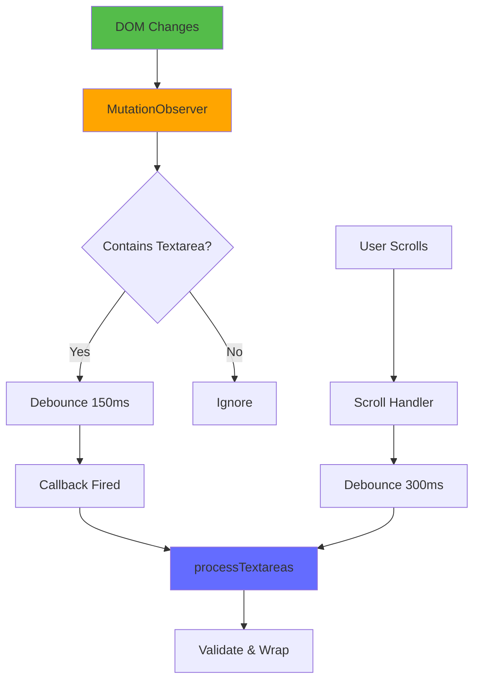
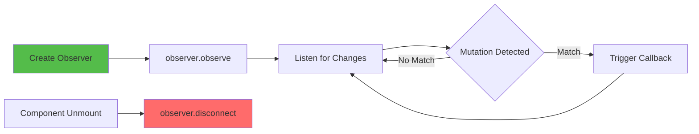

# Slide 12: Detecting Dynamic Textareas

**Branch:** `react/12-mutation-observer`

---

## 🎯 What is MutationObserver?

MutationObserver is a browser API that watches for changes in the DOM tree, essential for detecting dynamically added textareas in modern Single Page Applications (SPAs) like React, Vue, or Angular.

Key points:
- 👁️ **Real-time DOM Watching** - Detects when new elements are added to the page
- ⚡ **Performance Optimized** - Debouncing and throttling prevent excessive callbacks
- 🔄 **SPA Support** - Catches textareas loaded via AJAX, lazy loading, or route changes
- 🎯 **Selective Filtering** - Only triggers when `<textarea>` elements are detected
- 🧹 **Memory Safe** - Proper cleanup prevents memory leaks

---

## 📂 Files to Explore

<details>
<summary><b>New/Modified Files</b></summary>

- 📄 [hooks/useMutationObserver.ts](../textarea-fullscreen-react/src/content/hooks/useMutationObserver.ts) ⭐ **NEW**
- 📄 [hooks/useTextareaDetector.ts](../textarea-fullscreen-react/src/content/hooks/useTextareaDetector.ts) - Updated
- 📄 [ContentApp.tsx](../textarea-fullscreen-react/src/entrypoints/content/ContentApp.tsx) - Updated

</details>

<details>
<summary><b>Removed Files</b></summary>

- ❌ [hooks/useObserver.js](../textarea-fullscreen-react/src/content/hooks/useObserver.js) - Replaced by useMutationObserver

</details>

<details>
<summary><b>Configuration/Supporting Files</b></summary>

- 📄 [tsconfig.json](../textarea-fullscreen-react/tsconfig.json)

</details>

---

## ✅ What's New in This Slide

- ✅ Created reusable `useMutationObserver` hook with TypeScript
- ✅ Implemented debouncing to prevent performance issues
- ✅ Added smart filtering to only process textarea-related mutations
- ✅ Separated concerns: generic observer vs textarea-specific logic
- ✅ Improved SPA compatibility (React, Vue, Angular apps)
- ✅ Added proper cleanup to prevent memory leaks
- ✅ Scroll-based detection for lazy-loaded content

---

**Next:** [Slide 13: Performance Monitoring](./13-performance-safeguards.md)  

---

## 📑 Deep Dive

- [How It Works](#how-it-works)
- [Implementation Steps](#implementation-steps)
- [Key Concepts](#key-concepts)
- [Code Examples](#code-examples)
- [Common Patterns](#common-patterns)
- [Documentation](#documentation)
- [Challenge](#challenge)

---

## How It Works



**Flow:**
1. Page loads, MutationObserver starts watching `document.body`
2. DOM change detected (new element added)
3. Check if it's a `<textarea>` or contains one
4. If yes → debounce → trigger callback
5. Callback runs `processTextareas()` to validate and wrap
6. Scroll events also trigger detection for lazy-loaded content

---

## Implementation Steps

### 1. Create Generic MutationObserver Hook

Create `src/content/hooks/useMutationObserver.ts`:

```typescript
import { useEffect, useRef } from 'react';

interface UseMutationObserverOptions {
  /** Debounce delay in milliseconds */
  debounce?: number;
  /** MutationObserver configuration */
  config?: MutationObserverInit;
  /** Custom filter function */
  filter?: (mutations: MutationRecord[]) => boolean;
}

export function useMutationObserver(
  callback: () => void,
  options: UseMutationObserverOptions = {}
) {
  const {
    debounce = 150,
    config = { childList: true, subtree: true },
    filter
  } = options;

  const callbackRef = useRef(callback);
  const debounceTimerRef = useRef<number | null>(null);

  // Keep callback reference fresh
  useEffect(() => {
    callbackRef.current = callback;
  }, [callback]);

  useEffect(() => {
    const debouncedCallback = () => {
      if (debounceTimerRef.current) {
        clearTimeout(debounceTimerRef.current);
      }
      
      debounceTimerRef.current = window.setTimeout(() => {
        callbackRef.current();
      }, debounce);
    };

    const observer = new MutationObserver((mutations) => {
      // Apply custom filter if provided
      const shouldTrigger = filter ? filter(mutations) : true;
      
      if (shouldTrigger) {
        debouncedCallback();
      }
    });

    observer.observe(document.body, config);

    return () => {
      observer.disconnect();
      if (debounceTimerRef.current) {
        clearTimeout(debounceTimerRef.current);
      }
    };
  }, [debounce, filter, config]);
}
```

**What this does:**
- Generic, reusable observer hook
- Automatic debouncing
- Custom filter support
- Proper cleanup on unmount

---

### 2. Create Textarea-Specific Filter

Create `src/content/hooks/useTextareaObserver.ts`:

```typescript
import { useMutationObserver } from './useMutationObserver';

/**
 * Filter function that only triggers for textarea-related mutations
 */
function hasTextareaMutation(mutations: MutationRecord[]): boolean {
  // Limit mutations to check (performance optimization)
  const mutationsToCheck = mutations.slice(0, 10);
  
  for (const mutation of mutationsToCheck) {
    // Ignore mutations from our own extension
    if (mutation.target instanceof Element) {
      if (mutation.target.closest('#textarea-fullscreen-root')) {
        continue;
      }
    }

    // Check added nodes
    for (const node of Array.from(mutation.addedNodes)) {
      if (node.nodeType !== Node.ELEMENT_NODE) continue;
      
      const element = node as Element;
      
      // Direct textarea or contains textarea
      if (element.tagName === 'TEXTAREA' || element.querySelector('textarea')) {
        return true;
      }
    }
  }
  
  return false;
}

/**
 * Hook that watches for new textareas added to DOM
 */
export function useTextareaObserver(onNewTextarea: () => void) {
  useMutationObserver(onNewTextarea, {
    debounce: 150,
    filter: hasTextareaMutation,
    config: {
      childList: true,
      subtree: true,
      // Don't watch attributes or character data (performance)
      attributes: false,
      characterData: false
    }
  });
}
```

**Explanation:**
- Optimized filter only for textareas
- Ignores extension's own DOM changes
- Skips attribute/text changes (not needed)

---

### 3. Add Scroll-Based Detection

Create `src/content/hooks/useScrollDetection.ts`:

```typescript
import { useEffect, useRef } from 'react';

interface UseScrollDetectionOptions {
  /** Debounce delay in milliseconds */
  debounce?: number;
  /** Callback when scroll ends */
  onScrollEnd: () => void;
}

export function useScrollDetection({
  debounce = 300,
  onScrollEnd
}: UseScrollDetectionOptions) {
  const scrollTimerRef = useRef<number | null>(null);
  const callbackRef = useRef(onScrollEnd);

  useEffect(() => {
    callbackRef.current = onScrollEnd;
  }, [onScrollEnd]);

  useEffect(() => {
    const handleScroll = () => {
      if (scrollTimerRef.current) {
        clearTimeout(scrollTimerRef.current);
      }

      scrollTimerRef.current = window.setTimeout(() => {
        // Clean up orphaned markers
        const orphaned = document.querySelectorAll(
          'textarea[data-tx-fullscreen-processed="true"]'
        );
        
        orphaned.forEach(textarea => {
          if (!textarea.closest('[data-tx-wrapper]')) {
            textarea.removeAttribute('data-tx-fullscreen-processed');
          }
        });

        callbackRef.current();
      }, debounce);
    };

    window.addEventListener('scroll', handleScroll, { passive: true });

    return () => {
      window.removeEventListener('scroll', handleScroll);
      if (scrollTimerRef.current) {
        clearTimeout(scrollTimerRef.current);
      }
    };
  }, [debounce]);
}
```

**Why scroll detection?**
- Lazy-loaded content (infinite scroll)
- Hidden textareas that become visible
- Virtual scrolling lists

---

### 4. Update TextareaDetector Hook

Update `src/content/hooks/useTextareaDetector.ts`:

```typescript
import { useState, useCallback, useEffect } from 'react';
import { useTextareaObserver } from './useTextareaObserver';
import { useScrollDetection } from './useScrollDetection';

export function useTextareaDetector() {
  const [textareas, setTextareas] = useState<HTMLTextAreaElement[]>([]);

  const isTextareaValid = useCallback((textarea: HTMLTextAreaElement): boolean => {
    // Check visibility
    const style = window.getComputedStyle(textarea);
    if (
      style.display === 'none' || 
      style.visibility === 'hidden' || 
      parseFloat(style.opacity) === 0
    ) {
      return false;
    }

    // Check size
    const rect = textarea.getBoundingClientRect();
    if (rect.width < 50 || rect.height < 15) {
      return false;
    }

    // Check readonly/disabled
    if (textarea.hasAttribute('readonly') || textarea.hasAttribute('disabled')) {
      return false;
    }

    // Check parent visibility
    let parent = textarea.parentElement;
    while (parent && parent !== document.body) {
      const parentStyle = window.getComputedStyle(parent);
      if (parentStyle.display === 'none' || parentStyle.visibility === 'hidden') {
        return false;
      }
      parent = parent.parentElement;
    }

    return true;
  }, []);

  const processTextareas = useCallback(() => {
    const unprocessed = document.querySelectorAll<HTMLTextAreaElement>(
      'textarea:not([data-tx-fullscreen-processed="true"])'
    );

    const validTextareas: HTMLTextAreaElement[] = [];

    for (const textarea of Array.from(unprocessed)) {
      // Mark as processed
      textarea.setAttribute('data-tx-fullscreen-processed', 'true');

      if (isTextareaValid(textarea)) {
        validTextareas.push(textarea);
      }

      // Limit batch size for performance
      if (validTextareas.length >= 10) {
        break;
      }
    }

    if (validTextareas.length > 0) {
      setTextareas(prev => {
        const existing = new Set(prev);
        const combined = [...prev];
        
        for (const ta of validTextareas) {
          if (!existing.has(ta)) {
            combined.push(ta);
          }
        }
        
        return combined;
      });
    }
  }, [isTextareaValid]);

  // Initial detection on mount
  useEffect(() => {
    processTextareas();
  }, [processTextareas]);

  // Watch for new textareas via MutationObserver
  useTextareaObserver(processTextareas);

  // Watch for scroll events (lazy loading)
  useScrollDetection({ onScrollEnd: processTextareas });

  return { textareas, processTextareas };
}
```

---

### 5. Update ContentApp

Update `src/entrypoints/content/ContentApp.tsx`:

```typescript
import { useEffect, useState } from 'react';
import { useSettings } from '@/hooks/useSettings';
import { useTextareaDetector } from './hooks/useTextareaDetector';
import { TextareaWrapper } from './components/TextareaWrapper';

export default function ContentApp() {
  const { settings, loading } = useSettings();
  const { textareas } = useTextareaDetector();
  const [initialized, setInitialized] = useState(false);

  useEffect(() => {
    if (loading) return;

    if (!settings.enabled) {
      console.log('[TextareaFullscreen] Extension disabled');
      return;
    }

    // Small delay for page stability
    const timer = setTimeout(() => {
      setInitialized(true);
    }, 1000);

    return () => clearTimeout(timer);
  }, [loading, settings.enabled]);

  if (loading || !initialized) {
    return null;
  }

  return (
    <>
      {textareas.map((textarea, index) => (
        <TextareaWrapper
          key={`textarea-${index}`}
          textarea={textarea}
        />
      ))}
    </>
  );
}
```

---

## Key Concepts

### Concept 1: MutationObserver Lifecycle



**Lifecycle stages:**
1. **Creation** - `new MutationObserver(callback)`
2. **Start Watching** - `observer.observe(target, config)`
3. **Receive Mutations** - Callback fires when DOM changes
4. **Cleanup** - `observer.disconnect()` on unmount

**Critical:** Always disconnect to prevent memory leaks!

---

### Concept 2: Debouncing vs Throttling

**Debouncing** (what we use):
```typescript
// Wait for quiet period before executing
let timer;
function debounce(fn, delay) {
  clearTimeout(timer);
  timer = setTimeout(fn, delay);
}
```

**When to use:**
- User stops typing
- DOM changes settle
- Scroll ends

**Throttling** (alternative):
```typescript
// Execute at most once per time period
let lastRun = 0;
function throttle(fn, delay) {
  const now = Date.now();
  if (now - lastRun >= delay) {
    fn();
    lastRun = now;
  }
}
```

**When to use:**
- Continuous events (mousemove)
- Regular updates needed
- Rate limiting API calls

**For our use case:** Debouncing is better because we want to wait until DOM changes stop.

---

### Concept 3: Performance Optimization

**Problem:** MutationObserver can fire hundreds of times per second on complex pages.

**Solutions:**

| Technique | Implementation | Performance Gain |
|-----------|----------------|------------------|
| **Debouncing** | `setTimeout` with cancel | 80-90% reduction |
| **Limit Mutations** | `mutations.slice(0, 10)` | 50% faster processing |
| **Early Exit** | Skip non-textarea changes | 95% filtered out |
| **Batch Processing** | Process max 10 textareas | Prevents freezing |
| **Passive Listeners** | `{ passive: true }` | Better scrolling |

```typescript
// Example: Combined optimizations
const observer = new MutationObserver((mutations) => {
  // 1. Limit mutations checked
  const limited = mutations.slice(0, 10);
  
  // 2. Early exit if no textareas
  const hasTextarea = limited.some(m => 
    Array.from(m.addedNodes).some(n => 
      n.nodeName === 'TEXTAREA'
    )
  );
  
  if (!hasTextarea) return; // Skip 95% of mutations
  
  // 3. Debounce callback
  debouncedProcess();
});
```

---

## Code Examples

### Example 1: Basic MutationObserver

```typescript
import { useEffect } from 'react';

function BasicObserver() {
  useEffect(() => {
    // Create observer
    const observer = new MutationObserver((mutations) => {
      console.log('DOM changed!', mutations.length, 'mutations');
    });

    // Start observing
    observer.observe(document.body, {
      childList: true,    // Watch for added/removed children
      subtree: true,      // Watch entire subtree
      attributes: false,  // Don't watch attribute changes
      characterData: false // Don't watch text changes
    });

    // Cleanup
    return () => observer.disconnect();
  }, []);

  return null;
}
```

**What this does:**
- Logs every DOM change
- Watches entire document
- No debouncing (will spam console!)

---

### Example 2: Advanced Filtering

```typescript
function AdvancedFilter() {
  useEffect(() => {
    const observer = new MutationObserver((mutations) => {
      for (const mutation of mutations) {
        // Only process addedNodes
        if (mutation.addedNodes.length === 0) continue;

        for (const node of Array.from(mutation.addedNodes)) {
          // Skip text nodes
          if (node.nodeType !== Node.ELEMENT_NODE) continue;

          const el = node as Element;

          // Check for specific attributes
          if (el.hasAttribute('data-interactive')) {
            console.log('Found interactive element:', el);
          }

          // Check for class
          if (el.classList.contains('dynamic-form')) {
            console.log('Found dynamic form:', el);
          }

          // Deep search
          const inputs = el.querySelectorAll('input[type="text"]');
          if (inputs.length > 0) {
            console.log('Found', inputs.length, 'text inputs');
          }
        }
      }
    });

    observer.observe(document.body, {
      childList: true,
      subtree: true
    });

    return () => observer.disconnect();
  }, []);

  return null;
}
```

---

### Example 3: Debounced Observer with useRef

```typescript
import { useEffect, useRef } from 'react';

function DebouncedObserver({ onNewElement }: { onNewElement: () => void }) {
  const timerRef = useRef<number | null>(null);
  const callbackRef = useRef(onNewElement);

  // Keep callback fresh
  useEffect(() => {
    callbackRef.current = onNewElement;
  }, [onNewElement]);

  useEffect(() => {
    const observer = new MutationObserver(() => {
      // Clear existing timer
      if (timerRef.current) {
        clearTimeout(timerRef.current);
      }

      // Set new timer
      timerRef.current = window.setTimeout(() => {
        callbackRef.current();
      }, 200);
    });

    observer.observe(document.body, {
      childList: true,
      subtree: true
    });

    return () => {
      observer.disconnect();
      if (timerRef.current) {
        clearTimeout(timerRef.current);
      }
    };
  }, []); // Empty deps - only setup once

  return null;
}
```

**Why useRef for callback?**
- Avoids stale closures
- Prevents re-creating observer
- Better performance

---

### Example 4: Observing Specific Container

```typescript
function ObserveContainer() {
  const containerRef = useRef<HTMLDivElement>(null);

  useEffect(() => {
    if (!containerRef.current) return;

    const observer = new MutationObserver((mutations) => {
      console.log('Container changed:', mutations);
    });

    // Observe specific element instead of document.body
    observer.observe(containerRef.current, {
      childList: true,
      subtree: true
    });

    return () => observer.disconnect();
  }, []);

  return (
    <div ref={containerRef}>
      {/* Only watch this container */}
    </div>
  );
}
```

---

## Common Patterns

<details>
<summary><b>Pattern 1: Generic Reusable Observer</b></summary>

```typescript
import { useEffect, useRef } from 'react';

type MutationCallback = (mutations: MutationRecord[]) => void;

export function useGenericObserver(
  target: Element | null,
  callback: MutationCallback,
  config: MutationObserverInit = { childList: true, subtree: true }
) {
  const callbackRef = useRef(callback);

  useEffect(() => {
    callbackRef.current = callback;
  }, [callback]);

  useEffect(() => {
    if (!target) return;

    const observer = new MutationObserver((mutations) => {
      callbackRef.current(mutations);
    });

    observer.observe(target, config);
    return () => observer.disconnect();
  }, [target, config]);
}

// Usage
function MyComponent() {
  const divRef = useRef<HTMLDivElement>(null);

  useGenericObserver(
    divRef.current,
    (mutations) => {
      console.log('Div changed:', mutations.length);
    },
    { childList: true }
  );

  return <div ref={divRef} />;
}
```

**When to use:**
- Multiple observers in same app
- Different target elements
- Reusable across projects

</details>

<details>
<summary><b>Pattern 2: Intersection + Mutation Observer</b></summary>

```typescript
// Combine observers for lazy-loaded content
function useLazyContentDetector(onNewContent: () => void) {
  // Watch for DOM changes
  useMutationObserver(onNewContent, { debounce: 150 });

  // Watch for elements entering viewport
  useEffect(() => {
    const observer = new IntersectionObserver((entries) => {
      const visibleEntries = entries.filter(e => e.isIntersecting);
      if (visibleEntries.length > 0) {
        onNewContent();
      }
    });

    // Observe lazy-load containers
    const containers = document.querySelectorAll('[data-lazy-container]');
    containers.forEach(c => observer.observe(c));

    return () => observer.disconnect();
  }, [onNewContent]);
}
```

**When to use:**
- Infinite scroll pages
- Virtual lists
- Image galleries with lazy loading

</details>

<details>
<summary><b>Pattern 3: Conditional Observer</b></summary>

```typescript
function useConditionalObserver(
  enabled: boolean,
  callback: () => void
) {
  useEffect(() => {
    if (!enabled) return;

    const observer = new MutationObserver(callback);
    observer.observe(document.body, {
      childList: true,
      subtree: true
    });

    return () => observer.disconnect();
  }, [enabled, callback]);
}

// Usage
function App() {
  const { settings } = useSettings();

  useConditionalObserver(
    settings.watchDynamicContent,
    processNewElements
  );
}
```

**When to use:**
- User toggles feature
- Different behavior per page
- Performance optimization

</details>

---

## Documentation

<details>
<summary><b>Related Resources</b></summary>

- 📚 [MutationObserver API](https://developer.mozilla.org/en-US/docs/Web/API/MutationObserver)
- 📚 [Performance Best Practices](https://developer.mozilla.org/en-US/docs/Web/API/MutationObserver#performance_considerations)
- 🎓 [Debouncing vs Throttling](https://css-tricks.com/debouncing-throttling-explained-examples/)
- 💡 [React + MutationObserver](https://www.joshwcomeau.com/react/the-perils-of-rehydration/#abstractions)
- 🔧 [Chrome DevTools Performance](https://developer.chrome.com/docs/devtools/performance/)

</details>

<details>
<summary><b>MutationObserver Configuration Options</b></summary>

| Option | Type | Description |
|--------|------|-------------|
| `childList` | boolean | Watch for added/removed children |
| `subtree` | boolean | Watch entire subtree |
| `attributes` | boolean | Watch attribute changes |
| `attributeOldValue` | boolean | Record previous attribute values |
| `characterData` | boolean | Watch text content changes |
| `attributeFilter` | string[] | Only watch specific attributes |

**Our config:**
```typescript
{
  childList: true,      // ✅ Need this for new textareas
  subtree: true,        // ✅ Watch entire page
  attributes: false,    // ❌ Don't need attribute changes
  characterData: false  // ❌ Don't need text changes
}
```

</details>

---

## Challenge

**Try this yourself:**

1. **Add attribute watching:**
   - Watch for `contenteditable` divs (not just textareas)
   - Detect when `readonly` attribute is removed
   - Handle `display: none` → `display: block` transitions

2. **Implement performance monitoring:**
   - Count observer callbacks per second
   - Log if > 10 callbacks/second
   - Automatically disable on problematic pages

3. **Create a debug panel:**
   - Show mutation count
   - Display last 10 mutations
   - Toggle observer on/off

**Expected result:**
- Catches all textarea additions
- No performance lag on heavy pages
- Debug info visible in console

**Bonus:**
- Add ResizeObserver for textarea size changes
- Implement "pause detection" when user is idle
- Create visualization of DOM changes

---

**Next:** [Slide 13: Performance Monitoring](./13-performance-safeguards.md)  
