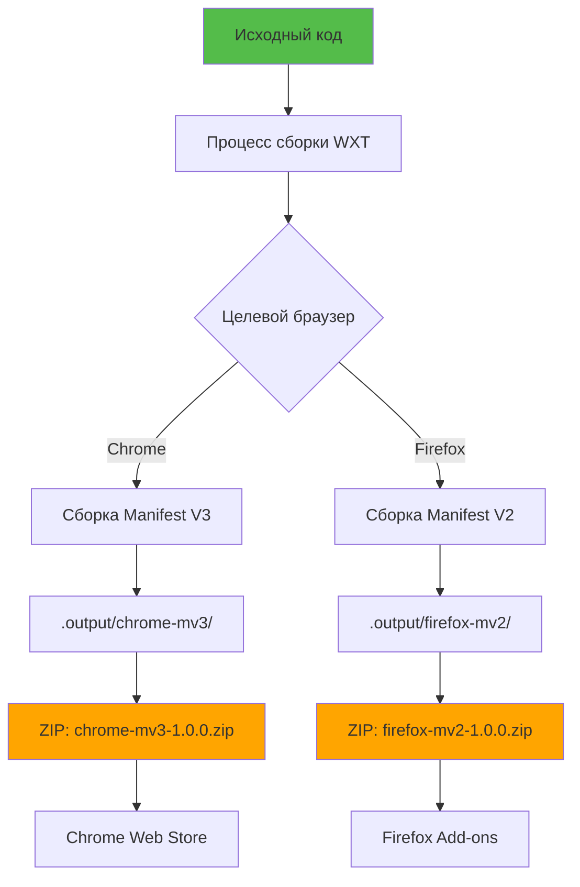
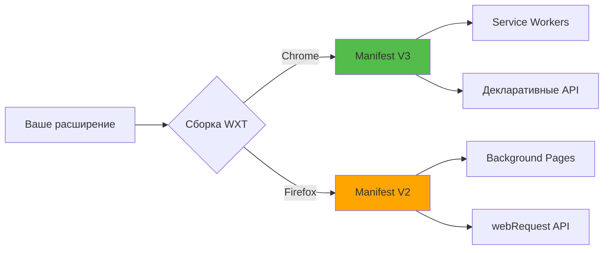

# Слайд 15: Сборка и публикация

**Ветка:** `react/15-build-and-package`

---

## 🎯 Что такое сборка и упаковка?

Сборка и упаковка подготавливает ваше расширение для распространения в Chrome Web Store, Firefox Add-ons или других магазинах расширений браузеров путем компиляции, оптимизации и объединения всего кода и ресурсов в готовые к загрузке ZIP-файлы.

Ключевые моменты:
- 📦 **Production-сборка** - Минифицированный, оптимизированный код для лучшей производительности
- 🌐 **Поддержка нескольких браузеров** - WXT автоматически генерирует сборки для Chrome (MV3) и Firefox (MV2)
- 🗜️ **ZIP-упаковка** - Готовые к загрузке файлы для магазинов расширений
- ✅ **Проверка перед отправкой** - Проверяет манифест, иконки и требования
- 🔄 **Управление версиями** - Семантическое версионирование и автоматические обновления
- ⚙️ **GitHub Actions** - Автоматизированный CI/CD для сборок и релизов

---

## 📂 Файлы для изучения

<details>
<summary><b>Новые/Измененные файлы</b></summary>

- 📄 [wxt.config.ts](../textarea-fullscreen-react/wxt.config.ts) ⭐ **НОВЫЙ** - Основная конфигурация
- 📄 [package.json](../textarea-fullscreen-react/package.json) - Обновлен со скриптами сборки
- 📄 [README.md](../textarea-fullscreen-react/README.md) ⭐ **НОВЫЙ** - Документация
- 📄 [CHANGELOG.md](../textarea-fullscreen-react/CHANGELOG.md) ⭐ **НОВЫЙ** - История версий
- 📄 [.github/workflows/build.yml](../textarea-fullscreen-react/.github/workflows/build.yml) ⭐ **НОВЫЙ** - CI/CD пайплайн
- 📄 [.github/workflows/release.yml](../textarea-fullscreen-react/.github/workflows/release.yml) ⭐ **НОВЫЙ** - Автоматизация релизов

</details>

<details>
<summary><b>Конфигурационные/Вспомогательные файлы</b></summary>

- 📄 [.gitignore](../textarea-fullscreen-react/.gitignore) - Добавлены выходные файлы сборки
- 📄 [tsconfig.json](../textarea-fullscreen-react/tsconfig.json)
- 📄 [public/icon/README.md](../textarea-fullscreen-react/public/icon/README.md) ⭐ **НОВЫЙ** - Руководство по иконкам

</details>

---

## ✅ Что нового в этом слайде

- ✅ Создана полная конфигурация WXT с деталями манифеста
- ✅ Добавлены скрипты сборки для разработки и production
- ✅ Настроена сборка для нескольких браузеров (Chrome MV3 + Firefox MV2)
- ✅ Настроена ZIP-упаковка для отправки в магазины
- ✅ Добавлено управление версиями и метаданные
- ✅ **GitHub Actions для автоматических сборок**
- ✅ **GitHub Actions для автоматических релизов**
- ✅ Исправлена устаревшая опция `runner` → конфигурация `dev`
- ✅ Исправлено поле `author` → объект `developer`
- ✅ Настроена правильная структура проекта (файлы на корневом уровне)

---

## 📑 Подробное изучение

- [Как это работает](#как-это-работает)
- [Шаги реализации](#шаги-реализации)
- [Ключевые концепции](#ключевые-концепции)
- [Примеры кода](#примеры-кода)
- [Общие паттерны](#общие-паттерны)
- [Документация](#документация)
- [Задание](#задание)

---

## Как это работает



**Процесс:**
1. Запуск `npm run build` → WXT компилирует TypeScript/JSX
2. Оптимизирует и минифицирует код
3. Генерирует специфичные для браузера манифесты (MV2 vs MV3)
4. Копирует публичные ресурсы (иконки, изображения)
5. Создает отдельные сборки в `.output/`
6. Запуск `npm run zip` → Создает ZIP-файлы
7. Загрузка ZIP в соответствующие магазины

---

## Шаги реализации

### 1. Создание конфигурации WXT (ИСПРАВЛЕНО)

Создайте `wxt.config.ts`:

```typescript
import { defineConfig } from 'wxt';

export default defineConfig({
  // Включить модуль React
  modules: ['@wxt-dev/module-react'],
  
  // Директория вывода
  outDir: '.output',
  // ⚠️ ВНИМАНИЕ: Нет srcDir, если файлы на корневом уровне (components/, entrypoints/, etc.)
  
  // Конфигурация манифеста
  manifest: {
    // Основная информация
    name: 'Textarea Fullscreen',
    version: '1.0.0',
    description: 'Разворачива��те любое текстовое поле на весь экран для лучшего редактирования. Идеально для написания писем, комментариев и длинного контента.',
    
    // ✅ ИСПРАВЛЕНО: Используйте объект developer вместо строки author
    developer: {
      name: 'Ваше имя',
      url: 'https://github.com/drunkody',
    },
    homepage_url: 'https://github.com/drunkody/textarea-fullscreen',
    
    // Иконки (соответствуют вашей структуре)
    icons: {
      16: '/icon/16.png',
      48: '/icon/48.png',
      128: '/icon/128.png'
    },
    
    // Разрешения
    permissions: ['storage'],
    
    // Действие (попап)
    action: {
      default_popup: 'popup.html',
      default_title: 'Настройки Textarea Fullscreen',
      default_icon: {
        16: '/icon/16.png',
        48: '/icon/48.png',
      },
    },
    
    // Веб-доступные ресурсы
    web_accessible_resources: [
      {
        resources: ['icon/*.svg', 'icon/*.png'],
        matches: ['<all_urls>']
      }
    ],
    
    // Команды (горячие клавиши)
    commands: {
      toggle_fullscreen: {
        suggested_key: {
          default: 'Ctrl+Shift+F',
          mac: 'Command+Shift+F',
        },
        description: 'Переключить полноэкранный редактор',
      },
    },
    
    // Специфично для Chrome: минимальная версия
    minimum_chrome_version: '88',
    
    // Специфично для Firefox: настройки браузера
    browser_specific_settings: {
      gecko: {
        id: 'textarea-fullscreen@example.com',
        strict_min_version: '109.0',
      },
    },
  },
  
  // ✅ ИСПРАВЛЕНО: Используйте конфигурацию dev вместо устаревшего runner
  dev: {
    server: {
      port: 3000,
    },
  },
  
  // Оптимизации сборки
  zip: {
    artifactTemplate: '{{name}}-{{browser}}-{{version}}.zip',
  },
});
```

**Ключевые исправления:**
- ❌ Удалено `srcDir: 'src'` (файлы на корневом уровне)
- ✅ Изменено `author: 'string'` → `developer: { name, url }`
- ✅ Изменено устаревшее `runner` → конфигурация `dev`
- ✅ Обновлены пути к иконкам на `/icon/` (не `/icons/`)

---

### 2. Обновленные скрипты Package.json

```json
{
  "name": "textarea-fullscreen",
  "version": "1.0.0",
  "private": true,
  "type": "module",
  "author": "Ваше имя",
  "license": "MIT",
  "repository": {
    "type": "git",
    "url": "https://github.com/drunkody/textarea-fullscreen.git"
  },
  "scripts": {
    "dev": "wxt",
    "dev:firefox": "wxt -b firefox",
    "build": "wxt build",
    "build:firefox": "wxt build -b firefox",
    "build:all": "npm run build && npm run build:firefox",
    "zip": "wxt zip",
    "zip:firefox": "wxt zip -b firefox",
    "zip:all": "npm run zip && npm run zip:firefox",
    "compile": "tsc --noEmit",
    "postinstall": "wxt prepare"
  }
}
```

**Объяснение скриптов:**

| Команда | Назначение |
|---------|------------|
| `npm run dev` | Режим разработки (Chrome, горячая перезагрузка) |
| `npm run dev:firefox` | Режим разработки (Firefox) |
| `npm run build` | Production-сборка (Chrome MV3) |
| `npm run build:firefox` | Production-сборка (Firefox MV2) |
| `npm run build:all` | Сборка для обоих браузеров |
| `npm run zip` | Создать Chrome ZIP |
| `npm run zip:firefox` | Создать Firefox ZIP |
| `npm run zip:all` | Создать ZIP для обоих браузеров |
| `npm run compile` | Проверка типов без сборки |

---

### 3. Сборка для Production

```bash
# Сборка для Chrome
npm run build

# Сборка для Firefox
npm run build:firefox

# Сборка для обоих
npm run build:all
```

**Что происходит:**
```
📂 .output/
   📂 chrome-mv3/              # Production-сборка для Chrome
      📂 chunks/               # Разделенные бандлы
      📄 manifest.json         # Manifest V3
      📄 content.js            # Собранный content script
      📄 popup.html
      📄 popup.js
      📂 icon/                 # Скопировано из public/
   
   📂 firefox-mv2/             # Production-сборка для Firefox
      📄 manifest.json         # Manifest V2
      📄 content.js
      📄 popup.html
      📄 popup.js
      📂 icon/
```

**Оптимизации сборки:**
- ✅ Минифицированный JavaScript
- ✅ Оптимизированный React (production mode)
- ✅ Tree-shaking (удаление неиспользуемого кода)
- ✅ Разделение кода (меньше начальная загрузка)
- ✅ Source maps (опционально, для отладки)

---

### 4. Создание дистрибутивных ZIP-файлов

```bash
# Создать Chrome ZIP
npm run zip
# Вывод: .output/textarea-fullscreen-chrome-1.0.0.zip

# Создать Firefox ZIP  
npm run zip:firefox
# Вывод: .output/textarea-fullscreen-firefox-1.0.0.zip

# Создать оба
npm run zip:all
```

---

### 5. GitHub Actions - Рабочий процесс сборки

**Файл: `.github/workflows/build.yml`**

```yaml
name: Build Extension

on:
  push:
    branches: [main, develop, 'react/**']
  pull_request:
    branches: [main, develop]

jobs:
  build:
    name: Сборка и тестирование
    runs-on: ubuntu-latest
    
    strategy:
      matrix:
        browser: [chrome, firefox]
    
    steps:
      - name: Checkout кода
        uses: actions/checkout@v4
      
      - name: Настройка Node.js
        uses: actions/setup-node@v4
        with:
          node-version: '20'
          cache: 'npm'
          cache-dependency-path: 'textarea-fullscreen-react/package-lock.json'
      
      - name: Установка зависимостей
        working-directory: textarea-fullscreen-react
        run: npm ci
      
      - name: Проверка типов
        working-directory: textarea-fullscreen-react
        run: npm run compile
      
      - name: Сборка расширения (${{ matrix.browser }})
        working-directory: textarea-fullscreen-react
        run: |
          if [ "${{ matrix.browser }}" == "firefox" ]; then
            npm run build:firefox
          else
            npm run build
          fi
      
      - name: Создание ZIP
        working-directory: textarea-fullscreen-react
        run: |
          if [ "${{ matrix.browser }}" == "firefox" ]; then
            npm run zip:firefox
          else
            npm run zip
          fi
      
      - name: Загрузка артефактов сборки
        uses: actions/upload-artifact@v4
        with:
          name: extension-${{ matrix.browser }}
          path: textarea-fullscreen-react/.output/*.zip
          retention-days: 30
```

---

### 6. GitHub Actions - Рабочий процесс релизов

**Файл: `.github/workflows/release.yml`**

```yaml
name: Release Extension

on:
  push:
    tags:
      - 'v*.*.*'

permissions:
  contents: write

jobs:
  build-and-release:
    name: Сборка и релиз
    runs-on: ubuntu-latest
    
    steps:
      - name: Checkout кода
        uses: actions/checkout@v4
      
      - name: Настройка Node.js
        uses: actions/setup-node@v4
        with:
          node-version: '20'
          cache: 'npm'
          cache-dependency-path: 'textarea-fullscreen-react/package-lock.json'
      
      - name: Установка зависимостей
        working-directory: textarea-fullscreen-react
        run: npm ci
      
      - name: Извлечение версии из тега
        id: version
        run: echo "VERSION=${GITHUB_REF#refs/tags/v}" >> $GITHUB_OUTPUT
      
      - name: Обновление версии в файлах
        working-directory: textarea-fullscreen-react
        run: |
          npm version ${{ steps.version.outputs.VERSION }} --no-git-tag-version
          sed -i "s/version: '[^']*'/version: '${{ steps.version.outputs.VERSION }}'/" wxt.config.ts
      
      - name: Сборка расширения для Chrome
        working-directory: textarea-fullscreen-react
        run: |
          npm run build
          npm run zip
      
      - name: Сборка расширения для Firefox
        working-directory: textarea-fullscreen-react
        run: |
          npm run build:firefox
          npm run zip:firefox
      
      - name: Создание GitHub Release
        uses: softprops/action-gh-release@v1
        with:
          files: |
            textarea-fullscreen-react/.output/*.zip
          draft: false
          prerelease: false
          generate_release_notes: true
        env:
          GITHUB_TOKEN: ${{ secrets.GITHUB_TOKEN }}
```

---

## Ключевые концепции

### Концепция 1: Manifest V2 vs V3



**Ключевые различия:**

| Функция | Manifest V2 (Firefox) | Manifest V3 (Chrome) |
|---------|----------------------|---------------------|
| **Background** | Постоянная страница | Service worker |
| **Host permissions** | Массив `permissions` | `host_permissions` |
| **webRequest** | Полная блокировка | Только декларативно |
| **CSP** | Одна строка | Объект с политиками |
| **Action** | `browser_action` | `action` |

**WXT обрабатывает это автоматически!** Пишите один раз, собирайте для обоих.

---

### Концепция 2: Оптимизация сборки

**Development-сборка:**
```javascript
// content.js - ~500KB без минификации
import React from 'react';
import ReactDOM from 'react-dom/client';

function MyComponent() {
  console.log('Debug info');
  return <div>Hello</div>;
}
```

**Production-сборка:**
```javascript
// content.js - ~150KB минифицированный
const e=React.createElement;function t(){return e("div",null,"Hello")}
```

**Применяемые оптимизации:**

| Техника | Уменьшение размера | Улучшение скорости |
|---------|-------------------|-------------------|
| **Минификация** | 60-70% | Быстрый парсинг |
| **Tree shaking** | 20-40% | Меньше кода для загрузки |
| **Разделение кода** | N/A | Быстрая начальная загрузка |
| **Production React** | 30% | Нет dev-предупреждений |

---

## Документация

<details>
<summary><b>Связанные ресурсы</b></summary>

- 📚 [Документация сборки WXT](https://wxt.dev/guide/essentials/building.html)
- 📚 [Публикация в Chrome Web Store](https://developer.chrome.com/docs/webstore/publish/)
- 📚 [Отправка в Firefox Add-ons](https://extensionworkshop.com/documentation/publish/submitting-an-add-on/)
- 🎓 [Миграция на Manifest V3](https://developer.chrome.com/docs/extensions/migrating/)
- 💡 [Лучшие практики публикации расширений](https://developer.chrome.com/docs/webstore/best_practices/)
- 🔧 [Семантическое версионирование](https://semver.org/)

</details>

<details>
<summary><b>Требования магазинов</b></summary>

**Chrome Web Store:**
- Требуется Manifest V3
- Иконки: 16x16, 48x48, 128x128 (PNG)
- Скриншоты: 1280x800 или 640x400
- Политика конфиденциальности (если собираются данные)
- Разовая плата $5 за разработчика

**Firefox Add-ons:**
- Manifest V2 или V3
- Иконки: 48x48, 96x96 (PNG)
- Скриншоты: Любой размер
- Может потребоваться исходный код
- Бесплатная отправка

</details>

---

## Задание

**Попробуйте сами:**

1. **Настройте GitHub Actions:**
   ```bash
   # Создайте директории
   mkdir -p .github/workflows
   
   # Добавьте build.yml и release.yml из примеров выше
   
   # Закоммитьте и отправьте
   git add .github/
   git commit -m "feat: добавить CI/CD пайплайны"
   git push
   ```

2. **Создайте релиз:**
   ```bash
   # Создайте тег версии
   git tag v1.0.0
   
   # Отправьте тег (запустит рабочий процесс релиза)
   git push origin v1.0.0
   
   # Проверьте: https://github.com/drunkody/textarea-fullscreen-extension/actions
   ```

3. **Ожидаемый результат:**
   - ✅ Сборки запускаются автоматически при push
   - ✅ Тесты проходят (проверка типов)
   - ✅ ZIP-файлы созданы
   - ✅ GitHub release создан с артефактами

**Бонус:**
- Настройте автоматическую публикацию в магазины
- Канал бета-тестирования
- Интеграция аналитики

---

**Далее:** [Слайд 16: Развертывание и распространение](./16-contribute.md)