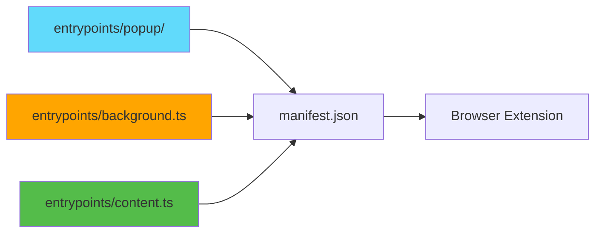

# Slide 1: Init WXT React Starter

**Branch:** `react/01-init-wxt-react-starter`

---

## 🎯 What is WXT?

WXT (Web Extension Tools) is a next-generation framework for building cross-browser extensions with modern tooling. It provides zero-config setup, automatic manifest generation, and lightning-fast Hot Module Reload powered by Vite.

Key points (3-5 bullet points):
- ⚡ **Vite-Powered Development** - Instant HMR and sub-second builds
- 🎨 **React + TypeScript** - Modern development with full type safety
- 📦 **Auto-Manifest Generation** - No manual manifest.json editing
- 🔄 **Multi-Browser Support** - Single codebase for Chrome, Firefox, Safari
- 🛠️ **Entrypoint Convention** - File-based routing for extension pages

---

## 📂 Files to Explore

<details>
<summary><b>New/Modified Files</b></summary>

- 📄 [entrypoints/popup/App.tsx](../textarea-fullscreen-react/entrypoints/popup/App.tsx)
- 📄 [entrypoints/popup/main.tsx](../textarea-fullscreen-react/entrypoints/popup/main.tsx)
- 📄 [entrypoints/popup/index.html](../textarea-fullscreen-react/entrypoints/popup/index.html)
- 📄 [entrypoints/background.ts](../textarea-fullscreen-react/entrypoints/background.ts)
- 📄 [entrypoints/content.ts](../textarea-fullscreen-react/entrypoints/content.ts)

</details>

<details>
<summary><b>Configuration/Supporting Files</b></summary>

- 📄 [wxt.config.ts](../textarea-fullscreen-react/wxt.config.ts)
- 📄 [package.json](../textarea-fullscreen-react/package.json)
- 📄 [tsconfig.json](../textarea-fullscreen-react/tsconfig.json)
- 📄 [.gitignore](../textarea-fullscreen-react/.gitignore)

</details>

---

## ✅ What's New in This Slide

- ✅ Initialized WXT project with React template
- ✅ Configured TypeScript with strict mode
- ✅ Set up popup entrypoint with React counter demo
- ✅ Created background service worker
- ✅ Added content script example
- ✅ Enabled Hot Module Reload (HMR) for instant development

---

**Next:** [Slide 2: Mounting React in Content Script](./02-react-content-script.md)

---

## 📑 Deep Dive

- [How It Works](#how-it-works)
- [Implementation Steps](#implementation-steps)
- [Key Concepts](#key-concepts)
- [Code Examples](#code-examples)
- [Common Patterns](#common-patterns)
- [Documentation](#documentation)
- [Challenge](#challenge)

---

## How It Works

```mermaid
graph TB
    A[📁 entrypoints/] --> B[WXT Framework]
    C[📄 wxt.config.ts] --> B
    B --> D[Vite Bundler]
    D --> E[Build Process]
    E --> F[manifest.json]
    E --> G[Bundled JS/CSS]
    E --> H[.output/chrome-mv3/]
    H --> I[Load in Browser]
    
    style B fill:#54bc4a
    style H fill:#ffa500
```



**How WXT transforms your code:**

1. **Scans entrypoints/** - Discovers popup, background, content scripts
2. **Bundles with Vite** - Lightning-fast builds with HMR
3. **Generates manifest.json** - Automatically from entrypoints
4. **Outputs build** - Browser-ready extension in `.output/`
5. **Watches changes** - Auto-rebuilds on file save

---

## Implementation Steps

### 1. Create New WXT Project
```bash
# Using npm
npm create wxt@latest

# Follow prompts:
# ✔ Project name: textarea-fullscreen
# ✔ Choose template: react
# ✔ Package manager: npm
```

**What happens:**
- Creates project structure with entrypoints
- Installs dependencies (React, WXT, TypeScript)
- Generates initial configuration files
- Sets up Git repository

---

### 2. Explore Project Structure
```bash
cd textarea-fullscreen
tree -L 2
```

**Generated structure:**
```
textarea-fullscreen/
├── entrypoints/           # Extension entry points
│   ├── popup/            # Popup UI (React)
│   ├── background.ts     # Background service worker
│   └── content.ts        # Content script
├── public/               # Static assets
├── .output/              # Build output (generated)
├── wxt.config.ts         # WXT configuration
├── package.json          # Dependencies
└── tsconfig.json         # TypeScript config
```

**Explanation:**
- `entrypoints/` - Convention-based routing for extension pages
- `.output/` - Build artifacts (git-ignored)
- `wxt.config.ts` - Main configuration (similar to vite.config)

---

### 3. Install Dependencies
```bash
npm install
```

**What gets installed:**
```json
{
  "dependencies": {
    "react": "^19.1.1",
    "react-dom": "^19.1.1"
  },
  "devDependencies": {
    "wxt": "^0.19.0",
    "@wxt-dev/module-react": "^1.1.0",
    "typescript": "^5.7.3",
    "@types/react": "^19.1.16"
  }
}
```

---

### 4. Start Development Server
```bash
npm run dev
```

**Terminal output:**
```
🌐 WXT 0.19.0
🔨 Building chrome-mv3 for development...

entrypoints/popup/main.tsx      1.2 kB
entrypoints/background.ts       0.5 kB
entrypoints/content.ts          0.3 kB

✓ Built in 847ms
📦 .output/chrome-mv3/

👀 Watching for changes...
```

**What happens:**
- Vite starts development server
- Bundles all entrypoints
- Generates manifest.json
- Watches files for changes
- Enables Hot Module Reload

---

### 5. Load Extension in Browser

**Chrome/Edge:**
1. Open `chrome://extensions/`
2. Enable "Developer mode" (top-right toggle)
3. Click "Load unpacked"
4. Select `.output/chrome-mv3` directory
5. Extension appears in toolbar ✅

**Firefox:**
```bash
npm run dev:firefox
```
Firefox opens automatically with extension loaded!

---

### 6. Test the Extension

**Instructions:**
1. Click extension icon in toolbar
2. Popup opens with React counter app
3. Click "count is 0" button → increments to 1
4. Open DevTools (F12) → See background script log
5. Visit Google.com → Content script runs

---

## Key Concepts

### Concept 1: Entrypoints Convention



**Explanation:**
- **File-based routing** - Each file/folder in `entrypoints/` becomes part of your extension
- **Auto-discovery** - WXT scans directory and generates manifest automatically
- **No manual config** - Don't edit manifest.json directly, WXT generates it

**Mapping:**
| Entrypoint | Becomes | Purpose |
|------------|---------|---------|
| `popup/` | Browser action popup | UI when clicking icon |
| `background.ts` | Service worker | Background processing |
| `content.ts` | Content script | Runs on web pages |

---

### Concept 2: Hot Module Reload (HMR)

**Traditional extension development:**
```
Edit code → Reload extension → Close popup → Reopen popup → Test
(5 steps, ~10 seconds)
```

**With WXT + HMR:**
```
Edit code → See changes instantly
(1 step, ~100ms)
```

**How it works:**
1. Vite detects file change
2. Rebuilds only changed module (fast!)
3. Sends update to browser
4. React Fast Refresh updates UI
5. State preserved (counter doesn't reset!)

---

### Concept 3: TypeScript First

**Key points:**
- Full type safety out of the box
- IntelliSense for browser APIs
- Catch errors before runtime
- Better developer experience

**Example:**
```typescript
// TypeScript knows what browser.tabs is!
browser.tabs.query({ active: true })
//      ^? browser.tabs: Tabs
```

---

## Code Examples

### Example 1: Popup Component (React)

```typescript
// entrypoints/popup/App.tsx
import { useState } from 'react';
import reactLogo from '@/assets/react.svg';
import wxtLogo from '/wxt.svg';
import './App.css';

function App() {
  const [count, setCount] = useState(0);

  return (
    <>
      <div>
        <a href="https://wxt.dev" target="_blank">
          
        </a>
        <a href="https://react.dev" target="_blank">
          
        </a>
      </div>
      <h1>WXT + React</h1>
      <div className="card">
        <button onClick={() => setCount((count) => count + 1)}>
          count is {count}
        </button>
      </div>
    </>
  );
}

export default App;
```

**What this does:**
- Standard React component with hooks
- Uses Vite's asset imports (`@/assets/`, `/public`)
- CSS modules supported
- Hot reload works out of the box

---

### Example 2: Background Script

```typescript
// entrypoints/background.ts
export default defineBackground(() => {
  console.log('Hello background!', { id: browser.runtime.id });
});
```

**What this does:**
- `defineBackground()` - WXT helper for background scripts
- Runs when extension loads
- Access to all browser APIs
- Logs extension ID to console

---

### Example 3: Content Script

```typescript
// entrypoints/content.ts
export default defineContentScript({
  matches: ['*://*.google.com/*'],
  main() {
    console.log('Hello content script!', { id: browser.runtime.id });
  },
});
```

**What this does:**
- `defineContentScript()` - WXT helper with config
- `matches` - Run only on Google.com
- `main()` - Entry point function
- Injected into matching pages

---

### Example 4: WXT Configuration

```typescript
// wxt.config.ts
import { defineConfig } from 'wxt';

export default defineConfig({
  modules: ['@wxt-dev/module-react'],
  manifest: {
    name: 'Textarea Fullscreen',
    description: 'Make any textarea fullscreen',
    permissions: ['storage'],
  }
});
```

**What this does:**
- Enables React module (JSX transform, Fast Refresh)
- Configures manifest metadata
- Sets permissions
- WXT merges with auto-generated manifest

---

## Common Patterns

<details>
<summary><b>Pattern 1: Multiple Entrypoints</b></summary>

```
entrypoints/
├── popup/          # Main popup
├── options/        # Settings page
├── background.ts   # Service worker
├── content.ts      # Content script
└── content.css     # Content script styles
```

**When to use:**
- Options page for complex settings
- Multiple content scripts for different sites
- Separate CSS for content scripts

</details>

<details>
<summary><b>Pattern 2: Shared Components</b></summary>

```typescript
// components/Button.tsx
export function Button({ children, onClick }) {
  return <button onClick={onClick}>{children}</button>;
}

// entrypoints/popup/App.tsx
import { Button } from '@/components/Button';

function App() {
  return <Button onClick={() => alert('Hi!')}>Click me</Button>;
}
```

**When to use:**
- Reusable UI components
- Shared utilities
- Common hooks

</details>

<details>
<summary><b>Pattern 3: Asset Imports</b></summary>

```typescript
// Import from public/ folder
import logo from '/logo.png';

// Import from src/assets/
import icon from '@/assets/icon.svg';

// Use in JSX

```

**When to use:**
- Images, fonts, SVGs
- Static assets
- Icons

</details>

---

## Documentation

<details>
<summary><b>Related Resources</b></summary>

- 📚 [WXT Documentation](https://wxt.dev)
- 📚 [WXT Getting Started](https://wxt.dev/guide/)
- 🎓 [Chrome Extensions Guide](https://developer.chrome.com/docs/extensions)
- 💡 [React Documentation](https://react.dev)
- 🔧 [Vite Documentation](https://vitejs.dev)

</details>

---

## Challenge

**Try this yourself:**

1. **Customize the popup:**
   - Change button text to "🚀 Clicks: {count}"
   - Add a reset button
   - See HMR update instantly

2. **Add a new entrypoint:**
   - Create `entrypoints/options/index.html`
   - Create `entrypoints/options/App.tsx`
   - Build and open options page

3. **Modify content script:**
   - Change matches to `['<all_urls>']`
   - Log the current page URL
   - Test on different websites

**Expected result:**
- Popup updates without reload
- New options page appears in extensions
- Content script runs on all sites

**Bonus:**
- Add CSS styling to popup
- Create a shared component
- Use browser.storage API to persist count

---

**Next:** [Slide 2: Mounting React in Content Script](./02-react-content-script.md)