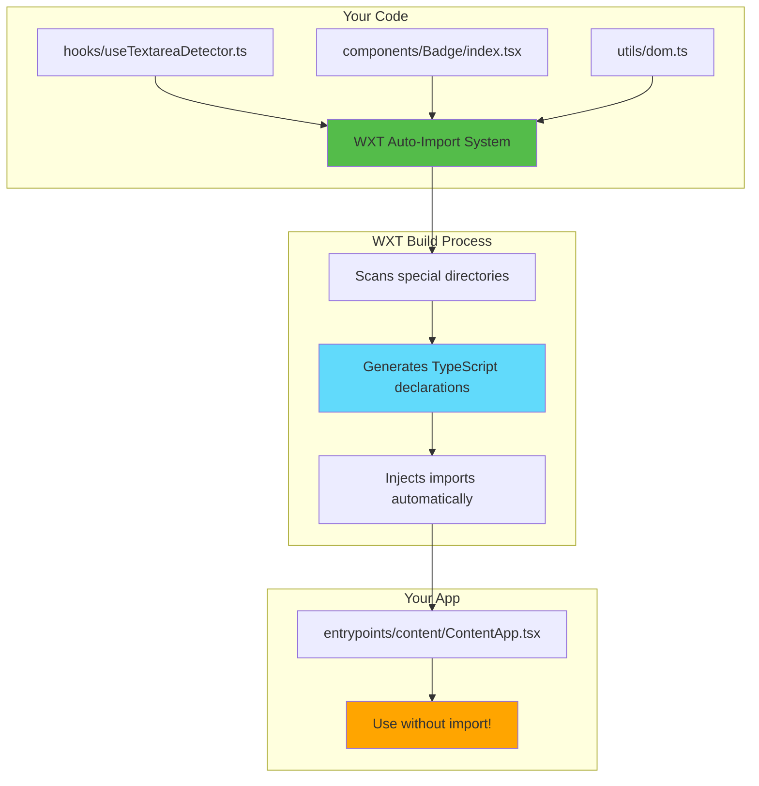
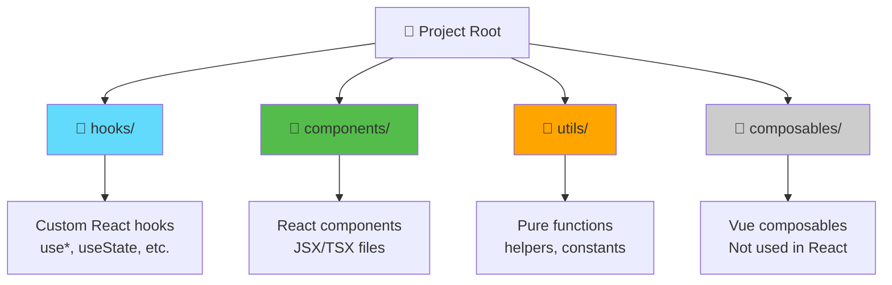

# Slide 3: WXT Auto-Import System

**Branch:** `react/03-auto-imports-and-hooks`

---

## 🎯 What is WXT Auto-Import?

WXT automatically imports files from special directories (`hooks/`, `components/`, `utils/`) so you don't need manual import statements. Similar to Nuxt.js auto-imports, this keeps your code clean and reduces boilerplate.

Key points:
- ⚡ **Zero Import Statements** - Files auto-imported from special directories
- 🎨 **Convention Over Configuration** - Put files in right folder, they just work
- 📦 **Type-Safe** - Full TypeScript support with auto-completion
- 🔄 **Framework Aware** - `hooks/` for React, `composables/` for Vue
- 🛠️ **Better DX** - Less boilerplate, cleaner code

---

## 📂 Files to Explore

<details>
<summary><b>New Directories & Files</b></summary>

- 📁 [hooks/useTextareaDetector.ts](../textarea-fullscreen-react/hooks/useTextareaDetector.ts)
- 📁 [components/Badge/index.tsx](../textarea-fullscreen-react/components/Badge/index.tsx)
- 📁 [utils/dom.ts](../textarea-fullscreen-react/utils/dom.ts)

</details>

<details>
<summary><b>Modified Files</b></summary>

- 📄 [entrypoints/content/ContentApp.tsx](../textarea-fullscreen-react/entrypoints/content/ContentApp.tsx)
- 📄 [wxt.config.ts](../textarea-fullscreen-react/wxt.config.ts)

</details>

---

## ✅ What's New in This Slide

- ✅ Created `hooks/` directory for custom React hooks
- ✅ Created `components/` directory for reusable components
- ✅ Created `utils/` directory for helper functions
- ✅ Implemented `useTextareaDetector` hook
- ✅ Used auto-imported code without manual imports

---

**Next:** [Slide 4: Detecting and Validating Textareas](./04-detect-and-validate-textareas.md)  

---

## 📑 Deep Dive

- [How It Works](#how-it-works)
- [Implementation Steps](#implementation-steps)
- [Key Concepts](#key-concepts)
- [Code Examples](#code-examples)
- [Common Patterns](#common-patterns)
- [Documentation](#documentation)
- [Challenge](#challenge)

---

## How It Works



**Flow Explanation:**
1. You create files in `hooks/`, `components/`, or `utils/`
2. WXT scans these directories during build
3. Generates type definitions in `.wxt/` folder
4. Your code can use these without import statements
5. TypeScript still has full type safety and autocomplete

---

## Implementation Steps

### 1. Create Project Structure

```bash
# Create directories
mkdir hooks
mkdir components
mkdir utils
```

**Final structure:**
```
📂 textarea-fullscreen-react/
   📁 .wxt/                    # Generated by WXT (git ignored)
      📄 types.d.ts            # Auto-generated type definitions
   📁 hooks/                   # Your custom hooks
      📄 useTextareaDetector.ts
   📁 components/              # Your components
      📁 Badge/
         📄 index.tsx
   📁 utils/                   # Your utilities
      📄 dom.ts
   📁 entrypoints/
      📂 content/
         📄 ContentApp.tsx     # Uses auto-imported code
```

---

### 2. Create a Custom Hook

```typescript
// hooks/useTextareaDetector.ts
import { useState, useEffect } from 'react';

export function useTextareaDetector() {
  const [textareas, setTextareas] = useState<HTMLTextAreaElement[]>([]);

  useEffect(() => {
    const elements = document.querySelectorAll('textarea');
    setTextareas(Array.from(elements));
  }, []);

  return { textareas };
}
```

**What this does:**
- Finds all `<textarea>` elements on the page
- Returns them as an array
- Updates when component mounts

---

### 3. Create a Reusable Component

```tsx
// components/Badge/index.tsx
interface BadgeProps {
  children: React.ReactNode;
  color?: string;
}

export function Badge({ children, color = '#54bc4a' }: BadgeProps) {
  return (
    <div style={{
      background: color,
      color: 'white',
      padding: '5px 10px',
      borderRadius: '4px',
      fontSize: '12px',
      fontWeight: 'bold',
      display: 'inline-block'
    }}>
      {children}
    </div>
  );
}
```

---

### 4. Create Utility Functions

```typescript
// utils/dom.ts
export function getTextareaCount(): number {
  return document.querySelectorAll('textarea').length;
}

export function highlightElement(element: HTMLElement, color: string = 'yellow') {
  element.style.outline = `3px solid ${color}`;
}

export function removeHighlight(element: HTMLElement) {
  element.style.outline = '';
}
```

---

### 5. Use Auto-Imported Code

```tsx
// entrypoints/content/ContentApp.tsx

// ❌ OLD WAY - Manual imports
// import { useTextareaDetector } from '../../hooks/useTextareaDetector';
// import { Badge } from '../../components/Badge';
// import { getTextareaCount } from '../../utils/dom';

// ✅ NEW WAY - No imports needed!
export default function ContentApp() {
  const { textareas } = useTextareaDetector(); // Auto-imported!
  
  return (
    <div style={{ 
      position: 'fixed', 
      top: 10, 
      right: 10, 
      zIndex: 999999 
    }}>
      <Badge color="#0066cc">
        Found {textareas.length} textareas
      </Badge>
    </div>
  );
}
```

---

### 6. Verify Auto-Imports Work

**Steps:**
1. Run `npm run dev`
2. Check `.wxt/types.d.ts` file (auto-generated)
3. Start typing in ContentApp.tsx
4. See autocomplete for your hooks/components/utils
5. No red squiggly lines = it works! ✅

---

## Key Concepts

### Concept 1: Special Directories



**Directory purposes:**
- **`hooks/`** - React hooks (must start with `use`)
- **`components/`** - React components (capitalized names)
- **`utils/`** - Pure utility functions
- **`composables/`** - Vue composables (ignore for React projects)

---

### Concept 2: How WXT Generates Types

**Build Process:**
```
1. WXT scans hooks/, components/, utils/
2. Extracts exported functions/components
3. Generates TypeScript declarations
4. Saves to .wxt/types.d.ts
5. TypeScript reads these types
6. You get autocomplete!
```

**Generated `.wxt/types.d.ts` (example):**
```typescript
// This file is auto-generated by WXT
declare module '#imports' {
  export const useTextareaDetector: typeof import('../hooks/useTextareaDetector').useTextareaDetector;
  export const Badge: typeof import('../components/Badge').Badge;
  export const getTextareaCount: typeof import('../utils/dom').getTextareaCount;
}
```

**You never edit this file!** WXT regenerates it automatically.

---

### Concept 3: Naming Conventions

**Hooks (must start with `use`):**
```typescript
✅ useTextareaDetector
✅ useFullscreen
✅ useSettings
❌ textareaDetector (missing 'use' prefix)
❌ getTextareas (not a hook)
```

**Components (PascalCase):**
```tsx
✅ Badge
✅ FullscreenButton
✅ TextareaWrapper
❌ badge (lowercase)
❌ fullscreen-button (kebab-case)
```

**Utils (any valid function name):**
```typescript
✅ getTextareaCount
✅ highlightElement
✅ debounce
✅ CONSTANTS (uppercase for constants)
```

---

## Code Examples

### Example 1: Simple Hook

```typescript
// hooks/useCounter.ts
import { useState } from 'react';

export function useCounter(initialValue: number = 0) {
  const [count, setCount] = useState(initialValue);

  const increment = () => setCount(c => c + 1);
  const decrement = () => setCount(c => c - 1);
  const reset = () => setCount(initialValue);

  return { count, increment, decrement, reset };
}
```

**Usage (auto-imported):**
```tsx
// entrypoints/content/ContentApp.tsx
export default function ContentApp() {
  const { count, increment } = useCounter(0);
  
  return <button onClick={increment}>Count: {count}</button>;
}
```

---

### Example 2: Component with Props

```tsx
// components/StatusBadge/index.tsx
interface StatusBadgeProps {
  status: 'active' | 'inactive' | 'error';
  message: string;
}

export function StatusBadge({ status, message }: StatusBadgeProps) {
  const colors = {
    active: '#4caf50',
    inactive: '#9e9e9e',
    error: '#f44336'
  };

  return (
    <div style={{
      background: colors[status],
      color: 'white',
      padding: '8px 12px',
      borderRadius: '4px'
    }}>
      {message}
    </div>
  );
}
```

**Usage (auto-imported):**
```tsx
export default function ContentApp() {
  return <StatusBadge status="active" message="Extension running" />;
}
```

---

### Example 3: Utility Functions

```typescript
// utils/validators.ts
export function isValidTextarea(element: HTMLElement): boolean {
  return element.tagName === 'TEXTAREA' && !element.hasAttribute('disabled');
}

export function getTextareaInfo(textarea: HTMLTextAreaElement) {
  return {
    id: textarea.id,
    name: textarea.name,
    rows: textarea.rows,
    value: textarea.value,
    length: textarea.value.length
  };
}
```

**Usage (auto-imported):**
```tsx
export default function ContentApp() {
  const { textareas } = useTextareaDetector();
  
  const validTextareas = textareas.filter(isValidTextarea);
  
  return <div>Valid: {validTextareas.length}</div>;
}
```

---

### Example 4: Full Example

```tsx
// entrypoints/content/ContentApp.tsx
export default function ContentApp() {
  // All auto-imported! No import statements needed
  const { textareas } = useTextareaDetector();
  const { count, increment } = useCounter(0);
  const validCount = textareas.filter(isValidTextarea).length;

  return (
    <div style={{ position: 'fixed', top: 10, right: 10, zIndex: 999999 }}>
      <StatusBadge 
        status={validCount > 0 ? 'active' : 'inactive'}
        message={`${validCount} textareas found`}
      />
      
      <Badge color="#0066cc">
        Clicks: {count}
      </Badge>
      
      <button onClick={increment}>Increment</button>
    </div>
  );
}
```

---

## Common Patterns

<details>
<summary><b>Pattern 1: Hook with Dependencies</b></summary>

```typescript
// hooks/useDebounce.ts
import { useState, useEffect } from 'react';

export function useDebounce<T>(value: T, delay: number): T {
  const [debouncedValue, setDebouncedValue] = useState(value);

  useEffect(() => {
    const handler = setTimeout(() => {
      setDebouncedValue(value);
    }, delay);

    return () => clearTimeout(handler);
  }, [value, delay]);

  return debouncedValue;
}
```

**When to use:**
- Delay state updates
- Search inputs
- API calls
- Performance optimization

</details>

<details>
<summary><b>Pattern 2: Compound Component</b></summary>

```tsx
// components/Card/index.tsx
export function Card({ children }: { children: React.ReactNode }) {
  return (
    <div style={{
      background: 'white',
      borderRadius: '8px',
      padding: '16px',
      boxShadow: '0 2px 8px rgba(0,0,0,0.1)'
    }}>
      {children}
    </div>
  );
}

export function CardHeader({ children }: { children: React.ReactNode }) {
  return <h3 style={{ margin: '0 0 12px 0' }}>{children}</h3>;
}

export function CardBody({ children }: { children: React.ReactNode }) {
  return <div>{children}</div>;
}
```

**Usage:**
```tsx
<Card>
  <CardHeader>Title</CardHeader>
  <CardBody>Content</CardBody>
</Card>
```

</details>

<details>
<summary><b>Pattern 3: Constants and Config</b></summary>

```typescript
// utils/constants.ts
export const COLORS = {
  primary: '#0066cc',
  success: '#4caf50',
  error: '#f44336',
  warning: '#ff9800'
} as const;

export const Z_INDEX = {
  badge: 999999,
  modal: 1000000,
  overlay: 999998
} as const;

export const TEXTAREA_MIN_SIZE = {
  width: 50,
  height: 15
} as const;
```

**Usage:**
```tsx
<div style={{ 
  zIndex: Z_INDEX.badge, 
  background: COLORS.primary 
}}>
  Badge
</div>
```

</details>

<details>
<summary><b>Pattern 4: Type-Safe Utilities</b></summary>

```typescript
// utils/array.ts
export function unique<T>(array: T[]): T[] {
  return Array.from(new Set(array));
}

export function chunk<T>(array: T[], size: number): T[][] {
  const chunks: T[][] = [];
  for (let i = 0; i < array.length; i += size) {
    chunks.push(array.slice(i, i + size));
  }
  return chunks;
}

export function groupBy<T>(array: T[], key: keyof T): Record<string, T[]> {
  return array.reduce((result, item) => {
    const groupKey = String(item[key]);
    if (!result[groupKey]) result[groupKey] = [];
    result[groupKey].push(item);
    return result;
  }, {} as Record<string, T[]>);
}
```

</details>

---

## Documentation

<details>
<summary><b>Related Resources</b></summary>

- 📚 [WXT Auto-Imports Guide](https://wxt.dev/guide/essentials/auto-imports.html)
- 📚 [TypeScript Declaration Files](https://www.typescriptlang.org/docs/handbook/declaration-files/introduction.html)
- 🎓 [React Custom Hooks](https://react.dev/learn/reusing-logic-with-custom-hooks)
- 💡 [Component Composition Patterns](https://react.dev/learn/passing-props-to-a-component)

</details>

---

## Challenge

**Try this yourself:**

1. Create a `hooks/useLocalStorage.ts` hook that:
   - Saves/loads data from localStorage
   - Returns current value and setter function
   - Syncs across browser tabs

2. Create a `components/Toggle/index.tsx` component:
   - On/Off switch UI
   - Accepts `value` and `onChange` props
   - Styled nicely

3. Use both in ContentApp without any imports:
   ```tsx
   const [enabled, setEnabled] = useLocalStorage('extension-enabled', true);
   return <Toggle value={enabled} onChange={setEnabled} />;
   ```

**Expected result:**
- Toggle shows current state
- Clicking toggle saves to localStorage
- State persists on page reload

**Bonus:**
- Add TypeScript types for better autocomplete
- Add animation to toggle switch
- Sync state across multiple tabs

---

**Next:** [Slide 4: Detecting and Validating Textareas](./04-detect-and-validate-textareas.md)