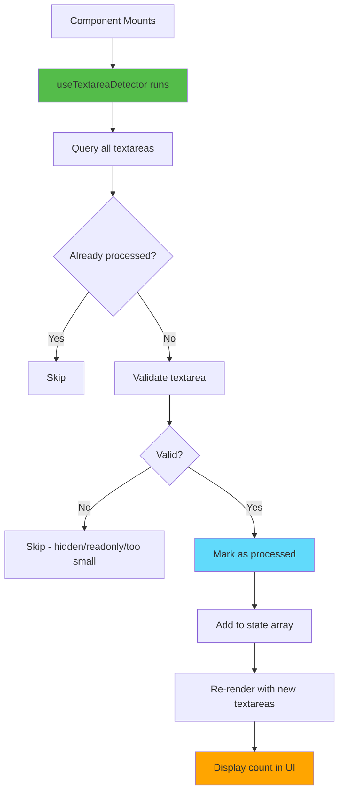
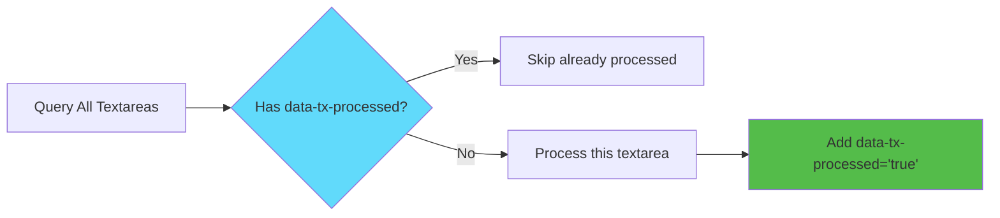
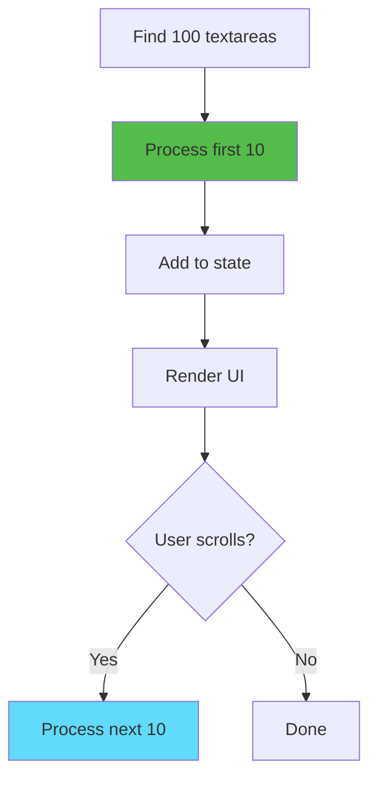

# Slide 4: Detecting and Validating Textareas

**Branch:** `react/04-detect-and-validate-textareas`

---

## 🎯 What is Textarea Detection?

Finding all textareas on a webpage and filtering them based on validation rules (visibility, size, attributes). This ensures we only add the fullscreen button to textareas that users can actually interact with.

Key points:
- ⚡ **Smart Detection** - Find textareas using DOM queries
- 🎨 **Validation Rules** - Check visibility, size, and attributes
- 📦 **Data Attributes** - Track which textareas are already processed
- 🔄 **Batch Processing** - Handle max 10 textareas at a time for performance
- 🛠️ **useCallback** - Prevent unnecessary re-renders

---

## 📂 Files to Explore

<details>
<summary><b>New/Modified Files</b></summary>

- 📄 [hooks/useTextareaDetector.ts](../textarea-fullscreen-react/hooks/useTextareaDetector.ts)
- 📄 [entrypoints/content/ContentApp.tsx](../textarea-fullscreen-react/entrypoints/content/ContentApp.tsx)

</details>

<details>
<summary><b>Supporting Files</b></summary>

- 📄 [utils/constants.ts](../textarea-fullscreen-react/utils/constants.ts)
- 📄 [components/Badge/index.tsx](../textarea-fullscreen-react/components/Badge/index.tsx)

</details>

---

## ✅ What's New in This Slide

- ✅ Implemented `useTextareaDetector` hook with validation
- ✅ Added visibility checks (display, visibility, opacity)
- ✅ Added size validation (minimum width/height)
- ✅ Added attribute checks (readonly, disabled)
- ✅ Used data attributes to prevent duplicate processing
- ✅ Batch processing (max 10 textareas at once)
- ✅ Display count of valid textareas in UI

---

**Next:** [Slide 5: Fullscreen Button Component](./05-fullscreen-button-component.md)  

---

## 📑 Deep Dive

- [How It Works](#how-it-works)
- [Implementation Steps](#implementation-steps)
- [Key Concepts](#key-concepts)
- [Code Examples](#code-examples)
- [Common Patterns](#common-patterns)
- [Documentation](#documentation)
- [Challenge](#challenge)

---

## How It Works



**Validation Flow:**
1. Find all `<textarea>` elements
2. Filter out already-processed ones
3. Check each textarea:
   - ✅ Visible on screen
   - ✅ Minimum size (50×15px)
   - ✅ Not readonly/disabled
4. Mark valid ones with `data-tx-processed="true"`
5. Add to state for rendering

---

## Implementation Steps

### 1. Create Constants

```typescript
// utils/constants.ts
export const TEXTAREA_MIN_SIZE = {
  width: 50,
  height: 15
} as const;

export const MAX_BATCH_SIZE = 10;

export const DATA_ATTRIBUTES = {
  processed: 'data-tx-processed',
  wrapper: 'data-tx-wrapper'
} as const;
```

**Why constants?**
- Easy to adjust values
- Reusable across files
- Self-documenting code

---

### 2. Create Validation Function

```typescript
// hooks/useTextareaDetector.ts
const isTextareaValid = (textarea: HTMLTextAreaElement): boolean => {
  // 1. Check if element is visible
  const style = window.getComputedStyle(textarea);
  if (style.display === 'none' || style.visibility === 'hidden') {
    return false;
  }
  
  if (parseFloat(style.opacity) === 0) {
    return false;
  }

  // 2. Check minimum size
  const rect = textarea.getBoundingClientRect();
  if (rect.width < 50 || rect.height < 15) {
    return false;
  }

  // 3. Check attributes
  if (textarea.hasAttribute('readonly') || textarea.hasAttribute('disabled')) {
    return false;
  }

  // 4. Check if parent is visible
  let parent = textarea.parentElement;
  while (parent && parent !== document.body) {
    const parentStyle = window.getComputedStyle(parent);
    if (parentStyle.display === 'none' || parentStyle.visibility === 'hidden') {
      return false;
    }
    parent = parent.parentElement;
  }

  return true;
};
```

**What this checks:**
- ✅ Element CSS display/visibility
- ✅ Element opacity
- ✅ Minimum dimensions
- ✅ Readonly/disabled attributes
- ✅ Parent element visibility

---

### 3. Create Processing Function

```typescript
// hooks/useTextareaDetector.ts
const processTextareas = useCallback(() => {
  // Find unprocessed textareas
  const unprocessed = document.querySelectorAll<HTMLTextAreaElement>(
    'textarea:not([data-tx-processed])'
  );
  
  const validTextareas: HTMLTextAreaElement[] = [];

  // Validate each textarea
  for (const textarea of unprocessed) {
    // Mark as processed immediately to avoid re-checking
    textarea.setAttribute('data-tx-processed', 'true');
    
    if (isTextareaValid(textarea)) {
      validTextareas.push(textarea);
    }
    
    // Batch limit: stop after 10 textareas
    if (validTextareas.length >= 10) {
      break;
    }
  }

  // Add to state if we found any
  if (validTextareas.length > 0) {
    setTextareas(prev => {
      const existing = new Set(prev);
      const combined = [...prev];
      
      for (const ta of validTextareas) {
        if (!existing.has(ta)) {
          combined.push(ta);
        }
      }
      
      return combined;
    });
  }
}, []);
```

**Why useCallback?**
- Prevents function recreation on every render
- Stable reference for useEffect dependencies
- Better performance

---

### 4. Complete Hook Implementation

```typescript
// hooks/useTextareaDetector.ts
import { useState, useEffect, useCallback } from 'react';

export function useTextareaDetector() {
  const [textareas, setTextareas] = useState<HTMLTextAreaElement[]>([]);

  const isTextareaValid = (textarea: HTMLTextAreaElement): boolean => {
    // Check visibility
    const style = window.getComputedStyle(textarea);
    if (style.display === 'none' || style.visibility === 'hidden') {
      return false;
    }

    // Check minimum size
    const rect = textarea.getBoundingClientRect();
    if (rect.width < 50 || rect.height < 15) {
      return false;
    }

    // Check attributes
    if (textarea.hasAttribute('readonly') || textarea.hasAttribute('disabled')) {
      return false;
    }

    return true;
  };

  const processTextareas = useCallback(() => {
    const unprocessed = document.querySelectorAll<HTMLTextAreaElement>(
      'textarea:not([data-tx-processed])'
    );
    
    const valid = Array.from(unprocessed)
      .filter(isTextareaValid)
      .slice(0, 10); // Process max 10 at a time

    valid.forEach(ta => {
      ta.setAttribute('data-tx-processed', 'true');
    });

    setTextareas(prev => [...prev, ...valid]);
  }, []);

  // Run on mount
  useEffect(() => {
    processTextareas();
  }, [processTextareas]);

  return { textareas, processTextareas };
}
```

---

### 5. Use in ContentApp

```tsx
// entrypoints/content/ContentApp.tsx
export default function ContentApp() {
  const { textareas } = useTextareaDetector(); // Auto-imported!

  return (
    <div style={{ 
      position: 'fixed', 
      top: 10, 
      right: 10, 
      zIndex: 999999,
      background: 'white',
      padding: '10px',
      borderRadius: '4px',
      boxShadow: '0 2px 8px rgba(0,0,0,0.15)'
    }}>
      <Badge color={textareas.length > 0 ? '#4caf50' : '#9e9e9e'}>
        ✅ {textareas.length} valid textareas
      </Badge>
    </div>
  );
}
```

---

### 6. Test on Different Websites

**Test pages:**
1. **GitHub** - Issue/PR comment boxes
2. **Gmail** - Email compose
3. **CodePen** - Code editors
4. **Stack Overflow** - Question/answer forms

**Expected results:**
- Hidden textareas: Not counted ✅
- Disabled textareas: Not counted ✅
- Tiny textareas: Not counted ✅
- Normal textareas: Counted ✅

---

## Key Concepts

### Concept 1: CSS Attribute Selectors



**CSS Selector:**
```css
textarea:not([data-tx-processed])
```

**What it does:**
- Finds all `<textarea>` elements
- Excludes those with `data-tx-processed` attribute
- Very performant (native browser query)

**Before:**
```html
<textarea>Content</textarea>
```

**After:**
```html
<textarea data-tx-processed="true">Content</textarea>
```

---

### Concept 2: getComputedStyle

**What is it?**
Returns the **actual rendered** CSS values, not just inline styles.

```typescript
const style = window.getComputedStyle(element);
console.log(style.display);    // 'none', 'block', 'flex', etc.
console.log(style.visibility); // 'visible' or 'hidden'
console.log(style.opacity);    // '0' to '1'
```

**Why not `element.style`?**
```html
<textarea style="color: red">Text</textarea>
<style>
  textarea { display: none; } /* Won't show in element.style */
</style>
```

```typescript
element.style.display;              // '' (empty string)
getComputedStyle(element).display;  // 'none' ✅
```

---

### Concept 3: getBoundingClientRect

**What is it?**
Returns the size and position of an element.

```typescript
const rect = element.getBoundingClientRect();

console.log(rect.width);   // 300
console.log(rect.height);  // 150
console.log(rect.top);     // Distance from top of viewport
console.log(rect.left);    // Distance from left of viewport
```

**Use case:**
```typescript
// Check if textarea is too small
if (rect.width < 50 || rect.height < 15) {
  return false; // Skip tiny textareas
}
```

---

### Concept 4: Batch Processing

**Why batch?**
- Performance: Don't process 1000+ textareas at once
- UX: Users rarely have 10+ textareas on one page
- Safety: Prevent browser freeze



**Implementation:**
```typescript
.slice(0, 10) // Take first 10 only
```

---

## Code Examples

### Example 1: Basic Detection

```typescript
// hooks/useTextareaDetector.ts (simplified)
export function useTextareaDetector() {
  const [textareas, setTextareas] = useState<HTMLTextAreaElement[]>([]);

  useEffect(() => {
    const elements = document.querySelectorAll('textarea');
    setTextareas(Array.from(elements));
  }, []);

  return { textareas };
}
```

**What this does:**
- Finds all textareas on mount
- No validation
- Simple but not production-ready

---

### Example 2: With Visibility Check

```typescript
export function useTextareaDetector() {
  const [textareas, setTextareas] = useState<HTMLTextAreaElement[]>([]);

  const isVisible = (textarea: HTMLTextAreaElement): boolean => {
    const style = window.getComputedStyle(textarea);
    return style.display !== 'none' && 
           style.visibility !== 'hidden' &&
           parseFloat(style.opacity) > 0;
  };

  useEffect(() => {
    const all = document.querySelectorAll<HTMLTextAreaElement>('textarea');
    const visible = Array.from(all).filter(isVisible);
    setTextareas(visible);
  }, []);

  return { textareas };
}
```

---

### Example 3: With Size Check

```typescript
export function useTextareaDetector() {
  const [textareas, setTextareas] = useState<HTMLTextAreaElement[]>([]);

  const isValidSize = (textarea: HTMLTextAreaElement): boolean => {
    const rect = textarea.getBoundingClientRect();
    return rect.width >= 50 && rect.height >= 15;
  };

  useEffect(() => {
    const all = document.querySelectorAll<HTMLTextAreaElement>('textarea');
    const valid = Array.from(all).filter(ta => {
      const style = window.getComputedStyle(ta);
      const isVisible = style.display !== 'none';
      return isVisible && isValidSize(ta);
    });
    setTextareas(valid);
  }, []);

  return { textareas };
}
```

---

### Example 4: Production-Ready Version

```typescript
// hooks/useTextareaDetector.ts
import { useState, useEffect, useCallback } from 'react';

export function useTextareaDetector() {
  const [textareas, setTextareas] = useState<HTMLTextAreaElement[]>([]);

  const isTextareaValid = useCallback((textarea: HTMLTextAreaElement): boolean => {
    // Visibility
    const style = window.getComputedStyle(textarea);
    if (style.display === 'none' || 
        style.visibility === 'hidden' || 
        parseFloat(style.opacity) === 0) {
      return false;
    }

    // Size
    const rect = textarea.getBoundingClientRect();
    if (rect.width < 50 || rect.height < 15) {
      return false;
    }

    // Attributes
    if (textarea.hasAttribute('readonly') || 
        textarea.hasAttribute('disabled')) {
      return false;
    }

    // Parent visibility
    let parent = textarea.parentElement;
    while (parent && parent !== document.body) {
      const parentStyle = window.getComputedStyle(parent);
      if (parentStyle.display === 'none' || 
          parentStyle.visibility === 'hidden') {
        return false;
      }
      parent = parent.parentElement;
    }

    return true;
  }, []);

  const processTextareas = useCallback(() => {
    const unprocessed = document.querySelectorAll<HTMLTextAreaElement>(
      'textarea:not([data-tx-processed])'
    );
    
    const valid: HTMLTextAreaElement[] = [];

    for (const textarea of unprocessed) {
      textarea.setAttribute('data-tx-processed', 'true');
      
      if (isTextareaValid(textarea)) {
        valid.push(textarea);
      }
      
      if (valid.length >= 10) break;
    }

    if (valid.length > 0) {
      setTextareas(prev => [...prev, ...valid]);
    }
  }, [isTextareaValid]);

  useEffect(() => {
    processTextareas();
  }, [processTextareas]);

  return { textareas, processTextareas };
}
```

---

## Common Patterns

<details>
<summary><b>Pattern 1: Defensive Checks</b></summary>

```typescript
function isTextareaValid(textarea: HTMLTextAreaElement | null): boolean {
  // Null check
  if (!textarea) return false;
  
  // Type check
  if (textarea.tagName !== 'TEXTAREA') return false;
  
  // DOM check (ensure element is in document)
  if (!document.body.contains(textarea)) return false;
  
  // Your validation logic...
  return true;
}
```

**When to use:**
- Working with dynamic DOM
- Third-party scripts might remove elements
- Prevent runtime errors

</details>

<details>
<summary><b>Pattern 2: Debounced Detection</b></summary>

```typescript
export function useTextareaDetector() {
  const [textareas, setTextareas] = useState<HTMLTextAreaElement[]>([]);

  const processTextareas = useCallback(() => {
    // detection logic...
  }, []);

  useEffect(() => {
    // Initial detection
    processTextareas();

    // Debounced re-detection on scroll
    let timeout: number;
    const handleScroll = () => {
      clearTimeout(timeout);
      timeout = setTimeout(processTextareas, 300);
    };

    window.addEventListener('scroll', handleScroll);
    return () => {
      clearTimeout(timeout);
      window.removeEventListener('scroll', handleScroll);
    };
  }, [processTextareas]);

  return { textareas };
}
```

**When to use:**
- Lazy-loaded content
- Infinite scroll pages
- SPAs with route changes

</details>

<details>
<summary><b>Pattern 3: Logging and Debugging</b></summary>

```typescript
const getTextareaInfo = (textarea: HTMLTextAreaElement) => {
  return {
    id: textarea.id || 'no-id',
    name: textarea.name || 'no-name',
    class: textarea.className || 'no-class',
    visible: window.getComputedStyle(textarea).display !== 'none',
    size: textarea.getBoundingClientRect(),
    attributes: {
      readonly: textarea.hasAttribute('readonly'),
      disabled: textarea.hasAttribute('disabled')
    }
  };
};

const processTextareas = useCallback(() => {
  const all = document.querySelectorAll<HTMLTextAreaElement>('textarea');
  
  console.log(`[Detector] Found ${all.length} textareas`);
  
  all.forEach((ta, i) => {
    const info = getTextareaInfo(ta);
    console.log(`[${i}]`, info);
  });
  
  // validation logic...
}, []);
```

**When to use:**
- Development/debugging
- Understanding why textareas are filtered out
- Troubleshooting on specific websites

</details>

---

## Documentation

<details>
<summary><b>Related Resources</b></summary>

- 📚 [getComputedStyle - MDN](https://developer.mozilla.org/en-US/docs/Web/API/Window/getComputedStyle)
- 📚 [getBoundingClientRect - MDN](https://developer.mozilla.org/en-US/docs/Web/API/Element/getBoundingClientRect)
- 🎓 [CSS Selectors - MDN](https://developer.mozilla.org/en-US/docs/Web/CSS/CSS_Selectors)
- 💡 [Data Attributes - MDN](https://developer.mozilla.org/en-US/docs/Learn/HTML/Howto/Use_data_attributes)
- 🎓 [useCallback - React Docs](https://react.dev/reference/react/useCallback)

</details>

---

## Challenge

**Try this yourself:**

1. **Add textarea filtering by size:**
   - Skip textareas smaller than 100×50px
   - Log which textareas were skipped and why

2. **Implement a "Show All" debug mode:**
   - Add a button that toggles validation on/off
   - When off, show ALL textareas (even hidden ones)
   - Display count: "5 visible / 12 total"

3. **Add visual debugging:**
   - Highlight valid textareas with green outline
   - Highlight invalid textareas with red outline
   - Show reason why textarea is invalid (tooltip)

**Expected result:**
```
Valid: 3 textareas
Invalid: 2 (1 hidden, 1 too small)
Total: 5 textareas
```

**Bonus:**
- Add performance metrics (time to detect)
- Group textareas by validation status
- Export detection report to console

**Hint:**
```typescript
const validationResults = textareas.map(ta => ({
  element: ta,
  valid: isTextareaValid(ta),
  reason: getInvalidReason(ta) // 'hidden' | 'too-small' | 'disabled'
}));
```

---

**Next:** [Slide 5: Fullscreen Button Component](./05-fullscreen-button-component.md)  