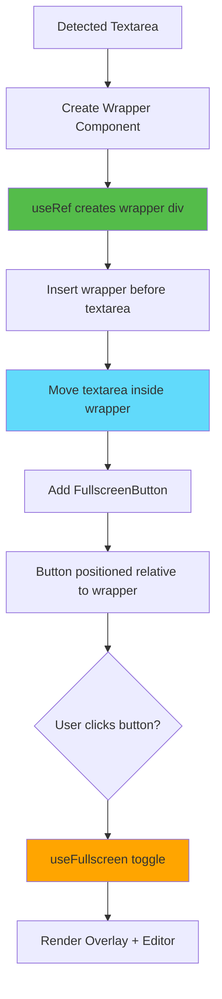
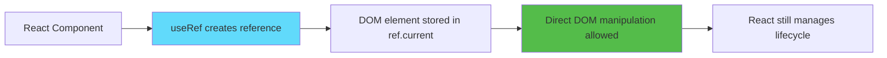
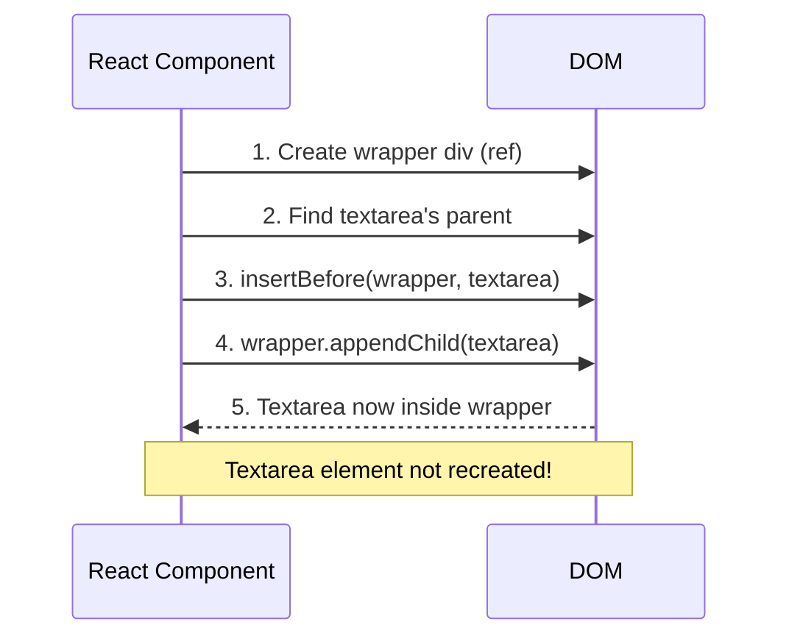
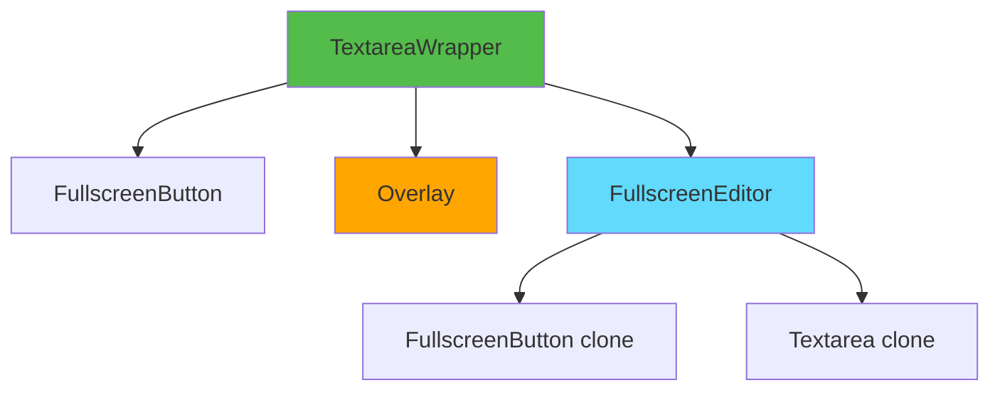

# Slide 6: Textarea Wrapper Component

**Branch:** `react/06-textarea-wrapper-component`

---

## 🎯 What is Textarea Wrapper?

A React component that wraps each detected textarea element with a container div, enabling us to position the fullscreen button and manage state independently for each textarea on the page.

Key points:
- ⚡ **DOM Manipulation** - Dynamically wraps existing textareas
- 🎨 **Relative Positioning** - Creates positioning context for button
- 📦 **Independent State** - Each textarea has its own fullscreen state
- 🔄 **Component Composition** - Combines button, overlay, and editor
- 🛠️ **Keyboard Shortcuts** - Ctrl+F to toggle per textarea

---

## 📂 Files to Explore

<details>
<summary><b>New/Modified Files</b></summary>

- 📁 [components/TextareaWrapper/index.tsx](../textarea-fullscreen-react/components/TextareaWrapper/index.tsx)
- 📁 [components/TextareaWrapper/style.css](../textarea-fullscreen-react/components/TextareaWrapper/style.css)

</details>

<details>
<summary><b>Supporting Files</b></summary>

- 📄 [hooks/useFullscreen.ts](../textarea-fullscreen-react/hooks/useFullscreen.ts)
- 📄 [entrypoints/content/ContentApp.tsx](../textarea-fullscreen-react/entrypoints/content/ContentApp.tsx)
- 📄 [components/FullscreenButton/index.tsx](../textarea-fullscreen-react/components/FullscreenButton/index.tsx)

</details>

---

## ✅ What's New in This Slide

- ✅ Created `TextareaWrapper` component
- ✅ Implemented DOM manipulation with `useRef`
- ✅ Wrapped textareas without recreating them
- ✅ Added relative positioning for button placement
- ✅ Created `useFullscreen` hook for state management
- ✅ Integrated keyboard shortcuts (Ctrl+F)
- ✅ Composed FullscreenButton, Overlay, and Editor

---

**Next:** [Slide 7: Fullscreen Editor with React Portal](./07-fullscreen-editor-portal.md)  

---

## 📑 Deep Dive

- [How It Works](#how-it-works)
- [Implementation Steps](#implementation-steps)
- [Key Concepts](#key-concepts)
- [Code Examples](#code-examples)
- [Common Patterns](#common-patterns)
- [Documentation](#documentation)
- [Challenge](#challenge)

---

## How It Works



**Visual transformation:**

**Before:**
```html
<div class="page-content">
  <textarea>Original content</textarea>
</div>
```

**After:**
```html
<div class="page-content">
  <div class="tx-editor-wrapper" data-tx-wrapper>
    <textarea>Original content</textarea>
    <button class="tx-fullscreen-btn">⛶</button>
  </div>
</div>
```

---

## Implementation Steps

### 1. Create Component Structure

```bash
mkdir -p components/TextareaWrapper
touch components/TextareaWrapper/index.tsx
touch components/TextareaWrapper/style.css
```

---

### 2. Define Component Interface

```tsx
// components/TextareaWrapper/index.tsx
import { useRef, useEffect } from 'react';
import './style.css';

interface TextareaWrapperProps {
  textarea: HTMLTextAreaElement;
}

export function TextareaWrapper({ textarea }: TextareaWrapperProps) {
  // Implementation
}
```

**Props:**
- `textarea` - The actual DOM element to wrap

---

### 3. Create Wrapper with useRef

```tsx
// components/TextareaWrapper/index.tsx
import { useRef, useEffect, useState } from 'react';
import './style.css';

interface TextareaWrapperProps {
  textarea: HTMLTextAreaElement;
}

export function TextareaWrapper({ textarea }: TextareaWrapperProps) {
  const wrapperRef = useRef<HTMLDivElement>(null);
  const [isExpanded, setIsExpanded] = useState(false);

  useEffect(() => {
    if (!wrapperRef.current || !textarea) return;

    const parent = textarea.parentElement;
    if (parent && !wrapperRef.current.contains(textarea)) {
      // Insert wrapper before textarea
      parent.insertBefore(wrapperRef.current, textarea);
      // Move textarea inside wrapper
      wrapperRef.current.appendChild(textarea);
    }
  }, [textarea]);

  const toggle = () => setIsExpanded(prev => !prev);

  return (
    <div 
      ref={wrapperRef} 
      className="tx-editor-wrapper" 
      data-tx-wrapper
    >
      <FullscreenButton onClick={toggle} isExpanded={isExpanded} />
    </div>
  );
}
```

**What this does:**
1. Creates a wrapper div using `useRef`
2. Inserts wrapper before original textarea
3. Moves textarea inside wrapper
4. Adds fullscreen button

---

### 4. Add Fullscreen State Management

```tsx
// hooks/useFullscreen.ts
import { useState, useCallback, useRef, useEffect } from 'react';

export function useFullscreen(textarea: HTMLTextAreaElement) {
  const [isExpanded, setIsExpanded] = useState(false);
  const originalState = useRef<any>(null);

  const expand = useCallback(() => {
    if (!textarea) return;

    // Save original state
    originalState.current = {
      parent: textarea.parentElement,
      nextSibling: textarea.nextSibling,
      styles: {
        width: textarea.style.width,
        height: textarea.style.height,
        position: textarea.style.position,
        zIndex: textarea.style.zIndex,
      }
    };

    setIsExpanded(true);
  }, [textarea]);

  const minimize = useCallback(() => {
    setIsExpanded(false);
  }, []);

  const toggle = useCallback(() => {
    isExpanded ? minimize() : expand();
  }, [isExpanded, expand, minimize]);

  // Restore original state when minimizing
  useEffect(() => {
    if (!isExpanded && originalState.current && textarea) {
      const { parent, nextSibling, styles } = originalState.current;
      if (parent) {
        parent.insertBefore(textarea, nextSibling);
      }
      Object.assign(textarea.style, styles);
      originalState.current = null;
    }
  }, [isExpanded, textarea]);

  return { isExpanded, toggle, expand, minimize };
}
```

---

### 5. Add Keyboard Shortcuts

```tsx
// components/TextareaWrapper/index.tsx (updated)
export function TextareaWrapper({ textarea }: TextareaWrapperProps) {
  const wrapperRef = useRef<HTMLDivElement>(null);
  const { isExpanded, toggle } = useFullscreen(textarea);
  const { settings } = useSettings();

  // DOM manipulation effect
  useEffect(() => {
    if (!wrapperRef.current || !textarea) return;

    const parent = textarea.parentElement;
    if (parent && !wrapperRef.current.contains(textarea)) {
      parent.insertBefore(wrapperRef.current, textarea);
      wrapperRef.current.appendChild(textarea);
    }
  }, [textarea]);

  // Keyboard shortcut effect
  useEffect(() => {
    const handleKeyDown = (e: KeyboardEvent) => {
      if (e.ctrlKey && e.key === settings.shortcutKey) {
        e.preventDefault();
        toggle();
      }
    };

    textarea?.addEventListener('keydown', handleKeyDown);
    return () => textarea?.removeEventListener('keydown', handleKeyDown);
  }, [textarea, settings.shortcutKey, toggle]);

  return (
    <div ref={wrapperRef} className="tx-editor-wrapper" data-tx-wrapper>
      <FullscreenButton onClick={toggle} isExpanded={isExpanded} />
    </div>
  );
}
```

---

### 6. Add CSS Styling

```css
/* components/TextareaWrapper/style.css */
.tx-editor-wrapper {
  position: relative !important;
  display: block !important;
}

.tx-editor-wrapper > textarea {
  position: relative !important;
}
```

**Why `position: relative`?**
- Creates positioning context for absolutely positioned button
- Button's `top/right` are relative to this wrapper

---

### 7. Compose with Other Components

```tsx
// components/TextareaWrapper/index.tsx (complete)
import { useRef, useEffect } from 'react';
import './style.css';

interface TextareaWrapperProps {
  textarea: HTMLTextAreaElement;
}

export function TextareaWrapper({ textarea }: TextareaWrapperProps) {
  const { settings } = useSettings(); // Auto-imported
  const { isExpanded, toggle } = useFullscreen(textarea); // Auto-imported
  const wrapperRef = useRef<HTMLDivElement>(null);

  // Wrap textarea
  useEffect(() => {
    if (textarea && wrapperRef.current) {
      const parent = textarea.parentElement;
      if (parent && !wrapperRef.current.contains(textarea)) {
        parent.insertBefore(wrapperRef.current, textarea);
        wrapperRef.current.appendChild(textarea);
      }
    }
  }, [textarea]);

  // Keyboard shortcuts
  useEffect(() => {
    const handleKeyDown = (e: KeyboardEvent) => {
      if (e.ctrlKey && e.key === settings.shortcutKey) {
        e.preventDefault();
        toggle();
      }
    };

    textarea?.addEventListener('keydown', handleKeyDown);
    return () => textarea?.removeEventListener('keydown', handleKeyDown);
  }, [textarea, settings.shortcutKey, toggle]);

  return (
    <div ref={wrapperRef} className="tx-editor-wrapper" data-tx-wrapper>
      {/* Fullscreen button */}
      <FullscreenButton onClick={toggle} isExpanded={isExpanded} />
      
      {/* Overlay (if enabled in settings) */}
      {isExpanded && settings.overlay && (
        <Overlay onClose={toggle} visible={isExpanded} />
      )}
      
      {/* Fullscreen editor */}
      <FullscreenEditor
        textarea={textarea}
        isExpanded={isExpanded}
        onToggle={toggle}
      />
    </div>
  );
}
```

---

### 8. Use in ContentApp

```tsx
// entrypoints/content/ContentApp.tsx
export default function ContentApp() {
  const { textareas } = useTextareaDetector();

  return (
    <>
      {textareas.map((textarea, index) => (
        <TextareaWrapper
          key={`textarea-${index}`}
          textarea={textarea}
        />
      ))}
    </>
  );
}
```

---

## Key Concepts

### Concept 1: useRef for DOM Manipulation



**Key differences:**

| useState | useRef |
|----------|--------|
| Triggers re-render | No re-render |
| For reactive data | For mutable data |
| `value` | `current` property |

**Example:**
```tsx
const [count, setCount] = useState(0);     // Re-renders
const divRef = useRef<HTMLDivElement>(null); // No re-render

setCount(1);              // ✅ Triggers re-render
divRef.current = element; // ✅ No re-render (direct mutation)
```

---

### Concept 2: DOM Manipulation in React



**Important:**
```tsx
// ❌ WRONG - Recreates textarea, loses content
<div className="wrapper">
  <textarea value={originalTextarea.value} />
</div>

// ✅ CORRECT - Moves existing element
useEffect(() => {
  wrapperRef.current.appendChild(originalTextarea);
}, []);
```

---

### Concept 3: insertBefore & appendChild

**insertBefore:**
```javascript
parent.insertBefore(newElement, referenceElement);
//                   ↑            ↑
//                   New node     Insert before this
```

**Visual:**
```
Before:
<parent>
  <child1 />
  <textarea />  ← reference
  <child2 />
</parent>

After insertBefore(wrapper, textarea):
<parent>
  <child1 />
  <wrapper />   ← inserted here
  <textarea />
  <child2 />
</parent>
```

**appendChild:**
```javascript
element.appendChild(childElement);
//                  ↑
//                  Moves to end of element
```

**Visual:**
```
After appendChild(textarea):
<parent>
  <child1 />
  <wrapper>
    <textarea />  ← moved inside
  </wrapper>
  <child2 />
</parent>
```

---

### Concept 4: Component Composition



**Benefits:**
- **Separation of concerns** - Each component has one job
- **Reusability** - Components can be used elsewhere
- **Testability** - Test components in isolation
- **Maintainability** - Easy to update individual pieces

---

## Code Examples

### Example 1: Basic Wrapper

```tsx
// components/TextareaWrapper/index.tsx (minimal)
import { useRef, useEffect } from 'react';

interface Props {
  textarea: HTMLTextAreaElement;
}

export function TextareaWrapper({ textarea }: Props) {
  const wrapperRef = useRef<HTMLDivElement>(null);

  useEffect(() => {
    if (!wrapperRef.current || !textarea) return;

    const parent = textarea.parentElement;
    if (parent) {
      parent.insertBefore(wrapperRef.current, textarea);
      wrapperRef.current.appendChild(textarea);
    }
  }, [textarea]);

  return (
    <div ref={wrapperRef} style={{ position: 'relative' }}>
      {/* Button will go here */}
    </div>
  );
}
```

---

### Example 2: With State

```tsx
// components/TextareaWrapper/index.tsx (with state)
import { useRef, useEffect, useState } from 'react';

interface Props {
  textarea: HTMLTextAreaElement;
}

export function TextareaWrapper({ textarea }: Props) {
  const wrapperRef = useRef<HTMLDivElement>(null);
  const [isExpanded, setIsExpanded] = useState(false);

  useEffect(() => {
    if (!wrapperRef.current || !textarea) return;
    const parent = textarea.parentElement;
    if (parent) {
      parent.insertBefore(wrapperRef.current, textarea);
      wrapperRef.current.appendChild(textarea);
    }
  }, [textarea]);

  return (
    <div ref={wrapperRef} style={{ position: 'relative' }}>
      <FullscreenButton 
        onClick={() => setIsExpanded(!isExpanded)}
        isExpanded={isExpanded}
      />
    </div>
  );
}
```

---

### Example 3: With Custom Hook

```tsx
// hooks/useFullscreen.ts
export function useFullscreen(textarea: HTMLTextAreaElement) {
  const [isExpanded, setIsExpanded] = useState(false);

  const toggle = useCallback(() => {
    setIsExpanded(prev => !prev);
  }, []);

  return { isExpanded, toggle };
}

// components/TextareaWrapper/index.tsx (using hook)
export function TextareaWrapper({ textarea }: Props) {
  const wrapperRef = useRef<HTMLDivElement>(null);
  const { isExpanded, toggle } = useFullscreen(textarea);

  useEffect(() => {
    if (!wrapperRef.current || !textarea) return;
    const parent = textarea.parentElement;
    if (parent) {
      parent.insertBefore(wrapperRef.current, textarea);
      wrapperRef.current.appendChild(textarea);
    }
  }, [textarea]);

  return (
    <div ref={wrapperRef} style={{ position: 'relative' }}>
      <FullscreenButton onClick={toggle} isExpanded={isExpanded} />
    </div>
  );
}
```

---

### Example 4: Production Version

```tsx
// components/TextareaWrapper/index.tsx (complete)
import { useRef, useEffect } from 'react';
import './style.css';

interface TextareaWrapperProps {
  textarea: HTMLTextAreaElement;
}

export function TextareaWrapper({ textarea }: TextareaWrapperProps) {
  const { settings } = useSettings();
  const { isExpanded, toggle } = useFullscreen(textarea);
  const wrapperRef = useRef<HTMLDivElement>(null);

  // Wrap textarea in DOM
  useEffect(() => {
    if (textarea && wrapperRef.current) {
      const parent = textarea.parentElement;
      if (parent && !wrapperRef.current.contains(textarea)) {
        parent.insertBefore(wrapperRef.current, textarea);
        wrapperRef.current.appendChild(textarea);
      }
    }
  }, [textarea]);

  // Keyboard shortcuts
  useEffect(() => {
    const handleKeyDown = (e: KeyboardEvent) => {
      if (e.ctrlKey && e.key === settings.shortcutKey) {
        e.preventDefault();
        toggle();
      }
    };

    textarea?.addEventListener('keydown', handleKeyDown);
    return () => textarea?.removeEventListener('keydown', handleKeyDown);
  }, [textarea, settings.shortcutKey, toggle]);

  return (
    <div ref={wrapperRef} className="tx-editor-wrapper" data-tx-wrapper>
      <FullscreenButton onClick={toggle} isExpanded={isExpanded} />
      
      {isExpanded && settings.overlay && (
        <Overlay onClose={toggle} visible={isExpanded} />
      )}
      
      <FullscreenEditor
        textarea={textarea}
        isExpanded={isExpanded}
        onToggle={toggle}
      />
    </div>
  );
}
```

---

## Common Patterns

<details>
<summary><b>Pattern 1: Cleanup on Unmount</b></summary>

```tsx
export function TextareaWrapper({ textarea }: Props) {
  const wrapperRef = useRef<HTMLDivElement>(null);

  useEffect(() => {
    // Wrap textarea
    if (wrapperRef.current && textarea) {
      const parent = textarea.parentElement;
      if (parent) {
        parent.insertBefore(wrapperRef.current, textarea);
        wrapperRef.current.appendChild(textarea);
      }
    }

    // Cleanup: unwrap on unmount
    return () => {
      if (wrapperRef.current && textarea) {
        const wrapper = wrapperRef.current;
        const parent = wrapper.parentElement;
        if (parent) {
          // Move textarea back out of wrapper
          parent.insertBefore(textarea, wrapper);
          // Remove wrapper
          wrapper.remove();
        }
      }
    };
  }, [textarea]);

  return <div ref={wrapperRef} />;
}
```

**When to use:**
- Component might unmount
- Need to restore original DOM structure
- Prevent memory leaks

</details>

<details>
<summary><b>Pattern 2: Conditional Wrapping</b></summary>

```tsx
export function TextareaWrapper({ textarea, shouldWrap }: Props) {
  const wrapperRef = useRef<HTMLDivElement>(null);
  const [isWrapped, setIsWrapped] = useState(false);

  useEffect(() => {
    if (!shouldWrap || !wrapperRef.current || !textarea) return;

    if (!isWrapped) {
      const parent = textarea.parentElement;
      if (parent) {
        parent.insertBefore(wrapperRef.current, textarea);
        wrapperRef.current.appendChild(textarea);
        setIsWrapped(true);
      }
    }
  }, [shouldWrap, textarea, isWrapped]);

  if (!shouldWrap) return null;

  return <div ref={wrapperRef} />;
}
```

**When to use:**
- Feature flags
- Conditional features
- A/B testing

</details>

<details>
<summary><b>Pattern 3: Multiple Instances</b></summary>

```tsx
// Each wrapper is independent
export default function ContentApp() {
  const { textareas } = useTextareaDetector();

  return (
    <>
      {textareas.map((textarea, index) => (
        <TextareaWrapper
          key={index}
          textarea={textarea}
        />
      ))}
    </>
  );
}
```

**Result:**
- Each textarea has independent state
- Button on textarea #1 doesn't affect textarea #2
- Scalable to any number of textareas

</details>

---

## Documentation

<details>
<summary><b>Related Resources</b></summary>

- 📚 [useRef - React Docs](https://react.dev/reference/react/useRef)
- 📚 [DOM Manipulation - MDN](https://developer.mozilla.org/en-US/docs/Web/API/Document_Object_Model/Introduction)
- 🎓 [Node.insertBefore - MDN](https://developer.mozilla.org/en-US/docs/Web/API/Node/insertBefore)
- 💡 [Node.appendChild - MDN](https://developer.mozilla.org/en-US/docs/Web/API/Node/appendChild)
- 🎓 [Component Composition - React](https://react.dev/learn/passing-props-to-a-component#passing-jsx-as-children)

</details>

---

## Challenge

**Try this yourself:**

1. **Add wrapper highlight on hover:**
   - Highlight wrapper border when mouse enters
   - Remove highlight when mouse leaves
   - Use subtle color (e.g., blue outline)

2. **Implement data persistence:**
   - Store which textareas are expanded
   - Use textarea ID or data attribute as key
   - Restore expanded state on page reload

3. **Add wrapper resize observer:**
   - Detect when textarea size changes
   - Update button position accordingly
   - Handle dynamic layouts

**Expected result:**
```tsx
const [isHovered, setIsHovered] = useState(false);

return (
  <div 
    ref={wrapperRef}
    onMouseEnter={() => setIsHovered(true)}
    onMouseLeave={() => setIsHovered(false)}
    style={{
      outline: isHovered ? '2px solid #0066cc' : 'none'
    }}
  >
    {/* components */}
  </div>
);
```

**Bonus:**
- Add animation when wrapping textarea
- Track and display wrapper statistics
- Support nested textareas

---

**Next:** [Slide 7: Fullscreen Editor with React Portal](./07-fullscreen-editor-portal.md)
