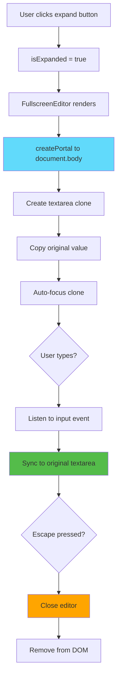
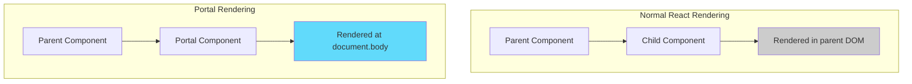
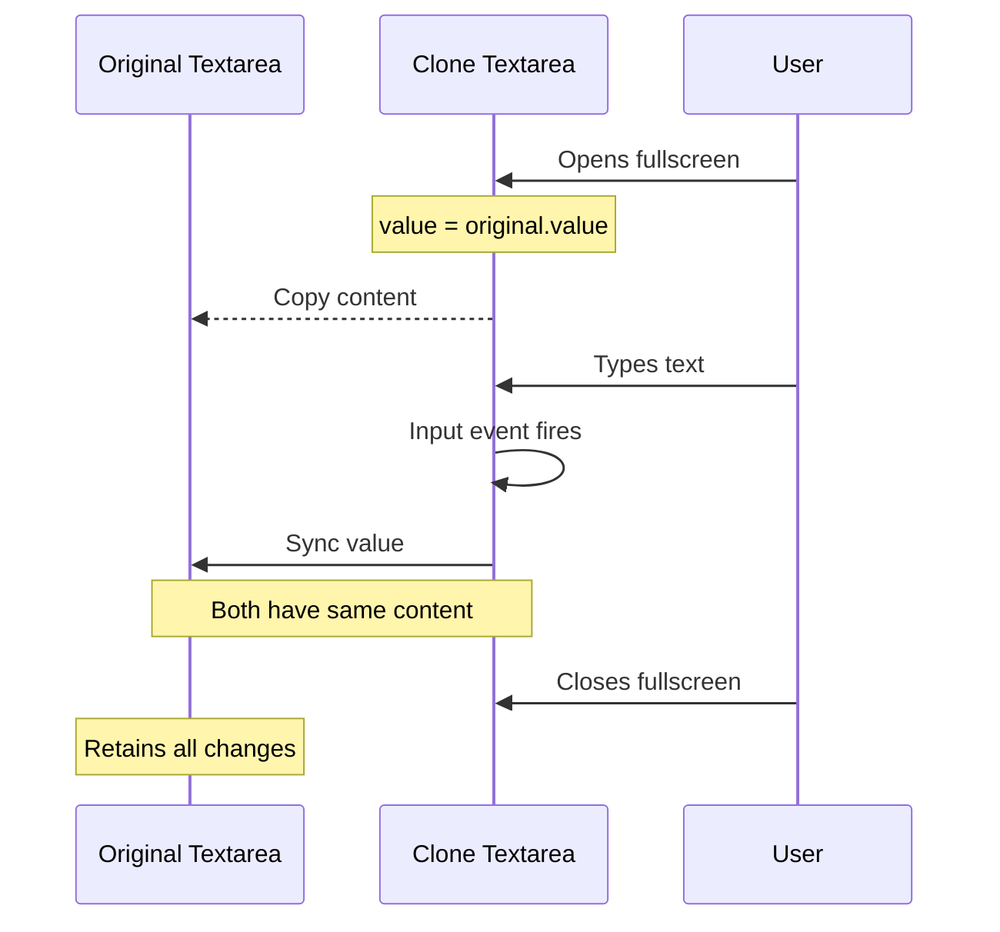

# Slide 7: Fullscreen Editor with React Portal

**Branch:** `react/07-fullscreen-editor-portal`

---

## 🎯 What is Fullscreen Editor with Portal?

A full-screen modal editor that renders outside the normal component hierarchy using React Portals. This allows complete freedom from parent CSS constraints and creates a focused editing experience with synchronized content.

Key points:
- ⚡ **React Portals** - Render component at document.body level
- 🎨 **Escape CSS Constraints** - Ignore parent overflow/z-index rules
- 📦 **Bidirectional Sync** - Changes in fullscreen sync to original textarea
- 🔄 **Focus Management** - Auto-focus on open, Escape to close
- 🛠️ **Maximum Z-Index** - Always on top (2147483647)

---

## 📂 Files to Explore

<details>
<summary><b>New/Modified Files</b></summary>

- 📁 [components/FullscreenEditor/index.tsx](../textarea-fullscreen-react/components/FullscreenEditor/index.tsx)
- 📁 [components/FullscreenEditor/style.css](../textarea-fullscreen-react/components/FullscreenEditor/style.css)

</details>

<details>
<summary><b>Supporting Files</b></summary>

- 📄 [components/TextareaWrapper/index.tsx](../textarea-fullscreen-react/components/TextareaWrapper/index.tsx)
- 📄 [components/FullscreenButton/index.tsx](../textarea-fullscreen-react/components/FullscreenButton/index.tsx)
- 📄 [utils/constants.ts](../textarea-fullscreen-react/utils/constants.ts)

</details>

---

## ✅ What's New in This Slide

- ✅ Created `FullscreenEditor` component with React Portal
- ✅ Implemented bidirectional textarea synchronization
- ✅ Added auto-focus on editor open
- ✅ Integrated Escape key to close
- ✅ Styled as centered modal (90vw × 90vh)
- ✅ Used maximum z-index for top layer
- ✅ Dark theme for better focus

---

**Next:** [Slide 8: Background Overlay Component](./08-overlay-component.md)  

---

## 📑 Deep Dive

- [How It Works](#how-it-works)
- [Implementation Steps](#implementation-steps)
- [Key Concepts](#key-concepts)
- [Code Examples](#code-examples)
- [Common Patterns](#common-patterns)
- [Documentation](#documentation)
- [Challenge](#challenge)

---

## How It Works



**Visual Flow:**

```
Normal State:
<body>
  <div class="page-content">
    <div class="tx-editor-wrapper">
      <textarea>Content</textarea> ← Original
      <button>⛶</button>
    </div>
  </div>
</body>

Expanded State:
<body>
  <div class="page-content">
    <div class="tx-editor-wrapper">
      <textarea>Content</textarea> ← Original (stays here)
      <button>⛶</button>
    </div>
  </div>
  
  <!-- Portal renders here -->
  <div class="tx-fullscreen-editor">
    <textarea>Content</textarea> ← Clone (synced)
    <button>⊗</button>
  </div>
</body>
```

---

## Implementation Steps

### 1. Create Component Structure

```bash
mkdir -p components/FullscreenEditor
touch components/FullscreenEditor/index.tsx
touch components/FullscreenEditor/style.css
```

---

### 2. Import React Portal

```tsx
// components/FullscreenEditor/index.tsx
import { createPortal } from 'react-dom';
import { useEffect, useRef } from 'react';
import './style.css';

interface FullscreenEditorProps {
  textarea: HTMLTextAreaElement;
  isExpanded: boolean;
  onClose: () => void;
}
```

**What is createPortal?**
- Function from `react-dom` package
- Renders children into a DOM node outside parent hierarchy
- Syntax: `createPortal(children, container)`

---

### 3. Create Basic Portal Structure

```tsx
// components/FullscreenEditor/index.tsx
export function FullscreenEditor({ 
  textarea, 
  isExpanded, 
  onClose 
}: FullscreenEditorProps) {
  
  // Don't render if not expanded
  if (!isExpanded) return null;

  return createPortal(
    <div className="tx-fullscreen-editor">
      <textarea className="tx-fullscreen-textarea" />
      <FullscreenButton onClick={onClose} isExpanded={true} />
    </div>,
    document.body // ← Render target
  );
}
```

**Why document.body?**
- Top-level DOM node
- No parent CSS interference
- Predictable z-index stacking
- Full viewport access

---

### 4. Add Textarea Clone with useRef

```tsx
// components/FullscreenEditor/index.tsx
export function FullscreenEditor({ 
  textarea, 
  isExpanded, 
  onClose 
}: FullscreenEditorProps) {
  const cloneRef = useRef<HTMLTextAreaElement>(null);

  if (!isExpanded) return null;

  return createPortal(
    <div className="tx-fullscreen-editor">
      <textarea
        ref={cloneRef}
        className="tx-fullscreen-textarea"
        defaultValue={textarea?.value}
      />
      <FullscreenButton onClick={onClose} isExpanded={true} />
    </div>,
    document.body
  );
}
```

**Why useRef?**
- Direct DOM access for event listeners
- No re-renders when updating textarea
- Needed for `.value` property access

---

### 5. Implement Bidirectional Sync

```tsx
// components/FullscreenEditor/index.tsx
export function FullscreenEditor({ 
  textarea, 
  isExpanded, 
  onClose 
}: FullscreenEditorProps) {
  const cloneRef = useRef<HTMLTextAreaElement>(null);

  useEffect(() => {
    if (isExpanded && textarea && cloneRef.current) {
      const clone = cloneRef.current;
      
      // 1. Copy original content to clone
      clone.value = textarea.value;
      
      // 2. Auto-focus the clone
      clone.focus();

      // 3. Sync changes back to original
      const syncContent = (e: Event) => {
        textarea.value = (e.target as HTMLTextAreaElement).value;
      };

      clone.addEventListener('input', syncContent);

      // 4. Cleanup
      return () => {
        clone.removeEventListener('input', syncContent);
      };
    }
  }, [isExpanded, textarea]);

  if (!isExpanded) return null;

  return createPortal(
    <div className="tx-fullscreen-editor">
      <textarea
        ref={cloneRef}
        className="tx-fullscreen-textarea"
        defaultValue={textarea?.value}
      />
      <FullscreenButton onClick={onClose} isExpanded={true} />
    </div>,
    document.body
  );
}
```

**Sync flow:**
1. Clone gets original value
2. User types in clone
3. `input` event fires
4. Original textarea updated
5. Both textareas stay synchronized

---

### 6. Add Keyboard Shortcuts

```tsx
// components/FullscreenEditor/index.tsx (complete)
export function FullscreenEditor({ 
  textarea, 
  isExpanded, 
  onClose 
}: FullscreenEditorProps) {
  const cloneRef = useRef<HTMLTextAreaElement>(null);

  // Content sync
  useEffect(() => {
    if (isExpanded && textarea && cloneRef.current) {
      const clone = cloneRef.current;
      clone.value = textarea.value;
      clone.focus();

      const syncContent = (e: Event) => {
        textarea.value = (e.target as HTMLTextAreaElement).value;
      };

      clone.addEventListener('input', syncContent);
      return () => clone.removeEventListener('input', syncContent);
    }
  }, [isExpanded, textarea]);

  // Escape key handler
  useEffect(() => {
    const handleKeyDown = (e: KeyboardEvent) => {
      if (e.key === 'Escape' && isExpanded) {
        onClose();
      }
    };

    document.addEventListener('keydown', handleKeyDown);
    return () => document.removeEventListener('keydown', handleKeyDown);
  }, [isExpanded, onClose]);

  if (!isExpanded) return null;

  return createPortal(
    <div className="tx-fullscreen-editor">
      <textarea
        ref={cloneRef}
        className="tx-fullscreen-textarea"
        defaultValue={textarea?.value}
      />
      <FullscreenButton onClick={onClose} isExpanded={true} />
    </div>,
    document.body
  );
}
```

---

### 7. Add CSS Styling

```css
/* components/FullscreenEditor/style.css */
.tx-fullscreen-editor {
  /* Positioning - centered modal */
  position: fixed !important;
  top: 50% !important;
  left: 50% !important;
  transform: translate(-50%, -50%) !important;
  
  /* Size - 90% of viewport */
  width: 90vw !important;
  height: 90vh !important;
  max-width: 1400px !important;
  max-height: 900px !important;
  
  /* Visibility - maximum z-index */
  z-index: 2147483647 !important;
  
  /* Appearance - dark theme */
  background: #1e1e1e !important;
  border: 2px solid #444 !important;
  border-radius: 8px !important;
  box-shadow: 0 20px 60px rgba(0, 0, 0, 0.5) !important;
  
  /* Layout */
  padding: 15px !important;
  box-sizing: border-box !important;
  display: flex !important;
  flex-direction: column !important;
}

.tx-fullscreen-textarea {
  /* Size - fill container */
  width: 100% !important;
  height: 100% !important;
  min-height: 100% !important;
  max-height: 100% !important;
  
  /* Disable resize */
  resize: none !important;
  
  /* Appearance - dark theme */
  background: #2a2a2a !important;
  color: #e0e0e0 !important;
  border: 1px solid #444 !important;
  border-radius: 4px !important;
  
  /* Typography */
  padding: 15px !important;
  font-size: 16px !important;
  line-height: 1.6 !important;
  font-family: -apple-system, BlinkMacSystemFont, 'Segoe UI', Roboto, monospace !important;
  
  /* Layout */
  box-sizing: border-box !important;
  outline: none !important;
}

.tx-fullscreen-textarea:focus {
  border-color: #666 !important;
}
```

**CSS Breakdown:**
- **Modal centering:** `top: 50%; left: 50%; transform: translate(-50%, -50%)`
- **Dark theme:** Better for focused writing
- **Maximum z-index:** 2147483647 (largest 32-bit signed integer)
- **Responsive:** 90vw/90vh with max-width/height limits

---

## Key Concepts

### Concept 1: React Portals



**Without Portal:**
```tsx
<div className="parent">
  <Modal /> {/* Rendered inside .parent */}
</div>

// DOM result:
<div class="parent">
  <div class="modal">...</div>
</div>
```

**With Portal:**
```tsx
<div className="parent">
  <Modal /> {/* Component here, but... */}
</div>

// DOM result:
<div class="parent"></div>
<body>
  <div class="modal">...</div> {/* Rendered here! */}
</body>
```

**Why use portals?**
- Escape `overflow: hidden` on parents
- Escape z-index stacking contexts
- Full viewport positioning
- Modals, tooltips, notifications

---

### Concept 2: Bidirectional Data Sync



**Implementation:**
```typescript
// 1. Clone gets original value
clone.value = original.value;

// 2. Listen for changes in clone
clone.addEventListener('input', (e) => {
  // 3. Update original
  original.value = e.target.value;
});

// Result: Changes in clone appear in original immediately
```

---

### Concept 3: Focus Management

**Auto-focus on open:**
```typescript
useEffect(() => {
  if (isExpanded && cloneRef.current) {
    cloneRef.current.focus(); // ✅ Auto-focus
  }
}, [isExpanded]);
```

**Why important?**
- User expects to start typing immediately
- No need to click into textarea
- Better UX for fullscreen mode

---

### Concept 4: Maximum Z-Index

**Z-Index hierarchy:**
```
Page content:     z-index: 1-1000
Dropdowns:        z-index: 1000-10000
Modals:           z-index: 10000-100000
Tooltips:         z-index: 100000-1000000
Our button:       z-index: 999999
Our overlay:      z-index: 2147483646
Our editor:       z-index: 2147483647 ← MAXIMUM
```

**Why 2147483647?**
```javascript
Math.pow(2, 31) - 1 = 2147483647
// Largest 32-bit signed integer
// Maximum safe z-index value
```

---

## Code Examples

### Example 1: Minimal Portal

```tsx
// components/FullscreenEditor/index.tsx (minimal)
import { createPortal } from 'react-dom';

interface Props {
  isExpanded: boolean;
  onClose: () => void;
}

export function FullscreenEditor({ isExpanded, onClose }: Props) {
  if (!isExpanded) return null;

  return createPortal(
    <div className="fullscreen">
      <textarea />
      <button onClick={onClose}>Close</button>
    </div>,
    document.body
  );
}
```

---

### Example 2: With Content Sync

```tsx
// components/FullscreenEditor/index.tsx (with sync)
import { createPortal } from 'react-dom';
import { useEffect, useRef } from 'react';

interface Props {
  textarea: HTMLTextAreaElement;
  isExpanded: boolean;
  onClose: () => void;
}

export function FullscreenEditor({ textarea, isExpanded, onClose }: Props) {
  const cloneRef = useRef<HTMLTextAreaElement>(null);

  useEffect(() => {
    if (isExpanded && cloneRef.current) {
      cloneRef.current.value = textarea.value;
      
      const sync = (e: Event) => {
        textarea.value = (e.target as HTMLTextAreaElement).value;
      };
      
      cloneRef.current.addEventListener('input', sync);
      return () => cloneRef.current?.removeEventListener('input', sync);
    }
  }, [isExpanded, textarea]);

  if (!isExpanded) return null;

  return createPortal(
    <div className="fullscreen">
      <textarea ref={cloneRef} defaultValue={textarea.value} />
      <button onClick={onClose}>Close</button>
    </div>,
    document.body
  );
}
```

---

### Example 3: With Keyboard Support

```tsx
// components/FullscreenEditor/index.tsx (with keyboard)
export function FullscreenEditor({ textarea, isExpanded, onClose }: Props) {
  const cloneRef = useRef<HTMLTextAreaElement>(null);

  // Content sync
  useEffect(() => {
    if (isExpanded && cloneRef.current) {
      cloneRef.current.value = textarea.value;
      cloneRef.current.focus(); // Auto-focus
      
      const sync = (e: Event) => {
        textarea.value = (e.target as HTMLTextAreaElement).value;
      };
      
      cloneRef.current.addEventListener('input', sync);
      return () => cloneRef.current?.removeEventListener('input', sync);
    }
  }, [isExpanded, textarea]);

  // Keyboard shortcuts
  useEffect(() => {
    const handleKey = (e: KeyboardEvent) => {
      if (e.key === 'Escape' && isExpanded) {
        e.preventDefault();
        onClose();
      }
      
      // Ctrl+S to save (example)
      if (e.ctrlKey && e.key === 's' && isExpanded) {
        e.preventDefault();
        console.log('Save triggered');
      }
    };

    document.addEventListener('keydown', handleKey);
    return () => document.removeEventListener('keydown', handleKey);
  }, [isExpanded, onClose]);

  if (!isExpanded) return null;

  return createPortal(
    <div className="fullscreen">
      <textarea ref={cloneRef} />
      <button onClick={onClose}>Close (Esc)</button>
    </div>,
    document.body
  );
}
```

---

### Example 4: Production Version

```tsx
// components/FullscreenEditor/index.tsx (complete)
import { createPortal } from 'react-dom';
import { useEffect, useRef } from 'react';
import './style.css';

interface FullscreenEditorProps {
  textarea: HTMLTextAreaElement;
  isExpanded: boolean;
  onClose: () => void;
}

export function FullscreenEditor({ 
  textarea, 
  isExpanded, 
  onClose 
}: FullscreenEditorProps) {
  const cloneRef = useRef<HTMLTextAreaElement>(null);

  // Sync content between original and clone
  useEffect(() => {
    if (isExpanded && textarea && cloneRef.current) {
      const clone = cloneRef.current;
      
      // Copy value and focus
      clone.value = textarea.value;
      clone.focus();

      // Bidirectional sync
      const syncContent = (e: Event) => {
        textarea.value = (e.target as HTMLTextAreaElement).value;
      };

      clone.addEventListener('input', syncContent);

      return () => {
        clone.removeEventListener('input', syncContent);
      };
    }
  }, [isExpanded, textarea]);

  // Keyboard shortcuts
  useEffect(() => {
    const handleKeyDown = (e: KeyboardEvent) => {
      if (e.key === 'Escape' && isExpanded) {
        onClose();
      }
    };

    document.addEventListener('keydown', handleKeyDown);
    return () => document.removeEventListener('keydown', handleKeyDown);
  }, [isExpanded, onClose]);

  if (!isExpanded) return null;

  return createPortal(
    <div className="tx-fullscreen-editor">
      <textarea
        ref={cloneRef}
        className="tx-fullscreen-textarea"
        defaultValue={textarea?.value}
      />
      <FullscreenButton onClick={onClose} isExpanded={true} />
    </div>,
    document.body
  );
}
```

---

## Common Patterns

<details>
<summary><b>Pattern 1: Portal with Animation</b></summary>

```tsx
import { useState, useEffect } from 'react';

export function FullscreenEditor({ isExpanded, onClose }: Props) {
  const [isVisible, setIsVisible] = useState(false);

  useEffect(() => {
    if (isExpanded) {
      setIsVisible(true);
    } else {
      // Delay removal for fade-out animation
      const timer = setTimeout(() => setIsVisible(false), 300);
      return () => clearTimeout(timer);
    }
  }, [isExpanded]);

  if (!isVisible) return null;

  return createPortal(
    <div 
      className="fullscreen"
      style={{
        opacity: isExpanded ? 1 : 0,
        transition: 'opacity 0.3s ease'
      }}
    >
      <textarea />
    </div>,
    document.body
  );
}
```

**When to use:**
- Smooth open/close animations
- Fade in/out effects
- Better UX

</details>

<details>
<summary><b>Pattern 2: Portal to Custom Container</b></summary>

```tsx
export function FullscreenEditor({ container, isExpanded }: Props) {
  // Default to document.body if no container provided
  const portalContainer = container || document.body;

  if (!isExpanded) return null;

  return createPortal(
    <div className="fullscreen">
      <textarea />
    </div>,
    portalContainer
  );
}
```

**When to use:**
- Testing (custom container in tests)
- Nested modals
- Shadow DOM scenarios

</details>

<details>
<summary><b>Pattern 3: Prevent Body Scroll</b></summary>

```tsx
export function FullscreenEditor({ isExpanded, onClose }: Props) {
  useEffect(() => {
    if (isExpanded) {
      // Prevent body scroll
      document.body.style.overflow = 'hidden';
      
      return () => {
        // Restore scroll
        document.body.style.overflow = '';
      };
    }
  }, [isExpanded]);

  if (!isExpanded) return null;

  return createPortal(
    <div className="fullscreen">
      <textarea />
    </div>,
    document.body
  );
}
```

**When to use:**
- Prevent background scrolling
- Lock user focus in modal
- Better UX for fullscreen modes

</details>

---

## Documentation

<details>
<summary><b>Related Resources</b></summary>

- 📚 [React Portals - Official Docs](https://react.dev/reference/react-dom/createPortal)
- 📚 [createPortal API Reference](https://react.dev/reference/react-dom/createPortal)
- 🎓 [Event Listeners in React](https://react.dev/learn/responding-to-events)
- 💡 [Focus Management - MDN](https://developer.mozilla.org/en-US/docs/Web/API/HTMLElement/focus)
- 🎓 [Z-Index Stacking - MDN](https://developer.mozilla.org/en-US/docs/Web/CSS/CSS_positioned_layout/Understanding_z-index)

</details>

---

## Challenge

**Try this yourself:**

1. **Add word/character count:**
   - Display live count in fullscreen editor
   - Show: "Characters: 245 | Words: 42"
   - Update on every keystroke

2. **Implement save indicator:**
   - Show "All changes saved" badge
   - Display "Saving..." when syncing
   - Auto-save every 2 seconds

3. **Add dark/light theme toggle:**
   - Button to switch themes
   - Save preference to localStorage
   - Apply to both modal and textarea

**Expected result:**
```tsx
<div className="fullscreen">
  <div className="toolbar">
    <span>Characters: {count} | Words: {words}</span>
    <span>{isSaving ? 'Saving...' : 'Saved'}</span>
    <button onClick={toggleTheme}>🌓</button>
  </div>
  <textarea />
</div>
```

**Bonus:**
- Add markdown preview mode
- Implement undo/redo
- Add fullscreen toolbar with formatting buttons

---

**Next:** [Slide 8: Background Overlay Component](./08-overlay-component.md)