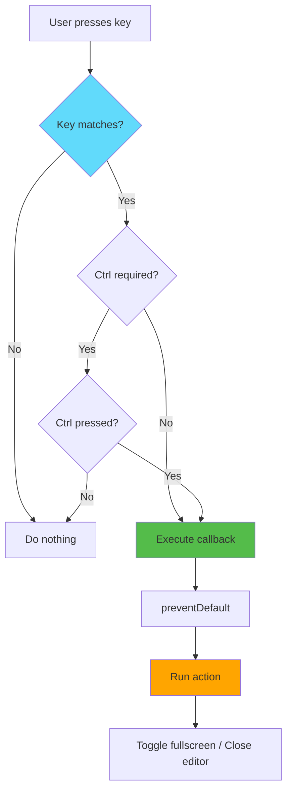
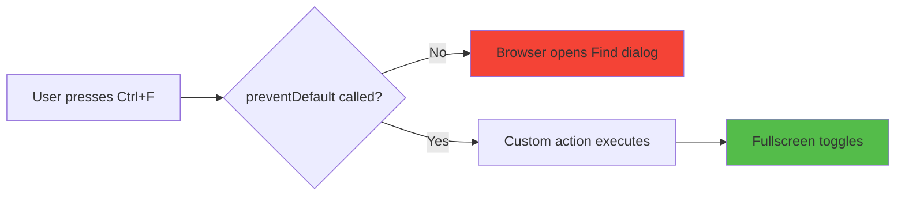
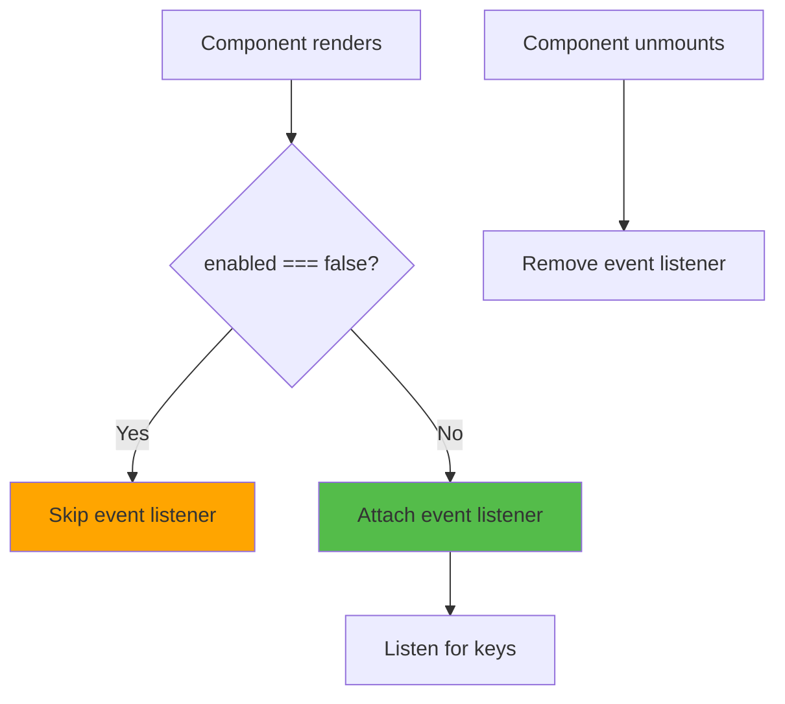

# Slide 9: Keyboard Shortcuts

**Branch:** `react/09-keyboard-shortcuts`

---

## 🎯 What are Keyboard Shortcuts?

Reusable custom hooks that enable keyboard-based interactions for toggling fullscreen mode. Users can press Ctrl+F to expand any textarea or Escape to close the fullscreen editor, providing a seamless keyboard-driven workflow.

Key points:
- ⚡ **Custom Hook Pattern** - Reusable `useKeyboardShortcut` for any key combination
- 🎨 **Prevent Default Behavior** - Override browser's built-in shortcuts
- 📦 **Conditional Listeners** - Enable/disable based on component state
- 🔄 **Memory Leak Prevention** - Proper cleanup on unmount
- 🛠️ **Configurable Modifiers** - Support Ctrl, Alt, Shift combinations

---

## 📂 Files to Explore

<details>
<summary><b>New/Modified Files</b></summary>

- 📄 [hooks/useKeyboardShortcut.ts](../textarea-fullscreen-react/hooks/useKeyboardShortcut.ts)
- 📄 [components/TextareaWrapper/index.tsx](../textarea-fullscreen-react/components/TextareaWrapper/index.tsx)
- 📄 [components/FullscreenEditor/index.tsx](../textarea-fullscreen-react/components/FullscreenEditor/index.tsx)

</details>

<details>
<summary><b>Supporting Files</b></summary>

- 📄 [utils/constants.ts](../textarea-fullscreen-react/utils/constants.ts)
- 📄 [hooks/useSettings.ts](../textarea-fullscreen-react/hooks/useSettings.ts)

</details>

---

## ✅ What's New in This Slide

- ✅ Created reusable `useKeyboardShortcut` custom hook
- ✅ Implemented Ctrl+F to toggle fullscreen
- ✅ Added Escape key to close editor
- ✅ Prevented browser default actions (e.g., Ctrl+F = Find)
- ✅ Made shortcuts configurable via settings
- ✅ Added conditional listener activation
- ✅ Implemented proper cleanup to prevent memory leaks

---

**Next:** [Slide 10: Complete Integration](./10-settings-popup.md)  

---

## 📑 Deep Dive

- [How It Works](#how-it-works)
- [Implementation Steps](#implementation-steps)
- [Key Concepts](#key-concepts)
- [Code Examples](#code-examples)
- [Common Patterns](#common-patterns)
- [Documentation](#documentation)
- [Challenge](#challenge)

---

## How It Works



**Keyboard event flow:**
```
1. User presses key combination (e.g., Ctrl+F)
2. Browser captures keydown event
3. useKeyboardShortcut hook receives event
4. Checks if key matches
5. Checks if modifiers match (Ctrl, Alt, Shift)
6. Calls e.preventDefault() to block browser action
7. Executes callback function
8. Fullscreen toggles or closes
```

---

## Implementation Steps

### 1. Create Custom Hook File

```bash
touch hooks/useKeyboardShortcut.ts
```

---

### 2. Define Hook Interface

```typescript
// hooks/useKeyboardShortcut.ts
import { useEffect } from 'react';

interface KeyboardShortcutOptions {
  ctrl?: boolean;
  alt?: boolean;
  shift?: boolean;
  enabled?: boolean;
}

export function useKeyboardShortcut(
  key: string,
  callback: () => void,
  options: KeyboardShortcutOptions = {}
) {
  // Implementation
}
```

**Parameters:**
- `key` - The key to listen for ('f', 'Escape', 'Enter', etc.)
- `callback` - Function to execute when key is pressed
- `options` - Configuration object for modifiers and enable/disable

---

### 3. Implement Basic Key Detection

```typescript
// hooks/useKeyboardShortcut.ts
export function useKeyboardShortcut(
  key: string,
  callback: () => void,
  options: KeyboardShortcutOptions = {}
) {
  useEffect(() => {
    const handleKeyDown = (e: KeyboardEvent) => {
      // Check if key matches (case-insensitive)
      if (e.key.toLowerCase() === key.toLowerCase()) {
        callback();
      }
    };

    document.addEventListener('keydown', handleKeyDown);
    
    // Cleanup
    return () => document.removeEventListener('keydown', handleKeyDown);
  }, [key, callback]);
}
```

---

### 4. Add Modifier Key Support

```typescript
// hooks/useKeyboardShortcut.ts
export function useKeyboardShortcut(
  key: string,
  callback: () => void,
  options: KeyboardShortcutOptions = {}
) {
  useEffect(() => {
    const handleKeyDown = (e: KeyboardEvent) => {
      // Check modifier keys
      const ctrlMatch = options.ctrl ? e.ctrlKey || e.metaKey : true;
      const altMatch = options.alt ? e.altKey : true;
      const shiftMatch = options.shift ? e.shiftKey : true;
      
      // Check if key matches
      const keyMatch = e.key.toLowerCase() === key.toLowerCase();
      
      // All conditions must be true
      if (keyMatch && ctrlMatch && altMatch && shiftMatch) {
        callback();
      }
    };

    document.addEventListener('keydown', handleKeyDown);
    return () => document.removeEventListener('keydown', handleKeyDown);
  }, [key, callback, options.ctrl, options.alt, options.shift]);
}
```

**Why `e.metaKey`?**
- On Mac, Cmd key is used instead of Ctrl
- `metaKey` captures Cmd key
- Ensures cross-platform compatibility

---

### 5. Add preventDefault and Enabled Flag

```typescript
// hooks/useKeyboardShortcut.ts (complete)
import { useEffect } from 'react';

interface KeyboardShortcutOptions {
  ctrl?: boolean;
  alt?: boolean;
  shift?: boolean;
  enabled?: boolean;
}

export function useKeyboardShortcut(
  key: string,
  callback: () => void,
  options: KeyboardShortcutOptions = {}
) {
  useEffect(() => {
    // Don't attach listener if disabled
    if (options.enabled === false) return;

    const handleKeyDown = (e: KeyboardEvent) => {
      // Check modifier keys
      const ctrlMatch = options.ctrl ? (e.ctrlKey || e.metaKey) : true;
      const altMatch = options.alt ? e.altKey : true;
      const shiftMatch = options.shift ? e.shiftKey : true;
      
      // Check key match
      const keyMatch = e.key.toLowerCase() === key.toLowerCase();
      
      if (keyMatch && ctrlMatch && altMatch && shiftMatch) {
        // Prevent browser default action
        e.preventDefault();
        
        // Execute callback
        callback();
      }
    };

    document.addEventListener('keydown', handleKeyDown);
    
    return () => {
      document.removeEventListener('keydown', handleKeyDown);
    };
  }, [key, callback, options.ctrl, options.alt, options.shift, options.enabled]);
}
```

---

### 6. Use in TextareaWrapper

```tsx
// components/TextareaWrapper/index.tsx
import { useRef, useEffect } from 'react';

export function TextareaWrapper({ textarea }: Props) {
  const { settings } = useSettings();
  const { isExpanded, toggle } = useFullscreen(textarea);
  const wrapperRef = useRef<HTMLDivElement>(null);

  // Ctrl+F to toggle fullscreen (uses settings.shortcutKey)
  useKeyboardShortcut(settings.shortcutKey, toggle, { 
    ctrl: true 
  });

  // ... rest of component
}
```

---

### 7. Use in FullscreenEditor

```tsx
// components/FullscreenEditor/index.tsx
export function FullscreenEditor({ textarea, isExpanded, onClose }: Props) {
  const cloneRef = useRef<HTMLTextAreaElement>(null);

  // Escape to close (only when expanded)
  useKeyboardShortcut('Escape', onClose, {
    enabled: isExpanded
  });

  // Content sync effect
  useEffect(() => {
    // ... existing sync code
  }, [isExpanded, textarea]);

  if (!isExpanded) return null;

  return createPortal(
    <div className="tx-fullscreen-editor">
      <textarea ref={cloneRef} />
      <FullscreenButton onClick={onClose} isExpanded={true} />
    </div>,
    document.body
  );
}
```

---

## Key Concepts

### Concept 1: Event.preventDefault()



**Without preventDefault:**
```typescript
// ❌ Browser's default action runs
const handleKeyDown = (e: KeyboardEvent) => {
  if (e.ctrlKey && e.key === 'f') {
    toggle(); // Your action
    // Browser ALSO opens Find dialog
  }
};
```

**With preventDefault:**
```typescript
// ✅ Only your action runs
const handleKeyDown = (e: KeyboardEvent) => {
  if (e.ctrlKey && e.key === 'f') {
    e.preventDefault(); // Blocks browser action
    toggle(); // Only your action runs
  }
};
```

---

### Concept 2: Modifier Keys

**Keyboard event properties:**
```typescript
interface KeyboardEvent {
  key: string;       // 'f', 'Escape', 'Enter', etc.
  ctrlKey: boolean;  // Ctrl key pressed?
  metaKey: boolean;  // Cmd (Mac) or Win key pressed?
  altKey: boolean;   // Alt/Option key pressed?
  shiftKey: boolean; // Shift key pressed?
}
```

**Common combinations:**
```typescript
// Ctrl+F (or Cmd+F on Mac)
if ((e.ctrlKey || e.metaKey) && e.key === 'f') { }

// Alt+S
if (e.altKey && e.key === 's') { }

// Shift+Enter
if (e.shiftKey && e.key === 'Enter') { }

// Ctrl+Shift+K
if (e.ctrlKey && e.shiftKey && e.key === 'k') { }
```

---

### Concept 3: Conditional Event Listeners



**Why conditional?**
```typescript
// Only listen when editor is open
useKeyboardShortcut('Escape', onClose, {
  enabled: isExpanded  // ← Only active when true
});

// Always listen
useKeyboardShortcut('f', toggle, {
  ctrl: true
  // enabled not set = always active
});
```

**Benefits:**
- Saves resources when not needed
- Prevents unintended triggers
- Better performance

---

### Concept 4: Memory Leaks Prevention

**Problem:**
```typescript
// ❌ Memory leak - listener never removed
useEffect(() => {
  document.addEventListener('keydown', handleKeyDown);
  // Missing cleanup!
}, []);
```

**Solution:**
```typescript
// ✅ Proper cleanup
useEffect(() => {
  document.addEventListener('keydown', handleKeyDown);
  
  return () => {
    document.removeEventListener('keydown', handleKeyDown);
  };
}, []);
```

**What happens:**
1. Component mounts → Event listener attached
2. Component re-renders → Old listener removed, new attached
3. Component unmounts → Listener removed
4. No memory leaks! ✅

---

## Code Examples

### Example 1: Basic Usage

```tsx
// Simple Escape key handler
function Modal({ onClose }) {
  useKeyboardShortcut('Escape', onClose);
  
  return <div className="modal">Modal content</div>;
}
```

---

### Example 2: With Ctrl Modifier

```tsx
// Ctrl+S to save
function Editor({ onSave }) {
  useKeyboardShortcut('s', onSave, { ctrl: true });
  
  return <textarea />;
}
```

---

### Example 3: Conditional Activation

```tsx
// Only active when modal is open
function App() {
  const [isOpen, setIsOpen] = useState(false);
  
  useKeyboardShortcut('Escape', () => setIsOpen(false), {
    enabled: isOpen  // Only listen when modal is open
  });
  
  return (
    <>
      <button onClick={() => setIsOpen(true)}>Open</button>
      {isOpen && <Modal />}
    </>
  );
}
```

---

### Example 4: Multiple Shortcuts

```tsx
// Multiple keyboard shortcuts in one component
function TextEditor() {
  const [content, setContent] = useState('');
  const [isBold, setIsBold] = useState(false);
  
  // Ctrl+B for bold
  useKeyboardShortcut('b', () => setIsBold(!isBold), { 
    ctrl: true 
  });
  
  // Ctrl+S for save
  useKeyboardShortcut('s', () => save(content), { 
    ctrl: true 
  });
  
  // Ctrl+Z for undo
  useKeyboardShortcut('z', () => undo(), { 
    ctrl: true 
  });
  
  return <textarea value={content} onChange={e => setContent(e.target.value)} />;
}
```

---

### Example 5: Production Version with All Features

```typescript
// hooks/useKeyboardShortcut.ts (complete)
import { useEffect, useCallback, useRef } from 'react';

interface KeyboardShortcutOptions {
  ctrl?: boolean;
  alt?: boolean;
  shift?: boolean;
  enabled?: boolean;
  preventDefault?: boolean;
}

export function useKeyboardShortcut(
  key: string,
  callback: () => void,
  options: KeyboardShortcutOptions = {}
) {
  const callbackRef = useRef(callback);
  
  // Keep callback ref updated
  useEffect(() => {
    callbackRef.current = callback;
  }, [callback]);

  useEffect(() => {
    // Skip if disabled
    if (options.enabled === false) return;

    const handleKeyDown = (e: KeyboardEvent) => {
      // Check modifier keys
      const ctrlMatch = options.ctrl ? (e.ctrlKey || e.metaKey) : !e.ctrlKey && !e.metaKey;
      const altMatch = options.alt ? e.altKey : !e.altKey;
      const shiftMatch = options.shift ? e.shiftKey : !e.shiftKey;
      
      // Check key match
      const keyMatch = e.key.toLowerCase() === key.toLowerCase();
      
      if (keyMatch && ctrlMatch && altMatch && shiftMatch) {
        // Prevent default if specified (default: true)
        if (options.preventDefault !== false) {
          e.preventDefault();
        }
        
        // Execute callback
        callbackRef.current();
      }
    };

    document.addEventListener('keydown', handleKeyDown);
    
    return () => {
      document.removeEventListener('keydown', handleKeyDown);
    };
  }, [key, options.ctrl, options.alt, options.shift, options.enabled, options.preventDefault]);
}
```

---

## Common Patterns

<details>
<summary><b>Pattern 1: Toggle Shortcuts</b></summary>

```tsx
function Component() {
  const [isActive, setIsActive] = useState(false);
  
  // Toggle with same key
  useKeyboardShortcut('t', () => setIsActive(prev => !prev), {
    ctrl: true
  });
  
  return <div>{isActive ? 'Active' : 'Inactive'}</div>;
}
```

**When to use:**
- Toggle states (on/off, open/close)
- Same key for both actions
- Simple state changes

</details>

<details>
<summary><b>Pattern 2: Context-Aware Shortcuts</b></summary>

```tsx
function Editor() {
  const [mode, setMode] = useState<'edit' | 'preview'>('edit');
  
  // Different action based on mode
  useKeyboardShortcut('Enter', () => {
    if (mode === 'edit') {
      save();
    } else {
      setMode('edit');
    }
  }, { ctrl: true });
  
  return <div>Mode: {mode}</div>;
}
```

**When to use:**
- Same shortcut, different contexts
- State-dependent actions
- Modal dialogs

</details>

<details>
<summary><b>Pattern 3: Shortcut Chains</b></summary>

```tsx
function App() {
  const [commandMode, setCommandMode] = useState(false);
  
  // Ctrl+K enters command mode
  useKeyboardShortcut('k', () => setCommandMode(true), {
    ctrl: true
  });
  
  // Then 'S' to save (only in command mode)
  useKeyboardShortcut('s', () => {
    save();
    setCommandMode(false);
  }, {
    enabled: commandMode
  });
  
  // Then 'Q' to quit (only in command mode)
  useKeyboardShortcut('q', () => {
    quit();
    setCommandMode(false);
  }, {
    enabled: commandMode
  });
  
  return <div>{commandMode && 'Command mode active'}</div>;
}
```

**When to use:**
- VS Code-style shortcuts (Ctrl+K, then S)
- Vim-like command modes
- Multi-step actions

</details>

<details>
<summary><b>Pattern 4: Scoped Shortcuts</b></summary>

```tsx
function Component() {
  const elementRef = useRef<HTMLDivElement>(null);
  
  useEffect(() => {
    const element = elementRef.current;
    if (!element) return;
    
    const handleKeyDown = (e: KeyboardEvent) => {
      if (e.key === 'Enter') {
        console.log('Enter pressed inside this element');
      }
    };
    
    // Listen only on this element
    element.addEventListener('keydown', handleKeyDown);
    return () => element.removeEventListener('keydown', handleKeyDown);
  }, []);
  
  return <div ref={elementRef} tabIndex={0}>Focused element</div>;
}
```

**When to use:**
- Shortcuts only in specific areas
- Multiple editors on same page
- Prevent global conflicts

</details>

---

## Documentation

<details>
<summary><b>Related Resources</b></summary>

- 📚 [KeyboardEvent - MDN](https://developer.mozilla.org/en-US/docs/Web/API/KeyboardEvent)
- 📚 [Event.preventDefault() - MDN](https://developer.mozilla.org/en-US/docs/Web/API/Event/preventDefault)
- 🎓 [Keyboard Events - JavaScript.info](https://javascript.info/keyboard-events)
- 💡 [React useEffect - React Docs](https://react.dev/reference/react/useEffect)
- 🎓 [Web Extension Keyboard Shortcuts](https://developer.mozilla.org/en-US/docs/Mozilla/Add-ons/WebExtensions/manifest.json/commands)

</details>

---

## Challenge

**Try this yourself:**

1. **Add multiple shortcut support:**
   - Allow array of keys: `['f', 'F']`
   - Match any key in array
   - Useful for case variations

2. **Implement shortcut recorder:**
   - Input field that captures key press
   - Display: "Ctrl+Shift+K"
   - Save to settings
   - Users customize their shortcuts

3. **Add shortcut conflicts detection:**
   - Warn if shortcut already used
   - Show list of active shortcuts
   - Suggest alternatives

**Expected result:**
```tsx
<ShortcutRecorder
  value={settings.shortcut}
  onChange={setShortcut}
  conflicts={['Ctrl+F', 'Ctrl+S']}
/>

// Displays: "Press keys..."
// User presses Ctrl+K
// Displays: "Ctrl+K"
// Check conflicts → Shows warning if used
```

**Bonus:**
- Add global shortcuts (work anywhere, not just in textarea)
- Implement shortcut sequences (Ctrl+K, then S)
- Add visual shortcut cheatsheet overlay

---

**Next:** [Slide 10: Complete Integration](./10-settings-popup.md)