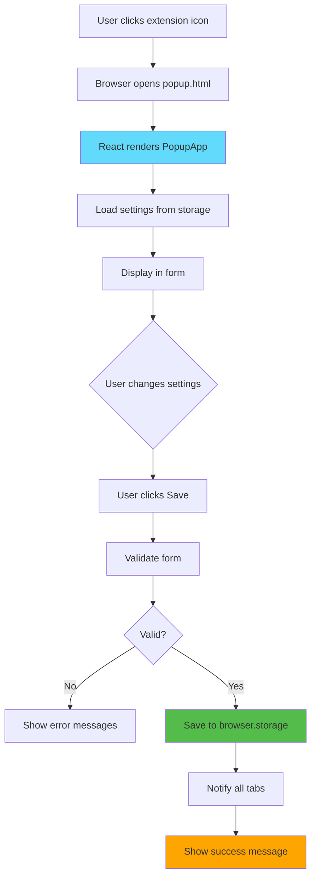
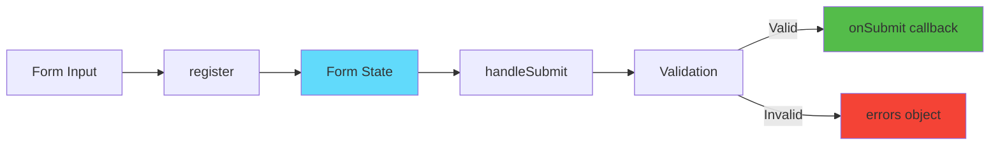
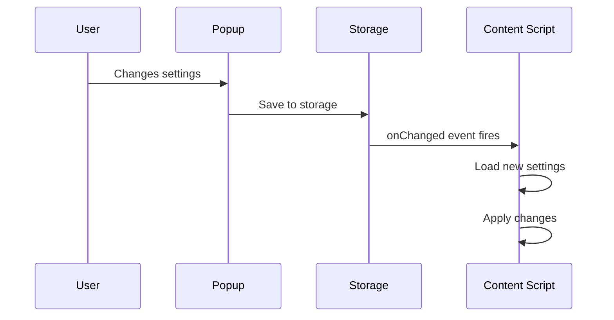

# Slide 10: Settings Popup UI

**Branch:** `react/10-settings-popup`

---

## 🎯 What is Settings Popup?

A settings interface that appears when users click the extension icon in the browser toolbar. Built with React and react-hook-form, it provides a user-friendly way to configure extension behavior, keyboard shortcuts, and excluded domains.

Key points:
- ⚡ **Popup Entrypoint** - Separate HTML page for settings UI
- 🎨 **React Hook Form** - Efficient form management with validation
- 📦 **Browser Storage** - Save/load settings using browser.storage API
- 🔄 **Real-time Updates** - Settings apply across all tabs
- 🛠️ **Form Validation** - Client-side validation with error messages

---

## 📂 Files to Explore

<details>
<summary><b>New/Modified Files</b></summary>

- 📄 [entrypoints/popup/App.tsx](../textarea-fullscreen-react/entrypoints/popup/App.tsx)
- 📄 [entrypoints/popup/index.html](../textarea-fullscreen-react/entrypoints/popup/index.html)
- 📄 [entrypoints/popup/main.tsx](../textarea-fullscreen-react/entrypoints/popup/main.tsx)
- 📄 [components/SettingsForm/index.tsx](../textarea-fullscreen-react/components/SettingsForm/index.tsx)
- 📄 [components/SettingsForm/style.css](../textarea-fullscreen-react/components/SettingsForm/style.css)

</details>

<details>
<summary><b>Supporting Files</b></summary>

- 📄 [hooks/useSettings.ts](../textarea-fullscreen-react/hooks/useSettings.ts)
- 📄 [utils/constants.ts](../textarea-fullscreen-react/utils/constants.ts)
- 📄 [manifest.json](../textarea-fullscreen-react/manifest.json)

</details>

---

## ✅ What's New in This Slide

- ✅ Created popup entrypoint with HTML page
- ✅ Built settings form with react-hook-form
- ✅ Added form validation (required fields, max length)
- ✅ Integrated browser.storage for persistence
- ✅ Created SettingsForm component
- ✅ Added success/error messages
- ✅ Implemented real-time settings sync

---

**Next:** [Slide 11: Storage Integration](./11-storage-api.md)

---

## 📑 Deep Dive

- [How It Works](#how-it-works)
- [Implementation Steps](#implementation-steps)
- [Key Concepts](#key-concepts)
- [Code Examples](#code-examples)
- [Common Patterns](#common-patterns)
- [Documentation](#documentation)
- [Challenge](#challenge)

---

## How It Works



**Flow explanation:**
1. User clicks extension icon → Browser opens popup
2. Popup loads current settings from storage
3. Form displays with current values
4. User makes changes
5. On submit, form validates inputs
6. Valid data saves to browser.storage
7. All content scripts receive update notification
8. Success message displays

---

## Implementation Steps

### 1. Update Manifest for Popup

```json
// manifest.json
{
  "manifest_version": 3,
  "name": "Textarea Fullscreen",
  "action": {
    "default_popup": "popup.html",
    "default_title": "Textarea Fullscreen Settings"
  },
  "permissions": ["storage"]
}
```

**What this does:**
- `action.default_popup` - Opens popup.html when icon clicked
- `permissions: ["storage"]` - Allows using browser.storage API

---

### 2. Create Popup HTML Entrypoint

```html
<!-- entrypoints/popup/index.html -->
<!DOCTYPE html>
<html lang="en">
  <head>
    <meta charset="UTF-8" />
    <meta name="viewport" content="width=device-width, initial-scale=1.0" />
    <title>Textarea Fullscreen Settings</title>
  </head>
  <body>
    <div id="root"></div>
    <script type="module" src="./main.tsx"></script>
  </body>
</html>
```

**Structure:**
- Minimal HTML skeleton
- Root div for React
- Module script loads React app

---

### 3. Create React Entry Point

```tsx
// entrypoints/popup/main.tsx
import React from 'react';
import { createRoot } from 'react-dom/client';
import App from './App';
import './style.css';

const root = createRoot(document.getElementById('root')!);
root.render(
  <React.StrictMode>
    <App />
  </React.StrictMode>
);
```

---

### 4. Install react-hook-form

```bash
npm install react-hook-form
```

**Why react-hook-form?**
- Minimal re-renders (better performance)
- Built-in validation
- Easy form state management
- Small bundle size

---

### 5. Create Settings Interface

```typescript
// types/settings.ts
export interface Settings {
  enabled: boolean;
  overlay: boolean;
  shortcutKey: string;
  excludedDomains: string;
}
```

---

### 6. Build Settings Form Component

```tsx
// components/SettingsForm/index.tsx
import { useForm } from 'react-hook-form';
import './style.css';

interface SettingsFormProps {
  settings: Settings;
  onSave: (data: Settings) => void;
}

export function SettingsForm({ settings, onSave }: SettingsFormProps) {
  const { 
    register, 
    handleSubmit, 
    formState: { errors } 
  } = useForm<Settings>({
    defaultValues: settings
  });

  return (
    <form onSubmit={handleSubmit(onSave)} className="settings-form">
      {/* Enable extension checkbox */}
      <div className="form-group">
        <label>
          <input type="checkbox" {...register('enabled')} />
          Enable extension
        </label>
      </div>

      {/* Show overlay checkbox */}
      <div className="form-group">
        <label>
          <input type="checkbox" {...register('overlay')} />
          Show overlay
        </label>
      </div>

      {/* Shortcut key input */}
      <div className="form-group">
        <label htmlFor="shortcutKey">Shortcut Key</label>
        <input
          id="shortcutKey"
          {...register('shortcutKey', { 
            required: 'Shortcut key is required',
            maxLength: {
              value: 1,
              message: 'Only one character allowed'
            }
          })}
        />
        {errors.shortcutKey && (
          <span className="error">{errors.shortcutKey.message}</span>
        )}
      </div>

      {/* Excluded domains textarea */}
      <div className="form-group">
        <label htmlFor="excludedDomains">
          Excluded Domains (one per line)
        </label>
        <textarea
          id="excludedDomains"
          {...register('excludedDomains')}
          rows={4}
          placeholder="mail.google.com&#10;docs.google.com"
        />
      </div>

      <button type="submit">Save Settings</button>
    </form>
  );
}
```

**Key parts:**
- `register()` - Connects inputs to form state
- `handleSubmit()` - Handles form submission with validation
- `errors` - Contains validation errors
- Validation rules inline with register

---

### 7. Create Popup App

```tsx
// entrypoints/popup/App.tsx
import { useState } from 'react';
import { SettingsForm } from '@/components/SettingsForm';
import { useSettings } from '@/hooks/useSettings';
import './style.css';

export default function App() {
  const { settings, loading, saveSettings } = useSettings();
  const [statusMessage, setStatusMessage] = useState('');

  const handleSave = async (newSettings: Settings) => {
    try {
      await saveSettings(newSettings);
      setStatusMessage('✓ Settings saved successfully!');
      setTimeout(() => setStatusMessage(''), 2000);
    } catch (error) {
      setStatusMessage('✗ Failed to save settings');
    }
  };

  if (loading) {
    return <div className="loading">Loading...</div>;
  }

  return (
    <div className="popup-container">
      <h3>⛶ Textarea Fullscreen</h3>
      
      {statusMessage && (
        <div className={`message ${statusMessage.startsWith('✓') ? 'success' : 'error'}`}>
          {statusMessage}
        </div>
      )}
      
      <SettingsForm settings={settings} onSave={handleSave} />
      
      <div className="info-box">
        <strong>ℹ️ Tip:</strong>
        Press Ctrl+{settings.shortcutKey.toUpperCase()} to toggle fullscreen
      </div>
    </div>
  );
}
```

---

### 8. Add Styling

```css
/* entrypoints/popup/style.css */
.popup-container {
  width: 350px;
  padding: 16px;
  font-family: -apple-system, BlinkMacSystemFont, 'Segoe UI', sans-serif;
}

.popup-container h3 {
  margin: 0 0 16px 0;
  font-size: 18px;
  color: #333;
}

.message {
  padding: 8px 12px;
  margin-bottom: 12px;
  border-radius: 4px;
  font-size: 14px;
  text-align: center;
}

.message.success {
  background: #e8f5e9;
  color: #2e7d32;
  border: 1px solid #4caf50;
}

.message.error {
  background: #ffebee;
  color: #c62828;
  border: 1px solid #f44336;
}

.loading {
  padding: 20px;
  text-align: center;
}

.info-box {
  margin-top: 12px;
  padding: 8px;
  background: #fff3cd;
  border: 1px solid #ffc107;
  border-radius: 4px;
  font-size: 12px;
  color: #856404;
}
```

```css
/* components/SettingsForm/style.css */
.settings-form {
  display: flex;
  flex-direction: column;
  gap: 16px;
}

.form-group {
  display: flex;
  flex-direction: column;
  gap: 6px;
}

.form-group label {
  font-size: 14px;
  font-weight: 500;
  color: #333;
}

.form-group input[type="text"],
.form-group textarea {
  padding: 8px;
  border: 1px solid #ccc;
  border-radius: 4px;
  font-size: 14px;
  font-family: inherit;
}

.form-group input[type="text"]:focus,
.form-group textarea:focus {
  outline: none;
  border-color: #0066cc;
  box-shadow: 0 0 0 2px rgba(0, 102, 204, 0.1);
}

.form-group input[type="checkbox"] {
  margin-right: 8px;
}

.error {
  color: #c62828;
  font-size: 12px;
}

button[type="submit"] {
  padding: 10px 16px;
  background: #0066cc;
  color: white;
  border: none;
  border-radius: 4px;
  font-size: 14px;
  font-weight: 500;
  cursor: pointer;
  transition: background 0.2s;
}

button[type="submit"]:hover {
  background: #0052a3;
}

button[type="submit"]:active {
  transform: translateY(1px);
}
```

---

## Key Concepts

### Concept 1: react-hook-form



**Core functions:**

| Function | Purpose |
|----------|---------|
| `register()` | Connect input to form state |
| `handleSubmit()` | Handle form submission with validation |
| `formState.errors` | Access validation errors |
| `watch()` | Watch specific field values |
| `reset()` | Reset form to default values |

**Example:**
```tsx
const { register, handleSubmit, formState: { errors } } = useForm({
  defaultValues: { name: 'John' }
});

// Register input
<input {...register('name', { required: true, maxLength: 20 })} />

// Show errors
{errors.name && <span>This field is required</span>}

// Handle submit
<form onSubmit={handleSubmit(data => console.log(data))}>
```

---

### Concept 2: Browser Storage API

**Storage types:**

| Type | Scope | Sync | Size Limit |
|------|-------|------|------------|
| `storage.local` | Per device | ❌ No | ~5MB |
| `storage.sync` | Across devices | ✅ Yes | ~100KB |
| `storage.session` | Per session | ❌ No | ~1MB |

**Usage:**
```typescript
import browser from 'webextension-polyfill';

// Save
await browser.storage.sync.set({ key: 'value' });

// Load
const data = await browser.storage.sync.get('key');
console.log(data.key); // 'value'

// Listen for changes
browser.storage.onChanged.addListener((changes, area) => {
  if (area === 'sync' && changes.key) {
    console.log('Old:', changes.key.oldValue);
    console.log('New:', changes.key.newValue);
  }
});
```

---

### Concept 3: Form Validation

**Validation rules:**
```tsx
<input 
  {...register('email', {
    required: 'Email is required',
    pattern: {
      value: /^[A-Z0-9._%+-]+@[A-Z0-9.-]+\.[A-Z]{2,}$/i,
      message: 'Invalid email address'
    }
  })}
/>

<input
  {...register('age', {
    min: { value: 18, message: 'Must be 18+' },
    max: { value: 120, message: 'Invalid age' },
    valueAsNumber: true
  })}
/>

<input
  {...register('username', {
    required: true,
    minLength: { value: 3, message: 'Too short' },
    maxLength: { value: 20, message: 'Too long' },
    validate: {
      noSpaces: v => !/\s/.test(v) || 'No spaces allowed',
      notTaken: async v => {
        const taken = await checkUsername(v);
        return !taken || 'Username taken';
      }
    }
  })}
/>
```

---

### Concept 4: Popup vs Content Script Communication



**How they communicate:**

1. **Via Storage (Recommended):**
   ```typescript
   // Popup saves
   await browser.storage.sync.set({ enabled: false });
   
   // Content script listens
   browser.storage.onChanged.addListener((changes) => {
     if (changes.enabled) {
       applyNewSettings(changes.enabled.newValue);
     }
   });
   ```

2. **Via Messages:**
   ```typescript
   // Popup sends message
   browser.tabs.sendMessage(tabId, { type: 'UPDATE_SETTINGS', data });
   
   // Content script receives
   browser.runtime.onMessage.addListener((message) => {
     if (message.type === 'UPDATE_SETTINGS') {
       applySettings(message.data);
     }
   });
   ```

---

## Code Examples

### Example 1: Simple Form

```tsx
import { useForm } from 'react-hook-form';

export function SimpleSettings() {
  const { register, handleSubmit } = useForm({
    defaultValues: {
      enabled: true,
      theme: 'dark'
    }
  });

  const onSubmit = (data) => {
    console.log('Saving:', data);
  };

  return (
    <form onSubmit={handleSubmit(onSubmit)}>
      <label>
        <input type="checkbox" {...register('enabled')} />
        Enable
      </label>
      
      <select {...register('theme')}>
        <option value="light">Light</option>
        <option value="dark">Dark</option>
      </select>
      
      <button type="submit">Save</button>
    </form>
  );
}
```

---

### Example 2: With Validation

```tsx
export function ValidatedForm() {
  const { register, handleSubmit, formState: { errors } } = useForm();

  return (
    <form onSubmit={handleSubmit(data => console.log(data))}>
      <input
        {...register('name', {
          required: 'Name is required',
          minLength: { value: 3, message: 'Too short' }
        })}
      />
      {errors.name && <span>{errors.name.message}</span>}
      
      <input
        type="number"
        {...register('age', {
          required: true,
          min: { value: 1, message: 'Must be positive' },
          max: { value: 120, message: 'Invalid' }
        })}
      />
      {errors.age && <span>{errors.age.message}</span>}
      
      <button>Submit</button>
    </form>
  );
}
```

---

### Example 3: With Storage Integration

```tsx
import { useForm } from 'react-hook-form';
import browser from 'webextension-polyfill';

export function StorageForm() {
  const [settings, setSettings] = useState(null);
  const { register, handleSubmit, reset } = useForm();

  // Load on mount
  useEffect(() => {
    browser.storage.sync.get('settings').then(data => {
      setSettings(data.settings || {});
      reset(data.settings);
    });
  }, [reset]);

  const onSubmit = async (data) => {
    await browser.storage.sync.set({ settings: data });
    alert('Saved!');
  };

  if (!settings) return <div>Loading...</div>;

  return (
    <form onSubmit={handleSubmit(onSubmit)}>
      <input {...register('name')} />
      <button>Save</button>
    </form>
  );
}
```

---

### Example 4: Production Version

```tsx
// entrypoints/popup/App.tsx (complete)
import { useState, useEffect } from 'react';
import { useForm } from 'react-hook-form';
import browser from 'webextension-polyfill';

interface Settings {
  enabled: boolean;
  overlay: boolean;
  shortcutKey: string;
  excludedDomains: string;
}

const DEFAULT_SETTINGS: Settings = {
  enabled: true,
  overlay: true,
  shortcutKey: 'f',
  excludedDomains: ''
};

export default function App() {
  const [loading, setLoading] = useState(true);
  const [statusMessage, setStatusMessage] = useState('');
  
  const { register, handleSubmit, reset, formState: { errors } } = useForm<Settings>({
    defaultValues: DEFAULT_SETTINGS
  });

  // Load settings on mount
  useEffect(() => {
    browser.storage.sync.get(DEFAULT_SETTINGS).then(data => {
      reset(data as Settings);
      setLoading(false);
    });
  }, [reset]);

  const onSubmit = async (data: Settings) => {
    try {
      await browser.storage.sync.set(data);
      setStatusMessage('✓ Saved successfully!');
      
      // Notify content scripts
      const tabs = await browser.tabs.query({});
      tabs.forEach(tab => {
        if (tab.id) {
          browser.tabs.sendMessage(tab.id, {
            type: 'SETTINGS_UPDATED',
            settings: data
          }).catch(() => {}); // Ignore errors
        }
      });
      
      setTimeout(() => setStatusMessage(''), 2000);
    } catch (error) {
      setStatusMessage('✗ Failed to save');
    }
  };

  if (loading) return <div>Loading...</div>;

  return (
    <div className="popup">
      <h3>⛶ Textarea Fullscreen</h3>
      
      {statusMessage && <div className="status">{statusMessage}</div>}
      
      <form onSubmit={handleSubmit(onSubmit)}>
        <label>
          <input type="checkbox" {...register('enabled')} />
          Enable extension
        </label>
        
        <label>
          <input type="checkbox" {...register('overlay')} />
          Show overlay
        </label>
        
        <label>
          Shortcut Key
          <input
            {...register('shortcutKey', {
              required: true,
              maxLength: { value: 1, message: 'One character only' }
            })}
          />
          {errors.shortcutKey && <span className="error">{errors.shortcutKey.message}</span>}
        </label>
        
        <label>
          Excluded Domains
          <textarea {...register('excludedDomains')} rows={3} />
          <small>One per line</small>
        </label>
        
        <button type="submit">Save Settings</button>
      </form>
    </div>
  );
}
```

---

## Common Patterns

<details>
<summary><b>Pattern 1: Form Reset</b></summary>

```tsx
const { register, handleSubmit, reset } = useForm();

// Reset to default values
const handleReset = () => {
  reset({
    enabled: true,
    theme: 'light'
  });
};

// Reset to loaded data
useEffect(() => {
  loadSettings().then(data => {
    reset(data); // Populate form with loaded data
  });
}, [reset]);
```

**When to use:**
- Reload form with fresh data
- Reset to defaults
- Cancel changes

</details>

<details>
<summary><b>Pattern 2: Watch Field Values</b></summary>

```tsx
const { register, watch } = useForm();

// Watch single field
const enabled = watch('enabled');

// Watch multiple fields
const [enabled, theme] = watch(['enabled', 'theme']);

// Watch all fields
const formData = watch();

return (
  <div>
    <input type="checkbox" {...register('enabled')} />
    {enabled && <p>Extension is enabled!</p>}
  </div>
);
```

**When to use:**
- Show/hide fields based on other fields
- Real-time validation feedback
- Preview changes

</details>

<details>
<summary><b>Pattern 3: Async Validation</b></summary>

```tsx
<input
  {...register('username', {
    validate: {
      checkAvailable: async (value) => {
        const response = await fetch(`/api/check/${value}`);
        const available = await response.json();
        return available || 'Username taken';
      }
    }
  })}
/>
```

**When to use:**
- Check username/email availability
- Verify API keys
- Domain validation

</details>

---

## Documentation

<details>
<summary><b>Related Resources</b></summary>

- 📚 [react-hook-form Docs](https://react-hook-form.com/)
- 📚 [Browser Storage API](https://developer.mozilla.org/en-US/docs/Mozilla/Add-ons/WebExtensions/API/storage)
- 🎓 [Chrome Extension Popup](https://developer.chrome.com/docs/extensions/mv3/user_interface/#popup)
- 💡 [Form Validation Patterns](https://react-hook-form.com/advanced-usage#FormProviderPerformance)
- 🎓 [webextension-polyfill](https://github.com/mozilla/webextension-polyfill)

</details>

---

## Challenge

**Try this yourself:**

1. **Add advanced settings section:**
   - Collapsible "Advanced" section
   - Font size slider (12-24px)
   - Color picker for editor background
   - Export/import settings as JSON

2. **Implement form validation:**
   - Shortcut key must not be a reserved key
   - Excluded domains must be valid hostnames
   - Show validation in real-time (not just on submit)

3. **Add settings presets:**
   - "Minimal", "Default", "Power User" presets
   - One-click apply preset
   - Save custom preset

**Expected result:**
```tsx
<select onChange={applyPreset}>
  <option>Default</option>
  <option>Minimal</option>
  <option>Power User</option>
</select>

<div className="advanced">
  <input type="range" min="12" max="24" {...register('fontSize')} />
  <input type="color" {...register('bgColor')} />
</div>

<button onClick={exportSettings}>Export</button>
<input type="file" onChange={importSettings} />
```

**Bonus:**
- Add keyboard navigation in popup (Tab, Enter)
- Implement dark mode for popup
- Add tooltips explaining each setting

---

**Next:** [Slide 11: Storage Integration](./11-storage-api.md)  