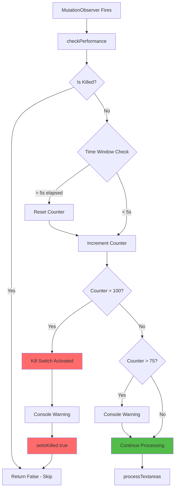
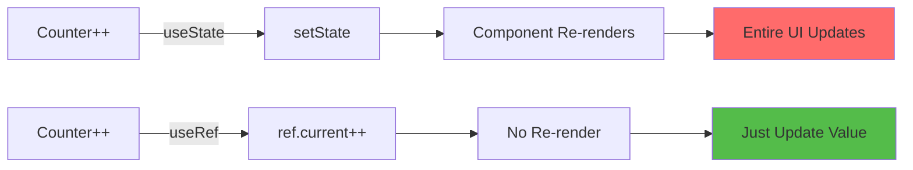
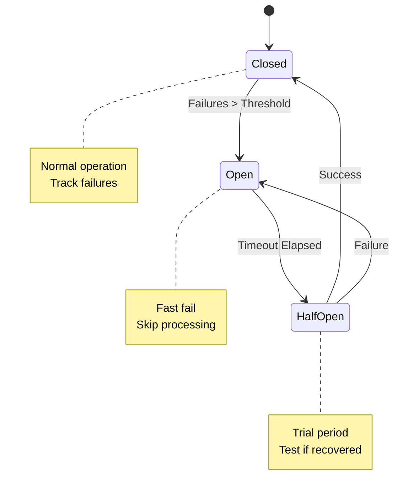

# Slide 13: Performance Protection

**Branch:** `react/13-performance-safeguards`

---

## 🎯 What is Performance Safeguards?

Performance safeguards are defensive mechanisms that prevent browser extensions from causing infinite loops, memory leaks, or excessive CPU usage that could freeze tabs or crash the browser.

Key points:
- 🛡️ **Kill Switch** - Automatically disables extension if processing exceeds safe limits
- 📊 **Process Tracking** - Monitors how many times detection runs per time window
- ⚠️ **Early Warnings** - Console alerts when approaching performance limits
- 🔄 **Batch Limiting** - Processes maximum 10 textareas at once to prevent UI freezing
- 💾 **useRef over useState** - Prevents re-renders when tracking performance metrics

---

## 📂 Files to Explore

<details>
<summary><b>New/Modified Files</b></summary>

- 📄 [hooks/usePerformance.ts](../textarea-fullscreen-react/src/content/hooks/usePerformance.ts) ⭐ **NEW**
- 📄 [ContentApp.tsx](../textarea-fullscreen-react/src/entrypoints/content/ContentApp.tsx) - Updated
- 📄 [hooks/useTextareaDetector.ts](../textarea-fullscreen-react/src/content/hooks/useTextareaDetector.ts) - Add batch limit

</details>

<details>
<summary><b>Configuration/Supporting Files</b></summary>

- 📄 [constants/performance.ts](../textarea-fullscreen-react/src/utils/constants/performance.ts) ⭐ **NEW**

</details>

---

## ✅ What's New in This Slide

- ✅ Created `usePerformance` hook with kill switch mechanism
- ✅ Implemented process counter with rolling time window (5 seconds)
- ✅ Added automatic reset after quiet periods
- ✅ Console warnings when approaching limits (75+ processes)
- ✅ Batch processing limit enforced (max 10 textareas per cycle)
- ✅ Integration with MutationObserver to prevent runaway callbacks
- ✅ Graceful degradation when performance limit exceeded

---

**Next:** [Slide 14: Final Integration & Testing](./14-icons-and-assets.md)  

---

## 📑 Deep Dive

- [How It Works](#how-it-works)
- [Implementation Steps](#implementation-steps)
- [Key Concepts](#key-concepts)
- [Code Examples](#code-examples)
- [Common Patterns](#common-patterns)
- [Documentation](#documentation)
- [Challenge](#challenge)

---

## How It Works



**Flow:**
1. Every time detection is triggered, call `checkPerformance()`
2. Check if already killed → skip immediately
3. Check time window → reset counter if > 5 seconds passed
4. Increment process counter
5. If counter > 100 → kill extension for this page
6. If counter > 75 → warn but continue
7. Return true/false whether to proceed

---

## Implementation Steps

### 1. Create Performance Constants

Create `src/utils/constants/performance.ts`:

```typescript
export const PERFORMANCE_LIMITS = {
  /** Maximum processes allowed in time window */
  MAX_PROCESS_COUNT: 100,
  
  /** Warning threshold (75% of max) */
  WARNING_THRESHOLD: 75,
  
  /** Time window in milliseconds */
  TIME_WINDOW: 5000, // 5 seconds
  
  /** Maximum textareas to process per batch */
  MAX_BATCH_SIZE: 10,
  
  /** Debounce delay for observers */
  DEBOUNCE_DELAY: 150,
  
  /** Scroll debounce delay */
  SCROLL_DEBOUNCE: 300
} as const;

export const PERFORMANCE_MESSAGES = {
  WARNING: '[Textarea Fullscreen] High processing detected. Count:',
  KILLED: '[Textarea Fullscreen] Performance limit exceeded. Extension disabled on this page.',
  REASON: 'This usually indicates a problematic page or infinite loop.'
} as const;
```

**What this does:**
- Centralizes all performance-related constants
- Makes limits easy to adjust
- Provides consistent error messages

---

### 2. Create usePerformance Hook

Create `src/content/hooks/usePerformance.ts`:

```typescript
import { useRef, useState, useCallback, useEffect } from 'react';
import { PERFORMANCE_LIMITS, PERFORMANCE_MESSAGES } from '@/utils/constants/performance';

interface PerformanceMetrics {
  processCount: number;
  lastReset: number;
  isKilled: boolean;
}

interface UsePerformanceReturn {
  /** Check if processing is allowed */
  checkPerformance: () => boolean;
  /** Whether extension is killed on this page */
  isKilled: boolean;
  /** Current process count */
  getMetrics: () => PerformanceMetrics;
  /** Manually kill extension */
  kill: () => void;
  /** Reset counters */
  reset: () => void;
}

export function usePerformance(): UsePerformanceReturn {
  const processCount = useRef(0);
  const lastReset = useRef(Date.now());
  const [isKilled, setIsKilled] = useState(false);

  const checkPerformance = useCallback((): boolean => {
    // Already killed - skip immediately
    if (isKilled) {
      return false;
    }

    const now = Date.now();
    const elapsed = now - lastReset.current;

    // Reset counter if time window exceeded
    if (elapsed > PERFORMANCE_LIMITS.TIME_WINDOW) {
      processCount.current = 0;
      lastReset.current = now;
    }

    // Increment counter
    processCount.current++;

    // Warning threshold
    if (
      processCount.current > PERFORMANCE_LIMITS.WARNING_THRESHOLD &&
      processCount.current <= PERFORMANCE_LIMITS.MAX_PROCESS_COUNT
    ) {
      console.warn(
        `${PERFORMANCE_MESSAGES.WARNING} ${processCount.current}/${PERFORMANCE_LIMITS.MAX_PROCESS_COUNT}`
      );
    }

    // Kill switch
    if (processCount.current > PERFORMANCE_LIMITS.MAX_PROCESS_COUNT) {
      console.error(PERFORMANCE_MESSAGES.KILLED);
      console.error(PERFORMANCE_MESSAGES.REASON);
      console.error(`Process count: ${processCount.current} in ${elapsed}ms`);
      
      setIsKilled(true);
      return false;
    }

    return true;
  }, [isKilled]);

  const getMetrics = useCallback((): PerformanceMetrics => ({
    processCount: processCount.current,
    lastReset: lastReset.current,
    isKilled
  }), [isKilled]);

  const kill = useCallback(() => {
    console.warn('Manual kill triggered');
    setIsKilled(true);
  }, []);

  const reset = useCallback(() => {
    processCount.current = 0;
    lastReset.current = Date.now();
    setIsKilled(false);
    console.log('[Textarea Fullscreen] Performance counters reset');
  }, []);

  // Cleanup on unmount
  useEffect(() => {
    return () => {
      processCount.current = 0;
    };
  }, []);

  return {
    checkPerformance,
    isKilled,
    getMetrics,
    kill,
    reset
  };
}
```

**Key features:**
- `useRef` for counters (no re-renders)
- Rolling time window (resets every 5s)
- Progressive warnings (75% threshold)
- Detailed console logging
- Manual controls for testing

---

### 3. Integrate with ContentApp

Update `src/entrypoints/content/ContentApp.tsx`:

```typescript
import { useEffect, useState } from 'react';
import { useSettings } from '@/hooks/useSettings';
import { usePerformance } from './hooks/usePerformance';
import { useTextareaDetector } from './hooks/useTextareaDetector';
import { TextareaWrapper } from './components/TextareaWrapper';

export default function ContentApp() {
  const { settings, loading } = useSettings();
  const { checkPerformance, isKilled } = usePerformance();
  const { textareas } = useTextareaDetector(checkPerformance);
  const [initialized, setInitialized] = useState(false);

  useEffect(() => {
    if (loading || isKilled) return;

    if (!settings.enabled) {
      console.log('[Textarea Fullscreen] Extension disabled in settings');
      return;
    }

    // Initial delay for page stability
    const timer = setTimeout(() => {
      if (checkPerformance()) {
        setInitialized(true);
      }
    }, 1000);

    return () => clearTimeout(timer);
  }, [loading, settings.enabled, checkPerformance, isKilled]);

  // Don't render if killed
  if (loading || !initialized || isKilled) {
    return null;
  }

  return (
    <>
      {textareas.map((textarea, index) => (
        <TextareaWrapper
          key={`textarea-${index}-${textarea.id || 'anonymous'}`}
          textarea={textarea}
        />
      ))}
    </>
  );
}
```

**Changes:**
- Pass `checkPerformance` to detector
- Early return if killed
- Better loading states

---

### 4. Update TextareaDetector

Update `src/content/hooks/useTextareaDetector.ts`:

```typescript
import { useState, useCallback, useEffect } from 'react';
import { useTextareaObserver } from './useTextareaObserver';
import { useScrollDetection } from './useScrollDetection';
import { PERFORMANCE_LIMITS } from '@/utils/constants/performance';

export function useTextareaDetector(checkPerformance: () => boolean) {
  const [textareas, setTextareas] = useState<HTMLTextAreaElement[]>([]);

  const isTextareaValid = useCallback((textarea: HTMLTextAreaElement): boolean => {
    // ... validation logic
  }, []);

  const processTextareas = useCallback(() => {
    // Check performance before processing
    if (!checkPerformance()) {
      console.warn('[Textarea Fullscreen] Skipping processing - performance limit');
      return;
    }

    const unprocessed = document.querySelectorAll<HTMLTextAreaElement>(
      'textarea:not([data-tx-fullscreen-processed="true"])'
    );

    const validTextareas: HTMLTextAreaElement[] = [];

    // Enforce batch limit
    const limit = Math.min(
      unprocessed.length,
      PERFORMANCE_LIMITS.MAX_BATCH_SIZE
    );

    for (let i = 0; i < limit; i++) {
      const textarea = unprocessed[i];
      textarea.setAttribute('data-tx-fullscreen-processed', 'true');

      if (isTextareaValid(textarea)) {
        validTextareas.push(textarea);
      }
    }

    if (validTextareas.length > 0) {
      console.log(`[Textarea Fullscreen] Found ${validTextareas.length} valid textareas`);
      
      setTextareas(prev => {
        const existing = new Set(prev);
        const combined = [...prev];
        
        for (const ta of validTextareas) {
          if (!existing.has(ta)) {
            combined.push(ta);
          }
        }
        
        return combined;
      });
    }
  }, [checkPerformance, isTextareaValid]);

  // Initial detection
  useEffect(() => {
    if (checkPerformance()) {
      processTextareas();
    }
  }, [processTextareas, checkPerformance]);

  // Observer with performance check
  useTextareaObserver(() => {
    if (checkPerformance()) {
      processTextareas();
    }
  });

  // Scroll detection with performance check
  useScrollDetection({
    onScrollEnd: () => {
      if (checkPerformance()) {
        processTextareas();
      }
    }
  });

  return { textareas, processTextareas };
}
```

**Improvements:**
- Performance check before every operation
- Batch size enforced
- Logging for debugging
- Early returns when killed

---

## Key Concepts

### Concept 1: useRef vs useState for Counters



**Why useRef?**

| Feature | useState | useRef |
|---------|----------|--------|
| Re-renders | ✅ Yes | ❌ No |
| Persists between renders | ✅ Yes | ✅ Yes |
| Triggers effects | ✅ Yes | ❌ No |
| Good for counters | ❌ No (too many renders) | ✅ Yes |
| Good for UI state | ✅ Yes | ❌ No |

**Example:**

```typescript
// ❌ BAD - Causes re-render on every increment
const [count, setCount] = useState(0);
const increment = () => setCount(c => c + 1);

// ✅ GOOD - No re-renders
const countRef = useRef(0);
const increment = () => countRef.current++;

// ✅ HYBRID - Track when to show UI warning
const countRef = useRef(0);
const [showWarning, setShowWarning] = useState(false);

const increment = () => {
  countRef.current++;
  if (countRef.current > 75) {
    setShowWarning(true); // Only re-render when needed
  }
};
```

**For our use case:** We check the counter on every observer callback, but only need UI update when killed.

---

### Concept 2: Rolling Time Window

**Problem:** How to count "processes per 5 seconds" when events happen continuously?

**Solution:** Rolling window with reset

```typescript
let count = 0;
let windowStart = Date.now();

function check() {
  const now = Date.now();
  const elapsed = now - windowStart;
  
  // Reset if outside window
  if (elapsed > 5000) {
    count = 0;
    windowStart = now;
  }
  
  count++;
  return count <= 100;
}
```

**Visualization:**

```
Time:     0s    5s    10s   15s   20s
Window:   [----]
                [----]
                      [----]
                            [----]
Count:    50    0     30    0     25
```

**Alternative approach:** Fixed buckets (more complex):

```typescript
const buckets = new Map<number, number>();

function check() {
  const bucket = Math.floor(Date.now() / 5000);
  const count = (buckets.get(bucket) || 0) + 1;
  buckets.set(bucket, count);
  
  // Clean old buckets
  for (const [key] of buckets) {
    if (key < bucket - 2) buckets.delete(key);
  }
  
  return count <= 100;
}
```

We use the simpler rolling window approach.

---

### Concept 3: Circuit Breaker Pattern

**Concept from distributed systems:**



**Our implementation:**

| State | Circuit Breaker | Our Extension |
|-------|----------------|---------------|
| **Closed** | Normal operation | Processing textareas |
| **Open** | Fast fail | `isKilled = true`, skip all |
| **Half-Open** | Test recovery | Could add "reset" button |

**Analogy:** Like a fuse in electrical circuit - trips when overloaded, prevents damage.

---

## Code Examples

### Example 1: Basic Performance Tracking

```typescript
function BasicPerformanceTracker() {
  const callCount = useRef(0);
  const startTime = useRef(Date.now());

  const track = useCallback(() => {
    callCount.current++;
    const elapsed = Date.now() - startTime.current;
    
    console.log(`Called ${callCount.current} times in ${elapsed}ms`);
    console.log(`Rate: ${(callCount.current / elapsed * 1000).toFixed(2)} calls/sec`);
  }, []);

  return { track };
}

// Usage
const { track } = BasicPerformanceTracker();
observer.observe(document.body, {
  childList: true,
  subtree: true
});
```

---

### Example 2: Progressive Warnings

```typescript
function ProgressiveWarnings() {
  const count = useRef(0);
  const warningLevels = [
    { threshold: 50, message: 'Moderate activity' },
    { threshold: 75, message: 'High activity - approaching limit' },
    { threshold: 90, message: '⚠️ Critical - near shutdown' }
  ];

  const check = useCallback(() => {
    count.current++;
    
    for (const { threshold, message } of warningLevels) {
      if (count.current === threshold) {
        console.warn(`[${threshold}%] ${message}`);
      }
    }
    
    if (count.current >= 100) {
      console.error('🛑 LIMIT EXCEEDED');
      return false;
    }
    
    return true;
  }, []);

  return { check };
}
```

---

### Example 3: Automatic Recovery

```typescript
function AutoRecovery() {
  const [isKilled, setIsKilled] = useState(false);
  const lastActivity = useRef(Date.now());
  const RECOVERY_TIMEOUT = 30000; // 30 seconds

  useEffect(() => {
    if (!isKilled) return;

    // Check every 5 seconds if we can recover
    const interval = setInterval(() => {
      const idle = Date.now() - lastActivity.current;
      
      if (idle > RECOVERY_TIMEOUT) {
        console.log('[Recovery] Page quiet for 30s, attempting recovery');
        setIsKilled(false);
        lastActivity.current = Date.now();
      }
    }, 5000);

    return () => clearInterval(interval);
  }, [isKilled]);

  const check = useCallback(() => {
    lastActivity.current = Date.now();
    
    if (isKilled) {
      return false;
    }
    
    // ... performance checks
    return true;
  }, [isKilled]);

  return { check, isKilled };
}
```

---

### Example 4: Performance Metrics Dashboard

```typescript
interface Metrics {
  totalProcesses: number;
  avgProcessTime: number;
  peakCount: number;
  killCount: number;
}

function usePerformanceMetrics() {
  const metrics = useRef<Metrics>({
    totalProcesses: 0,
    avgProcessTime: 0,
    peakCount: 0,
    killCount: 0
  });

  const recordProcess = useCallback((duration: number) => {
    const m = metrics.current;
    m.totalProcesses++;
    m.avgProcessTime = (m.avgProcessTime * (m.totalProcesses - 1) + duration) / m.totalProcesses;
  }, []);

  const recordPeak = useCallback((count: number) => {
    metrics.current.peakCount = Math.max(metrics.current.peakCount, count);
  }, []);

  const getReport = useCallback(() => {
    const m = metrics.current;
    console.table({
      'Total Processes': m.totalProcesses,
      'Average Time': `${m.avgProcessTime.toFixed(2)}ms`,
      'Peak Count': m.peakCount,
      'Times Killed': m.killCount
    });
  }, []);

  return { recordProcess, recordPeak, getReport };
}
```

---

## Common Patterns

<details>
<summary><b>Pattern 1: Rate Limiter</b></summary>

```typescript
function useRateLimiter(maxCalls: number, windowMs: number) {
  const calls = useRef<number[]>([]);

  const check = useCallback((): boolean => {
    const now = Date.now();
    
    // Remove old calls outside window
    calls.current = calls.current.filter(time => now - time < windowMs);
    
    // Check if under limit
    if (calls.current.length >= maxCalls) {
      console.warn('Rate limit exceeded');
      return false;
    }
    
    // Record this call
    calls.current.push(now);
    return true;
  }, [maxCalls, windowMs]);

  return { check };
}

// Usage: max 50 calls per 10 seconds
const { check } = useRateLimiter(50, 10000);

useMutationObserver(() => {
  if (check()) {
    processTextareas();
  }
});
```

**When to use:**
- API rate limiting
- Prevent spam clicks
- Throttle expensive operations

</details>

<details>
<summary><b>Pattern 2: Adaptive Throttling</b></summary>

```typescript
function useAdaptiveThrottle() {
  const [delay, setDelay] = useState(100);
  const processCount = useRef(0);

  const adjust = useCallback(() => {
    processCount.current++;

    // Increase delay if processing too much
    if (processCount.current > 50) {
      setDelay(d => Math.min(d * 1.5, 1000));
      console.log(`Throttle increased to ${delay}ms`);
    }

    // Decrease delay if quiet
    if (processCount.current < 10) {
      setDelay(d => Math.max(d * 0.8, 100));
      console.log(`Throttle decreased to ${delay}ms`);
    }

    // Reset counter periodically
    setTimeout(() => {
      processCount.current = 0;
    }, 5000);
  }, [delay]);

  return { delay, adjust };
}
```

**When to use:**
- Variable load conditions
- Auto-tuning performance
- Progressive degradation

</details>

<details>
<summary><b>Pattern 3: Emergency Stop</b></summary>

```typescript
function useEmergencyStop() {
  const [isStopped, setIsStopped] = useState(false);

  useEffect(() => {
    // Listen for keyboard shortcut (Ctrl+Shift+K)
    const handleKeyDown = (e: KeyboardEvent) => {
      if (e.ctrlKey && e.shiftKey && e.key === 'K') {
        console.warn('🛑 EMERGENCY STOP ACTIVATED');
        setIsStopped(true);
      }
    };

    window.addEventListener('keydown', handleKeyDown);
    return () => window.removeEventListener('keydown', handleKeyDown);
  }, []);

  const check = useCallback(() => {
    if (isStopped) {
      console.warn('Extension stopped by user');
      return false;
    }
    return true;
  }, [isStopped]);

  return { check, isStopped, resume: () => setIsStopped(false) };
}
```

**When to use:**
- User-controlled kill switch
- Debug/testing tools
- Power user features

</details>

---

## Documentation

<details>
<summary><b>Related Resources</b></summary>

- 📚 [Circuit Breaker Pattern](https://martinfowler.com/bliki/CircuitBreaker.html)
- 📚 [Rate Limiting Algorithms](https://blog.logrocket.com/rate-limiting-node-js/)
- 🎓 [Performance Monitoring Best Practices](https://web.dev/performance-monitoring/)
- 💡 [Chrome Extension Performance](https://developer.chrome.com/docs/extensions/mv3/performance/)
- 🔧 [Memory Leak Detection](https://developer.chrome.com/docs/devtools/memory-problems/)

</details>

<details>
<summary><b>Performance Metrics to Track</b></summary>

| Metric | What It Measures | Target |
|--------|------------------|--------|
| **Process Count** | Observer callbacks/5s | < 100 |
| **Batch Size** | Textareas processed/cycle | ≤ 10 |
| **Memory Usage** | Heap size | < 50MB |
| **CPU Time** | Script execution time | < 100ms |
| **DOM Mutations** | Changes detected/s | < 50 |

</details>

---

## Challenge

**Try this yourself:**

1. **Add performance dashboard:**
   - Create popup tab showing metrics
   - Display process count, peak, average
   - Add "Reset" button

2. **Implement adaptive limits:**
   - Detect page complexity (DOM size)
   - Adjust `MAX_PROCESS_COUNT` dynamically
   - Stricter limits on heavy pages

3. **Create performance logger:**
   - Log all checkPerformance() calls
   - Export as CSV
   - Identify problematic pages

**Expected result:**
- Extension never freezes browser
- Useful debugging information
- Graceful degradation on bad pages

**Bonus:**
- Add performance.mark() API integration
- Create Chrome DevTools extension panel
- Send anonymous metrics to analytics

---

**Next:** [Slide 14: Final Integration & Testing](./14-icons-and-assets.md)  