# Slide 14: Adding Icons and Assets

**Branch:** `react/14-icons-and-assets`

---

## 🎯 What is Icons and Assets Management?

Managing static assets (icons, images, fonts) in browser extensions requires special handling since content scripts run in isolated contexts and can't directly access extension files without proper configuration.

Key points:
- 📁 **Public Folder** - WXT's `public/` directory for static assets that need to be accessible
- 🔗 **runtime.getURL()** - Converts relative paths to extension:// URLs
- 🌐 **web_accessible_resources** - Makes assets available to content scripts and web pages
- 🎨 **Icon Sizes** - Multiple sizes (16px, 48px, 128px) required for Chrome Web Store
- ⚡ **SVG vs PNG** - SVG for UI elements, PNG for extension icons

---

## 📂 Files to Explore

<details>
<summary><b>New/Modified Files</b></summary>

- 📄 [public/icons/expand.svg](../textarea-fullscreen-react/public/icons/expand.svg) ⭐ **NEW**
- 📄 [public/icons/collapse.svg](../textarea-fullscreen-react/public/icons/collapse.svg) ⭐ **NEW**
- 📄 [public/icons/icon-16.png](../textarea-fullscreen-react/public/icons/icon-16.png) ⭐ **NEW**
- 📄 [public/icons/icon-48.png](../textarea-fullscreen-react/public/icons/icon-48.png) ⭐ **NEW**
- 📄 [public/icons/icon-128.png](../textarea-fullscreen-react/public/icons/icon-128.png) ⭐ **NEW**
- 📄 [components/FullscreenButton/index.tsx](../textarea-fullscreen-react/components/FullscreenButton/index.tsx) - Updated
- 📄 [wxt.config.ts](../textarea-fullscreen-react/wxt.config.ts) - Updated

</details>

<details>
<summary><b>Configuration/Supporting Files</b></summary>

- 📄 [wxt.config.ts](../textarea-fullscreen-react/wxt.config.ts) - Add web_accessible_resources
- 📄 [package.json](../textarea-fullscreen-react/package.json)

</details>

---

## ✅ What's New in This Slide

- ✅ Created `public/` directory structure for static assets
- ✅ Added expand/collapse SVG icons for fullscreen button
- ✅ Added PNG icons in 3 sizes (16px, 48px, 128px) for extension
- ✅ Configured `web_accessible_resources` in WXT config
- ✅ Updated FullscreenButton to use `browser.runtime.getURL()`
- ✅ Implemented dynamic icon switching (expand ↔ collapse)
- ✅ Added proper icon attribution and licensing

---

**Next:** [Slide 15: Building & Publishing](./15-build-and-package.md)  

---

## 📑 Deep Dive

- [How It Works](#how-it-works)
- [Implementation Steps](#implementation-steps)
- [Key Concepts](#key-concepts)
- [Code Examples](#code-examples)
- [Common Patterns](#common-patterns)
- [Documentation](#documentation)
- [Challenge](#challenge)

---

## How It Works

```mermaid
graph TB
    A[public/icons/expand.svg] --> B[WXT Build Process]
    B --> C[dist/icons/expand.svg]
    D[FullscreenButton Component] --> E[browser.runtime.getURL]
    E --> F["extension://abc123/icons/expand.svg"]
    F --> G[web_accessible_resources Check]
    G -->|Allowed| H[Icon Loads ✅]
    G -->|Blocked| I[404 Error ❌]
    
    style A fill:#54bc4a
    style H fill:#54bc4a
    style I fill:#ff6b6b
```



**Flow:**
1. Place assets in `public/` folder
2. WXT copies them to `dist/` on build
3. Component requests icon via `browser.runtime.getURL()`
4. Browser checks `web_accessible_resources` permission
5. If allowed → icon loads, if not → 404 error

---

## Implementation Steps

### 1. Create Public Directory Structure

```bash
# Create directory structure
mkdir -p public/icons

# Your project should look like this:
# textarea-fullscreen/
# ├── public/
# │   └── icons/
# │       ├── expand.svg
# │       ├── collapse.svg
# │       ├── icon-16.png
# │       ├── icon-48.png
# │       └── icon-128.png
# ├── src/
# └── wxt.config.ts
```

**What happens:**
- WXT automatically copies `public/` contents to `dist/` during build
- Files maintain their directory structure
- No import needed - files are just referenced by path

---

### 2. Create SVG Icons

Create `public/icons/expand.svg`:

```svg
<svg xmlns="http://www.w3.org/2000/svg" width="24" height="24" viewBox="0 0 24 24" fill="none" stroke="currentColor" stroke-width="2" stroke-linecap="round" stroke-linejoin="round">
  <!-- Expand icon: arrows pointing outward -->
  <path d="M15 3h6v6"/>
  <path d="M9 21H3v-6"/>
  <path d="M21 3l-7 7"/>
  <path d="M3 21l7-7"/>
</svg>
```

Create `public/icons/collapse.svg`:

```svg
<svg xmlns="http://www.w3.org/2000/svg" width="24" height="24" viewBox="0 0 24 24" fill="none" stroke="currentColor" stroke-width="2" stroke-linecap="round" stroke-linejoin="round">
  <!-- Collapse icon: arrows pointing inward -->
  <path d="M4 14h6v6"/>
  <path d="M20 10h-6V4"/>
  <path d="M14 10l7-7"/>
  <path d="M3 21l7-7"/>
</svg>
```

**Why SVG?**
- Scalable (looks sharp at any size)
- Small file size (~300 bytes)
- Can style with CSS (color, stroke-width)
- Retina-ready without @2x versions

---

### 3. Add Extension Icons (PNG)

For Chrome Web Store submission, you need:

| Size | Purpose | Required |
|------|---------|----------|
| **16×16** | Favicon, tabs | ✅ Yes |
| **48×48** | Extension management page | ✅ Yes |
| **128×128** | Chrome Web Store, installation | ✅ Yes |
| 32×32 | Windows computers | Optional |
| 64×64 | macOS | Optional |

**Tools to create icons:**
- [Figma](https://figma.com) - Design + export
- [GIMP](https://gimp.org) - Free Photoshop alternative
- [Canva](https://canva.com) - Quick online tool
- [Icon generators](https://icon.kitchen) - Automated

**Quick example (pseudo-design):**
```
icon-128.png: 
  Background: Gradient (#646cff → #54bc4a)
  Symbol: White "⛶" (fullscreen symbol)
  Border-radius: 20px (rounded square)
```

---

### 4. Configure WXT for Asset Access

Update `wxt.config.ts`:

```typescript
import { defineConfig } from 'wxt';

export default defineConfig({
  modules: ['@wxt-dev/module-react'],
  
  manifest: {
    name: 'Textarea Fullscreen',
    description: 'Make any textarea fullscreen with ease',
    version: '1.0.0',
    
    // Extension icons (shown in browser UI)
    icons: {
      16: '/icons/icon-16.png',
      48: '/icons/icon-48.png',
      128: '/icons/icon-128.png'
    },
    
    // Make icons accessible to content scripts
    web_accessible_resources: [
      {
        resources: [
          'icons/*.svg',   // All SVG icons
          'icons/*.png'    // All PNG icons (if needed in content)
        ],
        matches: ['<all_urls>']  // Available on all websites
      }
    ],
    
    permissions: ['storage']
  }
});
```

**What this does:**
- `icons` → Shows in browser toolbar, extension page
- `web_accessible_resources` → Allows content scripts to load these files
- `matches: ['<all_urls>']` → Works on any website

---

### 5. Update FullscreenButton Component

Update `src/content/components/FullscreenButton/index.tsx`:

```typescript
import { useState } from 'react';
import { browser } from 'wxt/browser';
import './styles.css';

interface FullscreenButtonProps {
  onClick: () => void;
  isExpanded: boolean;
}

export function FullscreenButton({ onClick, isExpanded }: FullscreenButtonProps) {
  const [isHovered, setIsHovered] = useState(false);

  // Get extension URL for icon
  const iconUrl = browser.runtime.getURL(
    isExpanded ? '/icons/collapse.svg' : '/icons/expand.svg'
  );

  return (
    <button
      className={`tx-fullscreen-btn ${isExpanded ? 'expanded' : ''}`}
      onClick={onClick}
      onMouseEnter={() => setIsHovered(true)}
      onMouseLeave={() => setIsHovered(false)}
      aria-label={isExpanded ? 'Exit Fullscreen' : 'Enter Fullscreen'}
      title={`${isExpanded ? 'Exit' : 'Enter'} Fullscreen (Ctrl+F)`}
      style={{
        backgroundImage: `url("${iconUrl}")`,
        backgroundSize: '18px 18px',
        backgroundRepeat: 'no-repeat',
        backgroundPosition: 'center',
        opacity: isHovered ? 1 : 0.85,
        transform: isHovered ? 'scale(1.05)' : 'scale(1)'
      }}
    />
  );
}
```

**Changes:**
- Import `browser` from `wxt/browser` (no more webextension-polyfill!)
- Use `browser.runtime.getURL()` to get full extension URL
- Dynamic icon based on `isExpanded` state
- Inline styles for background image

---

### 6. Alternative: CSS-Only Approach

Update `styles.css`:

```css
.tx-fullscreen-btn {
  position: absolute;
  right: 5px;
  top: 5px;
  width: 30px;
  height: 30px;
  background-color: rgba(255, 255, 255, 0.95);
  background-size: 18px 18px;
  background-position: center;
  background-repeat: no-repeat;
  border: 1px solid rgba(204, 204, 204, 0.8);
  border-radius: 4px;
  cursor: pointer;
  transition: all 0.2s ease;
  z-index: 999999;
}

.tx-fullscreen-btn:hover {
  opacity: 1;
  transform: scale(1.05);
  box-shadow: 0 3px 12px rgba(0, 0, 0, 0.25);
}

/* Expanded state */
.tx-fullscreen-btn.expanded {
  right: 20px;
  top: 20px;
  width: 32px;
  height: 32px;
  background-size: 20px 20px;
  z-index: 2147483647;
}
```

Then in component:

```typescript
export function FullscreenButton({ onClick, isExpanded }: Props) {
  const iconUrl = browser.runtime.getURL(
    isExpanded ? '/icons/collapse.svg' : '/icons/expand.svg'
  );

  return (
    <button
      className={`tx-fullscreen-btn ${isExpanded ? 'expanded' : ''}`}
      onClick={onClick}
      style={{ backgroundImage: `url("${iconUrl}")` }}
      aria-label="Toggle Fullscreen"
    />
  );
}
```

---

## Key Concepts

### Concept 1: Extension URLs


**Extension URL format:**

| Browser | URL Scheme |
|---------|------------|
| Chrome | `chrome-extension://[id]/path` |
| Firefox | `moz-extension://[id]/path` |
| Edge | `extension://[id]/path` |
| Safari | `safari-extension://[id]/path` |

**Why needed?**
Extensions run in isolated contexts. Assets must be loaded from the extension's origin, not the webpage's origin.

**Example:**

```typescript
// ❌ WRONG - Relative path doesn't work


// ❌ WRONG - Absolute path doesn't work  


// ✅ CORRECT - Use runtime.getURL()
const url = browser.runtime.getURL('/icons/expand.svg');

```

---

### Concept 2: web_accessible_resources

**Problem:** By default, extension files are NOT accessible to web pages (security).

**Solution:** Explicitly declare which files can be accessed.

```typescript
// wxt.config.ts
web_accessible_resources: [
  {
    resources: ['icons/*.svg'],
    matches: ['<all_urls>']
  }
]
```

**Security implications:**

| Configuration | Security | Use Case |
|---------------|----------|----------|
| `matches: ['<all_urls>']` | ⚠️ Lower | Public icons, safe files |
| `matches: ['https://example.com/*']` | ✅ Higher | Specific domain only |
| No declaration | 🔒 Highest | Background scripts only |

**Best practices:**
- Only expose necessary files
- Use specific `matches` if possible
- Never expose sensitive data

---

### Concept 3: Icon Requirements

**Chrome Web Store requirements:**

```typescript
// Minimum required
icons: {
  "16": "icons/icon-16.png",   // ✅ Required
  "48": "icons/icon-48.png",   // ✅ Required  
  "128": "icons/icon-128.png"  // ✅ Required
}

// Recommended (better quality)
icons: {
  "16": "icons/icon-16.png",
  "32": "icons/icon-32.png",   // 📱 Better for some displays
  "48": "icons/icon-48.png",
  "64": "icons/icon-64.png",   // 🖥️ Better for macOS
  "128": "icons/icon-128.png"
}
```

**Format guidelines:**

| Aspect | Requirement |
|--------|-------------|
| **Format** | PNG (no transparency issues) or JPG |
| **Dimensions** | Exact square (128×128, not 130×128) |
| **Color space** | RGB or sRGB |
| **Background** | Transparent OR solid color |
| **File size** | < 1MB per icon |

---

## Code Examples

### Example 1: Lazy-Load Icons

```typescript
import { useState, useEffect } from 'react';
import { browser } from 'wxt/browser';

export function LazyIcon({ name }: { name: string }) {
  const [iconUrl, setIconUrl] = useState<string>('');

  useEffect(() => {
    // Lazy load icon URL
    const url = browser.runtime.getURL(`/icons/${name}.svg`);
    setIconUrl(url);
  }, [name]);

  if (!iconUrl) return null;

  return (
    
  );
}

// Usage
<LazyIcon name="expand" />
```

**What this does:**
- Loads icon URL asynchronously
- Prevents SSR issues
- Shows nothing until URL ready

---

### Example 2: Icon Sprite System

```typescript
// utils/icons.ts
import { browser } from 'wxt/browser';

export const ICONS = {
  expand: () => browser.runtime.getURL('/icons/expand.svg'),
  collapse: () => browser.runtime.getURL('/icons/collapse.svg'),
  settings: () => browser.runtime.getURL('/icons/settings.svg'),
  close: () => browser.runtime.getURL('/icons/close.svg')
} as const;

// Component
import { ICONS } from '@/utils/icons';

function MyButton() {
  return (
    <button style={{ backgroundImage: `url("${ICONS.expand()}")` }}>
      Expand
    </button>
  );
}
```

**Benefits:**
- Centralized icon management
- Type-safe icon names
- Easy to update paths

---

### Example 3: Inline SVG (Alternative)

```typescript
// For simple icons, inline SVG can be better
export function ExpandIcon({ size = 24 }: { size?: number }) {
  return (
    <svg 
      width={size} 
      height={size} 
      viewBox="0 0 24 24"
      fill="none"
      stroke="currentColor"
      strokeWidth={2}
    >
      <path d="M15 3h6v6"/>
      <path d="M9 21H3v-6"/>
      <path d="M21 3l-7 7"/>
      <path d="M3 21l7-7"/>
    </svg>
  );
}

// Usage
<button>
  <ExpandIcon size={18} />
</button>
```

**Pros:**
- No HTTP request
- Easy to style
- Smaller bundle (if few icons)

**Cons:**
- Larger bundle (if many icons)
- Harder to update globally

---

### Example 4: Data URL Fallback

```typescript
// For very simple icons, use data URLs
const EXPAND_ICON = 'data:image/svg+xml,%3Csvg xmlns="http://www.w3.org/2000/svg" viewBox="0 0 24 24"%3E%3Cpath d="M15 3h6v6M9 21H3v-6M21 3l-7 7M3 21l7-7"/%3E%3C/svg%3E';

function Button() {
  return (
    <button style={{ backgroundImage: `url("${EXPAND_ICON}")` }}>
      Click me
    </button>
  );
}
```

**When to use:**
- Very small, simple icons
- Need guaranteed availability
- Avoid HTTP requests

---

## Common Patterns

<details>
<summary><b>Pattern 1: Icon Component with Cache</b></summary>

```typescript
import { browser } from 'wxt/browser';
import { useMemo } from 'react';

const iconCache = new Map<string, string>();

export function Icon({ name, size = 24 }: { name: string; size?: number }) {
  const url = useMemo(() => {
    if (iconCache.has(name)) {
      return iconCache.get(name)!;
    }
    
    const iconUrl = browser.runtime.getURL(`/icons/${name}.svg`);
    iconCache.set(name, iconUrl);
    return iconUrl;
  }, [name]);

  return (
    
  );
}
```

**When to use:**
- Multiple instances of same icon
- Performance optimization
- Reduce getURL() calls

</details>

<details>
<summary><b>Pattern 2: Theme-Aware Icons</b></summary>

```typescript
import { browser } from 'wxt/browser';

type Theme = 'light' | 'dark';

export function ThemedIcon({ name, theme }: { name: string; theme: Theme }) {
  const iconUrl = browser.runtime.getURL(
    `/icons/${theme}/${name}.svg`
  );

  return ;
}

// Directory structure:
// icons/
//   light/
//     expand.svg
//   dark/
//     expand.svg
```

**When to use:**
- Dark mode support
- Theme customization
- Brand variations

</details>

<details>
<summary><b>Pattern 3: Preload Critical Icons</b></summary>

```typescript
// entrypoints/content/index.tsx
import { browser } from 'wxt/browser';

// Preload icons on mount
const preloadIcons = ['expand', 'collapse', 'close'];

preloadIcons.forEach(name => {
  const link = document.createElement('link');
  link.rel = 'preload';
  link.as = 'image';
  link.href = browser.runtime.getURL(`/icons/${name}.svg`);
  document.head.appendChild(link);
});

export default defineContentScript({
  matches: ['<all_urls>'],
  main() {
    // Your code
  }
});
```

**When to use:**
- Improve perceived performance
- Critical UI icons
- Prevent flash of missing icons

</details>

---

## Documentation

<details>
<summary><b>Related Resources</b></summary>

- 📚 [WXT Public Assets](https://wxt.dev/guide/assets.html#public-assets)
- 📚 [Chrome web_accessible_resources](https://developer.chrome.com/docs/extensions/mv3/manifest/web_accessible_resources/)
- 🎓 [Icon Design Guidelines](https://developer.chrome.com/docs/webstore/images/)
- 💡 [SVG Optimization Tools](https://jakearchibald.github.io/svgomg/)
- 🎨 [Free Icon Libraries](https://lucide.dev)
- 🔧 [browser.runtime.getURL() API](https://developer.mozilla.org/en-US/docs/Mozilla/Add-ons/WebExtensions/API/runtime/getURL)

</details>

<details>
<summary><b>Icon Resources</b></summary>

**Free Icon Libraries:**
- [Lucide Icons](https://lucide.dev) - Beautiful, consistent SVG icons
- [Heroicons](https://heroicons.com) - Tailwind's icon set
- [Feather Icons](https://feathericons.com) - Simply beautiful
- [Material Icons](https://fonts.google.com/icons) - Google's icons
- [Font Awesome](https://fontawesome.com) - Classic choice

**Tools:**
- [SVGOMG](https://jakearchibald.github.io/svgomg/) - SVG optimizer
- [Figma](https://figma.com) - Design tool
- [Icon Kitchen](https://icon.kitchen) - Generate all sizes

</details>

---

## Challenge

**Try this yourself:**

1. **Add more icons:**
   - Settings icon for popup
   - Close icon for fullscreen editor
   - Loading spinner SVG

2. **Implement icon theme switcher:**
   - Detect system dark mode
   - Switch between light/dark icons
   - Store preference in storage

3. **Create animated icon:**
   - Expand icon that rotates on click
   - Use CSS animations
   - Smooth transition between states

**Expected result:**
- All icons load correctly
- No 404 errors in console
- Smooth icon transitions
- Theme-aware if implemented

**Bonus:**
- Add icon sprite sheet for performance
- Implement icon preloading
- Create custom icon component library

---

**Next:** [Slide 15: Building & Publishing](./15-build-and-package.md)