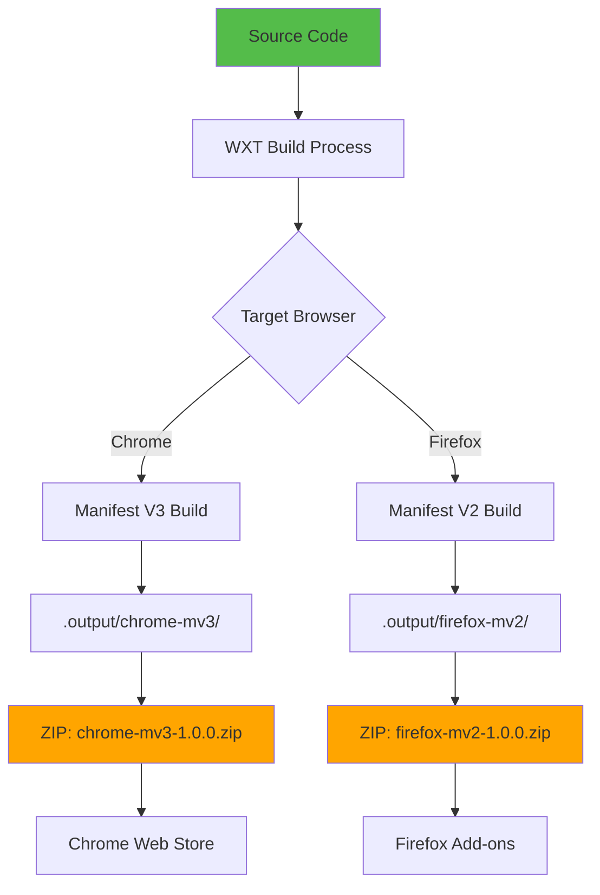
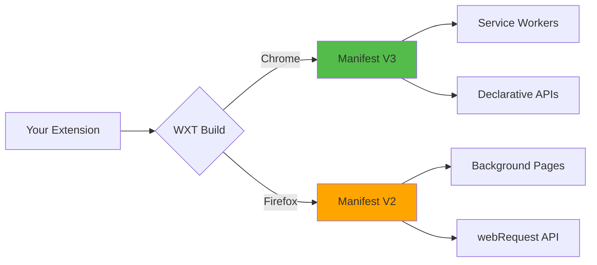

# Slide 15: Building and Publishing

**Branch:** `react/15-build-and-package`

---

## 🎯 What is Build and Package?

Building and packaging prepares your extension for distribution on Chrome Web Store, Firefox Add-ons, or other browser extension marketplaces by compiling, optimizing, and bundling all code and assets into production-ready ZIP files.

Key points:
- 📦 **Production Build** - Minified, optimized code for best performance
- 🌐 **Multi-Browser Support** - WXT automatically generates Chrome (MV3) and Firefox (MV2) builds
- 🗜️ **ZIP Packaging** - Ready-to-upload files for extension stores
- ✅ **Pre-submission Validation** - Checks manifest, icons, and requirements
- 🔄 **Version Management** - Semantic versioning and automated updates

---

## 📂 Files to Explore

<details>
<summary><b>New/Modified Files</b></summary>

- 📄 [wxt.config.ts](../textarea-fullscreen-react/wxt.config.ts) ⭐ **NEW** - Main configuration
- 📄 [package.json](../textarea-fullscreen-react/package.json) - Updated with build scripts
- 📄 [README.md](../textarea-fullscreen-react/README.md) ⭐ **NEW** - Documentation
- 📄 [CHANGELOG.md](../textarea-fullscreen-react/CHANGELOG.md) ⭐ **NEW** - Version history

</details>

<details>
<summary><b>Configuration/Supporting Files</b></summary>

- 📄 [.gitignore](../textarea-fullscreen-react/.gitignore) - Add build outputs
- 📄 [tsconfig.json](../textarea-fullscreen-react/tsconfig.json)
- 📄 [.npmrc](../textarea-fullscreen-react/.npmrc) - Optional package manager config

</details>

---

## ✅ What's New in This Slide

- ✅ Created complete WXT configuration with manifest details
- ✅ Added build scripts for development and production
- ✅ Configured multi-browser builds (Chrome MV3 + Firefox MV2)
- ✅ Set up ZIP packaging for store submission
- ✅ Added version management and metadata
- ✅ Created pre-submission checklist
- ✅ Configured build optimizations

---

**Next:** [Slide 16: Deployment & Distribution](./16-contribute.md)  


---

## 📑 Deep Dive

- [How It Works](#how-it-works)
- [Implementation Steps](#implementation-steps)
- [Key Concepts](#key-concepts)
- [Code Examples](#code-examples)
- [Common Patterns](#common-patterns)
- [Documentation](#documentation)
- [Challenge](#challenge)

---

## How It Works



**Flow:**
1. Run `npm run build` → WXT compiles TypeScript/JSX
2. Optimizes and minifies code
3. Generates browser-specific manifests (MV2 vs MV3)
4. Copies public assets (icons, images)
5. Creates separate builds in `.output/`
6. Run `npm run zip` → Creates ZIP files
7. Upload ZIPs to respective stores

---

## Implementation Steps

### 1. Create WXT Configuration

Create `wxt.config.ts`:

```typescript
import { defineConfig } from 'wxt';

export default defineConfig({
  // Enable React module
  modules: ['@wxt-dev/module-react'],
  
  // Source directory (optional, defaults to project root)
  srcDir: 'src',
  
  // Output directory
  outDir: '.output',
  
  // Manifest configuration
  manifest: {
    // Basic Info
    name: 'Textarea Fullscreen',
    version: '1.0.0',
    description: 'Expand any textarea to fullscreen for a better editing experience',
    
    // Author & Homepage
    author: 'Your Name',
    homepage_url: 'https://github.com/drunkody/textarea-fullscreen',
    
    // Icons (required for stores)
    icons: {
      16: '/icons/icon-16.png',
      48: '/icons/icon-48.png',
      128: '/icons/icon-128.png'
    },
    
    // Permissions
    permissions: ['storage'],
    
    // Optional permissions (request when needed)
    // optional_permissions: ['tabs'],
    
    // Web accessible resources
    web_accessible_resources: [
      {
        resources: ['icons/*.svg', 'icons/*.png'],
        matches: ['<all_urls>']
      }
    ],
    
    // Content Security Policy (if needed)
    // content_security_policy: {
    //   extension_pages: "script-src 'self'; object-src 'self'"
    // },
  },
  
  // Build-specific configuration
  runner: {
    disabled: false,
    chromiumArgs: ['--disable-extensions-except=', '--load-extension=']
  },
  
  // Browser-specific overrides
  chrome: {
    manifest: {
      // Chrome-specific manifest fields
      minimum_chrome_version: '88'
    }
  },
  
  firefox: {
    manifest: {
      // Firefox-specific manifest fields
      browser_specific_settings: {
        gecko: {
          id: 'textarea-fullscreen@example.com',
          strict_min_version: '109.0'
        }
      }
    }
  }
});
```

**What this does:**
- Defines all extension metadata
- Configures permissions and resources
- Sets browser-specific options
- Enables optimizations

---

### 2. Update Package.json Scripts

Update `package.json`:

```json
{
  "name": "textarea-fullscreen",
  "version": "1.0.0",
  "private": true,
  "type": "module",
  "scripts": {
    "dev": "wxt",
    "dev:firefox": "wxt -b firefox",
    "build": "wxt build",
    "build:firefox": "wxt build -b firefox",
    "zip": "wxt zip",
    "zip:firefox": "wxt zip -b firefox",
    "compile": "tsc --noEmit",
    "postinstall": "wxt prepare"
  },
  "dependencies": {
    "react": "^19.1.1",
    "react-dom": "^19.1.1"
  },
  "devDependencies": {
    "@types/react": "^19.1.16",
    "@types/react-dom": "^19.1.9",
    "@wxt-dev/module-react": "^1.1.0",
    "typescript": "^5.7.3",
    "wxt": "^0.19.0"
  }
}
```

**Scripts explained:**

| Command | Purpose |
|---------|---------|
| `npm run dev` | Development mode (Chrome, hot reload) |
| `npm run dev:firefox` | Development mode (Firefox) |
| `npm run build` | Production build (Chrome MV3) |
| `npm run build:firefox` | Production build (Firefox MV2) |
| `npm run zip` | Create Chrome ZIP |
| `npm run zip:firefox` | Create Firefox ZIP |
| `npm run compile` | Type check without build |

---

### 3. Build for Production

```bash
# Build for Chrome
npm run build

# Build for Firefox
npm run build:firefox

# Build for both
npm run build && npm run build:firefox
```

**What happens:**
```
📂 .output/
   📂 chrome-mv3/              # Chrome production build
      📂 chunks/               # Code-split bundles
      📄 manifest.json         # Manifest V3
      📄 content.js            # Bundled content script
      📄 popup.html
      📄 popup.js
      📂 icons/                # Copied from public/
   
   📂 firefox-mv2/             # Firefox production build
      📄 manifest.json         # Manifest V2
      📄 content.js
      📄 popup.html
      📄 popup.js
      📂 icons/
```

**Build optimizations:**
- ✅ Minified JavaScript
- ✅ Optimized React (production mode)
- ✅ Tree-shaking (removes unused code)
- ✅ Code splitting (smaller initial load)
- ✅ Source maps (optional, for debugging)

---

### 4. Create Distribution ZIPs

```bash
# Create Chrome ZIP
npm run zip
# Output: .output/chrome-mv3-1.0.0.zip

# Create Firefox ZIP  
npm run zip:firefox
# Output: .output/firefox-mv2-1.0.0.zip
```

**ZIP contents:**
```
chrome-mv3-1.0.0.zip
├── manifest.json
├── content.js
├── popup.html
├── popup.js
├── icons/
│   ├── icon-16.png
│   ├── icon-48.png
│   ├── icon-128.png
│   ├── expand.svg
│   └── collapse.svg
└── chunks/
    └── react-vendor.js
```

---

### 5. Version Management

Update version in `wxt.config.ts`:

```typescript
export default defineConfig({
  manifest: {
    name: 'Textarea Fullscreen',
    version: '1.0.1',  // ← Update here
    // ...
  }
});
```

**Semantic versioning:**
```
MAJOR.MINOR.PATCH
  1  .  0  .  0

MAJOR: Breaking changes (v1 → v2)
MINOR: New features (v1.0 → v1.1)
PATCH: Bug fixes (v1.0.0 → v1.0.1)
```

**Examples:**
- `1.0.0` → Initial release
- `1.0.1` → Bug fix (sync issue)
- `1.1.0` → New feature (dark mode)
- `2.0.0` → Breaking change (new API)

---

### 6. Test Production Build

```bash
# 1. Build
npm run build

# 2. Load unpacked in Chrome
# chrome://extensions/ → Developer mode → Load unpacked
# Select: .output/chrome-mv3/

# 3. Test all features
# - Settings page works
# - Content script loads
# - Icons display correctly
# - No console errors

# 4. Test in Firefox
npm run build:firefox
# about:debugging#/runtime/this-firefox → Load Temporary Add-on
# Select: .output/firefox-mv2/manifest.json
```

**Testing checklist:**
- [ ] Extension loads without errors
- [ ] All icons display correctly (16, 48, 128)
- [ ] Popup opens and settings work
- [ ] Content script detects textareas
- [ ] Fullscreen mode works
- [ ] Storage persists
- [ ] No console warnings/errors

---

## Key Concepts

### Concept 1: Manifest V2 vs V3



**Key differences:**

| Feature | Manifest V2 (Firefox) | Manifest V3 (Chrome) |
|---------|----------------------|---------------------|
| **Background** | Persistent page | Service worker |
| **Host permissions** | `permissions` array | `host_permissions` |
| **webRequest** | Full blocking | Declarative only |
| **CSP** | Single string | Object with policies |
| **Action** | `browser_action` | `action` |

**WXT handles this automatically!** Just write once, builds for both.

---

### Concept 2: Build Optimization

**Development build:**
```javascript
// content.js - ~500KB unminified
import React from 'react';
import ReactDOM from 'react-dom/client';

function MyComponent() {
  console.log('Debug info');
  return <div>Hello</div>;
}
```

**Production build:**
```javascript
// content.js - ~150KB minified
const e=React.createElement;function t(){return e("div",null,"Hello")}
```

**Optimizations applied:**

| Technique | Size Reduction | Speed Improvement |
|-----------|----------------|-------------------|
| **Minification** | 60-70% | Faster parsing |
| **Tree shaking** | 20-40% | Less code to load |
| **Code splitting** | N/A | Faster initial load |
| **Production React** | 30% | No dev warnings |

---

### Concept 3: Code Splitting

**Without code splitting:**
```
content.js (500KB)
├── React (120KB)
├── ReactDOM (100KB)
├── Your code (50KB)
└── Dependencies (230KB)
```

**With code splitting:**
```
content.js (50KB) ← Initial load
├── Your code

chunks/react-vendor.js (220KB) ← Lazy loaded
├── React
└── ReactDOM

chunks/heavy-feature.js (100KB) ← Only when needed
└── Optional feature
```

**Benefits:**
- Faster initial page load
- Better caching (vendor code rarely changes)
- Only load what's needed

---

## Code Examples

### Example 1: Environment-Specific Code

```typescript
// utils/config.ts
export const IS_DEV = import.meta.env.MODE === 'development';
export const IS_PROD = import.meta.env.MODE === 'production';

export const API_URL = IS_DEV 
  ? 'http://localhost:3000'
  : 'https://api.example.com';

// Only log in development
export function log(...args: any[]) {
  if (IS_DEV) {
    console.log('[Extension]', ...args);
  }
}

// entrypoints/content/index.tsx
import { IS_DEV, log } from '@/utils/config';

export default defineContentScript({
  matches: ['<all_urls>'],
  main() {
    log('Content script loaded'); // Only logs in dev
    
    if (IS_DEV) {
      // Enable React DevTools
      window.__REACT_DEVTOOLS_GLOBAL_HOOK__ = window.parent.__REACT_DEVTOOLS_GLOBAL_HOOK__;
    }
  }
});
```

---

### Example 2: Build-Time Feature Flags

```typescript
// wxt.config.ts
export default defineConfig({
  manifest: {
    name: 'Textarea Fullscreen',
    version: '1.0.0',
    
    // Conditional permissions based on build
    permissions: [
      'storage',
      ...(process.env.ENABLE_ANALYTICS ? ['webRequest'] : [])
    ]
  },
  
  // Define global constants
  define: {
    __APP_VERSION__: JSON.stringify('1.0.0'),
    __BUILD_TIME__: JSON.stringify(new Date().toISOString()),
    __ENABLE_ANALYTICS__: process.env.ENABLE_ANALYTICS === 'true'
  }
});

// Use in code
declare const __APP_VERSION__: string;
declare const __BUILD_TIME__: string;
declare const __ENABLE_ANALYTICS__: boolean;

console.log(`Version ${__APP_VERSION__} built at ${__BUILD_TIME__}`);

if (__ENABLE_ANALYTICS__) {
  // Analytics code only included in build if enabled
  trackEvent('app_loaded');
}
```

---

### Example 3: Multi-Environment Builds

```typescript
// wxt.config.ts
import { defineConfig } from 'wxt';

const isDev = process.env.NODE_ENV === 'development';
const isStaging = process.env.STAGING === 'true';

export default defineConfig({
  manifest: {
    name: isStaging 
      ? 'Textarea Fullscreen (Staging)'
      : 'Textarea Fullscreen',
    
    version: '1.0.0',
    
    // Different icons for staging
    icons: {
      16: isStaging ? '/icons/staging-16.png' : '/icons/icon-16.png',
      48: isStaging ? '/icons/staging-48.png' : '/icons/icon-48.png',
      128: isStaging ? '/icons/staging-128.png' : '/icons/icon-128.png'
    }
  }
});

// package.json scripts
{
  "scripts": {
    "build:staging": "STAGING=true wxt build",
    "build:prod": "wxt build"
  }
}
```

---

### Example 4: Pre-build Validation Script

```typescript
// scripts/pre-build.ts
import { readFileSync } from 'fs';
import { join } from 'path';

console.log('🔍 Running pre-build validation...');

// Check manifest version matches package.json
const pkg = JSON.parse(readFileSync('package.json', 'utf-8'));
const config = readFileSync('wxt.config.ts', 'utf-8');

const versionMatch = config.match(/version:\s*['"](\d+\.\d+\.\d+)['"]/);
const manifestVersion = versionMatch?.[1];

if (manifestVersion !== pkg.version) {
  console.error(`❌ Version mismatch!`);
  console.error(`   package.json: ${pkg.version}`);
  console.error(`   wxt.config.ts: ${manifestVersion}`);
  process.exit(1);
}

// Check required icons exist
const requiredIcons = ['16', '48', '128'];
const iconsExist = requiredIcons.every(size => {
  const iconPath = join('public', 'icons', `icon-${size}.png`);
  try {
    readFileSync(iconPath);
    return true;
  } catch {
    console.error(`❌ Missing icon: ${iconPath}`);
    return false;
  }
});

if (!iconsExist) {
  process.exit(1);
}

console.log('✅ Pre-build validation passed');

// package.json
{
  "scripts": {
    "prebuild": "tsx scripts/pre-build.ts",
    "build": "wxt build"
  }
}
```

---

## Common Patterns

<details>
<summary><b>Pattern 1: Automated Version Bumping</b></summary>

```json
// package.json
{
  "scripts": {
    "version:patch": "npm version patch && npm run sync-version",
    "version:minor": "npm version minor && npm run sync-version",
    "version:major": "npm version major && npm run sync-version",
    "sync-version": "node scripts/sync-version.js"
  }
}
```

```javascript
// scripts/sync-version.js
const fs = require('fs');
const pkg = require('../package.json');

// Update wxt.config.ts
const config = fs.readFileSync('wxt.config.ts', 'utf-8');
const updated = config.replace(
  /version:\s*['"][\d.]+['"]/,
  `version: '${pkg.version}'`
);
fs.writeFileSync('wxt.config.ts', updated);

console.log(`✅ Synced version to ${pkg.version}`);
```

**Usage:**
```bash
npm run version:patch  # 1.0.0 → 1.0.1
npm run version:minor  # 1.0.0 → 1.1.0
npm run version:major  # 1.0.0 → 2.0.0
```

</details>

<details>
<summary><b>Pattern 2: Build Notifications</b></summary>

```typescript
// wxt.config.ts
import { defineConfig } from 'wxt';
import notifier from 'node-notifier';

export default defineConfig({
  modules: ['@wxt-dev/module-react'],
  
  hooks: {
    'build:done': () => {
      notifier.notify({
        title: 'WXT Build',
        message: 'Build completed successfully! 🎉'
      });
    },
    'build:fail': (error) => {
      notifier.notify({
        title: 'WXT Build Failed',
        message: error.message
      });
    }
  }
});
```

</details>

<details>
<summary><b>Pattern 3: CI/CD Integration</b></summary>

```yaml
# .github/workflows/build.yml
name: Build Extension

on:
  push:
    branches: [main]
  pull_request:
    branches: [main]

jobs:
  build:
    runs-on: ubuntu-latest
    
    steps:
      - uses: actions/checkout@v3
      
      - name: Setup Node.js
        uses: actions/setup-node@v3
        with:
          node-version: '20'
          
      - name: Install dependencies
        run: npm ci
        
      - name: Type check
        run: npm run compile
        
      - name: Build Chrome
        run: npm run build
        
      - name: Build Firefox
        run: npm run build:firefox
        
      - name: Create ZIPs
        run: |
          npm run zip
          npm run zip:firefox
          
      - name: Upload artifacts
        uses: actions/upload-artifact@v3
        with:
          name: extension-builds
          path: .output/*.zip
```

</details>

---

## Documentation

<details>
<summary><b>Related Resources</b></summary>

- 📚 [WXT Build Documentation](https://wxt.dev/guide/essentials/building.html)
- 📚 [Chrome Web Store Publish](https://developer.chrome.com/docs/webstore/publish/)
- 📚 [Firefox Add-ons Submit](https://extensionworkshop.com/documentation/publish/submitting-an-add-on/)
- 🎓 [Manifest V3 Migration](https://developer.chrome.com/docs/extensions/migrating/)
- 💡 [Extension Publishing Best Practices](https://developer.chrome.com/docs/webstore/best_practices/)
- 🔧 [Semantic Versioning](https://semver.org/)

</details>

<details>
<summary><b>Store Requirements</b></summary>

**Chrome Web Store:**
- Manifest V3 required
- Icons: 16x16, 48x48, 128x128 (PNG)
- Screenshots: 1280x800 or 640x400
- Privacy policy (if collecting data)
- One-time $5 developer fee

**Firefox Add-ons:**
- Manifest V2 or V3
- Icons: 48x48, 96x96 (PNG)
- Screenshots: Any size
- Source code may be required
- Free submission

</details>

---

## Challenge

**Try this yourself:**

1. **Create complete build pipeline:**
   - Add pre-build validation script
   - Implement version sync
   - Set up automated testing
   - Generate changelog automatically

2. **Multi-environment setup:**
   - Development build (verbose logging)
   - Staging build (test APIs)
   - Production build (optimized)

3. **Store submission:**
   - Build production ZIPs
   - Create store listings
   - Take screenshots
   - Write descriptions

**Expected result:**
- Production-ready ZIP files
- No build errors or warnings
- All icons and assets included
- Proper versioning

**Bonus:**
- Set up GitHub Actions CI/CD
- Automated store publishing
- Beta testing channel
- Analytics integration

---

**Next:** [Congratulations! 🎉](./16-contribute.md)  
**Branch:** `git checkout main`
