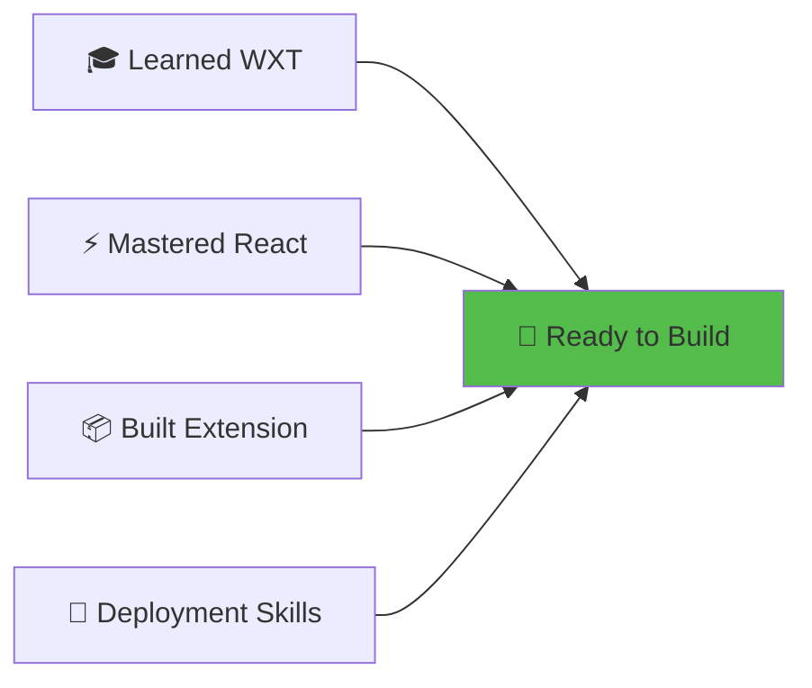
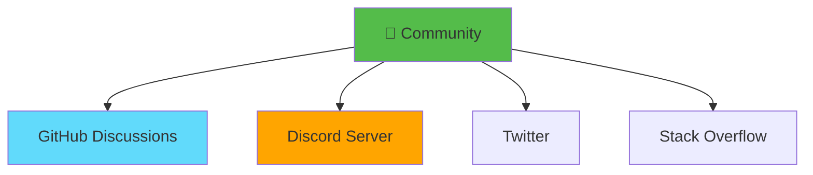
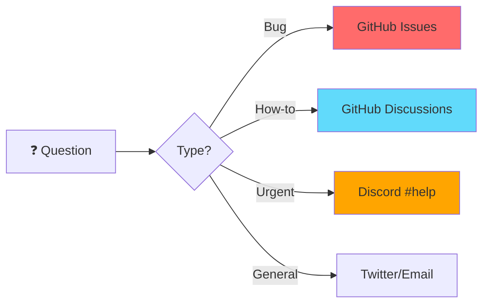
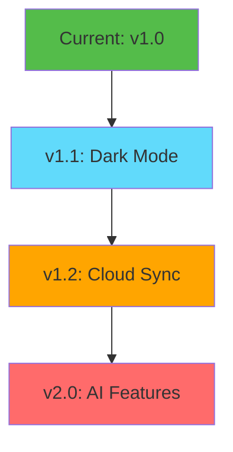

# Slide 16: Contribute & Stay Connected! 🎉

---

## 🎊 Congratulations!

You've completed the **Textarea Fullscreen Chrome Extension** workshop!



**What You've Accomplished:**
- ✅ Built a production-ready Chrome extension
- ✅ Mastered WXT framework and React integration
- ✅ Learned content scripts and browser APIs
- ✅ Implemented fullscreen editing with keyboard shortcuts
- ✅ Configured build and packaging for distribution

---

## 🤝 Contribute to the Project

This is an **open-source project** - your contributions are welcome!

### 🌟 How to Contribute

<details>
<summary><b>1. Star the Repository</b></summary>

Show your support!

```bash
# Visit and star ⭐
https://github.com/your-username/textarea-fullscreen-react
```

**Why star?**
- Helps others discover the project
- Shows appreciation
- Motivates maintainers

</details>

<details>
<summary><b>2. Report Issues</b></summary>

Found a bug or have a feature request?

**Steps:**
1. Go to [Issues](https://github.com/your-username/textarea-fullscreen-react/issues)
2. Click "New Issue"
3. Choose template:
   - 🐛 Bug Report
   - 💡 Feature Request
   - 📚 Documentation Improvement
4. Provide details and submit

**Good Issue Example:**
```markdown
## Bug: Fullscreen not working on Google Docs

**Environment:**
- Browser: Chrome 120
- Extension Version: 1.0.0
- OS: macOS 14.1

**Steps to Reproduce:**
1. Open Google Docs
2. Click fullscreen button
3. Nothing happens

**Expected:** Should enter fullscreen
**Actual:** No response

**Console Errors:**
TypeError: Cannot read property 'focus' of null
```

</details>

<details>
<summary><b>3. Submit Pull Requests</b></summary>

Want to add features or fix bugs?

**Contribution Workflow:**

```bash
# 1. Fork the repository
# 2. Clone your fork
git clone https://github.com/YOUR-USERNAME/textarea-fullscreen-react.git

# 3. Create a feature branch
git checkout -b feature/amazing-feature

# 4. Make your changes
# ... code code code ...

# 5. Commit with conventional commits
git commit -m "feat: add dark mode support"

# 6. Push to your fork
git push origin feature/amazing-feature

# 7. Open Pull Request on GitHub
```

**Commit Convention:**
- `feat:` New feature
- `fix:` Bug fix
- `docs:` Documentation
- `style:` Code style (formatting)
- `refactor:` Code refactoring
- `test:` Adding tests
- `chore:` Build/tooling changes

</details>

<details>
<summary><b>4. Improve Documentation</b></summary>

Help others learn!

**Documentation Needs:**
- 📝 Fix typos or unclear explanations
- 🌐 Translate to other languages
- 🎥 Create video tutorials
- 📸 Add screenshots/GIFs
- 💡 Share use cases

**Easy First Contributions:**
- Add missing JSDoc comments
- Improve README examples
- Create troubleshooting guide
- Write blog posts about the extension

</details>

---

## 💬 Join the Community

### Communication Channels



<details>
<summary><b>GitHub Discussions</b></summary>

**Best for:** Technical questions, feature discussions, showing off builds

**Link:** [github.com/your-username/textarea-fullscreen-react/discussions](https://github.com/your-username/textarea-fullscreen-react/discussions)

**Categories:**
- 💡 Ideas - Feature suggestions
- 🙏 Q&A - Get help
- 🎉 Show and Tell - Share your extensions
- 📣 Announcements - Project updates

</details>

<details>
<summary><b>Discord Server</b></summary>

**Best for:** Real-time chat, quick questions, community hangout

**Link:** [discord.gg/textarea-ext](https://discord.gg/textarea-ext) *(mock link)*

**Channels:**
- #general - General discussion
- #help - Get assistance
- #showcase - Show your work
- #resources - Share tutorials
- #announcements - Updates

</details>

<details>
<summary><b>Social Media</b></summary>

**Follow for updates:**

- 🐦 **Twitter:** [@TextareaExt](https://twitter.com/TextareaExt)
- 💼 **LinkedIn:** [Textarea Fullscreen Project](https://linkedin.com/company/textarea-ext)
- 📺 **YouTube:** [Extension Dev Tutorials](https://youtube.com/@extensiondev)

**Tag us in your builds!** #TextareaFullscreen #WXT #ChromeExtension

</details>

---

## 📚 Additional Resources

### 🎓 Continue Learning

<details>
<summary><b>Advanced Topics</b></summary>

**Next Steps:**
1. **Cross-browser compatibility** - Firefox, Safari, Edge
2. **Advanced Chrome APIs** - Tabs, Windows, History
3. **Extension monetization** - Strategies and best practices
4. **Performance optimization** - Profiling and debugging
5. **Security best practices** - CSP, permissions, XSS prevention

**Recommended Courses:**
- [Chrome Extension Masterclass](https://example.com/course)
- [WXT Advanced Patterns](https://wxt.dev/guide/advanced)
- [Browser Extension Security](https://example.com/security)

</details>

<details>
<summary><b>Example Projects</b></summary>

**Build these next:**

1. **Tab Manager**
   - Group and organize tabs
   - Save/restore sessions
   - Search across tabs

2. **Screenshot Tool**
   - Capture visible area
   - Full page screenshots
   - Annotate and share

3. **Pomodoro Timer**
   - Productivity timer
   - Website blocking
   - Statistics tracking

4. **Price Tracker**
   - Monitor product prices
   - Price history charts
   - Alert notifications

**Find more:** [Awesome WXT Examples](https://github.com/wxt-dev/awesome-wxt)

</details>

---

## 🎁 Share Your Experience

### Leave Your Mark!

We'd love to hear from you! Please share:

<details>
<summary><b>📝 Workshop Feedback Form</b></summary>

**Help us improve!**

**Link:** [forms.gle/textarea-workshop-feedback](https://forms.gle/mock-form) *(mock link)*

**Questions we ask:**
- How would you rate this workshop? (1-5 stars)
- What was most helpful?
- What could be improved?
- What topics should we cover next?
- Would you recommend to others?

**Your feedback shapes future workshops! 🙏**

</details>

<details>
<summary><b>🌟 Testimonials</b></summary>

**Share your success story!**

Submit to: **testimonials@textarea-ext.com** *(mock email)*

**Template:**
```markdown
## [Your Name] - [Your Role]

"This workshop helped me [achievement]. 
Now I'm using these skills to [project/goal]."

⭐⭐⭐⭐⭐

Optional: Add your photo, LinkedIn, Twitter
```

**We might feature you on our website!**

</details>

<details>
<summary><b>📸 Share Your Build</b></summary>

Built something awesome with what you learned?

**Share it:**
1. Post screenshot/GIF on Twitter with #TextareaFullscreen
2. Tag @TextareaExt and @alexchen_dev
3. Include brief description
4. Link to Chrome Web Store (if published)

**Best submissions get:**
- Featured on our showcase page
- Retweeted to our followers
- Free code review from maintainers

</details>

---

## 📞 Contact & Support

### 🆘 Need Help?

**Getting Stuck?**



**Response Times:**
- 🔴 **GitHub Issues:** 24-48 hours
- 🟡 **Discussions:** 12-24 hours
- 🟢 **Discord:** 1-4 hours (community)
- 🔵 **Email:** 2-3 business days

---

### 📧 Direct Contact

<details>
<summary><b>Maintainer Contact Info</b></summary>

**Alex Chen (Lead Maintainer)**
- 📧 Email: alex.chen@example.com
- 💼 LinkedIn: [linkedin.com/in/alexchen](https://linkedin.com/in/alexchen)
- 🐦 Twitter: [@alexchen_dev](https://twitter.com/alexchen_dev)
- 💻 GitHub: [@alexchen](https://github.com/alexchen)

**For:**
- Partnership inquiries
- Speaking engagements
- Consulting requests
- Media/press

</details>

<details>
<summary><b>Contributing Team</b></summary>

Want to become a core contributor?

**We're looking for:**
- 🎨 UI/UX designers
- 💻 Developers (React, TypeScript)
- 📝 Technical writers
- 🧪 QA testers
- 🌍 Translators

**Apply:** Send email with:
- Your background
- What you want to contribute
- GitHub profile
- Time commitment (hours/week)

**Email:** contributors@textarea-ext.com *(mock email)*

</details>

---

## 🎯 What's Next?

### Project Roadmap



**Upcoming Features:**
- 🌙 **v1.1 (Next Month)** - Dark mode support
- ☁️ **v1.2 (Q2 2024)** - Cloud sync across devices
- 🤖 **v2.0 (Q3 2024)** - AI-powered grammar checking
- 🎨 **v2.1 (Q4 2024)** - Customizable themes

**Vote on features:** [Feature Voting Board](https://github.com/your-username/textarea-fullscreen-react/discussions/categories/ideas)

---

## 🏆 Hall of Fame

**Top Contributors (Mock Data):**

```markdown
🥇 @sarah_dev - 47 commits, 12 PRs
🥈 @mike_codes - 32 commits, 8 PRs
🥉 @lisa_tech - 28 commits, 6 PRs

🌟 @john_docs - Outstanding documentation
🐛 @emma_qa - Most bugs reported (18!)
🎨 @chris_design - UI/UX improvements
```

**Want your name here?** Start contributing today!

---

## 🎉 Thank You!

```
 _____ _                 _     __   __          _ 
|_   _| |__   __ _ _ __ | | __ \ \ / /__  _   _| |
  | | | '_ \ / _` | '_ \| |/ /  \ V / _ \| | | | |
  | | | | | | (_| | | | |   <    | | (_) | |_| |_|
  |_| |_| |_|\__,_|_| |_|_|\_\   |_|\___/ \__,_(_)
```

**You're now equipped to build amazing Chrome extensions!**

### Final Checklist

- [ ] ⭐ Starred the repository
- [ ] 💾 Cloned the code locally
- [ ] 🏗️ Built your first extension
- [ ] 📚 Bookmarked documentation
- [ ] 💬 Joined Discord/Discussions
- [ ] 🐦 Followed on social media
- [ ] 📝 Submitted feedback form
- [ ] 🚀 Started planning your own extension

---

## 🚀 Keep Building!

**Remember:**
- Start small, iterate quickly
- Test on real users early
- Prioritize privacy and performance
- Have fun and help others!

**Resources:**
- 📖 [Slides](https://github.com/your-username/textarea-fullscreen-react/tree/main/slides)
- 💻 [Code](https://github.com/your-username/textarea-fullscreen-react)
- 📺 [Video Tutorial](https://youtube.com/@extensiondev) *(mock link)*
- 📧 [Newsletter](https://textarea-ext.com/newsletter) *(mock link)*

---

## 🌟 Stay in Touch!

**Let's keep learning together:**

```typescript
const stayConnected = {
  github: 'https://github.com/your-username',
  twitter: '@TextareaExt',
  discord: 'discord.gg/textarea-ext',
  email: 'hello@textarea-ext.com'
};

// Don't be a stranger! 👋
console.log('See you in the community! 🚀');
```

---

**🎊 Happy Coding! 🎊**

*Built with ❤️ using WXT + React + TypeScript*

---

**Previous:** [Slide 15: Build and Package](./15-build-and-package.md)  
**Workshop Complete!** 🎉